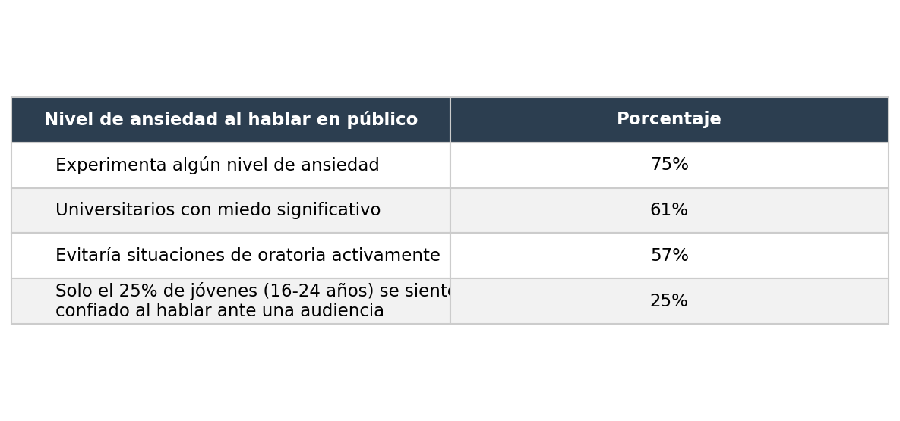
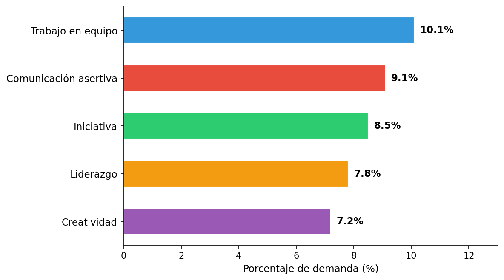
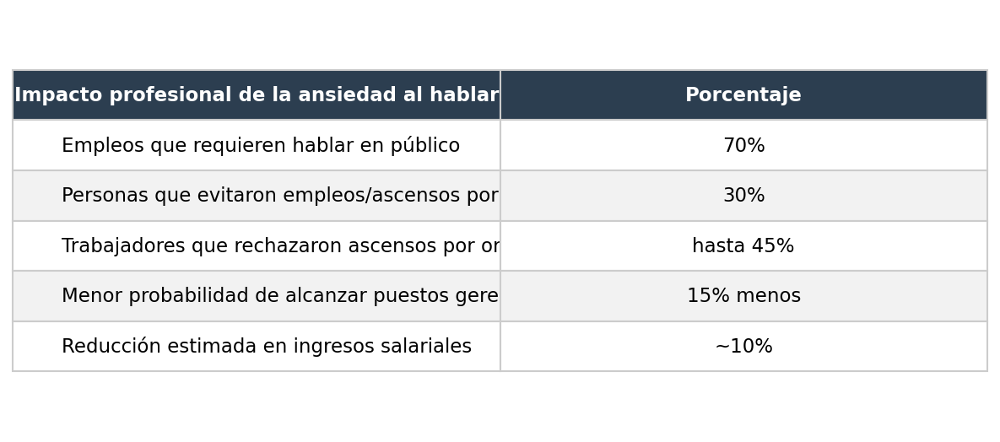
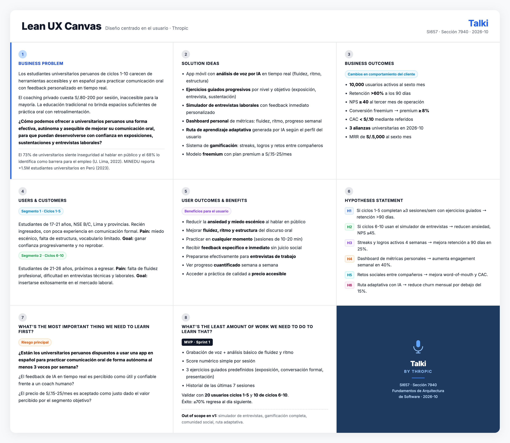

  

<h2 style="text-align: center;"> Universidad Peruana de Ciencias Aplicadas </h2>

<h4 style="text-align: center"> Ingeniería de Software </h4>

<h4 style="text-align: center"> Periodo: 202601 </h4>

<h4 style="text-align: center"> SI657 | Fundamentos de Arquitectura de Software </h4>

<h4 style="text-align: center"> Sección: 7940 </h4>

<h4 style="text-align: center"> Docente: Daniel Enrique Mori Yzaguirre </h4>

<h3 style="text-align: center;"> Informe de Trabajo Final </h3>

<h4 style="text-align: center"> Startup: Thropic </h4>

<h4 style="text-align: center"> Producto: Talki </h4>

<h4 style="text-align: center">Integrantes:</h4>

   <table style="margin-left: auto; margin-right: auto;">
      <tr>
         <th>Código</th>
         <th>Apellidos y Nombres</th>
      </tr>
      <tr>
         <td>U202313397</td>
         <td>Oroncoy Almeyda, Alejandro Daniel</td>
      </tr>
      <tr>
         <td>U202312222</td>
         <td>Rivera Sosa, Eduardo Gael</td>
      </tr>
      <tr>
         <td>U20241C134</td>
         <td>Tumi Oliden, Manuel Ignacio</td>
      </tr>
   </table>

 

<h5 style="text-align: center; font-style: italic;"> Abril 2026 </h5>

# Registro de Versiones del Informe

| Version | Fecha | Autor | Descripción de modificación |
|---------|-------|-------|-----------------------------|
| 1.0 | 09/04/2026 | Oroncoy Almeyda, Alejandro Daniel | Creación del documento |

# Contenido

- [Capítulo I: Introducción](#capítulo-i-introducción)
   - [1.1. Startup Profile](#11-startup-profile)
      - [1.1.1. Descripción de la Startup](#111-descripción-de-la-startup)
      - [1.1.2. Perfiles de integrantes del equipo](#112-perfiles-de-integrantes-del-equipo)
   - [1.2. Solution Profile](#12-solution-profile)
      - [1.2.1. Nombre del producto](#121-nombre-del-producto)
      - [1.2.2. Antecedentes y problemática](#122-antecedentes-y-problemática)
      - [1.2.3. Lean UX Process](#123-lean-ux-process)
         - [1.2.3.1. Lean UX Problem Statement](#1231-lean-ux-problem-statement)
         - [1.2.3.2. Lean UX Assumptions](#1232-lean-ux-assumptions)
         - [1.2.3.3. Lean UX Hypothesis](#1233-lean-ux-hypothesis)
         - [1.2.3.4. Lean UX Canvas](#1234-lean-ux-canvas)
   - [1.3. Segmentos objetivo](#13-segmentos-objetivo)

- [Capítulo II: Requirements & Analysis](#capítulo-ii-requirements--analysis)
   - [2.1. Competidores](#21-competidores)
   - [2.2. Entrevistas](#22-entrevistas)
   - [2.3. Needfinding](#23-needfinding)
      - [2.3.1. User Personas](#231-user-personas)
      - [2.3.2. User Task Matrix](#232-user-task-matrix)
      - [2.3.3. Empathy Maps](#233-empathy-maps)
      - [2.3.4. As-is Scenario Mapping](#234-as-is-scenario-mapping)

- [Capítulo III: Requirements Specification](#capítulo-iii-requirements-specification)
   - [3.1. To-Be Scenario Mapping](#31-to-be-scenario-mapping)
   - [3.2. User Stories](#32-user-stories)
   - [3.3. Impact Map](#33-impact-map)
   - [3.4. Product Backlog](#34-product-backlog)

- [Capítulo IV: Product Architecture Design](#capítulo-iv-product-architecture-design)
   - [4.1. Design Concepts, ViewPoints & ER Diagrams](#41-design-concepts-viewpoints--er-diagrams)
      - [4.1.1. Principles Statements](#411-principles-statements)
      - [4.1.2. Approaches Statements Architectural Styles & Patterns](#412-approaches-statements-architectural-styles--patterns)
      - [4.1.3. Context Diagram](#413-context-diagram)
      - [4.1.4. Approach driven ViewPoints Diagrams](#414-approach-driven-viewpoints-diagrams)
      - [4.1.5. Relational/Non Relational Database Diagram](#415-relationalnon-relational-database-diagram)
      - [4.1.6. Design Patterns](#416-design-patterns)
      - [4.1.7. Tactics](#417-tactics)
   - [4.2. Architectural Drivers](#42-architectural-drivers)
      - [4.2.1. Design Purpose](#421-design-purpose)
      - [4.2.2. Primary Functionality (Primary User Stories)](#422-primary-functionality-primary-user-stories)
      - [4.2.3. Quality Attribute Scenarios](#423-quality-attribute-scenarios)
      - [4.2.4. Constraints](#424-constraints)
      - [4.2.5. Architectural Concerns](#425-architectural-concerns)
   - [4.3. ADD Iterations](#43-add-iterations)
      - [4.2.X. Iteration N: Iteration Name](#42x-iteration-n-iteration-name)
         - [4.2.X.1. Architectural Design Backlog N](#42x1-architectural-design-backlog-n)
         - [4.2.X.2. Establish Iteration Goal by Selecting Drivers](#42x2-establish-iteration-goal-by-selecting-drivers)
         - [4.2.X.3. Choose One or More Elements of the System to Refine](#42x3-choose-one-or-more-elements-of-the-system-to-refine)
         - [4.2.X.4. Choose One or More Design Concepts That Satisfy the Selected Drivers](#42x4-choose-one-or-more-design-concepts-that-satisfy-the-selected-drivers)
         - [4.2.X.5. Instantiate Architectural Elements, Allocate Responsibilities, and Define Interfaces](#42x5-instantiate-architectural-elements-allocate-responsibilities-and-define-interfaces)
         - [4.2.X.6. Sketch Views (C4 & UML) and Record Design Decisions](#42x6-sketch-views-c4--uml-and-record-design-decisions)
         - [4.2.X.7. Analysis of Current Design and Review Iteration Goal (Kanban Board)](#42x7-analysis-of-current-design-and-review-iteration-goal-kanban-board)

- [Capítulo V: Product Implementation, Validation & Deployment](#capítulo-v-product-implementation-validation--deployment)
   - [5.1. Testing Suites & General Patterns](#51-testing-suites--general-patterns)
      - [5.1.1. Backend Application Core Testing Suite](#511-backend-application-core-testing-suite)
      - [5.1.2. Pattern Based Backend Application(s)](#512-pattern-based-backend-applications)
      - [5.1.3. Pattern Based Custom Software Library](#513-pattern-based-custom-software-library)
      - [5.1.4. Framework Pattern Driven Refactoring Report](#514-framework-pattern-driven-refactoring-report)
   - [5.2. Software Configuration Management](#52-software-configuration-management)
      - [5.2.1. Software Development Environment Configuration](#521-software-development-environment-configuration)
      - [5.2.2. Source Code Management](#522-source-code-management)
      - [5.2.3. Source Code Style Guide & Conventions](#523-source-code-style-guide--conventions)
      - [5.2.4. Software Deployment Configuration](#524-software-deployment-configuration)
   - [5.3. Microservices Implementation](#53-microservices-implementation)
      - [5.3.1. Sprint 1](#531-sprint-1)
         - [5.3.1.1. Sprint Backlog 1](#5311-sprint-backlog-1)
         - [5.3.1.2. Development Evidence for Sprint Review](#5312-development-evidence-for-sprint-review)
         - [5.3.1.3. Testing Suite Evidence for Sprint Review](#5313-testing-suite-evidence-for-sprint-review)
         - [5.3.1.4. Execution Evidence for Sprint Review](#5314-execution-evidence-for-sprint-review)
         - [5.3.1.5. Microservices Documentation Evidence for Sprint Review](#5315-microservices-documentation-evidence-for-sprint-review)
         - [5.3.1.6. Software Deployment Evidence for Sprint Review](#5316-software-deployment-evidence-for-sprint-review)
         - [5.3.1.7. Team Collaboration Insights during Sprint](#5317-team-collaboration-insights-during-sprint)
         - [5.3.1.8. Kanban Board](#5318-kanban-board)
      - [5.3.2. Sprint 2](#532-sprint-2)
         - [5.3.2.1. Sprint Backlog 2](#5321-sprint-backlog-2)
         - [5.3.2.2. Development Evidence for Sprint Review](#5322-development-evidence-for-sprint-review)
         - [5.3.2.3. Testing Suite Evidence for Sprint Review](#5323-testing-suite-evidence-for-sprint-review)
         - [5.3.2.4. Execution Evidence for Sprint Review](#5324-execution-evidence-for-sprint-review)
         - [5.3.2.5. Microservices Documentation Evidence for Sprint Review](#5325-microservices-documentation-evidence-for-sprint-review)
         - [5.3.2.6. Software Deployment Evidence for Sprint Review](#5326-software-deployment-evidence-for-sprint-review)
         - [5.3.2.7. Team Collaboration Insights during Sprint](#5327-team-collaboration-insights-during-sprint)
         - [5.3.2.8. Kanban Board](#5328-kanban-board)
      - [5.3.3. Sprint 3](#533-sprint-3)
         - [5.3.3.1. Sprint Backlog 3](#5331-sprint-backlog-3)
         - [5.3.3.2. Development Evidence for Sprint Review](#5332-development-evidence-for-sprint-review)
         - [5.3.3.3. Testing Suite Evidence for Sprint Review](#5333-testing-suite-evidence-for-sprint-review)
         - [5.3.3.4. Execution Evidence for Sprint Review](#5334-execution-evidence-for-sprint-review)
         - [5.3.3.5. Microservices Documentation Evidence for Sprint Review](#5335-microservices-documentation-evidence-for-sprint-review)
         - [5.3.3.6. Software Deployment Evidence for Sprint Review](#5336-software-deployment-evidence-for-sprint-review)
         - [5.3.3.7. Team Collaboration Insights during Sprint](#5337-team-collaboration-insights-during-sprint)
         - [5.3.3.8. Kanban Board](#5338-kanban-board)
      - [5.3.4. Sprint 4](#534-sprint-4)
         - [5.3.4.1. Sprint Backlog 4](#5341-sprint-backlog-4)
         - [5.3.4.2. Development Evidence for Sprint Review](#5342-development-evidence-for-sprint-review)
         - [5.3.4.3. Testing Suite Evidence for Sprint Review](#5343-testing-suite-evidence-for-sprint-review)
         - [5.3.4.4. Execution Evidence for Sprint Review](#5344-execution-evidence-for-sprint-review)
         - [5.3.4.5. Microservices Documentation Evidence for Sprint Review](#5345-microservices-documentation-evidence-for-sprint-review)
         - [5.3.4.6. Software Deployment Evidence for Sprint Review](#5346-software-deployment-evidence-for-sprint-review)
         - [5.3.4.7. Team Collaboration Insights during Sprint](#5347-team-collaboration-insights-during-sprint)
         - [5.3.4.8. Kanban Board](#5348-kanban-board)
   - [5.4. Microservices Deployment](#54-microservices-deployment)
      - [5.4.1. Cloud Architecture Diagram](#541-cloud-architecture-diagram)
      - [5.4.2. Cloud Architecture Deployment](#542-cloud-architecture-deployment)

- [Conclusiones](#conclusiones)
- [Referencias Bibliográficas](#referencias-bibliográficas)
- [Anexos](#anexos)

# Student Outcome

En el siguiente cuadro se describe las acciones realizadas y enunciados de conclusiones por parte del grupo, que permiten sustentar el haber alcanzado el logro del ABET – EAC - Student Outcome.

<table>
  <thead>
    <tr>
      <th>Criterio específico</th>
      <th>Acciones realizadas</th>
      <th>Conclusiones</th>
    </tr>
  </thead>
  <tbody>
    <tr>
      <td rowspan="3"><strong>Criterio 1: ABET – EAC - Student Outcome 3  Capacidad para comunicar efectivamente con una amplia gama de audiencias.</strong></td>
      <td><strong>Oroncoy Almeyda, Alejandro Daniel</strong> <b>TB1:</b> Redacté la descripción de la startup Thropic y el producto Talki (sección 1.1.1), definí la propuesta de nombre del producto (1.2.1) y elaboré los segmentos objetivo con sus aspectos demográficos, geográficos y psicográficos (1.3), comunicando de forma clara el problema y la propuesta de valor a distintas audiencias.</td>
      <td rowspan="3"><b>TB1:</b> El equipo logró estructurar y comunicar de manera efectiva la propuesta de valor de Talki a través de los capítulos I, II y III del informe. Cada integrante contribuyó a transmitir el problema, la solución y los requerimientos con claridad para audiencias académicas y técnicas, empleando formatos visuales, narrativos y tabulares adecuados a cada sección.</td>
    </tr>
    <tr>
      <td><strong>Rivera Sosa, Eduardo Gael</strong> <b>TB1:</b> Elaboré los artefactos de especificación de requerimientos del Capítulo III (To-Be Scenario Mapping, User Stories con criterios de aceptación, Impact Map y Product Backlog priorizado), comunicando las necesidades del usuario y los requerimientos del sistema de forma estructurada y comprensible para audiencias técnicas y de negocio.</td>
    </tr>
    <tr>
      <td><strong>Tumi Oliden, Manuel Ignacio</strong> <b>TB1:</b> Diseñé y ejecuté entrevistas con usuarios de ambos segmentos objetivo (sección 2.2) y desarrollé los artefactos de Needfinding (User Personas, User Task Matrix, Empathy Maps y As-is Scenario Mapping, sección 2.3), comunicando visualmente los hallazgos de investigación de usuario para informar el diseño de la solución.</td>
    </tr>
    <tr>
      <td rowspan="3"><strong>Criterio 2: ABET – EAC - Student Outcome 5  Capacidad para identificar, formular y resolver problemas complejos de ingeniería aplicando principios de ciencias de la ingeniería, ciencias básicas y matemáticas.</strong></td>
      <td><strong>Oroncoy Almeyda, Alejandro Daniel</strong> <b>TB1:</b> Apliqué el framework 5W+2H para analizar y formular el problema de comunicación oral en universitarios peruanos (sección 1.2.2), identificando causas, actores, contexto e impacto cuantificado con citas académicas. Realicé el análisis competitivo comparando Talki con ELSA Speak, Speeko y Orai mediante matriz SWOT (sección 2.1), derivando estrategias de diferenciación basadas en evidencia (2.1.2).</td>
      <td rowspan="3"><b>TB1:</b> El equipo identificó y formuló el problema central de Talki mediante herramientas de ingeniería de software (Lean UX, 5W+2H, análisis competitivo, investigación de usuarios), estableciendo las bases para el diseño de una solución técnica fundamentada en evidencia y orientada al usuario.</td>
    </tr>
    <tr>
      <td><strong>Rivera Sosa, Eduardo Gael</strong> <b>TB1:</b> Formulé los requerimientos funcionales de Talki mediante User Stories con criterios de aceptación y los organicé en un Product Backlog priorizado (Capítulo III), aplicando principios de ingeniería de requerimientos para traducir necesidades del usuario en especificaciones técnicas accionables.</td>
    </tr>
    <tr>
      <td><strong>Tumi Oliden, Manuel Ignacio</strong> <b>TB1:</b> Apliqué técnicas de investigación cualitativa (entrevistas semi-estructuradas, empathy mapping, as-is scenario mapping) para identificar y analizar los problemas de comunicación oral de los dos segmentos objetivo (secciones 2.2 y 2.3), generando insights que fundamentan las decisiones de diseño de Talki.</td>
    </tr>
  </tbody>
</table>

# Capítulo I: Introducción

## 1.1. Startup Profile

### 1.1.1. Descripción de la Startup

Thropic es una startup de tecnología educativa fundada por estudiantes de Ingeniería de Software de la Universidad Peruana de Ciencias Aplicadas (UPC), con la misión de democratizar el acceso a herramientas de desarrollo personal mediante inteligencia artificial.

**Misión:** Empoderar a los estudiantes universitarios a desarrollar habilidades de comunicación oral efectiva a través de tecnología accesible e inteligente.

**Visión:** Ser la plataforma líder en Latinoamérica para el desarrollo de habilidades de comunicación oral en el ámbito académico y profesional para 2030.

Talki es la solución principal de Thropic: una aplicación móvil que utiliza IA para analizar, evaluar y retroalimentar la comunicación oral de estudiantes universitarios en tiempo real, ayudándoles a mejorar su fluidez, pronunciación, estructura del discurso y confianza al hablar en público.

### 1.1.2. Perfiles de integrantes del equipo

<table>
  <thead>
    <tr>
      <th>Perfil</th>
      <th>Foto</th>
    </tr>
  </thead>
  <tbody>
    <tr>
      <td><strong>Oroncoy Almeyda, Alejandro Daniel</strong> — U202313397 Mi nombre es Alejandro Oroncoy, tengo 19 años y soy estudiante de Ingeniería de Software en el quinto ciclo. Me considero una persona proactiva, autodidacta y orientada a objetivos. Disfruto aprender nuevas tecnologías por cuenta propia y busco siempre entregar resultados de calidad. Tengo experiencia en desarrollo backend con Java y Spring Boot, así como en Python y servicios cloud. Me motiva construir soluciones que generen impacto real, y en Thropic asumo con entusiasmo el reto de llevar Talki al mercado universitario peruano.</td>
      <td></td>
    </tr>
    <tr>
      <td><strong>Rivera Sosa, Eduardo Gael</strong> — U202312222 Mi nombre es Gael Rivera, tengo 20 años y soy estudiante de Ingeniería de Software en el quinto ciclo. Me caracterizo por ser responsable y orientado a resultados, con habilidades de liderazgo que facilitan la comunicación y el trabajo colaborativo. Tengo conocimientos en desarrollo frontend con Angular y experiencia en modelado de bases de datos relacionales. Siempre estoy dispuesto a abordar desafíos y encontrar soluciones en equipo, y en Thropic asumo la especificación de requerimientos como base técnica del producto.</td>
      <td></td>
    </tr>
    <tr>
      <td><strong>Tumi Oliden, Manuel Ignacio</strong> — U20241C134 Mi nombre es Manuel Tumi, soy estudiante de Ingeniería de Software y me caracterizo por ser una persona colaborativa y adaptable, que se integra fácilmente a distintos métodos de trabajo. Tengo conocimientos en investigación de usuarios, diseño de entrevistas y análisis de necesidades, habilidades que aplico en la etapa de needfinding del proyecto. Prefiero apoyar al equipo desde la escucha activa y el análisis, y en mi tiempo libre disfruto del voleibol y los videojuegos.</td>
      <td></td>
    </tr>
  </tbody>
</table>

## 1.2. Solution Profile

### 1.2.1. Nombre del producto

**Talki** es el nombre de nuestra aplicación. El nombre proviene de la combinación de "Talk" (hablar en inglés) con el sufijo "-i" que evoca inteligencia e innovación. Talki representa la idea de tener un compañero inteligente que te ayuda a mejorar tu forma de comunicarte oralmente.

### 1.2.2. Antecedentes y problemática

#### WHAT (Qué)

Las deficiencias en comunicación oral afectan el desempeño académico y profesional de los universitarios peruanos.

#### WHEN (Cuándo)

Se manifiesta principalmente al momento de realizar exposiciones, sustentaciones, entrevistas de trabajo y presentaciones profesionales.

#### WHERE (Dónde)

En aulas universitarias, plataformas virtuales y entornos laborales/prácticas.

#### WHO (Quién)

Estudiantes de educación superior peruanos (ciclos 1-10), especialmente aquellos sin acceso a coaching personalizado.

#### WHY (Por qué)

La educación tradicional no brinda suficientes espacios de práctica oral con feedback personalizado. El acceso a coaches es costoso y limitado.

#### HOW (Cómo)

Talki usa IA para grabar, analizar y retroalimentar la comunicación oral del usuario en tiempo real, con ejercicios progresivos y personalizados.

#### HOW MUCH (Cuánto)

Según la Superintendencia Nacional de Educación Superior Universitaria (SUNEDU, 2023), más de 1.5 millones de estudiantes se encuentran matriculados en universidades peruanas, representando un mercado potencial significativo para soluciones de desarrollo de competencias comunicativas.

En el plano de la ansiedad comunicativa, la literatura científica muestra cifras consistentemente elevadas. Maldonado et al. (2022), en un estudio experimental con universitarios publicado en la *Revista Latina de Comunicación Social*, confirmaron que la ansiedad al hablar en público impacta directamente el desempeño académico y la participación activa en clases. A nivel global, investigaciones compiladas por Teleprompter.com (2024) revelan que el **75% de las personas** experimenta algún nivel de ansiedad al hablar en público, y el **61% de universitarios** la reporta como un temor significativo.

_Figura 1: Prevalencia de la ansiedad al hablar en público en población universitaria_

_Nota._ Elaboración propia basada en Teleprompter.com (2024) y Crown Counseling (2024).

Respecto al impacto en la empleabilidad, un estudio descriptivo sobre competencias laborales blandas en egresados universitarios latinoamericanos (Redalyc, 2022) identificó que la **comunicación asertiva** es la segunda habilidad más demandada por empleadores (9.1%), solo detrás del trabajo en equipo (10.1%). Sin embargo, es también una de las competencias con mayores brechas en egresados.

_Figura 2: Habilidades blandas más demandadas por empleadores en Latinoamérica_

_Nota._ Elaboración propia basada en Redalyc (2022).

Finalmente, la ansiedad comunicativa no solo afecta el desempeño académico sino también la trayectoria profesional. Datos de Crown Counseling (2024) y Teleprompter.com (2024) indican que el **70% de los empleos** requiere algún nivel de oratoria o presentaciones; el **30% de las personas** ha evitado postular a empleos o ascensos debido a esta ansiedad; y quienes la padecen tienen un **15% menos de probabilidad** de alcanzar posiciones gerenciales.

_Figura 3: Impacto profesional de la ansiedad al hablar en público_

_Nota._ Elaboración propia basada en Crown Counseling (2024) y Teleprompter.com (2024).

Ante este escenario, el costo de un coach de oratoria privado en Lima oscila entre S/. 80 y S/. 200 por sesión (con frecuencia semanal recomendada), haciendo inaccesible el entrenamiento personalizado para la mayoría del segmento universitario. Talki aborda esta brecha mediante IA accesible desde el smartphone, a una fracción del costo.

### 1.2.3. Lean UX Process

El proceso Lean UX aplicado en Thropic sigue el enfoque de validación continua de hipótesis mediante ciclos cortos de aprendizaje, construir y medir (Ries, 2011), con el objetivo de reducir el riesgo de construir un producto que el mercado no necesita.

#### 1.2.3.1. Lean UX Problem Statement

**Segmento 1:** Hemos observado que los estudiantes de ciclos 1-5 carecen de espacios seguros y accesibles para practicar la comunicación oral con feedback real. El impacto es bajo desempeño en exposiciones y pérdida de oportunidades académicas. ¿Cómo podríamos brindarles práctica guiada con IA para que ganen confianza progresivamente?

**Segmento 2:** Hemos observado que los estudiantes de ciclos 6-10 no tienen herramientas asequibles para prepararse para entrevistas laborales y presentaciones profesionales. El impacto es dificultad para insertarse en el mercado laboral. ¿Cómo podríamos simular entornos reales de comunicación profesional para que estén listos al graduarse?

#### 1.2.3.2. Lean UX Assumptions

##### Business Assumptions

1. Creemos que los usuarios pagarán una suscripción mensual de S/. 15-25 por acceso premium.
2. Creemos que el mayor canal de adquisición serán las redes sociales universitarias (Instagram, TikTok).
3. Creemos que los usuarios necesitan al menos 3 sesiones semanales para notar mejora en 30 días.
4. Creemos que las universidades adoptarán Talki como herramienta complementaria en cursos de comunicación.
5. Creemos que el NPS (Net Promoter Score) alcanzará 40+ en los primeros 6 meses.
6. Creemos que el costo de adquisición por usuario será menor a S/. 10 mediante estrategias de referidos.
7. Creemos que el 60% de usuarios retendrá la app más de 3 meses con gamificación efectiva.
8. Creemos que las alianzas con institutos y universidades serán nuestro principal canal B2B.
9. Creemos que los usuarios en ciclos 6-10 están dispuestos a pagar más por features de simulación de entrevistas.
10. Creemos que el mercado latinoamericano de edtech móvil crecerá 25% anual los próximos 3 años.
11. Creemos que la diferenciación por idioma español y contexto peruano/latinoamericano será una ventaja competitiva sostenible.

##### User Assumptions

1. **¿Quién es el usuario?** Estudiantes universitarios peruanos de ciclos 1-10, de 17 a 26 años, nativos digitales con smartphone.
2. **¿Dónde encaja nuestro producto en su vida?** En los momentos previos a exposiciones, durante el estudio en casa, y en transporte público.
3. **¿Qué problemas resuelve nuestro producto?** La falta de espacios seguros para practicar oralidad con feedback inmediato y personalizado.
4. **¿Cuándo y cómo es usado nuestro producto?** Sesiones de 10-20 minutos, principalmente en las noches, desde el smartphone.
5. **¿Qué características son importantes?** Feedback en tiempo real, ejercicios progresivos, historial de progreso, modo simulación de entrevistas.
6. **¿Cómo debe verse y comportarse el producto?** Intuitivo, motivador, con elementos de gamificación, lenguaje cercano y sin tecnicismos.

#### 1.2.3.3. Lean UX Hypothesis

1. Creemos que aumentaremos la retención de usuarios si los estudiantes de ciclos 1-5 logran completar al menos 3 sesiones semanales de práctica con la feature de "ejercicios guiados con IA".

2. Creemos que mejoraremos la satisfacción si los estudiantes de ciclos 6-10 logran reducir su ansiedad en entrevistas con la feature de "simulador de entrevistas con feedback en tiempo real".

3. Creemos que mejoraremos la retención si los usuarios gamifican su progreso con la feature de "streaks y logros" durante 4 semanas consecutivas.

4. Creemos que aumentaremos el engagement si los estudiantes pueden ver su análisis de progreso detallado con la feature de "dashboard de métricas personales".

5. Creemos que aumentaremos el word-of-mouth si los usuarios pueden compartir sus logros con la feature de "comunidad y retos entre amigos".

6. Creemos que reduciremos el churn si los usuarios reciben un plan de práctica personalizado con la feature de "ruta de aprendizaje adaptativa con IA".

#### 1.2.3.4. Lean UX Canvas

_Figura 4: Lean UX Canvas — Talki_

_Nota._ Elaboración propia (2026).

## 1.3. Segmentos objetivo

**Segmento 1: Estudiantes universitarios de ciclos 1 al 5**

*Aspectos Demográficos:*
- Edad: 17-21 años
- Sexo: Masculino y femenino
- Nivel socioeconómico: B y C
- Ciclo: 1 al 5 de educación superior universitaria

*Aspectos Geográficos:*
- País: Perú
- Región: Lima Metropolitana y principales ciudades del interior (Arequipa, Trujillo, Piura)
- Tipo de institución: Universidades privadas y públicas

*Aspectos Psicográficos:*
- Motivaciones: Mejorar calificaciones en cursos con exposiciones, ganar confianza al hablar en público, no pasar vergüenza frente a compañeros
- Dolores: Miedo escénico pronunciado, vocabulario académico limitado, falta de estructura al exponer, nerviosismo que bloquea el discurso
- Comportamientos digitales: Nativos digitales, uso intensivo del smartphone, acostumbrados a apps de aprendizaje (Duolingo, YouTube), disponibles para sesiones cortas de 10-15 min

**Segmento 2: Estudiantes universitarios de ciclos 6 al 10**

*Aspectos Demográficos:*
- Edad: 21-26 años
- Sexo: Masculino y femenino
- Nivel socioeconómico: B y C
- Ciclo: 6 al 10 de educación superior universitaria, próximos a egresar

*Aspectos Geográficos:*
- País: Perú
- Región: Lima Metropolitana y principales ciudades con oferta laboral tecnológica
- Tipo de institución: Universidades con programas de prácticas preprofesionales activos

*Aspectos Psicográficos:*
- Motivaciones: Conseguir prácticas o primer empleo, destacar en entrevistas técnicas y de RR.HH., comunicar ideas con claridad en entornos profesionales
- Dolores: Dificultad para expresarse con fluidez y vocabulario profesional, ansiedad ante entrevistas de trabajo, falta de espacios reales de práctica con feedback concreto
- Comportamientos digitales: Usuarios activos de LinkedIn, plataformas de empleabilidad y apps de productividad; dispuestos a pagar por herramientas que generen ROI directo en su carrera

# Capítulo II: Requirements & Analysis

## 2.1. Competidores

<table>
  <tr>
    <th colspan="6">Competitive Analysis Landscape</th>
  </tr>
  <tr>
    <td colspan="2" align="center"><b>¿Por qué llevar a cabo este análisis?</b></td>
    <td colspan="4">Para identificar las fortalezas, debilidades y estrategias de nuestros competidores directos e indirectos, con el fin de definir la propuesta de valor diferenciada de Talki y detectar oportunidades de mercado no atendidas.</td>
  </tr>
  <tr>
    <th colspan="2">Nombre</th>
    <th>Talki (Thropic)</th>
    <th>ELSA Speak</th>
    <th>Speeko</th>
    <th>Orai</th>
  </tr>
  <tr>
    <td colspan="2" align="center"><b>Logo</b></td>
    <td align="center"></td>
    <td align="center"></td>
    <td align="center"></td>
    <td align="center"></td>
  </tr>
  <tr>
    <td rowspan="2"><b>Perfil</b></td>
    <td><b>Overview</b></td>
    <td>App móvil con IA que analiza y retroalimenta la comunicación oral de estudiantes universitarios peruanos en tiempo real, en español.</td>
    <td>App de pronunciación en inglés con IA que evalúa y corrige la pronunciación del usuario en tiempo real mediante reconocimiento de voz avanzado.</td>
    <td>App de coaching para hablar en público con lecciones estructuradas impartidas por coaches reales y ejercicios de práctica.</td>
    <td>App móvil con IA que analiza la oratoria del usuario (ritmo, palabras de relleno, energía, expresión facial) y entrega retroalimentación inmediata y lecciones personalizadas.</td>
  </tr>
  <tr>
    <td><b>Ventaja competitiva ¿Qué valor ofrece a los clientes?</b></td>
    <td>Feedback en tiempo real en español con contexto académico peruano; enfocado en universitarios latinoamericanos.</td>
    <td>Motor de IA especializado en detección de errores fonéticos del inglés; más de 50M usuarios globales.</td>
    <td>Contenido creado por coaches profesionales de oratoria; estructura de cursos progresivos y micro-lecciones de 5 minutos.</td>
    <td>Análisis multimodal (voz + expresión facial) con plan de entrenamiento adaptativo; gamificación y seguimiento de progreso detallado.</td>
  </tr>
  <tr>
    <td rowspan="2"><b>Perfil de Marketing</b></td>
    <td><b>Mercado objetivo</b></td>
    <td>Estudiantes universitarios peruanos/latinoamericanos de ciclos 1-10.</td>
    <td>Hablantes no nativos de inglés que desean mejorar su pronunciación, principalmente en Asia y Latinoamérica.</td>
    <td>Profesionales y estudiantes angloparlantes que quieren mejorar su oratoria y liderazgo comunicacional.</td>
    <td>Profesionales, estudiantes y ejecutivos angloparlantes que necesitan mejorar presentaciones y discursos.</td>
  </tr>
  <tr>
    <td><b>Estrategias de Marketing</b></td>
    <td>Freemium, marketing universitario, referidos entre compañeros.</td>
    <td>Freemium, referidos, partnerships con instituciones educativas.</td>
    <td>Freemium, publicidad en LinkedIn y redes, membresías corporativas.</td>
    <td>Freemium con trial de 7 días, alianzas con instituciones educativas, plan Enterprise para equipos.</td>
  </tr>
  <tr>
    <td rowspan="3"><b>Perfil de Producto</b></td>
    <td><b>Productos &amp; Servicios</b></td>
    <td>App móvil con análisis de voz, ejercicios guiados, simulador de entrevistas y dashboard de progreso.</td>
    <td>App móvil (iOS/Android) con lecciones de pronunciación, conversación simulada y análisis fonético detallado.</td>
    <td>App móvil con cursos de oratoria, ejercicios diarios de 5 minutos y biblioteca de habilidades comunicacionales.</td>
    <td>App móvil (iOS/Android) con análisis de voz e imagen, lecciones gamificadas, historial de práctica y plan personalizado de 4 semanas.</td>
  </tr>
  <tr>
    <td><b>Precios y Costos</b></td>
    <td>Freemium; plan premium S/. 15-25/mes.</td>
    <td>Gratis con funciones limitadas; premium desde $6.99/mes.</td>
    <td>Gratis con funciones básicas; premium desde $9.99/mes.</td>
    <td>Gratis con funciones básicas; premium desde $9.99/mes o $39.99/año.</td>
  </tr>
  <tr>
    <td><b>Canales de distribución</b></td>
    <td>App Store, Google Play, web.</td>
    <td>App Store, Google Play, web.</td>
    <td>App Store, Google Play.</td>
    <td>App Store, Google Play.</td>
  </tr>
  <tr>
    <td rowspan="4"><b>Análisis SWOT</b></td>
    <td><b>Fortalezas</b></td>
    <td>Español nativo, contexto universitario peruano, IA personalizada, gamificación.</td>
    <td>IA muy precisa, gran base de usuarios global, contenido extenso y probado.</td>
    <td>Contenido de alta calidad creado por expertos, formato de micro-lecciones atractivo.</td>
    <td>Análisis multimodal avanzado, plan adaptativo personalizado, gamificación efectiva, disponible en iOS y Android.</td>
  </tr>
  <tr>
    <td><b>Oportunidades</b></td>
    <td>Mercado latinoamericano poco atendido, alianzas con universidades, expansión a otros países.</td>
    <td>Expansión a otros idiomas, mercado B2B con instituciones educativas.</td>
    <td>Mercado B2B corporativo, expansión a español y otros idiomas.</td>
    <td>Expansión a idiomas distintos del inglés, mercado educativo universitario latinoamericano sin atender.</td>
  </tr>
  <tr>
    <td><b>Debilidades</b></td>
    <td>Startup nueva sin track record, recursos limitados, marca poco conocida.</td>
    <td>Enfocado solo en pronunciación del inglés, no cubre comunicación oral en español.</td>
    <td>Sin IA para feedback en tiempo real, contenido exclusivamente en inglés.</td>
    <td>Solo disponible en inglés, sin adaptación al contexto académico ni latinoamericano.</td>
  </tr>
  <tr>
    <td><b>Amenazas</b></td>
    <td>Entrada de apps internacionales al mercado hispanohablante, competidores con mayor financiamiento.</td>
    <td>Competidores con IA generativa más avanzada, apps multiidioma con mayor alcance.</td>
    <td>Apps con IA generativa que ofrecen feedback personalizado, saturación del mercado edtech.</td>
    <td>Saturación del mercado edtech en inglés, nuevos competidores con IA generativa más potente.</td>
  </tr>
</table>

### 2.1.2. Estrategias y tácticas frente a los competidores

A partir del análisis competitivo, Thropic adopta las siguientes estrategias para posicionar Talki en el mercado:

**Frente a ELSA Speak:**
ELSA Speak domina el mercado de pronunciación en inglés pero no atiende la comunicación oral en español ni el contexto académico latinoamericano. Talki se diferencia enfocándose exclusivamente en español con contexto universitario peruano, ofreciendo ejercicios de exposición académica y simulación de sustentaciones que ELSA no contempla.

**Frente a Speeko:**
Speeko utiliza contenido pregrabado por coaches sin feedback personalizado en tiempo real. Talki responde con IA generativa que analiza el discurso del usuario en el momento y entrega retroalimentación específica e inmediata, no guiones estáticos. Además, Speeko no tiene presencia en el mercado hispanohablante, lo que representa una ventana de oportunidad directa.

**Frente a Orai:**
Orai ofrece análisis de oratoria con IA de manera similar a Talki, pero opera exclusivamente en inglés y sin ninguna adaptación al contexto académico latinoamericano. Talki capitaliza esta brecha ofreciendo la misma profundidad de análisis (ritmo, fluidez, claridad) pero en español, con ejercicios diseñados para sustentaciones, exposiciones universitarias y entrevistas de prácticas preprofesionales típicas del sistema educativo peruano.

**Estrategia de diferenciación general:**

- *Localización:* Único producto diseñado para el contexto universitario peruano/latinoamericano en español
- *Precio accesible:* Modelo freemium con plan premium a S/. 15-25/mes, muy por debajo de los competidores internacionales
- *Alianzas universitarias:* Partnerships con facultades de Ingeniería y Comunicaciones de universidades peruanas para adopción institucional
- *Gamificación contextual:* Sistema de logros y streaks adaptado a los ciclos académicos peruanos (exposiciones, sustentaciones, entrevistas de prácticas)

## 2.2. Entrevistas

### 2.2.1. Diseño de entrevistas

### 2.2.2. Registro de entrevistas

### 2.2.3. Análisis de entrevistas

## 2.3. Needfinding

### 2.3.1. User Personas

### 2.3.2. User Task Matrix

<table>
  <thead>
    <tr>
      <th rowspan="2">Tareas</th>
      <th colspan="2">[Segmento 1]</th>
      <th colspan="2">[Segmento 2]</th>
    </tr>
    <tr>
      <th>Frecuencia</th>
      <th>Importancia</th>
      <th>Frecuencia</th>
      <th>Importancia</th>
    </tr>
  </thead>
  <tbody>
    <tr>
      <td>[COMPLETAR]</td>
      <td></td>
      <td></td>
      <td></td>
      <td></td>
    </tr>
  </tbody>
</table>

### 2.3.3. Empathy Maps

### 2.3.4. As-is Scenario Mapping

# Capítulo III: Requirements Specification

## 3.1. To-Be Scenario Mapping

## 3.2. User Stories

<table>
  <thead>
    <tr>
      <th>Epic / Story ID</th>
      <th>Título</th>
      <th>Descripción</th>
      <th>Criterios de Aceptación</th>
      <th>Relacionado con (Epic ID)</th>
    </tr>
  </thead>
  <tbody>
    <!-- ===================== EP01: Página de Aterrizaje ===================== -->
    <tr>
      <td>EP01</td>
      <td>Página de Aterrizaje</td>
      <td><strong>Como</strong> visitante, <strong>quiero</strong> acceder a una página informativa sobre Talki, <strong>para</strong> conocer los beneficios de la plataforma antes de registrarme.</td>
      <td>No Corresponde</td>
      <td>No Corresponde</td>
    </tr>
    <tr>
      <td>US01</td>
      <td>Visualizar beneficios de Talki</td>
      <td><strong>Como</strong> visitante, <strong>quiero</strong> ver una sección de beneficios clave en la página de aterrizaje, <strong>para</strong> entender cómo Talki puede ayudarme a mejorar mi comunicación oral.</td>
      <td>
        <strong>Escenario 1: Visualización exitosa de beneficios</strong> 
        <strong>Dado</strong> que el visitante accede a la landing page de Talki, 
        <strong>Cuando</strong> la página termina de cargar, 
        <strong>Entonces</strong> se muestran al menos 3 beneficios destacados con ícono, título y descripción breve.  
        <strong>Escenario 2: Beneficios adaptados por segmento</strong> 
        <strong>Dado</strong> que el visitante está en la sección de beneficios, 
        <strong>Cuando</strong> selecciona la pestaña "Ciclo 1-5" o "Ciclo 6-10", 
        <strong>Entonces</strong> los beneficios mostrados se ajustan al segmento seleccionado.
      </td>
      <td>EP01</td>
    </tr>
    <tr>
      <td>US02</td>
      <td>Ver planes y precios</td>
      <td><strong>Como</strong> visitante, <strong>quiero</strong> consultar los planes y precios disponibles en la landing page, <strong>para</strong> evaluar cuál se ajusta a mis necesidades y presupuesto.</td>
      <td>
        <strong>Escenario 1: Visualización de planes</strong> 
        <strong>Dado</strong> que el visitante navega a la sección de precios, 
        <strong>Cuando</strong> la sección se despliega, 
        <strong>Entonces</strong> se muestran al menos 2 planes con nombre, precio, lista de funcionalidades incluidas y un botón de acción.  
        <strong>Escenario 2: Comparación de planes</strong> 
        <strong>Dado</strong> que el visitante está viendo los planes, 
        <strong>Cuando</strong> hace clic en "Comparar planes", 
        <strong>Entonces</strong> se muestra una tabla comparativa con las diferencias entre cada plan.
      </td>
      <td>EP01</td>
    </tr>
    <tr>
      <td>US03</td>
      <td>Ver testimonios de usuarios</td>
      <td><strong>Como</strong> visitante, <strong>quiero</strong> leer testimonios de otros estudiantes que han usado Talki, <strong>para</strong> generar confianza antes de registrarme.</td>
      <td>
        <strong>Escenario 1: Visualización de testimonios</strong> 
        <strong>Dado</strong> que el visitante accede a la sección de testimonios en la landing page, 
        <strong>Cuando</strong> la sección carga, 
        <strong>Entonces</strong> se muestran al menos 3 testimonios con nombre, ciclo universitario y comentario del estudiante.  
        <strong>Escenario 2: Navegación entre testimonios</strong> 
        <strong>Dado</strong> que hay más de 3 testimonios disponibles, 
        <strong>Cuando</strong> el visitante hace clic en la flecha de siguiente, 
        <strong>Entonces</strong> se muestra el siguiente grupo de testimonios en formato carrusel.
      </td>
      <td>EP01</td>
    </tr>
    <tr>
      <td>US04</td>
      <td>Acceder a formulario de contacto</td>
      <td><strong>Como</strong> visitante, <strong>quiero</strong> enviar un mensaje de contacto desde la landing page, <strong>para</strong> resolver dudas antes de registrarme en Talki.</td>
      <td>
        <strong>Escenario 1: Envío exitoso del formulario</strong> 
        <strong>Dado</strong> que el visitante completa los campos nombre, correo y mensaje en el formulario de contacto, 
        <strong>Cuando</strong> hace clic en "Enviar", 
        <strong>Entonces</strong> se muestra un mensaje de confirmación y recibe un correo de acuse de recibo.  
        <strong>Escenario 2: Validación de campos obligatorios</strong> 
        <strong>Dado</strong> que el visitante deja el campo de correo vacío, 
        <strong>Cuando</strong> intenta enviar el formulario, 
        <strong>Entonces</strong> se muestra un mensaje de error indicando que el campo correo es obligatorio.
      </td>
      <td>EP01</td>
    </tr>
    <!-- ===================== EP02: Registro y Autenticación ===================== -->
    <tr>
      <td>EP02</td>
      <td>Registro y Autenticación</td>
      <td><strong>Como</strong> estudiante universitario, <strong>quiero</strong> crear y gestionar mi cuenta en Talki, <strong>para</strong> acceder a las funcionalidades de mejora de comunicación oral.</td>
      <td>No Corresponde</td>
      <td>No Corresponde</td>
    </tr>
    <tr>
      <td>US05</td>
      <td>Registro de cuenta nueva</td>
      <td><strong>Como</strong> estudiante universitario, <strong>quiero</strong> registrarme en Talki con mi correo electrónico, <strong>para</strong> crear una cuenta y acceder a las funcionalidades de la plataforma.</td>
      <td>
        <strong>Escenario 1: Registro exitoso</strong> 
        <strong>Dado</strong> que el estudiante completa el formulario de registro con nombre, correo universitario y contraseña válida, 
        <strong>Cuando</strong> hace clic en "Registrarme", 
        <strong>Entonces</strong> se crea la cuenta, se envía un correo de verificación y se redirige a la página de bienvenida.  
        <strong>Escenario 2: Registro con correo ya existente</strong> 
        <strong>Dado</strong> que el estudiante ingresa un correo electrónico que ya está registrado, 
        <strong>Cuando</strong> hace clic en "Registrarme", 
        <strong>Entonces</strong> se muestra el mensaje "Este correo ya está registrado. Inicia sesión o recupera tu contraseña."
      </td>
      <td>EP02</td>
    </tr>
    <tr>
      <td>US06</td>
      <td>Inicio de sesión</td>
      <td><strong>Como</strong> estudiante registrado, <strong>quiero</strong> iniciar sesión con mi correo y contraseña, <strong>para</strong> acceder a mi cuenta y sesiones de práctica.</td>
      <td>
        <strong>Escenario 1: Login exitoso</strong> 
        <strong>Dado</strong> que el estudiante ingresa un correo y contraseña válidos, 
        <strong>Cuando</strong> hace clic en "Iniciar sesión", 
        <strong>Entonces</strong> se redirige al dashboard principal mostrando su nombre y resumen de actividad.  
        <strong>Escenario 2: Login con credenciales incorrectas</strong> 
        <strong>Dado</strong> que el estudiante ingresa una contraseña incorrecta, 
        <strong>Cuando</strong> hace clic en "Iniciar sesión", 
        <strong>Entonces</strong> se muestra el mensaje "Credenciales incorrectas. Intenta de nuevo." y se incrementa el contador de intentos fallidos.
      </td>
      <td>EP02</td>
    </tr>
    <tr>
      <td>US07</td>
      <td>Recuperación de contraseña</td>
      <td><strong>Como</strong> estudiante registrado, <strong>quiero</strong> recuperar mi contraseña mediante mi correo electrónico, <strong>para</strong> volver a acceder a mi cuenta si olvido mis credenciales.</td>
      <td>
        <strong>Escenario 1: Envío de enlace de recuperación</strong> 
        <strong>Dado</strong> que el estudiante ingresa su correo registrado en el formulario de recuperación, 
        <strong>Cuando</strong> hace clic en "Enviar enlace", 
        <strong>Entonces</strong> se envía un correo con un enlace de restablecimiento válido por 24 horas.  
        <strong>Escenario 2: Correo no registrado</strong> 
        <strong>Dado</strong> que el estudiante ingresa un correo que no existe en el sistema, 
        <strong>Cuando</strong> hace clic en "Enviar enlace", 
        <strong>Entonces</strong> se muestra el mensaje "No encontramos una cuenta asociada a este correo."
      </td>
      <td>EP02</td>
    </tr>
    <tr>
      <td>US08</td>
      <td>Edición de perfil de usuario</td>
      <td><strong>Como</strong> estudiante registrado, <strong>quiero</strong> editar mi perfil con información como ciclo universitario, carrera y universidad, <strong>para</strong> que Talki personalice mi experiencia.</td>
      <td>
        <strong>Escenario 1: Actualización exitosa del perfil</strong> 
        <strong>Dado</strong> que el estudiante accede a la sección "Mi perfil" y modifica su ciclo universitario, 
        <strong>Cuando</strong> hace clic en "Guardar cambios", 
        <strong>Entonces</strong> el sistema actualiza la información y muestra un mensaje de confirmación.  
        <strong>Escenario 2: Campo obligatorio vacío</strong> 
        <strong>Dado</strong> que el estudiante borra el campo "Universidad" y lo deja vacío, 
        <strong>Cuando</strong> hace clic en "Guardar cambios", 
        <strong>Entonces</strong> se muestra un mensaje de error indicando que el campo "Universidad" es obligatorio.
      </td>
      <td>EP02</td>
    </tr>
    <tr>
      <td>US28</td>
      <td>Cerrar sesión de usuario</td>
      <td><strong>Como</strong> estudiante registrado, <strong>quiero</strong> cerrar sesión de manera segura, <strong>para</strong> proteger mi cuenta cuando uso un dispositivo compartido.</td>
      <td>
        <strong>Escenario 1: Cierre de sesión exitoso</strong> 
        <strong>Dado</strong> que el estudiante está autenticado en la plataforma, 
        <strong>Cuando</strong> hace clic en "Cerrar sesión" desde el menú de usuario, 
        <strong>Entonces</strong> se cierra la sesión activa, se eliminan los tokens del navegador y se redirige a la página de inicio de sesión.  
        <strong>Escenario 2: Cierre de sesión con grabación activa</strong> 
        <strong>Dado</strong> que el estudiante tiene una grabación en curso, 
        <strong>Cuando</strong> intenta cerrar sesión, 
        <strong>Entonces</strong> se muestra un diálogo de advertencia indicando que tiene una sesión de práctica activa y preguntando si desea finalizarla y guardarla antes de cerrar sesión.
      </td>
      <td>EP02</td>
    </tr>
    <!-- ===================== EP03: Gestión de Sesiones de Práctica ===================== -->
    <tr>
      <td>EP03</td>
      <td>Gestión de Sesiones de Práctica</td>
      <td><strong>Como</strong> estudiante, <strong>quiero</strong> crear y configurar sesiones de práctica oral, <strong>para</strong> ensayar distintos tipos de presentación.</td>
      <td>No Corresponde</td>
      <td>No Corresponde</td>
    </tr>
    <tr>
      <td>US09</td>
      <td>Crear nueva sesión de práctica</td>
      <td><strong>Como</strong> estudiante, <strong>quiero</strong> crear una nueva sesión de práctica oral, <strong>para</strong> comenzar a ensayar mi presentación y recibir retroalimentación.</td>
      <td>
        <strong>Escenario 1: Creación exitosa de sesión</strong> 
        <strong>Dado</strong> que el estudiante está en el dashboard y hace clic en "Nueva sesión", 
        <strong>Cuando</strong> ingresa un título para la sesión (por ejemplo "Pitch Startup TF"), 
        <strong>Entonces</strong> se crea la sesión y se redirige a la pantalla de configuración de sesión.  
        <strong>Escenario 2: Título duplicado en el mismo día</strong> 
        <strong>Dado</strong> que el estudiante ya tiene una sesión con el mismo título creada hoy, 
        <strong>Cuando</strong> intenta crear otra sesión con ese título, 
        <strong>Entonces</strong> el sistema muestra una advertencia sugiriendo renombrarla pero permite continuar si confirma.
      </td>
      <td>EP03</td>
    </tr>
    <tr>
      <td>US10</td>
      <td>Seleccionar tipo de sesión</td>
      <td><strong>Como</strong> estudiante, <strong>quiero</strong> seleccionar el tipo de presentación que voy a practicar (pitch, presentación, sustentación de tesis, charla), <strong>para</strong> que el feedback de la IA se ajuste al contexto de mi práctica.</td>
      <td>
        <strong>Escenario 1: Selección de tipo pitch</strong> 
        <strong>Dado</strong> que el estudiante está configurando una nueva sesión, 
        <strong>Cuando</strong> selecciona el tipo "Pitch" de la lista de opciones, 
        <strong>Entonces</strong> el sistema muestra una descripción del tipo seleccionado y ajusta los parámetros de evaluación para pitches (tiempo sugerido: 3-5 min, enfoque en claridad y persuasión).  
        <strong>Escenario 2: Selección de tipo sustentación de tesis</strong> 
        <strong>Dado</strong> que el estudiante está configurando una nueva sesión, 
        <strong>Cuando</strong> selecciona el tipo "Sustentación de tesis", 
        <strong>Entonces</strong> el sistema muestra parámetros de evaluación orientados a rigor académico, estructura argumentativa y manejo de preguntas, con tiempo sugerido de 15-20 min.
      </td>
      <td>EP03</td>
    </tr>
    <tr>
      <td>US11</td>
      <td>Configurar duración objetivo</td>
      <td><strong>Como</strong> estudiante, <strong>quiero</strong> establecer una duración objetivo para mi sesión de práctica, <strong>para</strong> entrenar el manejo del tiempo en mis presentaciones.</td>
      <td>
        <strong>Escenario 1: Configuración de duración personalizada</strong> 
        <strong>Dado</strong> que el estudiante está en la pantalla de configuración de sesión, 
        <strong>Cuando</strong> ingresa 10 minutos como duración objetivo, 
        <strong>Entonces</strong> el sistema registra la duración y mostrará un cronómetro durante la grabación.  
        <strong>Escenario 2: Alerta al superar la duración objetivo</strong> 
        <strong>Dado</strong> que el estudiante configuró una duración objetivo de 10 minutos, 
        <strong>Cuando</strong> el cronómetro de la sesión alcanza los 10 minutos, 
        <strong>Entonces</strong> se muestra una alerta visual y sonora indicando que se ha alcanzado el tiempo objetivo.
      </td>
      <td>EP03</td>
    </tr>
    <!-- ===================== EP04: Transcripción en Tiempo Real ===================== -->
    <tr>
      <td>EP04</td>
      <td>Transcripción en Tiempo Real</td>
      <td><strong>Como</strong> estudiante, <strong>quiero</strong> que mi voz sea transcrita en tiempo real durante la práctica, <strong>para</strong> visualizar lo que estoy diciendo mientras presento.</td>
      <td>No Corresponde</td>
      <td>No Corresponde</td>
    </tr>
    <tr>
      <td>US12</td>
      <td>Iniciar grabación y transcripción en tiempo real</td>
      <td><strong>Como</strong> estudiante, <strong>quiero</strong> iniciar la grabación de mi presentación y ver la transcripción en tiempo real, <strong>para</strong> monitorear lo que digo mientras practico.</td>
      <td>
        <strong>Escenario 1: Inicio exitoso de grabación</strong> 
        <strong>Dado</strong> que el estudiante tiene una sesión configurada y ha concedido permisos de micrófono, 
        <strong>Cuando</strong> hace clic en "Iniciar grabación", 
        <strong>Entonces</strong> el sistema comienza a capturar audio y muestra el texto transcrito en pantalla con un retraso máximo de 2 segundos.  
        <strong>Escenario 2: Permisos de micrófono denegados</strong> 
        <strong>Dado</strong> que el estudiante no ha concedido permisos de micrófono al navegador, 
        <strong>Cuando</strong> hace clic en "Iniciar grabación", 
        <strong>Entonces</strong> el sistema muestra un mensaje indicando que debe habilitar el acceso al micrófono con instrucciones para hacerlo.
      </td>
      <td>EP04</td>
    </tr>
    <tr>
      <td>US13</td>
      <td>Pausar y reanudar grabación</td>
      <td><strong>Como</strong> estudiante, <strong>quiero</strong> pausar y reanudar la grabación durante mi sesión, <strong>para</strong> tomar descansos sin perder el progreso de la transcripción.</td>
      <td>
        <strong>Escenario 1: Pausa exitosa</strong> 
        <strong>Dado</strong> que la grabación está activa y la transcripción se muestra en pantalla, 
        <strong>Cuando</strong> el estudiante hace clic en "Pausar", 
        <strong>Entonces</strong> la grabación y transcripción se detienen, el cronómetro se pausa y se muestra un indicador visual de estado "Pausado".  
        <strong>Escenario 2: Reanudación exitosa</strong> 
        <strong>Dado</strong> que la grabación está en estado "Pausado", 
        <strong>Cuando</strong> el estudiante hace clic en "Reanudar", 
        <strong>Entonces</strong> la grabación continúa desde donde se detuvo, la transcripción se reanuda y el cronómetro sigue avanzando.
      </td>
      <td>EP04</td>
    </tr>
    <tr>
      <td>US14</td>
      <td>Finalizar sesión y guardar transcripción</td>
      <td><strong>Como</strong> estudiante, <strong>quiero</strong> finalizar la sesión de grabación y que se guarde la transcripción completa, <strong>para</strong> poder revisarla posteriormente y recibir feedback.</td>
      <td>
        <strong>Escenario 1: Finalización y guardado exitoso</strong> 
        <strong>Dado</strong> que la grabación está activa o pausada, 
        <strong>Cuando</strong> el estudiante hace clic en "Finalizar sesión", 
        <strong>Entonces</strong> el sistema detiene la grabación, guarda la transcripción completa asociada a la sesión y muestra un mensaje "Sesión guardada exitosamente".  
        <strong>Escenario 2: Confirmación antes de finalizar</strong> 
        <strong>Dado</strong> que la grabación está activa, 
        <strong>Cuando</strong> el estudiante hace clic en "Finalizar sesión", 
        <strong>Entonces</strong> se muestra un diálogo de confirmación preguntando "¿Estás seguro de finalizar la sesión?" con opciones "Finalizar" y "Continuar practicando".
      </td>
      <td>EP04</td>
    </tr>
    <!-- ===================== EP05: Feedback y Análisis con IA ===================== -->
    <tr>
      <td>EP05</td>
      <td>Feedback y Análisis con IA</td>
      <td><strong>Como</strong> estudiante, <strong>quiero</strong> recibir retroalimentación automatizada de IA sobre mi presentación, <strong>para</strong> identificar áreas de mejora concreta en mi comunicación oral.</td>
      <td>No Corresponde</td>
      <td>No Corresponde</td>
    </tr>
    <tr>
      <td>US15</td>
      <td>Recibir feedback general de la IA</td>
      <td><strong>Como</strong> estudiante, <strong>quiero</strong> recibir un resumen de feedback general de la IA al finalizar mi sesión, <strong>para</strong> conocer una evaluación global de mi desempeño oral.</td>
      <td>
        <strong>Escenario 1: Feedback generado exitosamente</strong> 
        <strong>Dado</strong> que la sesión ha finalizado y la transcripción está guardada, 
        <strong>Cuando</strong> el sistema procesa la transcripción con la IA, 
        <strong>Entonces</strong> se muestra un resumen con puntuación general (1-100), fortalezas identificadas y áreas de mejora principales en menos de 30 segundos.  
        <strong>Escenario 2: Sesión demasiado corta para feedback</strong> 
        <strong>Dado</strong> que la sesión tiene una transcripción de menos de 30 palabras, 
        <strong>Cuando</strong> el sistema intenta generar el feedback, 
        <strong>Entonces</strong> se muestra un mensaje indicando que la sesión es muy corta para generar un análisis significativo y se sugiere practicar al menos 1 minuto.
      </td>
      <td>EP05</td>
    </tr>
    <tr>
      <td>US16</td>
      <td>Análisis de muletillas</td>
      <td><strong>Como</strong> estudiante, <strong>quiero</strong> ver un análisis detallado de las muletillas que usé durante mi presentación, <strong>para</strong> identificar y reducir su frecuencia.</td>
      <td>
        <strong>Escenario 1: Detección de muletillas</strong> 
        <strong>Dado</strong> que la sesión ha finalizado y el feedback ha sido generado, 
        <strong>Cuando</strong> el estudiante accede a la pestaña "Muletillas", 
        <strong>Entonces</strong> se muestra una lista de muletillas detectadas (por ejemplo "este", "o sea", "básicamente") con la frecuencia de cada una y su ubicación en la transcripción resaltada.  
        <strong>Escenario 2: Sin muletillas detectadas</strong> 
        <strong>Dado</strong> que la sesión ha finalizado, 
        <strong>Cuando</strong> el sistema no detecta muletillas significativas en la transcripción, 
        <strong>Entonces</strong> se muestra un mensaje positivo indicando "Excelente, no se detectaron muletillas frecuentes en tu presentación."
      </td>
      <td>EP05</td>
    </tr>
    <tr>
      <td>US17</td>
      <td>Análisis de palabras clave</td>
      <td><strong>Como</strong> estudiante, <strong>quiero</strong> ver las palabras clave identificadas en mi presentación, <strong>para</strong> verificar que estoy comunicando los conceptos importantes de mi tema.</td>
      <td>
        <strong>Escenario 1: Palabras clave identificadas</strong> 
        <strong>Dado</strong> que el feedback de la sesión ha sido generado, 
        <strong>Cuando</strong> el estudiante accede a la pestaña "Palabras clave", 
        <strong>Entonces</strong> se muestra una nube de palabras y una lista ordenada por frecuencia de los términos más relevantes usados en la presentación.  
        <strong>Escenario 2: Sugerencia de palabras clave faltantes</strong> 
        <strong>Dado</strong> que el estudiante seleccionó el tipo de sesión "Sustentación de tesis", 
        <strong>Cuando</strong> revisa el análisis de palabras clave, 
        <strong>Entonces</strong> la IA sugiere términos técnicos o académicos que podrían haberse incluido según el contexto detectado del tema.
      </td>
      <td>EP05</td>
    </tr>
    <tr>
      <td>US18</td>
      <td>Recomendaciones de mejora de léxico</td>
      <td><strong>Como</strong> estudiante, <strong>quiero</strong> recibir sugerencias para mejorar mi vocabulario y léxico, <strong>para</strong> enriquecer mi expresión oral en futuras presentaciones.</td>
      <td>
        <strong>Escenario 1: Sugerencias de sinónimos y vocabulario</strong> 
        <strong>Dado</strong> que la sesión ha finalizado y el feedback está disponible, 
        <strong>Cuando</strong> el estudiante accede a la sección "Mejora de léxico", 
        <strong>Entonces</strong> se muestran al menos 3 sugerencias de palabras o expresiones alternativas más precisas o formales para reemplazar términos repetidos o coloquiales.  
        <strong>Escenario 2: Sugerencias adaptadas al nivel académico</strong> 
        <strong>Dado</strong> que el estudiante pertenece al segmento ciclo 6-10, 
        <strong>Cuando</strong> revisa las sugerencias de léxico, 
        <strong>Entonces</strong> las recomendaciones incluyen terminología técnica y académica avanzada apropiada para sustentaciones y charlas profesionales.
      </td>
      <td>EP05</td>
    </tr>
    <tr>
      <td>US19</td>
      <td>Sugerencias de mejora por sección</td>
      <td><strong>Como</strong> estudiante, <strong>quiero</strong> recibir sugerencias específicas de mejora para cada sección de mi presentación, <strong>para</strong> saber exactamente en qué partes debo trabajar más.</td>
      <td>
        <strong>Escenario 1: Sugerencias por sección disponibles</strong> 
        <strong>Dado</strong> que la sesión ha finalizado y la transcripción tiene más de 200 palabras, 
        <strong>Cuando</strong> el estudiante accede a "Mejora por secciones", 
        <strong>Entonces</strong> la IA divide la transcripción en secciones lógicas (introducción, desarrollo, cierre) y muestra sugerencias específicas para cada una con fragmentos citados del texto.  
        <strong>Escenario 2: Identificación de sección débil</strong> 
        <strong>Dado</strong> que el análisis por secciones ha sido generado, 
        <strong>Cuando</strong> una sección tiene una puntuación significativamente menor que las demás, 
        <strong>Entonces</strong> se resalta visualmente esa sección como "Área crítica de mejora" con recomendaciones priorizadas.
      </td>
      <td>EP05</td>
    </tr>
    <!-- ===================== EP06: Historial y Progreso ===================== -->
    <tr>
      <td>EP06</td>
      <td>Historial y Progreso</td>
      <td><strong>Como</strong> estudiante, <strong>quiero</strong> consultar mi historial de sesiones y ver mi progreso, <strong>para</strong> medir mi mejora a lo largo del tiempo.</td>
      <td>No Corresponde</td>
      <td>No Corresponde</td>
    </tr>
    <tr>
      <td>US20</td>
      <td>Consultar historial de sesiones</td>
      <td><strong>Como</strong> estudiante, <strong>quiero</strong> ver una lista de todas mis sesiones de práctica pasadas, <strong>para</strong> acceder a las transcripciones y feedback anteriores.</td>
      <td>
        <strong>Escenario 1: Lista de sesiones mostrada</strong> 
        <strong>Dado</strong> que el estudiante tiene al menos una sesión completada, 
        <strong>Cuando</strong> accede a la sección "Historial", 
        <strong>Entonces</strong> se muestra una lista ordenada por fecha con título, tipo de sesión, duración y puntuación general de cada sesión.  
        <strong>Escenario 2: Sin sesiones previas</strong> 
        <strong>Dado</strong> que el estudiante no tiene sesiones completadas, 
        <strong>Cuando</strong> accede a la sección "Historial", 
        <strong>Entonces</strong> se muestra un mensaje "Aún no tienes sesiones. Crea tu primera práctica para comenzar." con un botón de acceso directo a crear sesión.
      </td>
      <td>EP06</td>
    </tr>
    <tr>
      <td>US21</td>
      <td>Ver progreso a lo largo del tiempo</td>
      <td><strong>Como</strong> estudiante, <strong>quiero</strong> visualizar gráficos de mi progreso en el tiempo, <strong>para</strong> ver cómo han mejorado mis habilidades de comunicación oral.</td>
      <td>
        <strong>Escenario 1: Gráfico de progreso disponible</strong> 
        <strong>Dado</strong> que el estudiante tiene al menos 3 sesiones completadas, 
        <strong>Cuando</strong> accede a la sección "Mi progreso", 
        <strong>Entonces</strong> se muestra un gráfico de línea con la evolución de la puntuación general y gráficos complementarios de frecuencia de muletillas y diversidad léxica a lo largo del tiempo.  
        <strong>Escenario 2: Datos insuficientes para gráfico</strong> 
        <strong>Dado</strong> que el estudiante tiene menos de 3 sesiones completadas, 
        <strong>Cuando</strong> accede a "Mi progreso", 
        <strong>Entonces</strong> se muestra un mensaje indicando que necesita al menos 3 sesiones para generar gráficos de tendencia, junto con su puntuación actual.
      </td>
      <td>EP06</td>
    </tr>
    <tr>
      <td>US22</td>
      <td>Comparar dos sesiones</td>
      <td><strong>Como</strong> estudiante, <strong>quiero</strong> comparar dos sesiones de práctica lado a lado, <strong>para</strong> identificar en qué aspectos he mejorado o empeorado.</td>
      <td>
        <strong>Escenario 1: Comparación exitosa</strong> 
        <strong>Dado</strong> que el estudiante selecciona dos sesiones desde el historial, 
        <strong>Cuando</strong> hace clic en "Comparar sesiones", 
        <strong>Entonces</strong> se muestra una vista lado a lado con puntuación general, frecuencia de muletillas, diversidad léxica y sugerencias de mejora de ambas sesiones con indicadores de mejora o retroceso.  
        <strong>Escenario 2: Sesiones de diferente tipo</strong> 
        <strong>Dado</strong> que el estudiante selecciona una sesión de tipo "Pitch" y otra de tipo "Sustentación de tesis", 
        <strong>Cuando</strong> intenta compararlas, 
        <strong>Entonces</strong> el sistema muestra un aviso indicando que los tipos son diferentes y la comparación puede no ser del todo representativa, pero permite continuar.
      </td>
      <td>EP06</td>
    </tr>
    <tr>
      <td>US27</td>
      <td>Exportar transcripción y feedback</td>
      <td><strong>Como</strong> estudiante, <strong>quiero</strong> exportar la transcripción y el feedback de mi sesión en formato PDF, <strong>para</strong> compartirlo con mi docente o revisarlo sin conexión.</td>
      <td>
        <strong>Escenario 1: Exportación exitosa en PDF</strong> 
        <strong>Dado</strong> que el estudiante está visualizando el feedback de una sesión completada, 
        <strong>Cuando</strong> hace clic en "Exportar PDF", 
        <strong>Entonces</strong> se genera y descarga un archivo PDF con la transcripción completa, resumen de feedback, análisis de muletillas, palabras clave y sugerencias de mejora.  
        <strong>Escenario 2: Exportación de sesión sin feedback completo</strong> 
        <strong>Dado</strong> que la sesión fue muy corta y no generó feedback completo, 
        <strong>Cuando</strong> el estudiante intenta exportar, 
        <strong>Entonces</strong> se genera el PDF solo con la transcripción disponible y una nota indicando que el análisis fue limitado por la duración de la sesión.
      </td>
      <td>EP06</td>
    </tr>
    <!-- ===================== EP07: Personalización de Contenido ===================== -->
    <tr>
      <td>EP07</td>
      <td>Personalización de Contenido</td>
      <td><strong>Como</strong> estudiante, <strong>quiero</strong> que la plataforma se adapte a mi nivel académico y objetivos, <strong>para</strong> recibir retroalimentación relevante a mi etapa universitaria.</td>
      <td>No Corresponde</td>
      <td>No Corresponde</td>
    </tr>
    <tr>
      <td>US23</td>
      <td>Seleccionar segmento académico</td>
      <td><strong>Como</strong> estudiante, <strong>quiero</strong> indicar mi segmento académico (ciclo 1-5 o ciclo 6-10) durante el registro o en mi perfil, <strong>para</strong> que Talki adapte el feedback a mi nivel.</td>
      <td>
        <strong>Escenario 1: Selección durante registro</strong> 
        <strong>Dado</strong> que el estudiante está completando el formulario de registro, 
        <strong>Cuando</strong> selecciona su ciclo universitario actual (por ejemplo, ciclo 3), 
        <strong>Entonces</strong> el sistema lo asigna automáticamente al segmento "Ciclo 1-5" y lo registra en su perfil.  
        <strong>Escenario 2: Cambio de segmento desde perfil</strong> 
        <strong>Dado</strong> que el estudiante ha avanzado de ciclo 5 a ciclo 6, 
        <strong>Cuando</strong> actualiza su ciclo universitario a 6 desde "Mi perfil", 
        <strong>Entonces</strong> el sistema lo reasigna al segmento "Ciclo 6-10" y muestra un mensaje indicando que el feedback se adaptará a su nuevo nivel.
      </td>
      <td>EP07</td>
    </tr>
    <tr>
      <td>US24</td>
      <td>Establecer metas de mejora personal</td>
      <td><strong>Como</strong> estudiante, <strong>quiero</strong> definir metas específicas de mejora (por ejemplo, reducir muletillas, ampliar vocabulario), <strong>para</strong> que Talki enfoque sus recomendaciones en mis objetivos.</td>
      <td>
        <strong>Escenario 1: Configuración de metas</strong> 
        <strong>Dado</strong> que el estudiante accede a la sección "Mis metas", 
        <strong>Cuando</strong> selecciona "Reducir muletillas" y "Mejorar estructura argumentativa" de la lista de metas disponibles, 
        <strong>Entonces</strong> el sistema guarda las metas seleccionadas y las muestra como activas en su dashboard.  
        <strong>Escenario 2: Feedback priorizado según metas</strong> 
        <strong>Dado</strong> que el estudiante tiene configurada la meta "Reducir muletillas", 
        <strong>Cuando</strong> recibe el feedback de una sesión, 
        <strong>Entonces</strong> la sección de muletillas aparece en primer lugar con mayor detalle y se incluye una comparación con su promedio histórico.
      </td>
      <td>EP07</td>
    </tr>
    <tr>
      <td>US25</td>
      <td>Seleccionar áreas de enfoque para la sesión</td>
      <td><strong>Como</strong> estudiante, <strong>quiero</strong> elegir áreas de enfoque específicas antes de iniciar una sesión (claridad, persuasión, vocabulario técnico, manejo del tiempo), <strong>para</strong> recibir feedback enfocado en esas competencias.</td>
      <td>
        <strong>Escenario 1: Selección de áreas de enfoque</strong> 
        <strong>Dado</strong> que el estudiante está configurando una nueva sesión, 
        <strong>Cuando</strong> selecciona las áreas "Claridad" y "Vocabulario técnico" de las opciones disponibles, 
        <strong>Entonces</strong> el sistema registra las áreas seleccionadas y las muestra como etiquetas en la pantalla de grabación.  
        <strong>Escenario 2: Feedback enfocado en áreas seleccionadas</strong> 
        <strong>Dado</strong> que el estudiante seleccionó "Persuasión" como área de enfoque, 
        <strong>Cuando</strong> recibe el feedback de la sesión, 
        <strong>Entonces</strong> se incluye una sección específica de "Persuasión" con evaluación de técnicas persuasivas utilizadas, frases de impacto detectadas y sugerencias para mejorar la capacidad de convencimiento.
      </td>
      <td>EP07</td>
    </tr>
    <tr>
      <td>US26</td>
      <td>Recibir recomendaciones adaptadas al segmento</td>
      <td><strong>Como</strong> estudiante de ciclo 1-5, <strong>quiero</strong> recibir retroalimentación adaptada a mi nivel básico de presentaciones, <strong>para</strong> desarrollar habilidades fundamentales de comunicación oral.</td>
      <td>
        <strong>Escenario 1: Feedback para segmento ciclo 1-5</strong> 
        <strong>Dado</strong> que un estudiante del segmento ciclo 1-5 finaliza una sesión de tipo "Presentación", 
        <strong>Cuando</strong> recibe el feedback, 
        <strong>Entonces</strong> las recomendaciones se enfocan en estructura básica (introducción-desarrollo-cierre), volumen de voz y uso de conectores simples, con lenguaje accesible.  
        <strong>Escenario 2: Feedback para segmento ciclo 6-10</strong> 
        <strong>Dado</strong> que un estudiante del segmento ciclo 6-10 finaliza una sesión de tipo "Sustentación de tesis", 
        <strong>Cuando</strong> recibe el feedback, 
        <strong>Entonces</strong> las recomendaciones incluyen evaluación de rigor argumentativo, uso de terminología especializada, capacidad de síntesis y manejo de contraargumentos, con un nivel de exigencia mayor.
      </td>
      <td>EP07</td>
    </tr>
  </tbody>
</table>

## 3.3. Impact Map

## 3.4. Product Backlog

<table>
  <thead>
    <tr>
      <th># Orden</th>
      <th>User Story ID</th>
      <th>Título</th>
      <th>Descripción</th>
      <th>Story Points</th>
    </tr>
  </thead>
  <tbody>
    <tr>
      <td>1</td>
      <td>US05</td>
      <td>Registro de cuenta nueva</td>
      <td><strong>Como</strong> estudiante universitario, <strong>quiero</strong> registrarme en Talki con mi correo electrónico, <strong>para</strong> crear una cuenta y acceder a las funcionalidades de la plataforma.</td>
      <td>3</td>
    </tr>
    <tr>
      <td>2</td>
      <td>US06</td>
      <td>Inicio de sesión</td>
      <td><strong>Como</strong> estudiante registrado, <strong>quiero</strong> iniciar sesión con mi correo y contraseña, <strong>para</strong> acceder a mi cuenta y sesiones de práctica.</td>
      <td>2</td>
    </tr>
    <tr>
      <td>3</td>
      <td>US07</td>
      <td>Recuperación de contraseña</td>
      <td><strong>Como</strong> estudiante registrado, <strong>quiero</strong> recuperar mi contraseña mediante mi correo electrónico, <strong>para</strong> volver a acceder a mi cuenta si olvido mis credenciales.</td>
      <td>2</td>
    </tr>
    <tr>
      <td>4</td>
      <td>US08</td>
      <td>Edición de perfil de usuario</td>
      <td><strong>Como</strong> estudiante registrado, <strong>quiero</strong> editar mi perfil con información como ciclo universitario, carrera y universidad, <strong>para</strong> que Talki personalice mi experiencia.</td>
      <td>3</td>
    </tr>
    <tr>
      <td>5</td>
      <td>US28</td>
      <td>Cerrar sesión de usuario</td>
      <td><strong>Como</strong> estudiante registrado, <strong>quiero</strong> cerrar sesión de manera segura, <strong>para</strong> proteger mi cuenta cuando uso un dispositivo compartido.</td>
      <td>1</td>
    </tr>
    <tr>
      <td>6</td>
      <td>US09</td>
      <td>Crear nueva sesión de práctica</td>
      <td><strong>Como</strong> estudiante, <strong>quiero</strong> crear una nueva sesión de práctica oral, <strong>para</strong> comenzar a ensayar mi presentación y recibir retroalimentación.</td>
      <td>3</td>
    </tr>
    <tr>
      <td>7</td>
      <td>US10</td>
      <td>Seleccionar tipo de sesión</td>
      <td><strong>Como</strong> estudiante, <strong>quiero</strong> seleccionar el tipo de presentación que voy a practicar (pitch, presentación, sustentación de tesis, charla), <strong>para</strong> que el feedback de la IA se ajuste al contexto de mi práctica.</td>
      <td>3</td>
    </tr>
    <tr>
      <td>8</td>
      <td>US11</td>
      <td>Configurar duración objetivo</td>
      <td><strong>Como</strong> estudiante, <strong>quiero</strong> establecer una duración objetivo para mi sesión de práctica, <strong>para</strong> entrenar el manejo del tiempo en mis presentaciones.</td>
      <td>2</td>
    </tr>
    <tr>
      <td>9</td>
      <td>US12</td>
      <td>Iniciar grabación y transcripción en tiempo real</td>
      <td><strong>Como</strong> estudiante, <strong>quiero</strong> iniciar la grabación de mi presentación y ver la transcripción en tiempo real, <strong>para</strong> monitorear lo que digo mientras practico.</td>
      <td>8</td>
    </tr>
    <tr>
      <td>10</td>
      <td>US13</td>
      <td>Pausar y reanudar grabación</td>
      <td><strong>Como</strong> estudiante, <strong>quiero</strong> pausar y reanudar la grabación durante mi sesión, <strong>para</strong> tomar descansos sin perder el progreso de la transcripción.</td>
      <td>3</td>
    </tr>
    <tr>
      <td>11</td>
      <td>US14</td>
      <td>Finalizar sesión y guardar transcripción</td>
      <td><strong>Como</strong> estudiante, <strong>quiero</strong> finalizar la sesión de grabación y que se guarde la transcripción completa, <strong>para</strong> poder revisarla posteriormente y recibir feedback.</td>
      <td>3</td>
    </tr>
    <tr>
      <td>12</td>
      <td>US15</td>
      <td>Recibir feedback general de la IA</td>
      <td><strong>Como</strong> estudiante, <strong>quiero</strong> recibir un resumen de feedback general de la IA al finalizar mi sesión, <strong>para</strong> conocer una evaluación global de mi desempeño oral.</td>
      <td>8</td>
    </tr>
    <tr>
      <td>13</td>
      <td>US16</td>
      <td>Análisis de muletillas</td>
      <td><strong>Como</strong> estudiante, <strong>quiero</strong> ver un análisis detallado de las muletillas que usé durante mi presentación, <strong>para</strong> identificar y reducir su frecuencia.</td>
      <td>5</td>
    </tr>
    <tr>
      <td>14</td>
      <td>US17</td>
      <td>Análisis de palabras clave</td>
      <td><strong>Como</strong> estudiante, <strong>quiero</strong> ver las palabras clave identificadas en mi presentación, <strong>para</strong> verificar que estoy comunicando los conceptos importantes de mi tema.</td>
      <td>5</td>
    </tr>
    <tr>
      <td>15</td>
      <td>US18</td>
      <td>Recomendaciones de mejora de léxico</td>
      <td><strong>Como</strong> estudiante, <strong>quiero</strong> recibir sugerencias para mejorar mi vocabulario y léxico, <strong>para</strong> enriquecer mi expresión oral en futuras presentaciones.</td>
      <td>5</td>
    </tr>
    <tr>
      <td>16</td>
      <td>US19</td>
      <td>Sugerencias de mejora por sección</td>
      <td><strong>Como</strong> estudiante, <strong>quiero</strong> recibir sugerencias específicas de mejora para cada sección de mi presentación, <strong>para</strong> saber exactamente en qué partes debo trabajar más.</td>
      <td>5</td>
    </tr>
    <tr>
      <td>17</td>
      <td>US23</td>
      <td>Seleccionar segmento académico</td>
      <td><strong>Como</strong> estudiante, <strong>quiero</strong> indicar mi segmento académico (ciclo 1-5 o ciclo 6-10) durante el registro o en mi perfil, <strong>para</strong> que Talki adapte el feedback a mi nivel.</td>
      <td>2</td>
    </tr>
    <tr>
      <td>18</td>
      <td>US26</td>
      <td>Recibir recomendaciones adaptadas al segmento</td>
      <td><strong>Como</strong> estudiante de ciclo 1-5, <strong>quiero</strong> recibir retroalimentación adaptada a mi nivel básico de presentaciones, <strong>para</strong> desarrollar habilidades fundamentales de comunicación oral.</td>
      <td>5</td>
    </tr>
    <tr>
      <td>19</td>
      <td>US20</td>
      <td>Consultar historial de sesiones</td>
      <td><strong>Como</strong> estudiante, <strong>quiero</strong> ver una lista de todas mis sesiones de práctica pasadas, <strong>para</strong> acceder a las transcripciones y feedback anteriores.</td>
      <td>3</td>
    </tr>
    <tr>
      <td>20</td>
      <td>US21</td>
      <td>Ver progreso a lo largo del tiempo</td>
      <td><strong>Como</strong> estudiante, <strong>quiero</strong> visualizar gráficos de mi progreso en el tiempo, <strong>para</strong> ver cómo han mejorado mis habilidades de comunicación oral.</td>
      <td>5</td>
    </tr>
    <tr>
      <td>21</td>
      <td>US22</td>
      <td>Comparar dos sesiones</td>
      <td><strong>Como</strong> estudiante, <strong>quiero</strong> comparar dos sesiones de práctica lado a lado, <strong>para</strong> identificar en qué aspectos he mejorado o empeorado.</td>
      <td>5</td>
    </tr>
    <tr>
      <td>22</td>
      <td>US24</td>
      <td>Establecer metas de mejora personal</td>
      <td><strong>Como</strong> estudiante, <strong>quiero</strong> definir metas específicas de mejora, <strong>para</strong> que Talki enfoque sus recomendaciones en mis objetivos.</td>
      <td>3</td>
    </tr>
    <tr>
      <td>23</td>
      <td>US25</td>
      <td>Seleccionar áreas de enfoque para la sesión</td>
      <td><strong>Como</strong> estudiante, <strong>quiero</strong> elegir áreas de enfoque específicas antes de iniciar una sesión, <strong>para</strong> recibir feedback enfocado en esas competencias.</td>
      <td>3</td>
    </tr>
    <tr>
      <td>24</td>
      <td>US27</td>
      <td>Exportar transcripción y feedback</td>
      <td><strong>Como</strong> estudiante, <strong>quiero</strong> exportar la transcripción y el feedback de mi sesión en formato PDF, <strong>para</strong> compartirlo con mi docente o revisarlo sin conexión.</td>
      <td>3</td>
    </tr>
    <tr>
      <td>25</td>
      <td>US01</td>
      <td>Visualizar beneficios de Talki</td>
      <td><strong>Como</strong> visitante, <strong>quiero</strong> ver una sección de beneficios clave en la página de aterrizaje, <strong>para</strong> entender cómo Talki puede ayudarme a mejorar mi comunicación oral.</td>
      <td>2</td>
    </tr>
    <tr>
      <td>26</td>
      <td>US02</td>
      <td>Ver planes y precios</td>
      <td><strong>Como</strong> visitante, <strong>quiero</strong> consultar los planes y precios disponibles en la landing page, <strong>para</strong> evaluar cuál se ajusta a mis necesidades y presupuesto.</td>
      <td>2</td>
    </tr>
    <tr>
      <td>27</td>
      <td>US03</td>
      <td>Ver testimonios de usuarios</td>
      <td><strong>Como</strong> visitante, <strong>quiero</strong> leer testimonios de otros estudiantes que han usado Talki, <strong>para</strong> generar confianza antes de registrarme.</td>
      <td>1</td>
    </tr>
    <tr>
      <td>28</td>
      <td>US04</td>
      <td>Acceder a formulario de contacto</td>
      <td><strong>Como</strong> visitante, <strong>quiero</strong> enviar un mensaje de contacto desde la landing page, <strong>para</strong> resolver dudas antes de registrarme en Talki.</td>
      <td>2</td>
    </tr>
  </tbody>
</table>

# Capítulo IV: Product Architecture Design

## 4.1. Design Concepts, ViewPoints & ER Diagrams

### 4.1.1. Principles Statements

### 4.1.2. Approaches Statements Architectural Styles & Patterns

### 4.1.3. Context Diagram

### 4.1.4. Approach driven ViewPoints Diagrams

### 4.1.5. Relational/Non Relational Database Diagram

### 4.1.6. Design Patterns

### 4.1.7. Tactics

## 4.2. Architectural Drivers

### 4.2.1. Design Purpose

### 4.2.2. Primary Functionality (Primary User Stories)

| ID | Título | Descripción |
|----|--------|-------------|
|    |        |             |

### 4.2.3. Quality Attribute Scenarios

| ID | Atributo de Calidad | Fuente | Estímulo | Artefacto | Entorno | Respuesta | Medida de Respuesta |
|----|---------------------|--------|----------|-----------|---------|-----------|---------------------|
|    |                     |        |          |           |         |           |                     |

### 4.2.4. Constraints

| ID | Restricción |
|----|-------------|
|    |             |

### 4.2.5. Architectural Concerns

| ID | Concern | Descripción |
|----|---------|-------------|
|    |         |             |

## 4.3. ADD Iterations

### 4.2.1. Iteration 1: [Nombre de la Iteración]

#### 4.2.1.1. Architectural Design Backlog 1

<table>
  <thead>
    <tr>
      <th>ID</th>
      <th>Decisión de Diseño</th>
      <th>Estado</th>
      <th>Driver(s) Relacionados</th>
    </tr>
  </thead>
  <tbody>
    <tr>
      <td></td>
      <td></td>
      <td></td>
      <td></td>
    </tr>
  </tbody>
</table>

#### 4.2.1.2. Establish Iteration Goal by Selecting Drivers

#### 4.2.1.3. Choose One or More Elements of the System to Refine

#### 4.2.1.4. Choose One or More Design Concepts That Satisfy the Selected Drivers

#### 4.2.1.5. Instantiate Architectural Elements, Allocate Responsibilities, and Define Interfaces

| Elemento | Responsabilidad | Interfaces |
|----------|-----------------|------------|
|          |                 |            |

#### 4.2.1.6. Sketch Views (C4 & UML) and Record Design Decisions

#### 4.2.1.7. Analysis of Current Design and Review Iteration Goal (Kanban Board)

<table>
  <thead>
    <tr>
      <th>Por hacer</th>
      <th>En progreso</th>
      <th>Hecho</th>
    </tr>
  </thead>
  <tbody>
    <tr>
      <td></td>
      <td></td>
      <td></td>
    </tr>
  </tbody>
</table>

# Capítulo V: Product Implementation, Validation & Deployment

## 5.1. Testing Suites & General Patterns

### 5.1.1. Backend Application Core Testing Suite

### 5.1.2. Pattern Based Backend Application(s)

### 5.1.3. Pattern Based Custom Software Library

### 5.1.4. Framework Pattern Driven Refactoring Report

## 5.2. Software Configuration Management

### 5.2.1. Software Development Environment Configuration

### 5.2.2. Source Code Management

Se utilizó **GitHub** como plataforma de control de versiones y colaboración en equipo.

Los integrantes del equipo y sus nombres de usuario en GitHub son los siguientes:

| Integrantes | Nombre en GitHub |
|-------------|------------------|
| Oroncoy Almeyda, Alejandro Daniel | alejooroncoy |
| Rivera Sosa, Eduardo Gael | gael-rs |
| Tumi Oliden, Manuel Ignacio | ManuelTumi2224 |

### 5.2.3. Source Code Style Guide & Conventions

### 5.2.4. Software Deployment Configuration

## 5.3. Microservices Implementation

### 5.3.1. Sprint 1

#### 5.3.1.1. Sprint Backlog 1

| Sprint # | User Story | Work-Item / Task | Descripción | Estimación (horas) | Asignado a | Estado |
|----------|------------|------------------|-------------|-------------------|------------|--------|
| Sprint 1 |            |                  |             |                   |            |        |

#### 5.3.1.2. Development Evidence for Sprint Review

| Repository | Branch | Commit ID | Commit Message | Commit Message Body | Committed on (Date) |
|------------|--------|-----------|----------------|---------------------|---------------------|
|            |        |           |                |                     |                     |

#### 5.3.1.3. Testing Suite Evidence for Sprint Review

| Repository | Branch | Commit ID | Commit Message | Commit Message Body | Committed on (Date) |
|------------|--------|-----------|----------------|---------------------|---------------------|
|            |        |           |                |                     |                     |

#### 5.3.1.4. Execution Evidence for Sprint Review

#### 5.3.1.5. Microservices Documentation Evidence for Sprint Review

| Microservicio | Verbo | Endpoint | Parámetros | Response |
|---------------|-------|----------|------------|----------|
|               |       |          |            |          |

#### 5.3.1.6. Software Deployment Evidence for Sprint Review

#### 5.3.1.7. Team Collaboration Insights during Sprint

| Integrantes | Tarea asignada |
|-------------|----------------|
|             |                |

#### 5.3.1.8. Kanban Board

### 5.3.2. Sprint 2

#### 5.3.2.1. Sprint Backlog 2

| Sprint # | User Story | Work-Item / Task | Descripción | Estimación (horas) | Asignado a | Estado |
|----------|------------|------------------|-------------|-------------------|------------|--------|
| Sprint 2 |            |                  |             |                   |            |        |

#### 5.3.2.2. Development Evidence for Sprint Review

| Repository | Branch | Commit ID | Commit Message | Commit Message Body | Committed on (Date) |
|------------|--------|-----------|----------------|---------------------|---------------------|
|            |        |           |                |                     |                     |

#### 5.3.2.3. Testing Suite Evidence for Sprint Review

| Repository | Branch | Commit ID | Commit Message | Commit Message Body | Committed on (Date) |
|------------|--------|-----------|----------------|---------------------|---------------------|
|            |        |           |                |                     |                     |

#### 5.3.2.4. Execution Evidence for Sprint Review

#### 5.3.2.5. Microservices Documentation Evidence for Sprint Review

| Microservicio | Verbo | Endpoint | Parámetros | Response |
|---------------|-------|----------|------------|----------|
|               |       |          |            |          |

#### 5.3.2.6. Software Deployment Evidence for Sprint Review

#### 5.3.2.7. Team Collaboration Insights during Sprint

| Integrantes | Tarea asignada |
|-------------|----------------|
|             |                |

#### 5.3.2.8. Kanban Board

### 5.3.3. Sprint 3

#### 5.3.3.1. Sprint Backlog 3

| Sprint # | User Story | Work-Item / Task | Descripción | Estimación (horas) | Asignado a | Estado |
|----------|------------|------------------|-------------|-------------------|------------|--------|
| Sprint 3 |            |                  |             |                   |            |        |

#### 5.3.3.2. Development Evidence for Sprint Review

| Repository | Branch | Commit ID | Commit Message | Commit Message Body | Committed on (Date) |
|------------|--------|-----------|----------------|---------------------|---------------------|
|            |        |           |                |                     |                     |

#### 5.3.3.3. Testing Suite Evidence for Sprint Review

| Repository | Branch | Commit ID | Commit Message | Commit Message Body | Committed on (Date) |
|------------|--------|-----------|----------------|---------------------|---------------------|
|            |        |           |                |                     |                     |

#### 5.3.3.4. Execution Evidence for Sprint Review

#### 5.3.3.5. Microservices Documentation Evidence for Sprint Review

| Microservicio | Verbo | Endpoint | Parámetros | Response |
|---------------|-------|----------|------------|----------|
|               |       |          |            |          |

#### 5.3.3.6. Software Deployment Evidence for Sprint Review

#### 5.3.3.7. Team Collaboration Insights during Sprint

| Integrantes | Tarea asignada |
|-------------|----------------|
|             |                |

#### 5.3.3.8. Kanban Board

### 5.3.4. Sprint 4

#### 5.3.4.1. Sprint Backlog 4

| Sprint # | User Story | Work-Item / Task | Descripción | Estimación (horas) | Asignado a | Estado |
|----------|------------|------------------|-------------|-------------------|------------|--------|
| Sprint 4 |            |                  |             |                   |            |        |

#### 5.3.4.2. Development Evidence for Sprint Review

| Repository | Branch | Commit ID | Commit Message | Commit Message Body | Committed on (Date) |
|------------|--------|-----------|----------------|---------------------|---------------------|
|            |        |           |                |                     |                     |

#### 5.3.4.3. Testing Suite Evidence for Sprint Review

| Repository | Branch | Commit ID | Commit Message | Commit Message Body | Committed on (Date) |
|------------|--------|-----------|----------------|---------------------|---------------------|
|            |        |           |                |                     |                     |

#### 5.3.4.4. Execution Evidence for Sprint Review

#### 5.3.4.5. Microservices Documentation Evidence for Sprint Review

| Microservicio | Verbo | Endpoint | Parámetros | Response |
|---------------|-------|----------|------------|----------|
|               |       |          |            |          |

#### 5.3.4.6. Software Deployment Evidence for Sprint Review

#### 5.3.4.7. Team Collaboration Insights during Sprint

| Integrantes | Tarea asignada |
|-------------|----------------|
|             |                |

#### 5.3.4.8. Kanban Board

## 5.4. Microservices Deployment

### 5.4.1. Cloud Architecture Diagram

### 5.4.2. Cloud Architecture Deployment (AWS, Microsoft Azure o Google Cloud)

# Conclusiones

## Conclusiones y recomendaciones

## Video About-The-Team

# Referencias Bibliográficas

Crown Counseling. (2024). *30+ revealing fear of public speaking statistics for 2025*. https://crowncounseling.com/statistics/fear-of-public-speaking-statistics/

ELSA Corp. (2024). *ELSA Speak — AI-powered English pronunciation coach* [Aplicación móvil]. App Store / Google Play. https://elsaspeak.com/

Maldonado, M. A., García García, A., Armada Crespo, J. M., Alós, F. J., & Moreno Osella, E. M. (2022). Competencia oral y ansiedad: entrenamiento y eficacia en estudiantes universitarios. *Revista Latina de Comunicación Social*, (80). https://doi.org/10.4185/RLCS-2022-1800

Ministerio de Educación del Perú. (2023). *Estadísticas de la calidad educativa — Educación Superior Universitaria*. MINEDU. https://escale.minedu.gob.pe/

Orai Inc. (2024). *Orai — AI-powered public speaking coach* [Aplicación móvil]. App Store / Google Play. https://orai.com/

Redalyc. (2022). Competencias laborales blandas de alto impacto en egresados universitarios. Un estudio descriptivo. *Revista de Investigación Educativa*, 194(276552011). https://www.redalyc.org/journal/1942/194276552011/html/

Ries, E. (2011). *The Lean Startup: How today's entrepreneurs use continuous innovation to create radically successful businesses*. Crown Business.

Speeko Inc. (2024). *Speeko — Public Speaking Coach* [Aplicación móvil]. App Store. https://www.speeko.co/

Superintendencia Nacional de Educación Superior Universitaria. (2023). *Sistema de información universitaria — TUNI: Estadísticas de matrícula universitaria*. SUNEDU. https://www.sunedu.gob.pe/

Teleprompter.com. (2024). *Public speaking statistics 2025: Global fear & trends*. https://www.teleprompter.com/blog/public-speaking-statistics

# Anexos

## Links

| Descripción | URL |
|-------------|-----|
|             |     |
