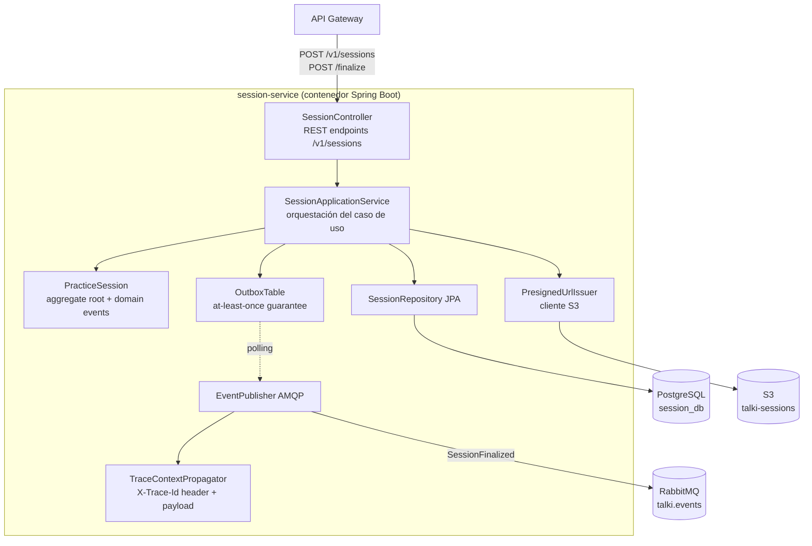
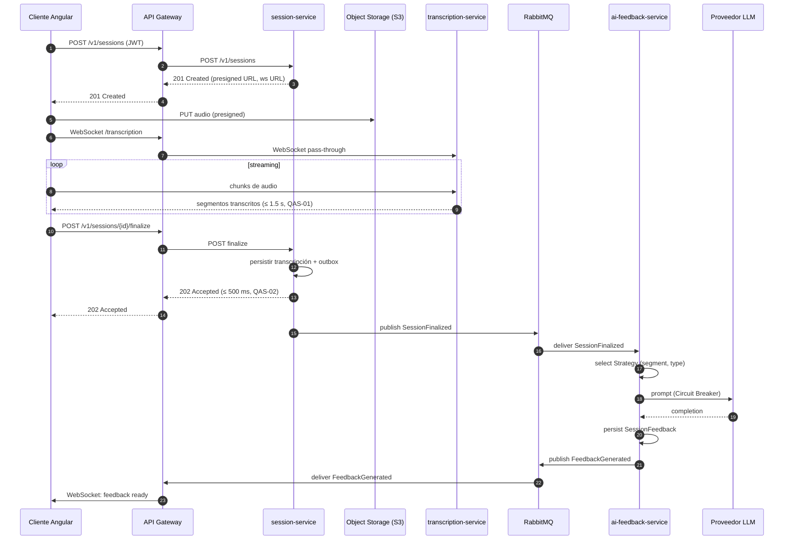
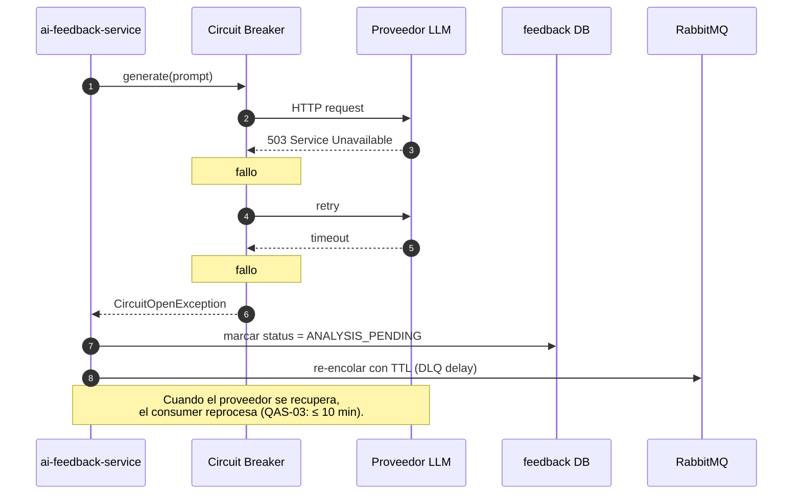
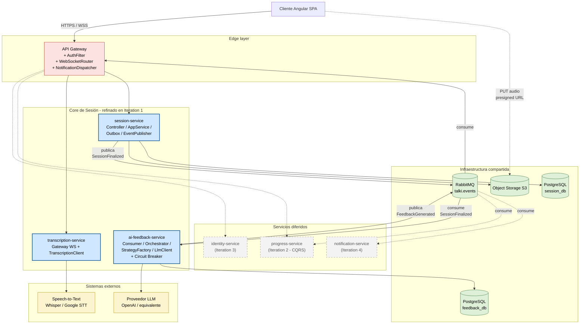
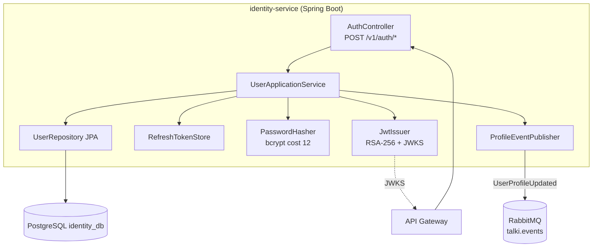
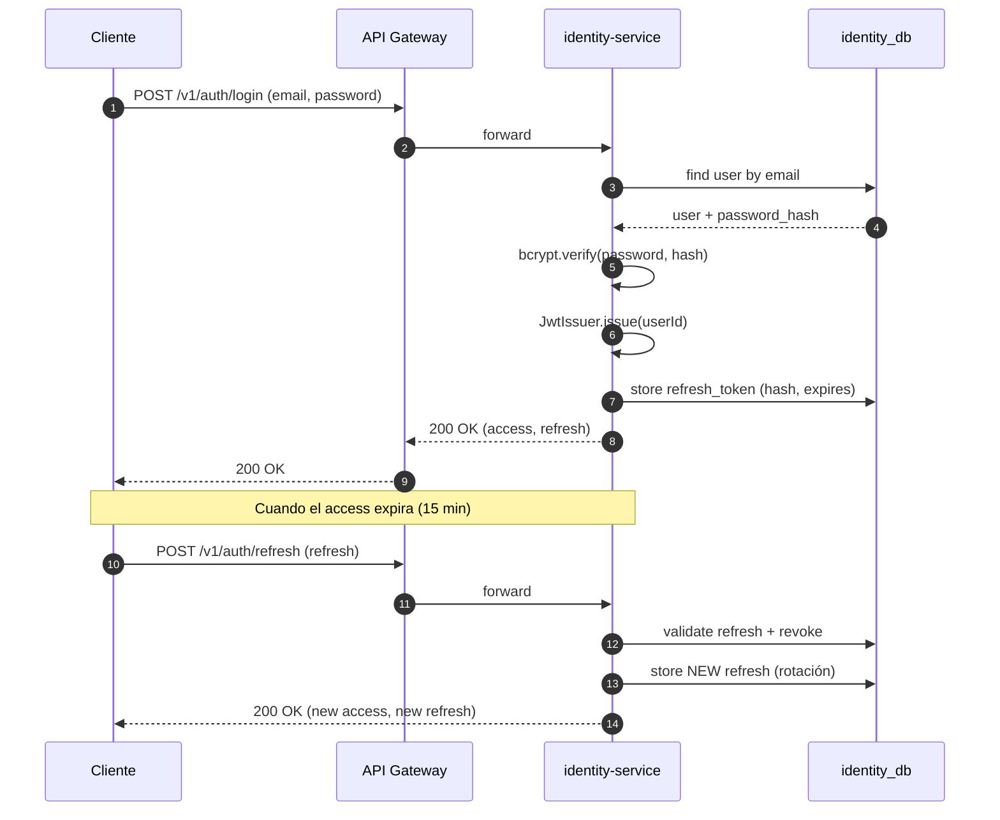

<div align="center">

<br><br>


<br><br>

**Universidad Peruana de Ciencias Aplicadas**

<br>

**Ingeniería de Software**

**Periodo:** 2026-10

<br>

**SI657 | Fundamentos de Arquitectura de Software**

**NRC:** 7940

**Docente:** Mori Yzaguirre, Daniel Enrique


### Informe de Trabajo Final


**Startup:** Thropic

**Producto:** Talki

<br>

**Integrantes:**

| Código | Apellidos y Nombres |
|--------|---------------------|
| U202313397 | Oroncoy Almeyda, Alejandro Daniel |
| U202312222 | Rivera Sosa, Eduardo Gael |
| U20241C134 | Tumi Oliden, Manuel Ignacio |

<br>

<br><br>

</div>

<hr class="page-break">

# Registro de Versiones del Informe

| Version | Fecha | Autor | Descripción de modificación |
|---------|-------|-------|-----------------------------|
| 1.0 | 09/04/2026 | Alejandro, Gael, Manuel | Creación del documento y estructura base del informe |
| 1.1 | 09/04/2026 | Alejandro, Gael, Manuel | Redacción de la descripción de la startup y perfiles del equipo (1.1) |
| 1.2 | 10/04/2026 | Alejandro, Gael, Manuel | Desarrollo de antecedentes y problemática con framework 5W+2H (1.2.2) |
| 1.3 | 10/04/2026 | Alejandro, Gael, Manuel | Elaboración del Lean UX Process y segmentos objetivo (1.2.3, 1.3) |
| 1.4 | 11/04/2026 | Alejandro, Gael, Manuel | Diseño y registro de entrevistas con ambos segmentos (2.2) |
| 1.5 | 11/04/2026 | Alejandro, Gael, Manuel | Análisis competitivo y estrategias con matriz SWOT (2.1) |
| 1.6 | 12/04/2026 | Alejandro, Gael, Manuel | Desarrollo de User Personas, User Task Matrix y Empathy Maps (2.3) |
| 1.7 | 12/04/2026 | Alejandro, Gael, Manuel | Elaboración de As-is Scenario Mapping (2.3.4) |
| 1.8 | 13/04/2026 | Alejandro, Gael, Manuel | Desarrollo de To-Be Scenario Mapping y User Stories (3.1, 3.2) |
| 1.9 | 13/04/2026 | Alejandro, Gael, Manuel | Elaboración de Impact Map y Product Backlog priorizado (3.3, 3.4) |
| 1.10 | 14/04/2026 | Alejandro, Gael, Manuel | Redacción del Student Outcome y revisión general del informe |
| 2.0 | 27/04/2026 | Manuel | Redacción de los principios arquitectónicos |
| 2.1 | 27/04/2026 | Manuel | Definición de estilos y patrones arquitectónicos |
| 2.2 | 27/04/2026 | Manuel | Elaboración del Context Diagram C4 |
| 2.3 | 27/04/2026 | Manuel | Elaboración de los ViewPoints Diagrams C4 nivel 2 y 3 |
| 2.4 | 27/04/2026 | Manuel | Elaboración del diagrama relacional database-per-service |
| 2.5 | 27/04/2026 | Manuel | Documentación de Design Patterns aplicados |
| 2.6 | 27/04/2026 | Manuel | Redacción de Tactics por atributo de calidad |
| 2.7 | 30/04/2026 | Gael | Redacción del Design Purpose del proceso de diseño |
| 2.8 | 30/04/2026 | Gael | Selección de Primary User Stories del backlog |
| 2.9 | 30/04/2026 | Gael | Definición de Quality Attribute Scenarios |
| 2.10 | 30/04/2026 | Gael | Catálogo de Constraints arquitectónicas |
| 2.11 | 30/04/2026 | Gael | Identificación de Architectural Concerns y riesgos |
| 2.12 | 02/05/2026 | Alejandro | Redacción de la sección 4.3 ADD Iterations — Iteration 1 (Núcleo de Sesión de Práctica y Feedback Asíncrono): Architectural Design Backlog 1, Iteration Goal con priorización de drivers, elementos a refinar, conceptos de diseño, instanciación de elementos arquitectónicos con interfaces, vistas C4 + UML y Decision Log |
| 2.13 | 02/05/2026 | Alejandro | Mejoras de trazabilidad en 4.3.1: incorporación de US10 como driver del Strategy con nota de alcance Must, reemplazo de la referencia a Adapter por la táctica oficial "Interfaces sobre implementaciones" (4.1.7) y marcado de campos opcionales en el contrato POST /v1/sessions con trazabilidad a US11/US25 |
| 2.14 | 02/05/2026 | Alejandro | Incorporación del diagrama C4 Nivel 3 del session-service en 4.3.1.6 para cumplir el requisito explícito del cronograma "Sketch Views (C4 & UML)" |
| 2.15 | 02/05/2026 | Alejandro | Alineación de 4.3 con el ejemplo oficial ADD del curso (Track Manager, SEI 2006): tabla de Architectural Driver Priorities en 4.3.1.2, Software Element View consolidada y tabla "Elements after Iteration 1" en 4.3.1.7 |
| 2.16 | 02/05/2026 | Alejandro | Redacción de la sección 4.3.2 ADD Iterations — Iteration 2 (Identidad, Seguridad y Observabilidad Transversal): Architectural Design Backlog 2 con 10 ítems, conceptos de diseño para JWT RSA-256, bcrypt, rate limiting, OpenTelemetry, S3 lifecycle; C4 Nivel 3 del identity-service y UML del flujo de login con refresh token rotativo |
| 2.17 | 03/05/2026 | Manuel | Incorporación del Class Diagram consolidado de los cinco bounded contexts en 4.1.5 con atributos, métodos y relaciones (Architecture Overview: Class Diagram & Database Diagram) |
| 2.18 | 03/05/2026 | Manuel | Incorporación del Context Map DDD en 4.1.4 con notación oficial (U/D, OHS, ACL, PL) sobre los cinco Bounded Contexts identificados |
| 2.19 | 03/05/2026 | Manuel | Ajustes finales en los diagramas del Capítulo IV para mejorar la claridad visual y la consistencia de notación |
| 2.20 | 03/05/2026 | Alejandro | Actualización del Registro de Versiones del informe consolidando todas las contribuciones del Avance 2 (Capítulo IV) por integrante |

<hr class="page-break">

# Contenido

- [Capítulo I: Introducción](#capítulo-i-introducción)
   - [1.1. Startup Profile](#11-startup-profile)
      - [1.1.1. Descripción de la Startup](#111-descripción-de-la-startup)
      - [1.1.2. Perfiles de integrantes del equipo](#112-perfiles-de-integrantes-del-equipo)
   - [1.2. Solution Profile](#12-solution-profile)
      - [1.2.1. Nombre del producto](#121-nombre-del-producto)
      - [1.2.2. Antecedentes y problemática](#122-antecedentes-y-problemática)
      - [1.2.3. Lean UX Process](#123-lean-ux-process)
         - [1.2.3.1. Lean UX Problem Statement](#1231-lean-ux-problem-statement)
         - [1.2.3.2. Lean UX Assumptions](#1232-lean-ux-assumptions)
         - [1.2.3.3. Lean UX Hypothesis](#1233-lean-ux-hypothesis)
         - [1.2.3.4. Lean UX Canvas](#1234-lean-ux-canvas)
   - [1.3. Segmentos objetivo](#13-segmentos-objetivo)

- [Capítulo II: Requirements & Analysis](#capítulo-ii-requirements--analysis)
   - [2.1. Competidores](#21-competidores)
   - [2.2. Entrevistas](#22-entrevistas)
   - [2.3. Needfinding](#23-needfinding)
      - [2.3.1. User Personas](#231-user-personas)
      - [2.3.2. User Task Matrix](#232-user-task-matrix)
      - [2.3.3. Empathy Maps](#233-empathy-maps)
      - [2.3.4. As-is Scenario Mapping](#234-as-is-scenario-mapping)

- [Capítulo III: Requirements Specification](#capítulo-iii-requirements-specification)
   - [3.1. To-Be Scenario Mapping](#31-to-be-scenario-mapping)
   - [3.2. User Stories](#32-user-stories)
   - [3.3. Impact Map](#33-impact-map)
   - [3.4. Product Backlog](#34-product-backlog)

- [Capítulo IV: Product Architecture Design](#capítulo-iv-product-architecture-design)
   - [4.1. Design Concepts, ViewPoints & ER Diagrams](#41-design-concepts-viewpoints--er-diagrams)
      - [4.1.1. Principles Statements](#411-principles-statements)
      - [4.1.2. Approaches Statements Architectural Styles & Patterns](#412-approaches-statements-architectural-styles--patterns)
      - [4.1.3. Context Diagram](#413-context-diagram)
      - [4.1.4. Approach driven ViewPoints Diagrams](#414-approach-driven-viewpoints-diagrams)
      - [4.1.5. Relational/Non Relational Database Diagram](#415-relationalnon-relational-database-diagram)
      - [4.1.6. Design Patterns](#416-design-patterns)
      - [4.1.7. Tactics](#417-tactics)
   - [4.2. Architectural Drivers](#42-architectural-drivers)
      - [4.2.1. Design Purpose](#421-design-purpose)
      - [4.2.2. Primary Functionality (Primary User Stories)](#422-primary-functionality-primary-user-stories)
      - [4.2.3. Quality Attribute Scenarios](#423-quality-attribute-scenarios)
      - [4.2.4. Constraints](#424-constraints)
      - [4.2.5. Architectural Concerns](#425-architectural-concerns)
   - [4.3. ADD Iterations](#43-add-iterations)
      - [4.3.1. Iteration 1: Núcleo de Sesión de Práctica y Feedback Asíncrono](#431-iteration-1-núcleo-de-sesión-de-práctica-y-feedback-asíncrono)
         - [4.3.1.1. Architectural Design Backlog 1](#4311-architectural-design-backlog-1)
         - [4.3.1.2. Establish Iteration Goal by Selecting Drivers](#4312-establish-iteration-goal-by-selecting-drivers)
         - [4.3.1.3. Choose One or More Elements of the System to Refine](#4313-choose-one-or-more-elements-of-the-system-to-refine)
         - [4.3.1.4. Choose One or More Design Concepts That Satisfy the Selected Drivers](#4314-choose-one-or-more-design-concepts-that-satisfy-the-selected-drivers)
         - [4.3.1.5. Instantiate Architectural Elements, Allocate Responsibilities, and Define Interfaces](#4315-instantiate-architectural-elements-allocate-responsibilities-and-define-interfaces)
         - [4.3.1.6. Sketch Views (C4 & UML) and Record Design Decisions](#4316-sketch-views-c4--uml-and-record-design-decisions)
         - [4.3.1.7. Analysis of Current Design and Review Iteration Goal (Kanban Board)](#4317-analysis-of-current-design-and-review-iteration-goal-kanban-board)
      - [4.3.2. Iteration 2: Identidad, Seguridad y Observabilidad Transversal](#432-iteration-2-identidad-seguridad-y-observabilidad-transversal)
         - [4.3.2.1. Architectural Design Backlog 2](#4321-architectural-design-backlog-2)
         - [4.3.2.2. Establish Iteration Goal by Selecting Drivers](#4322-establish-iteration-goal-by-selecting-drivers)
         - [4.3.2.3. Choose One or More Elements of the System to Refine](#4323-choose-one-or-more-elements-of-the-system-to-refine)
         - [4.3.2.4. Choose One or More Design Concepts That Satisfy the Selected Drivers](#4324-choose-one-or-more-design-concepts-that-satisfy-the-selected-drivers)
         - [4.3.2.5. Instantiate Architectural Elements, Allocate Responsibilities, and Define Interfaces](#4325-instantiate-architectural-elements-allocate-responsibilities-and-define-interfaces)
         - [4.3.2.6. Sketch Views (C4 & UML) and Record Design Decisions](#4326-sketch-views-c4--uml-and-record-design-decisions)
         - [4.3.2.7. Analysis of Current Design and Review Iteration Goal (Kanban Board)](#4327-analysis-of-current-design-and-review-iteration-goal-kanban-board)

- [Capítulo V: Product Implementation, Validation & Deployment](#capítulo-v-product-implementation-validation--deployment)
   - [5.1. Testing Suites & General Patterns](#51-testing-suites--general-patterns)
      - [5.1.1. Backend Application Core Testing Suite](#511-backend-application-core-testing-suite)
      - [5.1.2. Pattern Based Backend Application(s)](#512-pattern-based-backend-applications)
      - [5.1.3. Pattern Based Custom Software Library](#513-pattern-based-custom-software-library)
      - [5.1.4. Framework Pattern Driven Refactoring Report](#514-framework-pattern-driven-refactoring-report)
   - [5.2. Software Configuration Management](#52-software-configuration-management)
      - [5.2.1. Software Development Environment Configuration](#521-software-development-environment-configuration)
      - [5.2.2. Source Code Management](#522-source-code-management)
      - [5.2.3. Source Code Style Guide & Conventions](#523-source-code-style-guide--conventions)
      - [5.2.4. Software Deployment Configuration](#524-software-deployment-configuration)
   - [5.3. Microservices Implementation](#53-microservices-implementation)
      - [5.3.1. Sprint 1](#531-sprint-1)
         - [5.3.1.1. Sprint Backlog 1](#5311-sprint-backlog-1)
         - [5.3.1.2. Development Evidence for Sprint Review](#5312-development-evidence-for-sprint-review)
         - [5.3.1.3. Testing Suite Evidence for Sprint Review](#5313-testing-suite-evidence-for-sprint-review)
         - [5.3.1.4. Execution Evidence for Sprint Review](#5314-execution-evidence-for-sprint-review)
         - [5.3.1.5. Microservices Documentation Evidence for Sprint Review](#5315-microservices-documentation-evidence-for-sprint-review)
         - [5.3.1.6. Software Deployment Evidence for Sprint Review](#5316-software-deployment-evidence-for-sprint-review)
         - [5.3.1.7. Team Collaboration Insights during Sprint](#5317-team-collaboration-insights-during-sprint)
         - [5.3.1.8. Kanban Board](#5318-kanban-board)
      - [5.3.2. Sprint 2](#532-sprint-2)
         - [5.3.2.1. Sprint Backlog 2](#5321-sprint-backlog-2)
         - [5.3.2.2. Development Evidence for Sprint Review](#5322-development-evidence-for-sprint-review)
         - [5.3.2.3. Testing Suite Evidence for Sprint Review](#5323-testing-suite-evidence-for-sprint-review)
         - [5.3.2.4. Execution Evidence for Sprint Review](#5324-execution-evidence-for-sprint-review)
         - [5.3.2.5. Microservices Documentation Evidence for Sprint Review](#5325-microservices-documentation-evidence-for-sprint-review)
         - [5.3.2.6. Software Deployment Evidence for Sprint Review](#5326-software-deployment-evidence-for-sprint-review)
         - [5.3.2.7. Team Collaboration Insights during Sprint](#5327-team-collaboration-insights-during-sprint)
         - [5.3.2.8. Kanban Board](#5328-kanban-board)
      - [5.3.3. Sprint 3](#533-sprint-3)
         - [5.3.3.1. Sprint Backlog 3](#5331-sprint-backlog-3)
         - [5.3.3.2. Development Evidence for Sprint Review](#5332-development-evidence-for-sprint-review)
         - [5.3.3.3. Testing Suite Evidence for Sprint Review](#5333-testing-suite-evidence-for-sprint-review)
         - [5.3.3.4. Execution Evidence for Sprint Review](#5334-execution-evidence-for-sprint-review)
         - [5.3.3.5. Microservices Documentation Evidence for Sprint Review](#5335-microservices-documentation-evidence-for-sprint-review)
         - [5.3.3.6. Software Deployment Evidence for Sprint Review](#5336-software-deployment-evidence-for-sprint-review)
         - [5.3.3.7. Team Collaboration Insights during Sprint](#5337-team-collaboration-insights-during-sprint)
         - [5.3.3.8. Kanban Board](#5338-kanban-board)
      - [5.3.4. Sprint 4](#534-sprint-4)
         - [5.3.4.1. Sprint Backlog 4](#5341-sprint-backlog-4)
         - [5.3.4.2. Development Evidence for Sprint Review](#5342-development-evidence-for-sprint-review)
         - [5.3.4.3. Testing Suite Evidence for Sprint Review](#5343-testing-suite-evidence-for-sprint-review)
         - [5.3.4.4. Execution Evidence for Sprint Review](#5344-execution-evidence-for-sprint-review)
         - [5.3.4.5. Microservices Documentation Evidence for Sprint Review](#5345-microservices-documentation-evidence-for-sprint-review)
         - [5.3.4.6. Software Deployment Evidence for Sprint Review](#5346-software-deployment-evidence-for-sprint-review)
         - [5.3.4.7. Team Collaboration Insights during Sprint](#5347-team-collaboration-insights-during-sprint)
         - [5.3.4.8. Kanban Board](#5348-kanban-board)
   - [5.4. Microservices Deployment](#54-microservices-deployment)
      - [5.4.1. Cloud Architecture Diagram](#541-cloud-architecture-diagram)
      - [5.4.2. Cloud Architecture Deployment](#542-cloud-architecture-deployment)

- [Conclusiones](#conclusiones)
- [Referencias Bibliográficas](#referencias-bibliográficas)
- [Anexos](#anexos)

<hr class="page-break">

# Student Outcome

En el siguiente cuadro se describe las acciones realizadas y enunciados de conclusiones por parte del grupo, que permiten sustentar el haber alcanzado el logro del ABET-EAC - Student Outcome.

<table>
  <thead>
    <tr>
      <th>Criterio específico</th>
      <th>Acciones realizadas</th>
      <th>Conclusiones</th>
    </tr>
  </thead>
  <tbody>
    <tr>
      <td rowspan="3"><strong>Criterio 1: ABET-EAC - Student Outcome 3<br><br>Capacidad para comunicar efectivamente con una amplia gama de audiencias.</strong></td>
      <td><strong>Oroncoy Almeyda, Alejandro Daniel</strong><br><b>AV1:</b> Redacté la descripción de la startup Thropic y el producto Talki (sección 1.1.1), definí la propuesta de nombre del producto (1.2.1) y elaboré los segmentos objetivo con sus aspectos demográficos, geográficos y psicográficos (1.3), comunicando de forma clara el problema y la propuesta de valor a distintas audiencias.<br><br><b>AV2:</b> Redacté la sección 4.3 ADD Iterations del Capítulo IV con dos iteraciones completas del método Attribute-Driven Design (Iteration 1 — Núcleo de Sesión de Práctica y Feedback Asíncrono; Iteration 2 — Identidad, Seguridad y Observabilidad Transversal), comunicando el proceso iterativo de diseño mediante un Architectural Design Backlog trazable a los drivers de la sección 4.2, una tabla de Architectural Driver Priorities (Importance × Difficulty), diagramas C4 de Nivel 3 del session-service y del identity-service, diagramas UML de secuencia para el flujo end-to-end y el escenario de degradación elegante, una Software Element View consolidada del sistema, un Decision Log con identificadores DD-01 a DD-18, y Kanban Boards de cierre por iteración, adaptando el formato visual y narrativo a audiencias técnicas del equipo de desarrollo y a evaluadores académicos del curso.</td>
      <td rowspan="3"><b>AV1:</b> El equipo logró estructurar y comunicar de manera efectiva la propuesta de valor de Talki a través de los capítulos I, II y III del informe. Cada integrante contribuyó a transmitir el problema, la solución y los requerimientos con claridad para audiencias académicas y técnicas, empleando formatos visuales, narrativos y tabulares adecuados a cada sección.<br><br><b>AV2:</b> El equipo comunicó de manera efectiva el diseño arquitectónico de Talki en el Capítulo IV combinando narrativa técnica, diagramas C4 (contexto, contenedores y componentes), diagramas entidad-relación, tablas de drivers con identificadores trazables y matrices de tácticas por atributo de calidad, adaptando el formato a audiencias técnicas del equipo de desarrollo y a evaluadores académicos del curso.</td>
    </tr>
    <tr>
      <td><strong>Rivera Sosa, Eduardo Gael</strong><br><b>AV1:</b> Elaboré los artefactos de especificación de requerimientos del Capítulo III (To-Be Scenario Mapping, User Stories con criterios de aceptación, Impact Map y Product Backlog priorizado), comunicando las necesidades del usuario y los requerimientos del sistema de forma estructurada y comprensible para audiencias técnicas y de negocio.<br><br><b>AV2:</b> Redacté los Architectural Drivers del Capítulo IV (sección 4.2): Design Purpose, Primary User Stories, Quality Attribute Scenarios, Constraints y Architectural Concerns, comunicando las decisiones de diseño y los criterios de calidad de forma trazable para audiencias técnicas del equipo y evaluadores académicos.</td>
    </tr>
    <tr>
      <td><strong>Tumi Oliden, Manuel Ignacio</strong><br><b>AV1:</b> Diseñé y ejecuté entrevistas con usuarios de ambos segmentos objetivo (sección 2.2) y desarrollé los artefactos de Needfinding (User Personas, User Task Matrix, Empathy Maps y As-is Scenario Mapping, sección 2.3), comunicando visualmente los hallazgos de investigación de usuario para informar el diseño de la solución.<br><br><b>AV2:</b> Redacté las secciones 4.1.1 a 4.1.7 del Capítulo IV, comunicando las decisiones de diseño arquitectónico mediante narrativa técnica estructurada, diagramas C4 de contexto, contenedores y componentes, un Context Map DDD, el diagrama de clases consolidado de los cinco bounded contexts con atributos y métodos representativos, el diagrama entidad-relación de los esquemas de base de datos por servicio, y tablas de patrones de diseño y tácticas arquitectónicas alineadas con los drivers del sistema, adaptando el nivel de abstracción a audiencias técnicas del equipo de desarrollo y evaluadores académicos.</td>
    </tr>
    <tr>
      <td rowspan="3"><strong>Criterio 2: ABET-EAC - Student Outcome 5<br><br>Capacidad para identificar, formular y resolver problemas complejos de ingeniería aplicando principios de ciencias de la ingeniería, ciencias básicas y matemáticas.</strong></td>
      <td><strong>Oroncoy Almeyda, Alejandro Daniel</strong><br><b>AV1:</b> Apliqué el framework 5W+2H para analizar y formular el problema de comunicación oral en universitarios peruanos (sección 1.2.2), identificando causas, actores, contexto e impacto cuantificado con citas académicas. Realicé el análisis competitivo comparando Talki con ELSA Speak, Speeko y Orai mediante matriz SWOT (sección 2.1), derivando estrategias de diferenciación basadas en evidencia (2.1.2).<br><br><b>AV2:</b> Apliqué el método Attribute-Driven Design (Wojcik et al., SEI 2006) para resolver el problema del diseño iterativo e incremental de la arquitectura de Talki (sección 4.3), formulando dos iteraciones que descomponen el sistema en elementos refinados a partir de drivers priorizados por matriz Importance × Difficulty, seleccionando conceptos de diseño (Event-Driven Architecture, Saga por coreografía, Strategy + Factory, Circuit Breaker con Retry, JWT RSA-256 con JWKS, OpenTelemetry W3C Trace Context, S3 lifecycle policy) frente a alternativas descartadas con justificación trazable, instanciando 25 elementos arquitectónicos con responsabilidades e interfaces API-First, y registrando 18 decisiones de diseño con trazabilidad a User Stories, Quality Attribute Scenarios, Constraints y Architectural Concerns, garantizando que cada decisión técnica responde a un problema de ingeniería de software identificable y verificable.</td>
      <td rowspan="3"><b>AV1:</b> El equipo identificó y formuló el problema central de Talki mediante herramientas de ingeniería de software (Lean UX, 5W+2H, análisis competitivo, investigación de usuarios), estableciendo las bases para el diseño de una solución técnica fundamentada en evidencia y orientada al usuario.<br><br><b>AV2:</b> El equipo aplicó principios de ingeniería de software para resolver el problema del diseño arquitectónico de Talki, descomponiendo la solución en bounded contexts mediante DDD, formulando drivers arquitectónicos medibles (Quality Attribute Scenarios, Constraints y Concerns) y seleccionando estilos, patrones y tácticas justificados a partir de los requerimientos del AV1, garantizando trazabilidad entre cada decisión técnica y su problema de origen.</td>
    </tr>
    <tr>
      <td><strong>Rivera Sosa, Eduardo Gael</strong><br><b>AV1:</b> Formulé los requerimientos funcionales de Talki mediante User Stories con criterios de aceptación y los organicé en un Product Backlog priorizado (Capítulo III), aplicando principios de ingeniería de requerimientos para traducir necesidades del usuario en especificaciones técnicas accionables.<br><br><b>AV2:</b> Formulé los drivers arquitectónicos de Talki (sección 4.2) traduciendo los requerimientos del Capítulo III en 12 Quality Attribute Scenarios medibles, 14 Constraints y 11 Architectural Concerns con identificadores trazables, aplicando principios de ingeniería de software para sustentar las decisiones de diseño en evidencia y criterios verificables.</td>
    </tr>
    <tr>
      <td><strong>Tumi Oliden, Manuel Ignacio</strong><br><b>AV1:</b> Apliqué técnicas de investigación cualitativa (entrevistas semi-estructuradas, empathy mapping, as-is scenario mapping) para identificar y analizar los problemas de comunicación oral de los dos segmentos objetivo (secciones 2.2 y 2.3), generando insights que fundamentan las decisiones de diseño de Talki.<br><br><b>AV2:</b> Resolví el problema del diseño conceptual de la arquitectura de Talki aplicando principios de Domain-Driven Design: descompuse el sistema en cinco bounded contexts (Identity & Access, Practice Session, Speech Analysis, Progress & Metrics, Notification), definí sus mecanismos de integración mediante un Context Map, diseñé el modelo de clases por contexto incorporando los patrones Strategy, Factory Method, Repository y Observer justificados por los drivers del sistema, y modelé el esquema de base de datos relacional con decisiones de modelado fundamentadas en los requerimientos de consistencia transaccional y autonomía de cada servicio (secciones 4.1.1 a 4.1.7).</td>
    </tr>
  </tbody>
</table>

<hr class="page-break">

# Capítulo I: Introducción

## 1.1. Startup Profile

### 1.1.1. Descripción de la Startup

Thropic es una startup de tecnología educativa fundada por estudiantes de Ingeniería de Software de la Universidad Peruana de Ciencias Aplicadas (UPC), con la misión de democratizar el acceso a herramientas de desarrollo personal mediante inteligencia artificial.

**Misión:** Empoderar a los estudiantes universitarios a desarrollar habilidades de comunicación oral efectiva a través de tecnología accesible e inteligente.

**Visión:** Ser la plataforma líder en Latinoamérica para el desarrollo de habilidades de comunicación oral en el ámbito académico y profesional para 2030.

Talki es la solución principal de Thropic: una aplicación web que utiliza IA para analizar, evaluar y retroalimentar la comunicación oral de estudiantes universitarios en tiempo real, ayudándoles a mejorar su fluidez, pronunciación, estructura del discurso y confianza al hablar en público.

### 1.1.2. Perfiles de integrantes del equipo

<table>
  <thead>
    <tr>
      <th>Perfil</th>
      <th>Foto</th>
    </tr>
  </thead>
  <tbody>
    <tr>
      <td><strong>Oroncoy Almeyda, Alejandro Daniel</strong> (U202313397)<br>Mi nombre es Alejandro Oroncoy, tengo 19 años y soy estudiante de Ingeniería de Software en el quinto ciclo. Me considero una persona proactiva, autodidacta y orientada a objetivos. Disfruto aprender nuevas tecnologías por cuenta propia y busco siempre entregar resultados de calidad. Tengo experiencia en desarrollo backend con Java y Spring Boot, así como en Python y servicios cloud. Me motiva construir soluciones que generen impacto real, y en Thropic asumo con entusiasmo el reto de llevar Talki al mercado universitario peruano.</td>
      <td></td>
    </tr>
    <tr>
      <td><strong>Rivera Sosa, Eduardo Gael</strong> (U202312222)<br>Mi nombre es Gael Rivera, tengo 20 años y soy estudiante de Ingeniería de Software en el quinto ciclo. Me caracterizo por ser responsable y orientado a resultados, con habilidades de liderazgo que facilitan la comunicación y el trabajo colaborativo. Tengo conocimientos en desarrollo frontend con Angular y experiencia en modelado de bases de datos relacionales. Siempre estoy dispuesto a abordar desafíos y encontrar soluciones en equipo, y en Thropic asumo la especificación de requerimientos como base técnica del producto.</td>
      <td></td>
    </tr>
    <tr>
      <td><strong>Tumi Oliden, Manuel Ignacio</strong> (U20241C134)<br>Mi nombre es Manuel Tumi, soy estudiante de Ingeniería de Software y me caracterizo por ser una persona colaborativa y adaptable, que se integra fácilmente a distintos métodos de trabajo. Tengo conocimientos en investigación de usuarios, diseño de entrevistas y análisis de necesidades, habilidades que aplico en la etapa de needfinding del proyecto. Prefiero apoyar al equipo desde la escucha activa y el análisis, y en mi tiempo libre disfruto del voleibol y los videojuegos.</td>
      <td></td>
    </tr>
  </tbody>
</table>

<hr class="page-break">

## 1.2. Solution Profile

### 1.2.1. Nombre del producto

**Talki** es el nombre de nuestra aplicación. El nombre proviene de la combinación de "Talk" (hablar en inglés) con el sufijo "-i" que evoca inteligencia e innovación. Talki representa la idea de tener un compañero inteligente que te ayuda a mejorar tu forma de comunicarte oralmente.

### 1.2.2. Antecedentes y problemática

#### WHAT (Qué)

Las deficiencias en comunicación oral afectan el desempeño académico y profesional de los universitarios peruanos.

#### WHEN (Cuándo)

Se manifiesta principalmente al momento de realizar exposiciones, sustentaciones, entrevistas de trabajo y presentaciones profesionales.

#### WHERE (Dónde)

En aulas universitarias, plataformas virtuales y entornos laborales/prácticas.

#### WHO (Quién)

Estudiantes de educación superior peruanos (ciclos 1-10), especialmente aquellos sin acceso a coaching personalizado.

#### WHY (Por qué)

La educación tradicional no brinda suficientes espacios de práctica oral con feedback personalizado. El acceso a coaches es costoso y limitado.

#### HOW (Cómo)

Talki usa IA para grabar, analizar y retroalimentar la comunicación oral del usuario en tiempo real, con ejercicios progresivos y personalizados.

#### HOW MUCH (Cuánto)

Según la Superintendencia Nacional de Educación Superior Universitaria (SUNEDU, 2023), más de 1.5 millones de estudiantes se encuentran matriculados en universidades peruanas, representando un mercado potencial significativo para soluciones de desarrollo de competencias comunicativas.

En el plano de la ansiedad comunicativa, la literatura científica muestra cifras consistentemente elevadas. Maldonado et al. (2022), en un estudio experimental con universitarios publicado en la *Revista Latina de Comunicación Social*, confirmaron que la ansiedad al hablar en público impacta directamente el desempeño académico y la participación activa en clases. A nivel global, investigaciones compiladas por Teleprompter.com (2024) revelan que el **75% de las personas** experimenta algún nivel de ansiedad al hablar en público, y el **61% de universitarios** la reporta como un temor significativo.

_Figura 1: Prevalencia de la ansiedad al hablar en público en población universitaria_

<div align="center">

</div>

_Nota._ Elaboración propia basada en Teleprompter.com (2024) y Crown Counseling (2024).

Respecto al impacto en la empleabilidad, un estudio descriptivo sobre competencias laborales blandas en egresados universitarios latinoamericanos (Redalyc, 2022) identificó que la **comunicación asertiva** es la segunda habilidad más demandada por empleadores (9.1%), solo detrás del trabajo en equipo (10.1%). Sin embargo, es también una de las competencias con mayores brechas en egresados.

_Figura 2: Habilidades blandas más demandadas por empleadores en Latinoamérica_

<div align="center">

</div>

_Nota._ Elaboración propia basada en Redalyc (2022).

Finalmente, la ansiedad comunicativa no solo afecta el desempeño académico sino también la trayectoria profesional. Datos de Crown Counseling (2024) y Teleprompter.com (2024) indican que el **70% de los empleos** requiere algún nivel de oratoria o presentaciones; el **30% de las personas** ha evitado postular a empleos o ascensos debido a esta ansiedad; y quienes la padecen tienen un **15% menos de probabilidad** de alcanzar posiciones gerenciales.

_Figura 3: Impacto profesional de la ansiedad al hablar en público_

<div align="center">

</div>

_Nota._ Elaboración propia basada en Crown Counseling (2024) y Teleprompter.com (2024).

Ante este escenario, el costo de un coach de oratoria privado en Lima oscila entre S/. 80 y S/. 200 por sesión (con frecuencia semanal recomendada), haciendo inaccesible el entrenamiento personalizado para la mayoría del segmento universitario. Talki aborda esta brecha mediante IA accesible desde cualquier navegador web, a una fracción del costo.

### 1.2.3. Lean UX Process

El proceso Lean UX aplicado en Thropic sigue el enfoque de validación continua de hipótesis mediante ciclos cortos de aprendizaje, construir y medir (Ries, 2011), con el objetivo de reducir el riesgo de construir un producto que el mercado no necesita.

#### 1.2.3.1. Lean UX Problem Statement

**Segmento 1:** Hemos observado que los estudiantes de ciclos 1-5 carecen de espacios seguros y accesibles para practicar la comunicación oral con feedback real. El impacto es bajo desempeño en exposiciones y pérdida de oportunidades académicas. ¿Cómo podríamos brindarles práctica guiada con IA para que ganen confianza progresivamente?

**Segmento 2:** Hemos observado que los estudiantes de ciclos 6-10 no tienen herramientas asequibles para prepararse para entrevistas laborales y presentaciones profesionales. El impacto es dificultad para insertarse en el mercado laboral. ¿Cómo podríamos simular entornos reales de comunicación profesional para que estén listos al graduarse?

#### 1.2.3.2. Lean UX Assumptions

##### Business Assumptions

1. Creemos que los usuarios pagarán una suscripción mensual de S/. 15-25 por acceso premium.
2. Creemos que el mayor canal de adquisición serán las redes sociales universitarias (Instagram, TikTok).
3. Creemos que los usuarios necesitan al menos 3 sesiones semanales para notar mejora en 30 días.
4. Creemos que las universidades adoptarán Talki como herramienta complementaria en cursos de comunicación.
5. Creemos que el NPS (Net Promoter Score) alcanzará 40+ en los primeros 6 meses.
6. Creemos que el costo de adquisición por usuario será menor a S/. 10 mediante estrategias de referidos.
7. Creemos que el 60% de usuarios retendrá la app más de 3 meses con gamificación efectiva.
8. Creemos que las alianzas con institutos y universidades serán nuestro principal canal B2B.
9. Creemos que los usuarios en ciclos 6-10 están dispuestos a pagar más por features de simulación de entrevistas.
10. Creemos que el mercado latinoamericano de edtech crecerá 25% anual los próximos 3 años.
11. Creemos que la diferenciación por idioma español y contexto peruano/latinoamericano será una ventaja competitiva sostenible.

##### User Assumptions

1. **¿Quién es el usuario?** Estudiantes universitarios peruanos de ciclos 1-10, de 17 a 26 años, nativos digitales con acceso a laptop/PC y conexión a internet.
2. **¿Dónde encaja nuestro producto en su vida?** En los momentos previos a exposiciones, durante el estudio en casa, y en transporte público.
3. **¿Qué problemas resuelve nuestro producto?** La falta de espacios seguros para practicar oralidad con feedback inmediato y personalizado.
4. **¿Cuándo y cómo es usado nuestro producto?** Sesiones de 10-20 minutos, principalmente en las noches, desde el navegador web en su laptop o PC.
5. **¿Qué características son importantes?** Feedback en tiempo real, ejercicios progresivos, historial de progreso, modo simulación de entrevistas.
6. **¿Cómo debe verse y comportarse el producto?** Intuitivo, motivador, con elementos de gamificación, lenguaje cercano y sin tecnicismos.

#### 1.2.3.3. Lean UX Hypothesis

Cada hipótesis sigue el feature hypothesis template y explicita los cuatro componentes requeridos: business outcome medible, usuario segmentado (Valeria Ríos o Rodrigo Sánchez), beneficio percibido y feature asociada. Los outcomes están alineados con los Business Goals SMART del Impact Map (§3.3).

1. **H1 (Adopción, BG-01).** Creemos que lograremos una retención semanal del 40% y una permanencia promedio de más de 90 días en Valeria Ríos (Segmento 1, ciclos 1 al 5) si la estudiante gana confianza al practicar exposiciones con feedback inmediato, mediante la feature de *ejercicios guiados con IA*.

2. **H2 (Conversión, BG-02).** Creemos que lograremos una reducción de la ansiedad al hablar en público y un NPS de al menos 45 puntos en Rodrigo Sánchez (Segmento 2, ciclos 6 al 10) si el estudiante se prepara para entrevistas laborales reales en condiciones realistas, mediante la feature de *simulador de entrevistas con feedback en tiempo real*.

3. **H3 (Engagement, BG-03).** Creemos que lograremos al menos 3 sesiones semanales sostenidas durante 4 semanas consecutivas en ambos segmentos si los estudiantes conservan el hábito de práctica gracias a refuerzos positivos, mediante la feature de *streaks y logros*.

4. **H4 (Engagement, BG-03).** Creemos que lograremos un aumento del engagement de 40% (es decir, al menos 4 sesiones al mes) en Rodrigo Sánchez (Segmento 2) si el estudiante puede visualizar su progreso medible por habilidad en un lugar único, mediante la feature de *dashboard de métricas personales*.

5. **H5 (Adopción, BG-01).** Creemos que lograremos un CAC por debajo de S/ 10 vía referidos en Valeria Ríos (Segmento 1) si la estudiante puede compartir logros con sus compañeros de clase, mediante la feature de *comunidad y retos entre amigos*.

6. **H6 (Retención, BG-03).** Creemos que lograremos un churn mensual por debajo del 15% en ambos segmentos si los estudiantes reciben un plan de práctica personalizado según sus errores recurrentes, mediante la feature de *ruta de aprendizaje adaptativa con IA*.

#### 1.2.3.4. Lean UX Canvas

_Figura 4: Lean UX Canvas de Talki_

<div align="center">

</div>

_Nota._ Elaboración propia (2026).

<hr class="page-break">

## 1.3. Segmentos objetivo

**Segmento 1: Estudiantes universitarios de ciclos 1 al 5**

*Aspectos Demográficos:*
- Edad: 17-21 años
- Sexo: Masculino y femenino
- Nivel socioeconómico: B y C
- Ciclo: 1 al 5 de educación superior universitaria

*Aspectos Geográficos:*
- País: Perú
- Región: Lima Metropolitana y principales ciudades del interior (Arequipa, Trujillo, Piura)
- Tipo de institución: Universidades privadas y públicas

*Aspectos Psicográficos:*
- Motivaciones: Mejorar calificaciones en cursos con exposiciones, ganar confianza al hablar en público, no pasar vergüenza frente a compañeros
- Dolores: Miedo escénico pronunciado, vocabulario académico limitado, falta de estructura al exponer, nerviosismo que bloquea el discurso
- Comportamientos digitales: Nativos digitales, uso intensivo de dispositivos digitales y navegador web, acostumbrados a plataformas de aprendizaje (Duolingo, YouTube), disponibles para sesiones cortas de 10-15 min

**Segmento 2: Estudiantes universitarios de ciclos 6 al 10**

*Aspectos Demográficos:*
- Edad: 21-26 años
- Sexo: Masculino y femenino
- Nivel socioeconómico: B y C
- Ciclo: 6 al 10 de educación superior universitaria, próximos a egresar

*Aspectos Geográficos:*
- País: Perú
- Región: Lima Metropolitana y principales ciudades con oferta laboral tecnológica
- Tipo de institución: Universidades con programas de prácticas preprofesionales activos

*Aspectos Psicográficos:*
- Motivaciones: Conseguir prácticas o primer empleo, destacar en entrevistas técnicas y de RR.HH., comunicar ideas con claridad en entornos profesionales
- Dolores: Dificultad para expresarse con fluidez y vocabulario profesional, ansiedad ante entrevistas de trabajo, falta de espacios reales de práctica con feedback concreto
- Comportamientos digitales: Usuarios activos de LinkedIn, plataformas de empleabilidad y apps de productividad; dispuestos a pagar por herramientas que generen ROI directo en su carrera

<hr class="page-break">

# Capítulo II: Requirements & Analysis

## 2.1. Competidores

<table>
  <tr>
    <th colspan="6">Competitive Analysis Landscape</th>
  </tr>
  <tr>
    <td colspan="2" align="center"><b>¿Por qué llevar a cabo este análisis?</b></td>
    <td colspan="4">Para identificar las fortalezas, debilidades y estrategias de nuestros competidores directos e indirectos, con el fin de definir la propuesta de valor diferenciada de Talki y detectar oportunidades de mercado no atendidas.</td>
  </tr>
  <tr>
    <th colspan="2">Nombre</th>
    <th>Talki (Thropic)</th>
    <th>ELSA Speak</th>
    <th>Speeko</th>
    <th>Orai</th>
  </tr>
  <tr>
    <td colspan="2" align="center"><b>Logo</b></td>
    <td align="center"></td>
    <td align="center"></td>
    <td align="center"></td>
    <td align="center"></td>
  </tr>
  <tr>
    <td rowspan="2"><b>Perfil</b></td>
    <td><b>Overview</b></td>
    <td>Aplicación web con IA que analiza y retroalimenta la comunicación oral de estudiantes universitarios peruanos en tiempo real, en español.</td>
    <td>App de pronunciación en inglés con IA que evalúa y corrige la pronunciación del usuario en tiempo real mediante reconocimiento de voz avanzado.</td>
    <td>App de coaching para hablar en público con lecciones estructuradas impartidas por coaches reales y ejercicios de práctica.</td>
    <td>App móvil con IA que analiza la oratoria del usuario (ritmo, palabras de relleno, energía, expresión facial) y entrega retroalimentación inmediata y lecciones personalizadas.</td>
  </tr>
  <tr>
    <td><b>Ventaja competitiva ¿Qué valor ofrece a los clientes?</b></td>
    <td>Feedback en tiempo real en español con contexto académico peruano; enfocado en universitarios latinoamericanos.</td>
    <td>Motor de IA especializado en detección de errores fonéticos del inglés; más de 50M usuarios globales.</td>
    <td>Contenido creado por coaches profesionales de oratoria; estructura de cursos progresivos y micro-lecciones de 5 minutos.</td>
    <td>Análisis multimodal (voz + expresión facial) con plan de entrenamiento adaptativo; gamificación y seguimiento de progreso detallado.</td>
  </tr>
  <tr>
    <td rowspan="2"><b>Perfil de Marketing</b></td>
    <td><b>Mercado objetivo</b></td>
    <td>Estudiantes universitarios peruanos/latinoamericanos de ciclos 1-10.</td>
    <td>Hablantes no nativos de inglés que desean mejorar su pronunciación, principalmente en Asia y Latinoamérica.</td>
    <td>Profesionales y estudiantes angloparlantes que quieren mejorar su oratoria y liderazgo comunicacional.</td>
    <td>Profesionales, estudiantes y ejecutivos angloparlantes que necesitan mejorar presentaciones y discursos.</td>
  </tr>
  <tr>
    <td><b>Estrategias de Marketing</b></td>
    <td>Freemium, marketing universitario, referidos entre compañeros.</td>
    <td>Freemium, referidos, partnerships con instituciones educativas.</td>
    <td>Freemium, publicidad en LinkedIn y redes, membresías corporativas.</td>
    <td>Freemium con trial de 7 días, alianzas con instituciones educativas, plan Enterprise para equipos.</td>
  </tr>
  <tr>
    <td rowspan="3"><b>Perfil de Producto</b></td>
    <td><b>Productos &amp; Servicios</b></td>
    <td>Aplicación web con análisis de voz, ejercicios guiados, simulador de entrevistas y dashboard de progreso.</td>
    <td>App móvil (iOS/Android) con lecciones de pronunciación, conversación simulada y análisis fonético detallado.</td>
    <td>App móvil con cursos de oratoria, ejercicios diarios de 5 minutos y biblioteca de habilidades comunicacionales.</td>
    <td>App móvil (iOS/Android) con análisis de voz e imagen, lecciones gamificadas, historial de práctica y plan personalizado de 4 semanas.</td>
  </tr>
  <tr>
    <td><b>Precios y Costos</b></td>
    <td>Freemium; plan premium S/. 15-25/mes.</td>
    <td>Gratis con funciones limitadas; premium desde $6.99/mes.</td>
    <td>Gratis con funciones básicas; premium desde $9.99/mes.</td>
    <td>Gratis con funciones básicas; premium desde $9.99/mes o $39.99/año.</td>
  </tr>
  <tr>
    <td><b>Canales de distribución</b></td>
    <td>Sitio web (talki.com), compatible con navegadores modernos (Chrome, Edge, Safari, Firefox).</td>
    <td>App Store, Google Play, web.</td>
    <td>App Store, Google Play.</td>
    <td>App Store, Google Play.</td>
  </tr>
  <tr>
    <td rowspan="4"><b>Análisis SWOT</b></td>
    <td><b>Fortalezas</b></td>
    <td>Español nativo, contexto universitario peruano, IA personalizada, gamificación.</td>
    <td>IA muy precisa, gran base de usuarios global, contenido extenso y probado.</td>
    <td>Contenido de alta calidad creado por expertos, formato de micro-lecciones atractivo.</td>
    <td>Análisis multimodal avanzado, plan adaptativo personalizado, gamificación efectiva, disponible en iOS y Android.</td>
  </tr>
  <tr>
    <td><b>Oportunidades</b></td>
    <td>Mercado latinoamericano poco atendido, alianzas con universidades, expansión a otros países.</td>
    <td>Expansión a otros idiomas, mercado B2B con instituciones educativas.</td>
    <td>Mercado B2B corporativo, expansión a español y otros idiomas.</td>
    <td>Expansión a idiomas distintos del inglés, mercado educativo universitario latinoamericano sin atender.</td>
  </tr>
  <tr>
    <td><b>Debilidades</b></td>
    <td>Startup nueva sin track record, recursos limitados, marca poco conocida.</td>
    <td>Enfocado solo en pronunciación del inglés, no cubre comunicación oral en español.</td>
    <td>Sin IA para feedback en tiempo real, contenido exclusivamente en inglés.</td>
    <td>Solo disponible en inglés, sin adaptación al contexto académico ni latinoamericano.</td>
  </tr>
  <tr>
    <td><b>Amenazas</b></td>
    <td>Entrada de apps internacionales al mercado hispanohablante, competidores con mayor financiamiento.</td>
    <td>Competidores con IA generativa más avanzada, apps multiidioma con mayor alcance.</td>
    <td>Apps con IA generativa que ofrecen feedback personalizado, saturación del mercado edtech.</td>
    <td>Saturación del mercado edtech en inglés, nuevos competidores con IA generativa más potente.</td>
  </tr>
</table>

### 2.1.2. Estrategias y tácticas frente a los competidores

A partir del análisis competitivo, Thropic adopta las siguientes estrategias para posicionar Talki en el mercado:

**Frente a ELSA Speak:**
ELSA Speak domina el mercado de pronunciación en inglés pero no atiende la comunicación oral en español ni el contexto académico latinoamericano. Talki se diferencia enfocándose exclusivamente en español con contexto universitario peruano, ofreciendo ejercicios de exposición académica y simulación de sustentaciones que ELSA no contempla.

**Frente a Speeko:**
Speeko utiliza contenido pregrabado por coaches sin feedback personalizado en tiempo real. Talki responde con IA generativa que analiza el discurso del usuario en el momento y entrega retroalimentación específica e inmediata, no guiones estáticos. Además, Speeko no tiene presencia en el mercado hispanohablante, lo que representa una ventana de oportunidad directa.

**Frente a Orai:**
Orai ofrece análisis de oratoria con IA de manera similar a Talki, pero opera exclusivamente en inglés y sin ninguna adaptación al contexto académico latinoamericano. Talki capitaliza esta brecha ofreciendo la misma profundidad de análisis (ritmo, fluidez, claridad) pero en español, con ejercicios diseñados para sustentaciones, exposiciones universitarias y entrevistas de prácticas preprofesionales típicas del sistema educativo peruano.

**Estrategia de diferenciación general:**

- *Localización:* Único producto diseñado para el contexto universitario peruano/latinoamericano en español
- *Precio accesible:* Modelo freemium con plan premium a S/. 15-25/mes, muy por debajo de los competidores internacionales
- *Alianzas universitarias:* Partnerships con facultades de Ingeniería y Comunicaciones de universidades peruanas para adopción institucional
- *Gamificación contextual:* Sistema de logros y streaks adaptado a los ciclos académicos peruanos (exposiciones, sustentaciones, entrevistas de prácticas)

<hr class="page-break">

## 2.2. Entrevistas

### 2.2.1. Diseño de entrevistas

El objetivo de las entrevistas es comprender las necesidades, frustraciones y hábitos de comunicación oral de los segmentos objetivo de Talki, así como su disposición a usar herramientas digitales para mejorar sus habilidades comunicativas.

---

**Segmento 1: Estudiantes universitarios de ciclos 1 al 5**

*Objetivos específicos:*
- Conocer cómo viven los primeros encuentros con exposiciones y presentaciones en la universidad.
- Identificar las inseguridades comunicativas más frecuentes en etapas tempranas de la carrera.
- Entender qué estrategias de práctica emplean actualmente y cuáles consideran insuficientes.
- Evaluar su apertura a recibir retroalimentación automatizada de una IA.

*Preguntas introductorias:*
1. ¿En qué universidad estudias, qué carrera sigues y en qué ciclo te encuentras?
2. ¿Con qué frecuencia tienes que hacer exposiciones, sustentaciones o participaciones orales en clases?

*Preguntas principales:*

3. ¿Cómo fue tu primera exposición en la universidad? ¿Qué recuerdas de esa experiencia?
4. ¿Qué aspectos de tu comunicación oral sientes que más necesitas trabajar en este punto de tu carrera? (nerviosismo, muletillas, fluidez, volumen, etc.)
5. ¿Cómo te preparas actualmente cuando tienes que exponer? ¿Cuánto tiempo le dedicas?
6. ¿Alguna vez tu desempeño oral no reflejó lo que realmente sabías del tema? ¿Qué ocurrió?
7. ¿Has usado alguna app o herramienta digital para mejorar tu forma de hablar o exponer? ¿Cómo fue?
8. ¿Te grabarías en video o audio para escucharte y corregirte? ¿Por qué sí o por qué no?
9. ¿Qué tan cómodo(a) te sentirías recibiendo retroalimentación de una IA sobre tu forma de hablar?
10. ¿Estarías dispuesto(a) a pagar por una app así? ¿Qué precio te parecería justo?

---

**Segmento 2: Estudiantes universitarios de ciclos 6 al 10**

*Objetivos específicos:*
- Entender cómo evolucionan las exigencias de comunicación oral en ciclos avanzados.
- Identificar si la preparación para prácticas preprofesionales o entrevistas laborales genera nuevas necesidades comunicativas.
- Conocer su nivel de autonomía para practicar y mejorar su oratoria.
- Determinar su disposición a adoptar una herramienta de IA especializada en comunicación académica y profesional.

*Preguntas introductorias:*
1. ¿En qué universidad estudias, qué carrera sigues y en qué ciclo te encuentras?
2. ¿Qué tipos de evaluaciones orales has tenido que enfrentar en los últimos ciclos? (sustentaciones, jurados, entrevistas de prácticas, etc.)

*Preguntas principales:*

3. Comparando tus primeros ciclos con ahora, ¿sientes que tu comunicación oral ha mejorado? ¿Qué crees que la cambió?
4. ¿Cuáles son los escenarios orales que todavía te generan más estrés o inseguridad?
5. ¿Cómo te preparas hoy para una sustentación importante o una entrevista de prácticas?
6. ¿Has sentido que tu forma de comunicarte oralmente te ha jugado en contra en alguna evaluación o proceso de selección? Cuéntame.
7. ¿Has probado alguna herramienta digital para practicar presentaciones o entrevistas? ¿Qué te pareció?
8. ¿Qué tipo de análisis de tu comunicación te resultaría más valioso: fluidez, claridad de ideas, manejo de silencios, muletillas, otro?
9. ¿Qué tan útil sería para ti una app con IA que simule sustentaciones o entrevistas de prácticas y te dé retroalimentación detallada?
10. ¿Usarías este tipo de herramienta de forma autónoma o preferirías poder compartir los resultados con un profesor o tutor?

### 2.2.2. Registro de entrevistas

### Segmento #1: Estudiantes universitarios de ciclos 1 al 5
 
| Número de entrevista | Datos del entrevistado | Evidencia de entrevista |
|---|---|---|
| 1 | **Nombre:** Belén Ordoñez <br> **Universidad:** PUCP <br> **Ciclo:** 5to <br> **Carrera:** Comunicación para el Desarrollo <br><br> **Resumen:** Estudiante de quinto ciclo en la PUCP cuya carrera gira en torno a presentaciones orales: la mayoría de sus evaluaciones son exposiciones de proyectos. Recuerda haberse puesto nerviosa en su primera exposición universitaria. Su principal problema es que el volumen de su voz va disminuyendo conforme avanza en la presentación. Ha sufrido "black outs" durante exposiciones, terminando sin recordar lo que dijo. No conocía la existencia de herramientas digitales para mejorar la oratoria. Actualmente pide a amigos que la escuchen antes de exponer. Se sentiría más cómoda recibiendo retroalimentación de una IA por su mayor honestidad y franqueza. Estaría dispuesta a pagar entre 2 y 5 dólares mensuales por una app que realmente funcione. |  [📂 Ver entrevista](https://drive.google.com/file/d/10J3cMAzuvoZMY6HTzRomq5vosujsAai4/view?usp=sharing) <br> `00:00:00 a 00:06:07` |
 
| Número de entrevista | Datos del entrevistado | Evidencia de entrevista |
|---|---|---|
| 2 | **Nombre:** Isabel Rodriguez <br> **Universidad:** Universidad de Lima <br> **Ciclo:** 5to <br> **Carrera:** Arquitectura <br><br> **Resumen:** Isabel estudia Arquitectura en la Universidad de Lima y tiene exposiciones prácticamente todas las semanas, especialmente resúmenes de talleres los viernes. Su primera experiencia expositiva fue buena en general, aunque reconoce que hubiera sido mejor con más dominio del curso. Los puntos que más necesita trabajar son el nerviosismo y la ampliación de vocabulario, pues tiende a repetir siempre las mismas palabras. Se prepara con una bitácora personal y revisando sus diapositivas el día anterior. Usa ChatGPT para preparar contenido, aunque de forma general. Olvida información relevante por el apuro de terminar la exposición rápido. Le parece muy interesante recibir retroalimentación de una IA por el ahorro de tiempo. Estaría dispuesta a pagar hasta 5 dólares mensuales, aunque querría comparar precios antes de decidir. |  [📂 Ver entrevista](https://drive.google.com/file/d/10J3cMAzuvoZMY6HTzRomq5vosujsAai4/view?usp=sharing) <br> `00:06:13 a 00:13:22` |
 
| Número de entrevista | Datos del entrevistado | Evidencia de entrevista |
|---|---|---|
| 3 | **Nombre:** Juan Alejandro Elías López <br> **Universidad:** UPC <br> **Ciclo:** 4to <br> **Carrera:** Ingeniería de Software <br><br> **Resumen:** Juan Alejandro ya tenía experiencia en exposiciones desde la secundaria, por lo que su primera presentación universitaria no le generó nerviosismo. Considera que exponer es divertido. El aspecto que más necesita mejorar es la fluidez, especialmente en exposiciones finales de alta importancia donde el nerviosismo sí lo afecta. Se prepara escribiendo su guión a mano y memorizándolo en partes a lo largo de varios días, dedicando aproximadamente 2 horas diarias. Nunca ha sentido que una exposición no reflejara lo que sabía. No ha usado herramientas digitales para mejorar su oratoria. Estaría dispuesto a grabarse como nueva forma de práctica autónoma. Estaría abierto tanto a retroalimentación de IA como de un tutor humano, y el precio que pagaría dependería de las funcionalidades concretas que ofrezca la aplicación. | [📂 Ver entrevista](https://drive.google.com/file/d/10J3cMAzuvoZMY6HTzRomq5vosujsAai4/view?usp=sharing) <br> `00:13:23 a 00:19:12` |

### Segmento #2: Estudiantes universitarios de ciclos 6 al 10

| Número de entrevista | Datos del entrevistado | Evidencia de entrevista |
|---|---|---|
| 4 | **Nombre:** Gianger <br> **Universidad:** University of the People (EE.UU., modalidad remota) <br> **Ciclo:** 6to <br> **Carrera:** Computer Science <br><br> **Resumen:** Gianger estudia de forma remota en una universidad estadounidense y tiene una trayectoria oral variada: monografías, proyectos de software, debates, simulaciones de entrevistas y entrevistas reales de trabajo. Reconoce una mejora enorme desde sus inicios, impulsada principalmente por la experiencia laboral. Antes hablaba muy rápido y usaba muletillas constantemente. Hoy la presión aparece principalmente al presentar ante jefes o personas con mayor jerarquía. Se prepara con "chuletillas", guías de oratoria y autograbaciones para identificar puntos débiles. Vivió en carne propia cómo la mala comunicación le jugó en contra en una entrevista con una empresa española en inglés. Ha probado la herramienta "Speak", pero le falta feedback de contenido y manejo de silencios. Los análisis que más le aportarían son el manejo de silencios y la variedad de vocabulario. Ve una app con IA para simular sustentaciones y entrevistas como extremadamente útil, y prefiere un modelo híbrido con checkpoints periódicos con un tutor. | [📂 Ver entrevista](https://drive.google.com/file/d/10J3cMAzuvoZMY6HTzRomq5vosujsAai4/view?usp=sharing) <br> `00:19:15 a 00:31:41` |

| Número de entrevista | Datos del entrevistado | Evidencia de entrevista |
|---|---|---|
| 5 | **Nombre:** Jennifer <br> **Universidad:** Universidad Privada del Norte <br> **Ciclo:** 7mo <br> **Carrera:** Administración y Marketing <br><br> **Resumen:** Jennifer ha enfrentado sustentaciones de trabajos, exposiciones de proyectos, entrevistas y presentaciones ante jurados a lo largo de su carrera. Reconoce que su comunicación oral ha mejorado notablemente gracias a la práctica constante: en los primeros ciclos le costaba organizar sus ideas y se ponía nerviosa, hoy habla con mayor claridad y seguridad. Los escenarios que aún le generan estrés son las presentaciones ante un jurado y las entrevistas de prácticas, donde siente una evaluación más directa. Se prepara investigando el tema, organizando ideas, practicando frente al espejo o grabándose, y anticipando posibles preguntas. Ha vivido situaciones donde los nervios le hicieron olvidar ideas clave, afectando la claridad de su mensaje. No ha usado aplicaciones especializadas; solo grabaciones básicas con el celular o Zoom. El análisis que considera más valioso es el de fluidez y claridad de ideas. Ve muy útil una app con IA para practicar en un entorno realista con retroalimentación específica. Prefiere un uso híbrido: práctica autónoma combinada con orientación de un tutor o profesor. | [📂 Ver entrevista](https://drive.google.com/file/d/10J3cMAzuvoZMY6HTzRomq5vosujsAai4/view?usp=sharing) <br> `00:31:49 a 00:39:16` |
 
| Número de entrevista | Datos del entrevistado | Evidencia de entrevista |
|---|---|---|
| 6 | **Nombre:** Jorge Sinyun González <br> **Universidad:** Universidad Peruana de Ciencias Aplicadas (UPC) <br> **Ciclo:** 7mo a 8vo <br> **Carrera:** Ingeniería de Software <br><br> **Resumen:** Jorge identifica las presentaciones ante audiencias o profesores como su mayor dificultad, ya que la inseguridad al cometer errores y los nervios visibles pueden afectar directamente su nota. Siente que su comunicación ha mejorado en la medida que domina mejor los temas del curso, pero como habilidad pura de oratoria el avance ha sido leve. Se prepara revisando los requerimientos, tomando notas de apoyo y usando NotebookLM para generar preguntas y practicar respuestas. Tuvo un caso negativo en el curso de Agile Frameworks, donde tuvo que mirar constantemente las diapositivas por no dominar el flujo del tema, algo que el profesor notó y comentó. Practica hablando solo frente a la presentación o usando el método del espejo, y ha buscado apps de práctica de lenguaje sin encontrar una específica para oratoria. El análisis que considera más valioso es el de claridad de ideas, porque evidencia dominio del tema ante la audiencia. Ve la app con IA como extremadamente útil, especialmente si permite cargar el material propio para detectar puntos débiles de contenido y vocalización. Prefiere el modo autónomo por privacidad y comodidad, aunque reconoce el valor del feedback docente. | [📂 Ver entrevista](https://drive.google.com/file/d/10J3cMAzuvoZMY6HTzRomq5vosujsAai4/view?usp=sharing) <br> `00:39:23 a 00:47:18` |


### 2.2.3. Análisis de entrevistas

---

### Segmento #1: Estudiantes universitarios de ciclos iniciales (1ro al 5to ciclo)

---

### Hallazgos:

### Belén Ordoñez (PUCP, 5to ciclo)

Estudia Comunicación para el Desarrollo en la PUCP y se encuentra en su primer año de carrera. Las presentaciones son muy frecuentes en su carrera: la mayoría de las evaluaciones son exposiciones de proyectos, ya que hay pocos exámenes escritos. Recuerda haberse puesto nerviosa en su primera exposición universitaria. Su principal problema es que el volumen de su voz va bajando a medida que avanza la presentación, al punto de que ya no la escuchan. Se prepara intentando dominar el contenido del tema, aunque reconoce que hay cosas "fuera de su control". Ha experimentado "black outs" durante exposiciones: termina sin recordar lo que dijo, y solo después nota lo que le faltó. No conocía la existencia de aplicaciones para mejorar la oratoria. Le gustaría grabarse, aunque le cuesta escuchar su propia voz; actualmente pide a amigos que la escuchen y le den feedback. Se sentiría más cómoda recibiendo retroalimentación de una IA que de una persona, porque considera que la IA es más directa y honesta. Estaría dispuesta a usar una aplicación de pago entre 2 y 5 dólares mensuales, siempre que sea realmente buena.

**Puntos clave:**
- Exposiciones muy frecuentes (evaluación principal en su carrera).
- Mayor problema: **volumen de voz que decrece** durante la presentación.
- Ha sufrido **"black outs"** en exposiciones por los nervios y la adrenalina.
- **No conocía** herramientas digitales para mejorar la oratoria.
- Pide feedback a amigos; le cuesta escucharse o verse grabada.
- Prefiere retroalimentación de **IA sobre personas** por mayor honestidad.
- Dispuesta a pagar entre **2 y 5 dólares mensuales** si la app cumple.

---

### Isabel Rodriguez (Arquitectura, U. de Lima, 5to ciclo)

Estudia arquitectura en la Universidad de Lima y está en quinto ciclo. Tiene exposiciones prácticamente todas las semanas, especialmente los viernes, con resúmenes de cursos de taller. Su primera experiencia fue buena en términos generales, aunque reconoce que hubiera sido mejor con mayor conocimiento del curso. Los aspectos que más necesita trabajar son el nerviosismo y la ampliación de vocabulario, ya que tiende a usar siempre las mismas palabras. Se prepara leyendo sus diapositivas y notas de una bitácora personal el día anterior y momentos antes de la clase. Usa IA generativa (ChatGPT) para preparar su contenido, aunque con ideas muy generales. Siente que a veces olvida información relevante que no puso en las láminas por el apuro de terminar rápido. Estaría dispuesta a grabarse para autocorregirse. Le parece interesante recibir retroalimentación de una IA, especialmente porque le ahorraría tiempo, algo valioso dada su carga académica. Estaría dispuesta a pagar por la aplicación, en especial si la ayuda a prepararse para algo importante. Sugiere un precio máximo de 5 dólares mensuales, aunque querría compararlo con otras opciones antes.

**Puntos clave:**
- Exposiciones **semanales**, especialmente en talleres.
- Necesita mejorar **nerviosismo y vocabulario** (tiende a repetir palabras).
- Se prepara con **bitácora personal y diapositivas** el día anterior.
- Usa **ChatGPT** para preparar contenido, pero de forma general.
- Olvida información relevante por el **apuro de terminar** la exposición.
- Valoraría una app de IA que **ahorre tiempo** dada su alta carga académica.
- Precio aceptable: hasta **5 dólares mensuales**.

---

### Juan Alejandro Elías López (Ing. Software, UPC, 4to ciclo)

Estudia Ingeniería de Software en la UPC y está en cuarto ciclo. Ya venía con experiencia de exposiciones desde la secundaria, por lo que su primera presentación universitaria no fue especialmente nerviosa. Considera que sus exposiciones son divertidas. El aspecto en el que siente que más necesita mejorar es la fluidez, especialmente en exposiciones finales de alta importancia, donde el nerviosismo lo afecta. Se prepara escribiendo su guión a mano, memorizándolo en partes durante varios días, dedicando alrededor de 2 horas diarias. Nunca ha sentido que una exposición no reflejara lo que sabía, ya que siempre memorizaba sus puntos. Nunca ha usado herramientas digitales para mejorar su oratoria. Estaría dispuesto a grabarse para practicar de forma autónoma como algo nuevo a probar. Le gustaría tanto retroalimentación de una IA como de un profesor particular, sin descartar ninguna opción. El precio que pagaría dependería de las funcionalidades que ofrezca la aplicación.

**Puntos clave:**
- Experiencia previa en exposiciones desde secundaria; **no experimenta nerviosismo intenso**.
- Principal área de mejora: **fluidez** en exposiciones de alta importancia.
- Método de preparación: **guión escrito a mano y memorización** en partes (2 horas/día).
- **No ha usado** herramientas digitales de práctica oral.
- Abierto a grabarse como **método de práctica autónoma**.
- Prefiere retroalimentación **híbrida**: IA y tutor humano.
- El precio depende de las **funcionalidades ofrecidas**.

---

### Segmento #2: Estudiantes universitarios de ciclos avanzados (6to al 10mo ciclo)

### Hallazgos:

### Gianger (Computer Science, University of the People EE.UU., 6to ciclo)

Estudiante peruano radicado en Lima que cursa Computer Science de forma remota en una universidad estadounidense (University of the People), se encuentra en sexto ciclo. Aunque su universidad es extranjera, se incluye en el estudio porque representa el caso de universitarios peruanos que complementan su formación local con programas internacionales 100% online y que enfrentan retos adicionales de comunicación oral en contextos bilingües, un perfil cada vez más frecuente en el mercado laboral tecnológico peruano. Ha tenido evaluaciones orales variadas: monografías, proyectos de software, debates y simulaciones de entrevistas, además de entrevistas reales de trabajo. Reconoce que su comunicación oral ha mejorado enormemente desde sus inicios universitarios, principalmente gracias al mundo laboral. Antes hablaba muy rápido, llenaba los silencios y usaba muletillas constantemente. Actualmente, los escenarios que aún le generan presión son las presentaciones ante jefes o personas con mayor jerarquía. Se prepara haciendo "chuletillas" (resúmenes de ideas principales), consultando guías de oratoria y grabándose para identificar sus puntos débiles. Ha reconocido que la mala comunicación le jugó en contra en sus primeras entrevistas de trabajo, especialmente una con una empresa española en inglés. Ha probado la herramienta digital "Speak", que le da feedback sobre pronunciación, entonación y relación de palabras, aunque no sobre contenido ni manejo de silencios. Considera que lo más valioso sería una app que analice silencios y variedad de vocabulario, dos de sus puntos más débiles. Ve una aplicación con IA para simular sustentaciones y entrevistas como "extremadamente útil", con feedback sobre gestos, pronunciación, muletillas y claridad de ideas. Prefiere un esquema híbrido: IA autónoma con checkpoints periódicos con un tutor humano.

**Puntos clave:**
- Experiencia amplia: debates, proyectos, simulaciones y **entrevistas reales de trabajo**.
- Ha mejorado mucho gracias a la **práctica laboral**; antes hablaba muy rápido y usaba muchas muletillas.
- Siente presión al presentar ante **personas con mayor jerarquía**.
- Se prepara con **chuletillas, guías de oratoria y autograbaciones**.
- La mala comunicación le costó oportunidades laborales, especialmente en **inglés**.
- Ha usado **"Speak"**, pero le falta feedback de contenido y manejo de silencios.
- Necesita mejorar **manejo de silencios y variedad de vocabulario**.
- Ve la app con IA como **extremadamente útil**; prefiere modelo **híbrido** (IA + tutor).

### Jennifer (Administración y Marketing, Universidad Privada del Norte, 7mo ciclo)

Estudia Administración y Marketing en la Universidad Privada del Norte y se encuentra en séptimo ciclo. Ha enfrentado sustentaciones de trabajos, exposiciones de proyectos, entrevistas y presentaciones ante jurados. Reconoce que su comunicación oral ha mejorado bastante desde los primeros ciclos, cuando le costaba organizar sus ideas y se ponía nerviosa. La práctica constante le ha dado mayor claridad y seguridad. Los escenarios que aún le generan estrés son las presentaciones ante un jurado y las entrevistas de prácticas, donde siente una presión y evaluación más directa. Se prepara investigando bien el tema, organizando ideas, practicando frente al espejo o grabándose, y anticipando posibles preguntas. Ha experimentado que los nervios le han hecho olvidar ideas en momentos clave, afectando la claridad de su mensaje. No ha usado aplicaciones especializadas; solo se ha grabado con el celular o por Zoom. El análisis que considera más valioso es el de fluidez y claridad de ideas, como aspectos clave para mejorar su comunicación. Ve muy útil una app con IA que simule sustentaciones y entrevistas con retroalimentación específica, porque le permitiría practicar en un entorno más realista. Le gustaría utilizarla tanto de forma autónoma como compartiendo resultados con un tutor o profesor para recibir orientación adicional.

**Puntos clave:**
- Ha mejorado desde los primeros ciclos gracias a la **práctica constante**.
- Siente más presión en **jurados y entrevistas de prácticas**.
- Se prepara con investigación, espejo, grabaciones y **anticipación de preguntas**.
- Los nervios le han causado **olvidos** que afectaron la claridad del mensaje.
- No ha usado **apps especializadas**; solo grabaciones básicas.
- Análisis más valioso: **fluidez y claridad de ideas**.
- Ve la app como muy útil para practicar en un **entorno realista**.
- Prefiere uso **híbrido**: autónomo + compartir resultados con tutor.

---

### Jorge Sinyun González (Ing. Software, UPC, 7mo-8vo ciclo)

Estudia Ingeniería de Software en la UPC y se encuentra entre el séptimo y octavo ciclo. Lo que más le ha costado a lo largo de su carrera son las presentaciones ante una audiencia o profesor, por la inseguridad al cometer errores y porque los nervios visibles pueden afectar la nota. Siente que su comunicación ha mejorado en la medida en que ha ganado confianza y dominio de los temas del curso, aunque como habilidad pura de oratoria el avance ha sido leve. Se prepara revisando los requerimientos de la entrevista, tomando notas de apoyo, y usando herramientas como NotebookLM para generar preguntas y practicar respuestas. Ha tenido un caso negativo en el curso de Agile Frameworks, donde tuvo que mirar constantemente las diapositivas por no dominar bien el flujo del tema, lo que fue notado por el profesor. Practica hablando solo viendo la presentación, usando el método del espejo o buscando aplicaciones de práctica de lenguaje, aunque no ha encontrado una que se enfoque en oratoria específicamente. Considera que el análisis más valioso es el de claridad de ideas, porque demuestra dominio del tema ante la audiencia. Ve una app con IA para simular sustentaciones y entrevistas como "extremadamente útil", especialmente si permite cargar el material propio para detectar puntos débiles de contenido y vocalización. Prefiere una herramienta autónoma por la privacidad y comodidad, aunque reconoce que el feedback del profesor ofrece orientación más alineada al curso.

**Puntos clave:**
- Mayor dificultad: **inseguridad y nervios visibles** ante audiencias y profesores.
- La mejora ha venido del **conocimiento del tema**, no de la habilidad oral en sí.
- Se prepara con **notas, NotebookLM** y práctica de preguntas y respuestas.
- Caso negativo en **Agile Frameworks** por no dominar el flujo del contenido.
- Practica con el espejo, hablando solo o buscando apps de lenguaje, sin encontrar algo específico de **oratoria**.
- Análisis más valioso: **claridad de ideas**.
- App con IA sería "**extremadamente útil**", especialmente si permite cargar contenido propio.
- Prefiere modo **autónomo** por privacidad, aunque valora el feedback docente.

---

### Síntesis cruzada de hallazgos

Las fichas individuales anteriores recogen la evidencia bruta de cada entrevistado. A continuación se presentan los patrones convergentes y divergentes identificados al cruzar los seis casos, con el objetivo de extraer insights accionables para el diseño de Talki.

**Patrones convergentes (aplican a ambos segmentos):**

- **6 de 6** entrevistados consideran que una aplicación con IA especializada en oratoria sería "útil" o "extremadamente útil" para su preparación personal.
- **6 de 6** no han encontrado una aplicación digital enfocada específicamente en oratoria en español; las que conocen (Speak, ChatGPT, NotebookLM, grabadoras nativas) cubren partes del problema pero no el feedback completo.
- **5 de 6** reconocen que los nervios o la ansiedad los han llevado a olvidar contenido, perder fluidez o bajar el volumen durante una presentación importante (Belén, Isabel, Jennifer, Jorge, Juan Alejandro en exposiciones de alta importancia).
- **5 de 6** valoran recibir retroalimentación objetiva y directa, ya sea porque la IA es percibida como más honesta (Belén) o porque les ahorra tiempo frente al feedback de pares (Isabel, Jennifer).
- **4 de 6** se graban o están dispuestos a grabarse como método de práctica autónoma (Gianger, Jennifer, Juan Alejandro dispuesto, Jorge con su propio material).

**Divergencias por segmento:**

| Dimensión | Segmento 1 (ciclos 1 al 5) | Segmento 2 (ciclos 6 al 10) |
|---|---|---|
| Problema principal | Volumen, nerviosismo agudo, black outs, vocabulario repetitivo | Fluidez profesional, manejo de silencios, inseguridad ante jerarquías |
| Contexto de presentación | Exposiciones académicas frecuentes (semanales) | Sustentaciones, jurados, entrevistas laborales reales |
| Madurez oral percibida | Principiantes que buscan ganar confianza | Intermedios que buscan pulir un nivel ya existente |
| Herramientas usadas | Prácticamente ninguna | Speak, NotebookLM, grabaciones personales |
| Modelo de feedback preferido | Autónomo con IA (por honestidad y costo) | Híbrido (IA más checkpoints con tutor) |
| Disposición a pagar | USD 2 a 5 (S/ 7 a S/ 19) | Mayor, justificada por retorno profesional |

**Implicaciones para el diseño de Talki:**

1. **MVP debe cubrir feedback de voz básico en español** (volumen, fluidez, muletillas, vocabulario), validado por los seis entrevistados como brecha universal. Esto sustenta US12, US15 y US16 del Product Backlog.
2. **El análisis por segmento debe adaptar profundidad y foco**: para el Segmento 1, ejercicios guiados y métricas simples; para el Segmento 2, simulador de entrevistas y análisis de silencios. Esto sustenta US10 (tipo de sesión), US23 (segmento académico) y US26 (recomendaciones adaptadas).
3. **La IA como juez imparcial es una ventaja competitiva validada**: cinco de seis entrevistados prefieren o aceptan feedback de IA por su objetividad, lo que reduce la fricción social que enfrentan con amigos o profesores.
4. **El modelo freemium con precio estudiantil es viable**: el rango de disposición a pagar se alinea con el plan Premium de S/ 15 a S/ 25 (ver nota siguiente).
5. **La opción híbrida (IA más tutor) debe considerarse para la fase TB2 o posterior**, ya que dos entrevistados del Segmento 2 la prefieren explícitamente, aunque no es bloqueante para el MVP.

---

### Nota sobre la disposición a pagar

Las entrevistadas del Segmento 1 (Belén e Isabel) expresaron su disposición a pagar un rango aproximado de **USD 2 a 5 mensuales** por una aplicación que realmente funcione. Considerando el tipo de cambio promedio de referencia (S/ 3.70 por USD), este rango equivale a **S/ 7 a S/ 19 mensuales**. El plan Premium Estudiantil de Talki, definido en la sección 1.2.3.2 en **S/ 15 a S/ 25 mensuales**, se encuentra dentro o muy cerca del techo indicado por las usuarias, lo que sugiere una aceptabilidad razonable del precio propuesto. Para el Segmento 2 (Rodrigo Sánchez y similares), la disposición a pagar es mayor por el retorno profesional esperado (entrevistas, ascensos, primer empleo), lo que habilita el tramo superior del rango y justifica mantener la horquilla S/ 15 a S/ 25 como precio de referencia.

<hr class="page-break">

## 2.3. Needfinding

### 2.3.1. User Personas
Para comprender mejor las necesidades, motivaciones y comportamientos de los usuarios clave de Talki, se han desarrollado dos perfiles de usuario o personas representativas. Estos perfiles sintetizan características típicas, objetivos y retos de los segmentos principales, facilitando el diseño centrado en el usuario y la toma de decisiones estratégicas durante el desarrollo de la plataforma.

**Persona 1: Valeria Ríos, la Estudiante en Formación Oral**

Estudiante universitaria de 19 años, residente en Lima, Perú, cursando los ciclos 1 al 5 de una carrera con alta demanda de presentaciones orales. Valeria representa a los estudiantes de ciclos iniciales que enfrentan con frecuencia exposiciones como principal forma de evaluación, pero carecen de herramientas y métodos efectivos para practicar. Se considera responsable y esforzada, aunque algo insegura al hablar en público y en busca de mejorar de forma constante. Sus principales frustraciones son que su voz se apaga durante la exposición sin que ella lo note y los "black outs" provocados por los nervios. Valora recibir retroalimentación honesta y objetiva que le permita identificar errores (como la pérdida de volumen de voz o los olvidos por nervios) y mejorar progresivamente su desempeño, sin depender de terceros y a un costo accesible.

> *"Sé que voy a estar nerviosa, pero trato de estar lo más preparada posible."*


**Persona 2: Rodrigo Sánchez, el Estudiante Avanzado con Miras Profesionales**

Estudiante universitario de 23 años, residente en Lima, Perú, cursando los ciclos 6 al 10 de Ingeniería de Software con vida laboral activa. Rodrigo encarna a los estudiantes avanzados que, habiendo ganado experiencia académica y laboral, reconocen que la comunicación oral es un factor decisivo en su desarrollo profesional. Es analítico, proactivo y autodidacta; domina herramientas digitales como Speak y NotebookLM, pero ninguna cubre el feedback de oratoria que necesita (manejo de silencios, muletillas, claridad de ideas). Una mala entrevista en inglés con una empresa española le dejó claro que la comunicación oral es tan importante como el conocimiento técnico. Busca una solución específica que le brinde análisis detallado de su oratoria y le permita prepararse de forma autónoma para sustentaciones importantes y entrevistas de trabajo reales, con la opción de complementar la práctica autónoma con orientación periódica de un tutor.

> *"A medida que sube la complejidad, te das cuenta de que la preparación es algo fundamental."*


### 2.3.2. User Task Matrix

<table>
  <thead>
    <tr>
      <th rowspan="2">Tareas</th>
      <th colspan="2">Valeria Ríos (Ciclos iniciales)</th>
      <th colspan="2">Rodrigo Sánchez (Ciclos avanzados)</th>
    </tr>
    <tr>
      <th>Frecuencia</th>
      <th>Importancia</th>
      <th>Frecuencia</th>
      <th>Importancia</th>
    </tr>
  </thead>
  <tbody>
    <tr>
      <td>Grabarse practicando una exposición</td>
      <td>Raramente</td>
      <td>Alta</td>
      <td>Casi siempre</td>
      <td>Muy alta</td>
    </tr>
    <tr>
      <td>Recibir retroalimentación sobre su oratoria</td>
      <td>A veces</td>
      <td>Muy alta</td>
      <td>Casi siempre</td>
      <td>Muy alta</td>
    </tr>
    <tr>
      <td>Practicar simulaciones de exposiciones</td>
      <td>A veces</td>
      <td>Alta</td>
      <td>Siempre</td>
      <td>Muy alta</td>
    </tr>
    <tr>
      <td>Practicar simulaciones de entrevistas de trabajo</td>
      <td>Nunca</td>
      <td>Media</td>
      <td>Casi siempre</td>
      <td>Muy alta</td>
    </tr>
    <tr>
      <td>Identificar muletillas y palabras repetidas</td>
      <td>Raramente</td>
      <td>Alta</td>
      <td>Casi siempre</td>
      <td>Alta</td>
    </tr>
    <tr>
      <td>Analizar volumen y claridad de voz</td>
      <td>A veces</td>
      <td>Muy alta</td>
      <td>A veces</td>
      <td>Alta</td>
    </tr>
    <tr>
      <td>Revisar historial de sesiones de práctica</td>
      <td>Raramente</td>
      <td>Media</td>
      <td>Casi siempre</td>
      <td>Alta</td>
    </tr>
    <tr>
      <td>Compartir resultados con un tutor o profesor</td>
      <td>A veces</td>
      <td>Media</td>
      <td>A veces</td>
      <td>Alta</td>
    </tr>
    <tr>
      <td>Cargar material propio para practicar</td>
      <td>Raramente</td>
      <td>Media</td>
      <td>Casi siempre</td>
      <td>Muy alta</td>
    </tr>
    <tr>
      <td>Consultar tips y guías de oratoria</td>
      <td>A veces</td>
      <td>Alta</td>
      <td>A veces</td>
      <td>Media</td>
    </tr>
  </tbody>
</table>

Las tareas más frecuentes para los perfiles de usuario en Talki muestran diferencias claras según el ciclo académico y las metas de cada uno. Valeria Ríos, como estudiante de ciclos iniciales, interactúa principalmente con las funciones de grabación, análisis de volumen de voz y recepción de retroalimentación general, considerándolas cruciales para superar su inseguridad al exponer. En contraste, Rodrigo Sánchez, estudiante avanzado con experiencia laboral, utiliza la plataforma de forma más estratégica y constante, priorizando las simulaciones de entrevistas de trabajo, la carga de material propio y el seguimiento de su historial de sesiones, actividades que realiza con alta frecuencia y considera muy importantes para su desarrollo profesional. Ambos perfiles coinciden en el valor de practicar simulaciones de exposiciones y recibir retroalimentación sobre su oratoria, aunque Rodrigo las ejecuta con mayor regularidad y profundidad.

Coincidencias:
- Ambos consideran de muy alta importancia recibir retroalimentación sobre su oratoria, aunque Rodrigo lo hace con mayor frecuencia.

- Comparten una actitud positiva hacia la práctica de simulaciones de exposiciones, siendo una tarea central para los dos perfiles.

- Las funciones de identificación de muletillas y análisis de claridad de voz tienen importancia alta para ambos, aunque con distinta frecuencia de uso.

Diferencias:
- Valeria prioriza el análisis de volumen y claridad de voz como su necesidad más urgente, mientras que Rodrigo enfoca su atención en el manejo de silencios, la variedad de vocabulario y la preparación para entrevistas laborales.

- Rodrigo utiliza con mucha mayor frecuencia la carga de material propio y el historial de sesiones, tareas que Valeria realiza raramente por encontrarse en etapas más básicas de práctica.

- Las simulaciones de entrevistas de trabajo son de muy alta importancia y frecuencia para Rodrigo, mientras que para Valeria tienen una importancia media y nunca las ha practicado aún, dado que su foco está en las exposiciones académicas.

### 2.3.3. Empathy Maps
A continuación se presentan los mapas de empatía para los dos perfiles principales de usuarios de Talki: Valeria Ríos, estudiante universitaria de ciclos iniciales, y Rodrigo Sánchez, estudiante avanzado con experiencia laboral. Estos mapas permiten comprender en profundidad sus necesidades, pensamientos, sentimientos y comportamientos, facilitando un diseño centrado en el usuario.

- Segmento 1:

El mapa de empatía de Valeria muestra que es una estudiante que enfrenta con frecuencia exposiciones orales como principal forma de evaluación, pero carece de métodos objetivos para practicar. Se siente frustrada porque los nervios le provocan olvidos y su voz se apaga durante las presentaciones, y no encuentra herramientas digitales específicas que la ayuden a mejorar de forma autónoma y accesible.


- Segmento 2:

El mapa de empatía de Rodrigo refleja a un estudiante avanzado con clara conciencia de que la comunicación oral es decisiva para su desarrollo profesional. Busca una solución específica que vaya más allá de la pronunciación y le ofrezca análisis profundo de su oratoria, permitiéndole prepararse de forma autónoma para entrevistas de trabajo y sustentaciones importantes con feedback real y medible.


### 2.3.4. As-is Scenario Mapping
Segmento 1

Mediante este artefacto, se ha llevado a cabo la elaboración del As-is Scenario Mapping para el primer segmento. Este escenario refleja cómo los estudiantes universitarios que enfrentan exposiciones orales frecuentes se preparan actualmente para ellas, las dificultades que experimentan al no contar con herramientas objetivas de práctica, así como las emociones de ansiedad, frustración y resignación que acompañan cada etapa de su proceso expositivo.


Segmento 2

Mediante este artefacto, se ha llevado a cabo la elaboración del As-is Scenario Mapping para el segundo segmento. Este escenario describe cómo los estudiantes de ciclos superiores con experiencia laboral se preparan hoy en día para sustentaciones importantes y entrevistas de trabajo, evidenciando las limitaciones de las herramientas digitales actuales, los métodos de práctica poco objetivos a los que recurren y la incertidumbre que sienten al no poder medir su progreso de forma concreta.


<hr class="page-break">

# Capítulo III: Requirements Specification

## 3.1. To-Be Scenario Mapping

Segmento 1

Mediante este artefacto, se ha llevado a cabo la elaboración del To-be Scenario Mapping para el primer segmento. Este escenario proyecta cómo Talki transformará la experiencia de los estudiantes universitarios al momento de prepararse para sus exposiciones orales, brindándoles una herramienta autónoma, accesible y objetiva que les permita identificar sus errores específicos, practicar a su propio ritmo y llegar a cada presentación con mayor confianza y preparación real.


Segmento 2

Mediante este artefacto, se ha llevado a cabo la elaboración del To-be Scenario Mapping para el segundo segmento. Este escenario proyecta cómo Talki cubrirá el vacío que dejan las herramientas actuales, permitiendo a los estudiantes de ciclos superiores simular entrevistas de trabajo y sustentaciones en condiciones realistas, recibir análisis profundo de su oratoria (contenido, silencios, muletillas y vocabulario), y hacer seguimiento de su progreso con métricas concretas, acompañados opcionalmente por un tutor en un modelo híbrido de mejora continua.


<hr class="page-break">

## 3.2. User Stories

<table>
  <thead>
    <tr>
      <th>Epic / Story ID</th>
      <th>Título</th>
      <th>Descripción</th>
      <th>Criterios de Aceptación</th>
      <th>Relacionado con (Epic ID)</th>
    </tr>
  </thead>
  <tbody>
    <!-- ===================== EP01: Página de Aterrizaje ===================== -->
    <tr>
      <td>EP01</td>
      <td>Página de Aterrizaje</td>
      <td><strong>Como</strong> visitante, <strong>quiero</strong> acceder a una página informativa sobre Talki, <strong>para</strong> conocer los beneficios de la plataforma antes de registrarme.</td>
      <td>No Corresponde</td>
      <td>No Corresponde</td>
    </tr>
    <tr>
      <td>US01</td>
      <td>Visualizar beneficios de Talki</td>
      <td><strong>Como</strong> visitante, <strong>quiero</strong> ver una sección de beneficios clave en la página de aterrizaje, <strong>para</strong> entender cómo Talki puede ayudarme a mejorar mi comunicación oral.</td>
      <td>
        <strong>Escenario 1: Visualización exitosa de beneficios</strong><br>
        <strong>Dado</strong> que el visitante accede a la landing page de Talki,<br>
        <strong>Cuando</strong> la página termina de cargar,<br>
        <strong>Entonces</strong> se muestran al menos 3 beneficios destacados con ícono, título y descripción breve.<br><br>
        <strong>Escenario 2: Beneficios adaptados por segmento</strong><br>
        <strong>Dado</strong> que el visitante está en la sección de beneficios,<br>
        <strong>Cuando</strong> selecciona la pestaña "Ciclo 1-5" o "Ciclo 6-10",<br>
        <strong>Entonces</strong> los beneficios mostrados se ajustan al segmento seleccionado.
      </td>
      <td>EP01</td>
    </tr>
    <tr>
      <td>US02</td>
      <td>Ver planes y precios</td>
      <td><strong>Como</strong> visitante, <strong>quiero</strong> consultar los planes y precios disponibles en la landing page, <strong>para</strong> evaluar cuál se ajusta a mis necesidades y presupuesto.</td>
      <td>
        <strong>Escenario 1: Visualización de planes</strong><br>
        <strong>Dado</strong> que el visitante navega a la sección de precios,<br>
        <strong>Cuando</strong> la sección se despliega,<br>
        <strong>Entonces</strong> se muestran al menos 2 planes con nombre, precio, lista de funcionalidades incluidas y un botón de acción.<br><br>
        <strong>Escenario 2: Comparación de planes</strong><br>
        <strong>Dado</strong> que el visitante está viendo los planes,<br>
        <strong>Cuando</strong> hace clic en "Comparar planes",<br>
        <strong>Entonces</strong> se muestra una tabla comparativa con las diferencias entre cada plan.
      </td>
      <td>EP01</td>
    </tr>
    <tr>
      <td>US03</td>
      <td>Ver testimonios de usuarios</td>
      <td><strong>Como</strong> visitante, <strong>quiero</strong> leer testimonios de otros estudiantes que han usado Talki, <strong>para</strong> generar confianza antes de registrarme.</td>
      <td>
        <strong>Escenario 1: Visualización de testimonios</strong><br>
        <strong>Dado</strong> que el visitante accede a la sección de testimonios en la landing page,<br>
        <strong>Cuando</strong> la sección carga,<br>
        <strong>Entonces</strong> se muestran al menos 3 testimonios con nombre, ciclo universitario y comentario del estudiante.<br><br>
        <strong>Escenario 2: Navegación entre testimonios</strong><br>
        <strong>Dado</strong> que hay más de 3 testimonios disponibles,<br>
        <strong>Cuando</strong> el visitante hace clic en la flecha de siguiente,<br>
        <strong>Entonces</strong> se muestra el siguiente grupo de testimonios en formato carrusel.
      </td>
      <td>EP01</td>
    </tr>
    <tr>
      <td>US04</td>
      <td>Acceder a formulario de contacto</td>
      <td><strong>Como</strong> visitante, <strong>quiero</strong> enviar un mensaje de contacto desde la landing page, <strong>para</strong> resolver dudas antes de registrarme en Talki.</td>
      <td>
        <strong>Escenario 1: Envío exitoso del formulario</strong><br>
        <strong>Dado</strong> que el visitante completa los campos nombre, correo y mensaje en el formulario de contacto,<br>
        <strong>Cuando</strong> hace clic en "Enviar",<br>
        <strong>Entonces</strong> se muestra un mensaje de confirmación y recibe un correo de acuse de recibo.<br><br>
        <strong>Escenario 2: Validación de campos obligatorios</strong><br>
        <strong>Dado</strong> que el visitante deja el campo de correo vacío,<br>
        <strong>Cuando</strong> intenta enviar el formulario,<br>
        <strong>Entonces</strong> se muestra un mensaje de error indicando que el campo correo es obligatorio.
      </td>
      <td>EP01</td>
    </tr>
    <!-- ===================== EP02: Registro y Autenticación ===================== -->
    <tr>
      <td>EP02</td>
      <td>Registro y Autenticación</td>
      <td><strong>Como</strong> estudiante universitario, <strong>quiero</strong> crear y gestionar mi cuenta en Talki, <strong>para</strong> acceder a las funcionalidades de mejora de comunicación oral.</td>
      <td>No Corresponde</td>
      <td>No Corresponde</td>
    </tr>
    <tr>
      <td>US05</td>
      <td>Registro de cuenta nueva</td>
      <td><strong>Como</strong> estudiante universitario, <strong>quiero</strong> registrarme en Talki con mi correo electrónico, <strong>para</strong> crear una cuenta y acceder a las funcionalidades de la plataforma.</td>
      <td>
        <strong>Escenario 1: Registro exitoso</strong><br>
        <strong>Dado</strong> que el estudiante completa el formulario de registro con nombre, correo universitario y contraseña válida,<br>
        <strong>Cuando</strong> hace clic en "Registrarme",<br>
        <strong>Entonces</strong> se crea la cuenta, se envía un correo de verificación y se redirige a la página de bienvenida.<br><br>
        <strong>Escenario 2: Registro con correo ya existente</strong><br>
        <strong>Dado</strong> que el estudiante ingresa un correo electrónico que ya está registrado,<br>
        <strong>Cuando</strong> hace clic en "Registrarme",<br>
        <strong>Entonces</strong> se muestra el mensaje "Este correo ya está registrado. Inicia sesión o recupera tu contraseña."
      </td>
      <td>EP02</td>
    </tr>
    <tr>
      <td>US06</td>
      <td>Inicio de sesión</td>
      <td><strong>Como</strong> estudiante registrado, <strong>quiero</strong> iniciar sesión con mi correo y contraseña, <strong>para</strong> acceder a mi cuenta y sesiones de práctica.</td>
      <td>
        <strong>Escenario 1: Login exitoso</strong><br>
        <strong>Dado</strong> que el estudiante ingresa un correo y contraseña válidos,<br>
        <strong>Cuando</strong> hace clic en "Iniciar sesión",<br>
        <strong>Entonces</strong> se redirige al dashboard principal mostrando su nombre y resumen de actividad.<br><br>
        <strong>Escenario 2: Login con credenciales incorrectas</strong><br>
        <strong>Dado</strong> que el estudiante ingresa una contraseña incorrecta,<br>
        <strong>Cuando</strong> hace clic en "Iniciar sesión",<br>
        <strong>Entonces</strong> se muestra el mensaje "Credenciales incorrectas. Intenta de nuevo." y se incrementa el contador de intentos fallidos.
      </td>
      <td>EP02</td>
    </tr>
    <tr>
      <td>US07</td>
      <td>Recuperación de contraseña</td>
      <td><strong>Como</strong> estudiante registrado, <strong>quiero</strong> recuperar mi contraseña mediante mi correo electrónico, <strong>para</strong> volver a acceder a mi cuenta si olvido mis credenciales.</td>
      <td>
        <strong>Escenario 1: Envío de enlace de recuperación</strong><br>
        <strong>Dado</strong> que el estudiante ingresa su correo registrado en el formulario de recuperación,<br>
        <strong>Cuando</strong> hace clic en "Enviar enlace",<br>
        <strong>Entonces</strong> se envía un correo con un enlace de restablecimiento válido por 24 horas.<br><br>
        <strong>Escenario 2: Correo no registrado</strong><br>
        <strong>Dado</strong> que el estudiante ingresa un correo que no existe en el sistema,<br>
        <strong>Cuando</strong> hace clic en "Enviar enlace",<br>
        <strong>Entonces</strong> se muestra el mensaje "No encontramos una cuenta asociada a este correo."
      </td>
      <td>EP02</td>
    </tr>
    <tr>
      <td>US08</td>
      <td>Edición de perfil de usuario</td>
      <td><strong>Como</strong> estudiante registrado, <strong>quiero</strong> editar mi perfil con información como ciclo universitario, carrera y universidad, <strong>para</strong> que Talki personalice mi experiencia.</td>
      <td>
        <strong>Escenario 1: Actualización exitosa del perfil</strong><br>
        <strong>Dado</strong> que el estudiante accede a la sección "Mi perfil" y modifica su ciclo universitario,<br>
        <strong>Cuando</strong> hace clic en "Guardar cambios",<br>
        <strong>Entonces</strong> el sistema actualiza la información y muestra un mensaje de confirmación.<br><br>
        <strong>Escenario 2: Campo obligatorio vacío</strong><br>
        <strong>Dado</strong> que el estudiante borra el campo "Universidad" y lo deja vacío,<br>
        <strong>Cuando</strong> hace clic en "Guardar cambios",<br>
        <strong>Entonces</strong> se muestra un mensaje de error indicando que el campo "Universidad" es obligatorio.
      </td>
      <td>EP02</td>
    </tr>
    <tr>
      <td>US28</td>
      <td>Cerrar sesión de usuario</td>
      <td><strong>Como</strong> estudiante registrado, <strong>quiero</strong> cerrar sesión de manera segura, <strong>para</strong> proteger mi cuenta cuando uso un dispositivo compartido.</td>
      <td>
        <strong>Escenario 1: Cierre de sesión exitoso</strong><br>
        <strong>Dado</strong> que el estudiante está autenticado en la plataforma,<br>
        <strong>Cuando</strong> hace clic en "Cerrar sesión" desde el menú de usuario,<br>
        <strong>Entonces</strong> se cierra la sesión activa, se eliminan los tokens del navegador y se redirige a la página de inicio de sesión.<br><br>
        <strong>Escenario 2: Cierre de sesión con grabación activa</strong><br>
        <strong>Dado</strong> que el estudiante tiene una grabación en curso,<br>
        <strong>Cuando</strong> intenta cerrar sesión,<br>
        <strong>Entonces</strong> se muestra un diálogo de advertencia indicando que tiene una sesión de práctica activa y preguntando si desea finalizarla y guardarla antes de cerrar sesión.
      </td>
      <td>EP02</td>
    </tr>
    <!-- ===================== EP03: Gestión de Sesiones de Práctica ===================== -->
    <tr>
      <td>EP03</td>
      <td>Gestión de Sesiones de Práctica</td>
      <td><strong>Como</strong> estudiante, <strong>quiero</strong> crear y configurar sesiones de práctica oral, <strong>para</strong> ensayar distintos tipos de presentación.</td>
      <td>No Corresponde</td>
      <td>No Corresponde</td>
    </tr>
    <tr>
      <td>US09</td>
      <td>Crear nueva sesión de práctica</td>
      <td><strong>Como</strong> estudiante, <strong>quiero</strong> crear una nueva sesión de práctica oral, <strong>para</strong> comenzar a ensayar mi presentación y recibir retroalimentación.</td>
      <td>
        <strong>Escenario 1: Creación exitosa de sesión</strong><br>
        <strong>Dado</strong> que el estudiante está en el dashboard y hace clic en "Nueva sesión",<br>
        <strong>Cuando</strong> ingresa un título para la sesión (por ejemplo "Pitch Startup TF"),<br>
        <strong>Entonces</strong> se crea la sesión y se redirige a la pantalla de configuración de sesión.<br><br>
        <strong>Escenario 2: Título duplicado en el mismo día</strong><br>
        <strong>Dado</strong> que el estudiante ya tiene una sesión con el mismo título creada hoy,<br>
        <strong>Cuando</strong> intenta crear otra sesión con ese título,<br>
        <strong>Entonces</strong> el sistema muestra una advertencia sugiriendo renombrarla pero permite continuar si confirma.
      </td>
      <td>EP03</td>
    </tr>
    <tr>
      <td>US10</td>
      <td>Seleccionar tipo de sesión</td>
      <td><strong>Como</strong> estudiante, <strong>quiero</strong> seleccionar el tipo de presentación que voy a practicar (pitch, presentación, sustentación de tesis, charla), <strong>para</strong> que el feedback de la IA se ajuste al contexto de mi práctica.</td>
      <td>
        <strong>Escenario 1: Selección de tipo pitch</strong><br>
        <strong>Dado</strong> que el estudiante está configurando una nueva sesión,<br>
        <strong>Cuando</strong> selecciona el tipo "Pitch" de la lista de opciones,<br>
        <strong>Entonces</strong> el sistema muestra una descripción del tipo seleccionado y ajusta los parámetros de evaluación para pitches (tiempo sugerido: 3-5 min, enfoque en claridad y persuasión).<br><br>
        <strong>Escenario 2: Selección de tipo sustentación de tesis</strong><br>
        <strong>Dado</strong> que el estudiante está configurando una nueva sesión,<br>
        <strong>Cuando</strong> selecciona el tipo "Sustentación de tesis",<br>
        <strong>Entonces</strong> el sistema muestra parámetros de evaluación orientados a rigor académico, estructura argumentativa y manejo de preguntas, con tiempo sugerido de 15-20 min.
      </td>
      <td>EP03</td>
    </tr>
    <tr>
      <td>US11</td>
      <td>Configurar duración objetivo</td>
      <td><strong>Como</strong> estudiante, <strong>quiero</strong> establecer una duración objetivo para mi sesión de práctica, <strong>para</strong> entrenar el manejo del tiempo en mis presentaciones.</td>
      <td>
        <strong>Escenario 1: Configuración de duración personalizada</strong><br>
        <strong>Dado</strong> que el estudiante está en la pantalla de configuración de sesión,<br>
        <strong>Cuando</strong> ingresa 10 minutos como duración objetivo,<br>
        <strong>Entonces</strong> el sistema registra la duración y mostrará un cronómetro durante la grabación.<br><br>
        <strong>Escenario 2: Alerta al superar la duración objetivo</strong><br>
        <strong>Dado</strong> que el estudiante configuró una duración objetivo de 10 minutos,<br>
        <strong>Cuando</strong> el cronómetro de la sesión alcanza los 10 minutos,<br>
        <strong>Entonces</strong> se muestra una alerta visual y sonora indicando que se ha alcanzado el tiempo objetivo.
      </td>
      <td>EP03</td>
    </tr>
    <!-- ===================== EP04: Transcripción en Tiempo Real ===================== -->
    <tr>
      <td>EP04</td>
      <td>Transcripción en Tiempo Real</td>
      <td><strong>Como</strong> estudiante, <strong>quiero</strong> que mi voz sea transcrita en tiempo real durante la práctica, <strong>para</strong> visualizar lo que estoy diciendo mientras presento.</td>
      <td>No Corresponde</td>
      <td>No Corresponde</td>
    </tr>
    <tr>
      <td>US12</td>
      <td>Iniciar grabación y transcripción en tiempo real</td>
      <td><strong>Como</strong> estudiante, <strong>quiero</strong> iniciar la grabación de mi presentación y ver la transcripción en tiempo real, <strong>para</strong> monitorear lo que digo mientras practico.</td>
      <td>
        <strong>Escenario 1: Inicio exitoso de grabación</strong><br>
        <strong>Dado</strong> que el estudiante tiene una sesión configurada y ha concedido permisos de micrófono,<br>
        <strong>Cuando</strong> hace clic en "Iniciar grabación",<br>
        <strong>Entonces</strong> el sistema comienza a capturar audio y muestra el texto transcrito en pantalla con un retraso máximo de 2 segundos.<br><br>
        <strong>Escenario 2: Permisos de micrófono denegados</strong><br>
        <strong>Dado</strong> que el estudiante no ha concedido permisos de micrófono al navegador,<br>
        <strong>Cuando</strong> hace clic en "Iniciar grabación",<br>
        <strong>Entonces</strong> el sistema muestra un mensaje indicando que debe habilitar el acceso al micrófono con instrucciones para hacerlo.
      </td>
      <td>EP04</td>
    </tr>
    <tr>
      <td>US13</td>
      <td>Pausar y reanudar grabación</td>
      <td><strong>Como</strong> estudiante, <strong>quiero</strong> pausar y reanudar la grabación durante mi sesión, <strong>para</strong> tomar descansos sin perder el progreso de la transcripción.</td>
      <td>
        <strong>Escenario 1: Pausa exitosa</strong><br>
        <strong>Dado</strong> que la grabación está activa y la transcripción se muestra en pantalla,<br>
        <strong>Cuando</strong> el estudiante hace clic en "Pausar",<br>
        <strong>Entonces</strong> la grabación y transcripción se detienen, el cronómetro se pausa y se muestra un indicador visual de estado "Pausado".<br><br>
        <strong>Escenario 2: Reanudación exitosa</strong><br>
        <strong>Dado</strong> que la grabación está en estado "Pausado",<br>
        <strong>Cuando</strong> el estudiante hace clic en "Reanudar",<br>
        <strong>Entonces</strong> la grabación continúa desde donde se detuvo, la transcripción se reanuda y el cronómetro sigue avanzando.
      </td>
      <td>EP04</td>
    </tr>
    <tr>
      <td>US14</td>
      <td>Finalizar sesión y guardar transcripción</td>
      <td><strong>Como</strong> estudiante, <strong>quiero</strong> finalizar la sesión de grabación y que se guarde la transcripción completa, <strong>para</strong> poder revisarla posteriormente y recibir feedback.</td>
      <td>
        <strong>Escenario 1: Finalización y guardado exitoso</strong><br>
        <strong>Dado</strong> que la grabación está activa o pausada,<br>
        <strong>Cuando</strong> el estudiante hace clic en "Finalizar sesión",<br>
        <strong>Entonces</strong> el sistema detiene la grabación, guarda la transcripción completa asociada a la sesión y muestra un mensaje "Sesión guardada exitosamente".<br><br>
        <strong>Escenario 2: Confirmación antes de finalizar</strong><br>
        <strong>Dado</strong> que la grabación está activa,<br>
        <strong>Cuando</strong> el estudiante hace clic en "Finalizar sesión",<br>
        <strong>Entonces</strong> se muestra un diálogo de confirmación preguntando "¿Estás seguro de finalizar la sesión?" con opciones "Finalizar" y "Continuar practicando".
      </td>
      <td>EP04</td>
    </tr>
    <!-- ===================== EP05: Feedback y Análisis con IA ===================== -->
    <tr>
      <td>EP05</td>
      <td>Feedback y Análisis con IA</td>
      <td><strong>Como</strong> estudiante, <strong>quiero</strong> recibir retroalimentación automatizada de IA sobre mi presentación, <strong>para</strong> identificar áreas de mejora concreta en mi comunicación oral.</td>
      <td>No Corresponde</td>
      <td>No Corresponde</td>
    </tr>
    <tr>
      <td>US15</td>
      <td>Recibir feedback general de la IA</td>
      <td><strong>Como</strong> estudiante, <strong>quiero</strong> recibir un resumen de feedback general de la IA al finalizar mi sesión, <strong>para</strong> conocer una evaluación global de mi desempeño oral.</td>
      <td>
        <strong>Escenario 1: Feedback generado exitosamente</strong><br>
        <strong>Dado</strong> que la sesión ha finalizado y la transcripción está guardada,<br>
        <strong>Cuando</strong> el sistema procesa la transcripción con la IA,<br>
        <strong>Entonces</strong> se muestra un resumen con puntuación general (1-100), fortalezas identificadas y áreas de mejora principales en menos de 30 segundos.<br><br>
        <strong>Escenario 2: Sesión demasiado corta para feedback</strong><br>
        <strong>Dado</strong> que la sesión tiene una transcripción de menos de 30 palabras,<br>
        <strong>Cuando</strong> el sistema intenta generar el feedback,<br>
        <strong>Entonces</strong> se muestra un mensaje indicando que la sesión es muy corta para generar un análisis significativo y se sugiere practicar al menos 1 minuto.
      </td>
      <td>EP05</td>
    </tr>
    <tr>
      <td>US16</td>
      <td>Análisis de muletillas</td>
      <td><strong>Como</strong> estudiante, <strong>quiero</strong> ver un análisis detallado de las muletillas que usé durante mi presentación, <strong>para</strong> identificar y reducir su frecuencia.</td>
      <td>
        <strong>Escenario 1: Detección de muletillas</strong><br>
        <strong>Dado</strong> que la sesión ha finalizado y el feedback ha sido generado,<br>
        <strong>Cuando</strong> el estudiante accede a la pestaña "Muletillas",<br>
        <strong>Entonces</strong> se muestra una lista de muletillas detectadas (por ejemplo "este", "o sea", "básicamente") con la frecuencia de cada una y su ubicación en la transcripción resaltada.<br><br>
        <strong>Escenario 2: Sin muletillas detectadas</strong><br>
        <strong>Dado</strong> que la sesión ha finalizado,<br>
        <strong>Cuando</strong> el sistema no detecta muletillas significativas en la transcripción,<br>
        <strong>Entonces</strong> se muestra un mensaje positivo indicando "Excelente, no se detectaron muletillas frecuentes en tu presentación."
      </td>
      <td>EP05</td>
    </tr>
    <tr>
      <td>US17</td>
      <td>Análisis de palabras clave</td>
      <td><strong>Como</strong> estudiante, <strong>quiero</strong> ver las palabras clave identificadas en mi presentación, <strong>para</strong> verificar que estoy comunicando los conceptos importantes de mi tema.</td>
      <td>
        <strong>Escenario 1: Palabras clave identificadas</strong><br>
        <strong>Dado</strong> que el feedback de la sesión ha sido generado,<br>
        <strong>Cuando</strong> el estudiante accede a la pestaña "Palabras clave",<br>
        <strong>Entonces</strong> se muestra una nube de palabras y una lista ordenada por frecuencia de los términos más relevantes usados en la presentación.<br><br>
        <strong>Escenario 2: Sugerencia de palabras clave faltantes</strong><br>
        <strong>Dado</strong> que el estudiante seleccionó el tipo de sesión "Sustentación de tesis",<br>
        <strong>Cuando</strong> revisa el análisis de palabras clave,<br>
        <strong>Entonces</strong> la IA sugiere términos técnicos o académicos que podrían haberse incluido según el contexto detectado del tema.
      </td>
      <td>EP05</td>
    </tr>
    <tr>
      <td>US18</td>
      <td>Recomendaciones de mejora de léxico</td>
      <td><strong>Como</strong> estudiante, <strong>quiero</strong> recibir sugerencias para mejorar mi vocabulario y léxico, <strong>para</strong> enriquecer mi expresión oral en futuras presentaciones.</td>
      <td>
        <strong>Escenario 1: Sugerencias de sinónimos y vocabulario</strong><br>
        <strong>Dado</strong> que la sesión ha finalizado y el feedback está disponible,<br>
        <strong>Cuando</strong> el estudiante accede a la sección "Mejora de léxico",<br>
        <strong>Entonces</strong> se muestran al menos 3 sugerencias de palabras o expresiones alternativas más precisas o formales para reemplazar términos repetidos o coloquiales.<br><br>
        <strong>Escenario 2: Sugerencias adaptadas al nivel académico</strong><br>
        <strong>Dado</strong> que el estudiante pertenece al segmento ciclo 6-10,<br>
        <strong>Cuando</strong> revisa las sugerencias de léxico,<br>
        <strong>Entonces</strong> las recomendaciones incluyen terminología técnica y académica avanzada apropiada para sustentaciones y charlas profesionales.
      </td>
      <td>EP05</td>
    </tr>
    <tr>
      <td>US19</td>
      <td>Sugerencias de mejora por sección</td>
      <td><strong>Como</strong> estudiante, <strong>quiero</strong> recibir sugerencias específicas de mejora para cada sección de mi presentación, <strong>para</strong> saber exactamente en qué partes debo trabajar más.</td>
      <td>
        <strong>Escenario 1: Sugerencias por sección disponibles</strong><br>
        <strong>Dado</strong> que la sesión ha finalizado y la transcripción tiene más de 200 palabras,<br>
        <strong>Cuando</strong> el estudiante accede a "Mejora por secciones",<br>
        <strong>Entonces</strong> la IA divide la transcripción en secciones lógicas (introducción, desarrollo, cierre) y muestra sugerencias específicas para cada una con fragmentos citados del texto.<br><br>
        <strong>Escenario 2: Identificación de sección débil</strong><br>
        <strong>Dado</strong> que el análisis por secciones ha sido generado,<br>
        <strong>Cuando</strong> una sección tiene una puntuación significativamente menor que las demás,<br>
        <strong>Entonces</strong> se resalta visualmente esa sección como "Área crítica de mejora" con recomendaciones priorizadas.
      </td>
      <td>EP05</td>
    </tr>
    <!-- ===================== EP06: Historial y Progreso ===================== -->
    <tr>
      <td>EP06</td>
      <td>Historial y Progreso</td>
      <td><strong>Como</strong> estudiante, <strong>quiero</strong> consultar mi historial de sesiones y ver mi progreso, <strong>para</strong> medir mi mejora a lo largo del tiempo.</td>
      <td>No Corresponde</td>
      <td>No Corresponde</td>
    </tr>
    <tr>
      <td>US20</td>
      <td>Consultar historial de sesiones</td>
      <td><strong>Como</strong> estudiante, <strong>quiero</strong> ver una lista de todas mis sesiones de práctica pasadas, <strong>para</strong> acceder a las transcripciones y feedback anteriores.</td>
      <td>
        <strong>Escenario 1: Lista de sesiones mostrada</strong><br>
        <strong>Dado</strong> que el estudiante tiene al menos una sesión completada,<br>
        <strong>Cuando</strong> accede a la sección "Historial",<br>
        <strong>Entonces</strong> se muestra una lista ordenada por fecha con título, tipo de sesión, duración y puntuación general de cada sesión.<br><br>
        <strong>Escenario 2: Sin sesiones previas</strong><br>
        <strong>Dado</strong> que el estudiante no tiene sesiones completadas,<br>
        <strong>Cuando</strong> accede a la sección "Historial",<br>
        <strong>Entonces</strong> se muestra un mensaje "Aún no tienes sesiones. Crea tu primera práctica para comenzar." con un botón de acceso directo a crear sesión.
      </td>
      <td>EP06</td>
    </tr>
    <tr>
      <td>US21</td>
      <td>Ver progreso a lo largo del tiempo</td>
      <td><strong>Como</strong> estudiante, <strong>quiero</strong> visualizar gráficos de mi progreso en el tiempo, <strong>para</strong> ver cómo han mejorado mis habilidades de comunicación oral.</td>
      <td>
        <strong>Escenario 1: Gráfico de progreso disponible</strong><br>
        <strong>Dado</strong> que el estudiante tiene al menos 3 sesiones completadas,<br>
        <strong>Cuando</strong> accede a la sección "Mi progreso",<br>
        <strong>Entonces</strong> se muestra un gráfico de línea con la evolución de la puntuación general y gráficos complementarios de frecuencia de muletillas y diversidad léxica a lo largo del tiempo.<br><br>
        <strong>Escenario 2: Datos insuficientes para gráfico</strong><br>
        <strong>Dado</strong> que el estudiante tiene menos de 3 sesiones completadas,<br>
        <strong>Cuando</strong> accede a "Mi progreso",<br>
        <strong>Entonces</strong> se muestra un mensaje indicando que necesita al menos 3 sesiones para generar gráficos de tendencia, junto con su puntuación actual.
      </td>
      <td>EP06</td>
    </tr>
    <tr>
      <td>US22</td>
      <td>Comparar dos sesiones</td>
      <td><strong>Como</strong> estudiante, <strong>quiero</strong> comparar dos sesiones de práctica lado a lado, <strong>para</strong> identificar en qué aspectos he mejorado o empeorado.</td>
      <td>
        <strong>Escenario 1: Comparación exitosa</strong><br>
        <strong>Dado</strong> que el estudiante selecciona dos sesiones desde el historial,<br>
        <strong>Cuando</strong> hace clic en "Comparar sesiones",<br>
        <strong>Entonces</strong> se muestra una vista lado a lado con puntuación general, frecuencia de muletillas, diversidad léxica y sugerencias de mejora de ambas sesiones con indicadores de mejora o retroceso.<br><br>
        <strong>Escenario 2: Sesiones de diferente tipo</strong><br>
        <strong>Dado</strong> que el estudiante selecciona una sesión de tipo "Pitch" y otra de tipo "Sustentación de tesis",<br>
        <strong>Cuando</strong> intenta compararlas,<br>
        <strong>Entonces</strong> el sistema muestra un aviso indicando que los tipos son diferentes y la comparación puede no ser del todo representativa, pero permite continuar.
      </td>
      <td>EP06</td>
    </tr>
    <tr>
      <td>US27</td>
      <td>Exportar transcripción y feedback</td>
      <td><strong>Como</strong> estudiante, <strong>quiero</strong> exportar la transcripción y el feedback de mi sesión en formato PDF, <strong>para</strong> compartirlo con mi docente o revisarlo sin conexión.</td>
      <td>
        <strong>Escenario 1: Exportación exitosa en PDF</strong><br>
        <strong>Dado</strong> que el estudiante está visualizando el feedback de una sesión completada,<br>
        <strong>Cuando</strong> hace clic en "Exportar PDF",<br>
        <strong>Entonces</strong> se genera y descarga un archivo PDF con la transcripción completa, resumen de feedback, análisis de muletillas, palabras clave y sugerencias de mejora.<br><br>
        <strong>Escenario 2: Exportación de sesión sin feedback completo</strong><br>
        <strong>Dado</strong> que la sesión fue muy corta y no generó feedback completo,<br>
        <strong>Cuando</strong> el estudiante intenta exportar,<br>
        <strong>Entonces</strong> se genera el PDF solo con la transcripción disponible y una nota indicando que el análisis fue limitado por la duración de la sesión.
      </td>
      <td>EP06</td>
    </tr>
    <!-- ===================== EP07: Personalización de Contenido ===================== -->
    <tr>
      <td>EP07</td>
      <td>Personalización de Contenido</td>
      <td><strong>Como</strong> estudiante, <strong>quiero</strong> que la plataforma se adapte a mi nivel académico y objetivos, <strong>para</strong> recibir retroalimentación relevante a mi etapa universitaria.</td>
      <td>No Corresponde</td>
      <td>No Corresponde</td>
    </tr>
    <tr>
      <td>US23</td>
      <td>Seleccionar segmento académico</td>
      <td><strong>Como</strong> estudiante, <strong>quiero</strong> indicar mi segmento académico (ciclo 1-5 o ciclo 6-10) durante el registro o en mi perfil, <strong>para</strong> que Talki adapte el feedback a mi nivel.</td>
      <td>
        <strong>Escenario 1: Selección durante registro</strong><br>
        <strong>Dado</strong> que el estudiante está completando el formulario de registro,<br>
        <strong>Cuando</strong> selecciona su ciclo universitario actual (por ejemplo, ciclo 3),<br>
        <strong>Entonces</strong> el sistema lo asigna automáticamente al segmento "Ciclo 1-5" y lo registra en su perfil.<br><br>
        <strong>Escenario 2: Cambio de segmento desde perfil</strong><br>
        <strong>Dado</strong> que el estudiante ha avanzado de ciclo 5 a ciclo 6,<br>
        <strong>Cuando</strong> actualiza su ciclo universitario a 6 desde "Mi perfil",<br>
        <strong>Entonces</strong> el sistema lo reasigna al segmento "Ciclo 6-10" y muestra un mensaje indicando que el feedback se adaptará a su nuevo nivel.
      </td>
      <td>EP07</td>
    </tr>
    <tr>
      <td>US24</td>
      <td>Establecer metas de mejora personal</td>
      <td><strong>Como</strong> estudiante, <strong>quiero</strong> definir metas específicas de mejora (por ejemplo, reducir muletillas, ampliar vocabulario), <strong>para</strong> que Talki enfoque sus recomendaciones en mis objetivos.</td>
      <td>
        <strong>Escenario 1: Configuración de metas</strong><br>
        <strong>Dado</strong> que el estudiante accede a la sección "Mis metas",<br>
        <strong>Cuando</strong> selecciona "Reducir muletillas" y "Mejorar estructura argumentativa" de la lista de metas disponibles,<br>
        <strong>Entonces</strong> el sistema guarda las metas seleccionadas y las muestra como activas en su dashboard.<br><br>
        <strong>Escenario 2: Feedback priorizado según metas</strong><br>
        <strong>Dado</strong> que el estudiante tiene configurada la meta "Reducir muletillas",<br>
        <strong>Cuando</strong> recibe el feedback de una sesión,<br>
        <strong>Entonces</strong> la sección de muletillas aparece en primer lugar con mayor detalle y se incluye una comparación con su promedio histórico.
      </td>
      <td>EP07</td>
    </tr>
    <tr>
      <td>US25</td>
      <td>Seleccionar áreas de enfoque para la sesión</td>
      <td><strong>Como</strong> estudiante, <strong>quiero</strong> elegir áreas de enfoque específicas antes de iniciar una sesión (claridad, persuasión, vocabulario técnico, manejo del tiempo), <strong>para</strong> recibir feedback enfocado en esas competencias.</td>
      <td>
        <strong>Escenario 1: Selección de áreas de enfoque</strong><br>
        <strong>Dado</strong> que el estudiante está configurando una nueva sesión,<br>
        <strong>Cuando</strong> selecciona las áreas "Claridad" y "Vocabulario técnico" de las opciones disponibles,<br>
        <strong>Entonces</strong> el sistema registra las áreas seleccionadas y las muestra como etiquetas en la pantalla de grabación.<br><br>
        <strong>Escenario 2: Feedback enfocado en áreas seleccionadas</strong><br>
        <strong>Dado</strong> que el estudiante seleccionó "Persuasión" como área de enfoque,<br>
        <strong>Cuando</strong> recibe el feedback de la sesión,<br>
        <strong>Entonces</strong> se incluye una sección específica de "Persuasión" con evaluación de técnicas persuasivas utilizadas, frases de impacto detectadas y sugerencias para mejorar la capacidad de convencimiento.
      </td>
      <td>EP07</td>
    </tr>
    <tr>
      <td>US26</td>
      <td>Recibir recomendaciones adaptadas al segmento</td>
      <td><strong>Como</strong> estudiante de ciclo 1-5, <strong>quiero</strong> recibir retroalimentación adaptada a mi nivel básico de presentaciones, <strong>para</strong> desarrollar habilidades fundamentales de comunicación oral.</td>
      <td>
        <strong>Escenario 1: Feedback para segmento ciclo 1-5</strong><br>
        <strong>Dado</strong> que un estudiante del segmento ciclo 1-5 finaliza una sesión de tipo "Presentación",<br>
        <strong>Cuando</strong> recibe el feedback,<br>
        <strong>Entonces</strong> las recomendaciones se enfocan en estructura básica (introducción-desarrollo-cierre), volumen de voz y uso de conectores simples, con lenguaje accesible.<br><br>
        <strong>Escenario 2: Feedback para segmento ciclo 6-10</strong><br>
        <strong>Dado</strong> que un estudiante del segmento ciclo 6-10 finaliza una sesión de tipo "Sustentación de tesis",<br>
        <strong>Cuando</strong> recibe el feedback,<br>
        <strong>Entonces</strong> las recomendaciones incluyen evaluación de rigor argumentativo, uso de terminología especializada, capacidad de síntesis y manejo de contraargumentos, con un nivel de exigencia mayor.
      </td>
      <td>EP07</td>
    </tr>
  </tbody>
</table>

<hr class="page-break">

## 3.3. Impact Map

El **Impact Mapping** es una técnica de planificación estratégica que permite conectar los objetivos del negocio con los entregables del producto a través de los comportamientos esperados de los actores clave. Para Talki, se elaboró el Impact Map en la herramienta **UXpressia**, partiendo de los Business Goals definidos bajo el criterio **SMART** (específicos, medibles, alcanzables, relevantes y acotados en el tiempo) y conectándolos con los dos User Personas identificados en la sección 2.3.1: Valeria Ríos (Segmento 1, ciclos 1 al 5) y Rodrigo Sánchez (Segmento 2, ciclos 6 al 10). Cada rama responde la lógica: **¿quién** nos ayudará a lograr la meta? (Persona) → **¿qué** debería cambiar en su comportamiento? (Impact) → **¿qué** construiremos como negocio para provocar ese cambio? (Deliverable) → **¿cómo** se expresa ese entregable en una necesidad del usuario? (User Story).

_Figura 5: Impact Map de Talki (elaborado en UXpressia)_

<div align="center">

</div>

**Business Goals (SMART):**

- **BG-01 (Adopción):** Alcanzar 5 000 estudiantes universitarios peruanos activos mensuales en Talki durante los primeros 8 meses posteriores al lanzamiento, con una retención semanal mínima del 40 %.
- **BG-02 (Ingresos):** Lograr 600 usuarios suscritos al plan Premium y 3 convenios institucionales con universidades peruanas en un lapso de 12 meses, generando un ingreso recurrente mensual (MRR) mínimo de S/ 18 000.
- **BG-03 (Engagement):** Conseguir que el 70 % de los usuarios activos complete al menos 4 sesiones de práctica al mes durante los primeros 6 meses, evidenciando uso sostenido de la herramienta.

**Desglose del Impact Map:**

<table>
  <thead>
    <tr>
      <th>Business Goal</th>
      <th>Persona</th>
      <th>Impact</th>
      <th>Deliverable</th>
      <th>User Story</th>
    </tr>
  </thead>
  <tbody>
    <tr>
      <td rowspan="2"><strong>BG-01</strong><br>Adopción<br>(5 000 MAU en 8 meses)</td>
      <td>Valeria Ríos<br><em>(Segmento 1)</em></td>
      <td>Incorporar Talki a su rutina semanal de estudio practicando exposiciones académicas en sesiones cortas y recomendando la plataforma a compañeros de clase.</td>
      <td>Módulo de práctica guiada con análisis de voz en tiempo real y sesiones de 10 a 15 minutos.</td>
      <td><strong>Como</strong> estudiante de los primeros ciclos, <strong>deseo</strong> grabar una simulación de mi exposición y recibir feedback inmediato sobre fluidez, muletillas y volumen, <strong>para</strong> corregir mis errores antes de presentar en clase y ganar confianza.</td>
    </tr>
    <tr>
      <td>Rodrigo Sánchez<br><em>(Segmento 2)</em></td>
      <td>Usar Talki de forma recurrente para ensayar entrevistas y sustentaciones, compartiendo la plataforma en su red de LinkedIn y grupos universitarios.</td>
      <td>Simulador de entrevistas laborales y sustentación de tesis con IA generativa en español.</td>
      <td><strong>Como</strong> estudiante próximo a egresar, <strong>deseo</strong> practicar entrevistas laborales y sustentaciones mediante escenarios simulados con IA, <strong>para</strong> mejorar mi vocabulario profesional y responder con seguridad en procesos de selección reales.</td>
    </tr>
    <tr>
      <td rowspan="2"><strong>BG-02</strong><br>Ingresos<br>(600 Premium + 3 convenios en 12 meses)</td>
      <td>Valeria Ríos<br><em>(Segmento 1)</em></td>
      <td>Convertirse a una suscripción Premium con precio estudiantil al percibir mejora en sus calificaciones y desbloquear rutas personalizadas de práctica.</td>
      <td>Plan Premium Estudiantil con reportes de progreso y pago mediante tarjeta o billetera digital (Yape, Plin).</td>
      <td><strong>Como</strong> estudiante, <strong>deseo</strong> suscribirme a un plan Premium con precio accesible pagando con Yape, Plin o tarjeta, <strong>para</strong> acceder a ejercicios avanzados, rutas personalizadas y reportes detallados de mi progreso.</td>
    </tr>
    <tr>
      <td>Rodrigo Sánchez<br><em>(Segmento 2)</em></td>
      <td>Acceder a Talki mediante convenio institucional de su universidad o contratar Premium de forma individual para prepararse durante su búsqueda laboral.</td>
      <td>Gestión de pagos con renovación automática y portal de convenios institucionales para universidades.</td>
      <td><strong>Como</strong> estudiante de últimos ciclos, <strong>deseo</strong> pagar mi suscripción con renovación automática o usar el convenio de mi universidad, <strong>para</strong> mantener acceso ininterrumpido a las simulaciones de entrevistas durante mi proceso de inserción laboral.</td>
    </tr>
    <tr>
      <td rowspan="2"><strong>BG-03</strong><br>Engagement<br>(70 % de usuarios con ≥ 4 sesiones/mes en 6 meses)</td>
      <td>Valeria Ríos<br><em>(Segmento 1)</em></td>
      <td>Completar al menos una sesión de práctica semanal motivada por retos, rachas y notificaciones que refuercen el hábito.</td>
      <td>Sistema de gamificación con rachas, logros y notificaciones push personalizadas.</td>
      <td><strong>Como</strong> estudiante, <strong>deseo</strong> recibir recordatorios diarios y ganar logros por mantener mi racha de práctica, <strong>para</strong> conservar la constancia y mejorar progresivamente mi comunicación oral.</td>
    </tr>
    <tr>
      <td>Rodrigo Sánchez<br><em>(Segmento 2)</em></td>
      <td>Realizar sesiones frecuentes alineadas a metas concretas (ej. entrevista próxima, sustentación de tesis) y monitorear su avance en un dashboard.</td>
      <td>Dashboard de progreso con metas personalizadas y reportes de evolución por habilidad (fluidez, claridad, vocabulario).</td>
      <td><strong>Como</strong> estudiante próximo a egresar, <strong>deseo</strong> definir metas específicas (ej. preparar entrevista técnica) y ver mi evolución en un dashboard, <strong>para</strong> enfocar mi práctica en las habilidades que más necesito antes de un evento real.</td>
    </tr>
  </tbody>
</table>

<hr class="page-break">

## 3.4. Product Backlog

El Product Backlog está priorizado según el método **MoSCoW** (*Must* / *Should* / *Could* / *Won't*), basado en el valor que aporta cada User Story al MVP y la dependencia funcional entre ellas. Las User Stories *Must* son bloqueantes del MVP y cubren autenticación, sesión de práctica, grabación, feedback básico y adaptación por segmento. Las *Should* aportan valor crítico pero pueden esperar un sprint; incluyen tipos de sesión, análisis detallado, historial y progreso. Las *Could* son mejoras incrementales (landing page, exportación, metas personales) que se pueden desarrollar después del MVP sin afectar la propuesta de valor inicial.

<table>
  <thead>
    <tr>
      <th># Orden</th>
      <th>User Story ID</th>
      <th>Título</th>
      <th>Descripción</th>
      <th>Story Points</th>
      <th>Prioridad</th>
    </tr>
  </thead>
  <tbody>
    <tr>
      <td>1</td>
      <td>US05</td>
      <td>Registro de cuenta nueva</td>
      <td><strong>Como</strong> estudiante universitario, <strong>quiero</strong> registrarme en Talki con mi correo electrónico, <strong>para</strong> crear una cuenta y acceder a las funcionalidades de la plataforma.</td>
      <td>3</td>
      <td>Must</td>
    </tr>
    <tr>
      <td>2</td>
      <td>US06</td>
      <td>Inicio de sesión</td>
      <td><strong>Como</strong> estudiante registrado, <strong>quiero</strong> iniciar sesión con mi correo y contraseña, <strong>para</strong> acceder a mi cuenta y sesiones de práctica.</td>
      <td>2</td>
      <td>Must</td>
    </tr>
    <tr>
      <td>3</td>
      <td>US07</td>
      <td>Recuperación de contraseña</td>
      <td><strong>Como</strong> estudiante registrado, <strong>quiero</strong> recuperar mi contraseña mediante mi correo electrónico, <strong>para</strong> volver a acceder a mi cuenta si olvido mis credenciales.</td>
      <td>2</td>
      <td>Must</td>
    </tr>
    <tr>
      <td>4</td>
      <td>US08</td>
      <td>Edición de perfil de usuario</td>
      <td><strong>Como</strong> estudiante registrado, <strong>quiero</strong> editar mi perfil con información como ciclo universitario, carrera y universidad, <strong>para</strong> que Talki personalice mi experiencia.</td>
      <td>3</td>
      <td>Must</td>
    </tr>
    <tr>
      <td>5</td>
      <td>US28</td>
      <td>Cerrar sesión de usuario</td>
      <td><strong>Como</strong> estudiante registrado, <strong>quiero</strong> cerrar sesión de manera segura, <strong>para</strong> proteger mi cuenta cuando uso un dispositivo compartido.</td>
      <td>1</td>
      <td>Must</td>
    </tr>
    <tr>
      <td>6</td>
      <td>US23</td>
      <td>Seleccionar segmento académico</td>
      <td><strong>Como</strong> estudiante, <strong>quiero</strong> indicar mi segmento académico (ciclo 1 al 5 o ciclo 6 al 10) durante el registro o en mi perfil, <strong>para</strong> que Talki adapte el feedback a mi nivel.</td>
      <td>2</td>
      <td>Must</td>
    </tr>
    <tr>
      <td>7</td>
      <td>US09</td>
      <td>Crear nueva sesión de práctica</td>
      <td><strong>Como</strong> estudiante, <strong>quiero</strong> crear una nueva sesión de práctica oral, <strong>para</strong> comenzar a ensayar mi presentación y recibir retroalimentación.</td>
      <td>3</td>
      <td>Must</td>
    </tr>
    <tr>
      <td>8</td>
      <td>US12</td>
      <td>Iniciar grabación y transcripción en tiempo real</td>
      <td><strong>Como</strong> estudiante, <strong>quiero</strong> iniciar la grabación de mi presentación y ver la transcripción en tiempo real, <strong>para</strong> monitorear lo que digo mientras practico.</td>
      <td>8</td>
      <td>Must</td>
    </tr>
    <tr>
      <td>9</td>
      <td>US14</td>
      <td>Finalizar sesión y guardar transcripción</td>
      <td><strong>Como</strong> estudiante, <strong>quiero</strong> finalizar la sesión de grabación y que se guarde la transcripción completa, <strong>para</strong> poder revisarla posteriormente y recibir feedback.</td>
      <td>3</td>
      <td>Must</td>
    </tr>
    <tr>
      <td>10</td>
      <td>US15</td>
      <td>Recibir feedback general de la IA</td>
      <td><strong>Como</strong> estudiante, <strong>quiero</strong> recibir un resumen de feedback general de la IA al finalizar mi sesión, <strong>para</strong> conocer una evaluación global de mi desempeño oral.</td>
      <td>8</td>
      <td>Must</td>
    </tr>
    <tr>
      <td>11</td>
      <td>US26</td>
      <td>Recibir recomendaciones adaptadas al segmento</td>
      <td><strong>Como</strong> estudiante de ciclo 1 al 5, <strong>quiero</strong> recibir retroalimentación adaptada a mi nivel básico de presentaciones, <strong>para</strong> desarrollar habilidades fundamentales de comunicación oral.</td>
      <td>5</td>
      <td>Must</td>
    </tr>
    <tr>
      <td>12</td>
      <td>US10</td>
      <td>Seleccionar tipo de sesión</td>
      <td><strong>Como</strong> estudiante, <strong>quiero</strong> seleccionar el tipo de presentación que voy a practicar (pitch, presentación, sustentación de tesis, charla), <strong>para</strong> que el feedback de la IA se ajuste al contexto de mi práctica.</td>
      <td>3</td>
      <td>Should</td>
    </tr>
    <tr>
      <td>13</td>
      <td>US11</td>
      <td>Configurar duración objetivo</td>
      <td><strong>Como</strong> estudiante, <strong>quiero</strong> establecer una duración objetivo para mi sesión de práctica, <strong>para</strong> entrenar el manejo del tiempo en mis presentaciones.</td>
      <td>2</td>
      <td>Should</td>
    </tr>
    <tr>
      <td>14</td>
      <td>US13</td>
      <td>Pausar y reanudar grabación</td>
      <td><strong>Como</strong> estudiante, <strong>quiero</strong> pausar y reanudar la grabación durante mi sesión, <strong>para</strong> tomar descansos sin perder el progreso de la transcripción.</td>
      <td>3</td>
      <td>Should</td>
    </tr>
    <tr>
      <td>15</td>
      <td>US16</td>
      <td>Análisis de muletillas</td>
      <td><strong>Como</strong> estudiante, <strong>quiero</strong> ver un análisis detallado de las muletillas que usé durante mi presentación, <strong>para</strong> identificar y reducir su frecuencia.</td>
      <td>5</td>
      <td>Should</td>
    </tr>
    <tr>
      <td>16</td>
      <td>US17</td>
      <td>Análisis de palabras clave</td>
      <td><strong>Como</strong> estudiante, <strong>quiero</strong> ver las palabras clave identificadas en mi presentación, <strong>para</strong> verificar que estoy comunicando los conceptos importantes de mi tema.</td>
      <td>5</td>
      <td>Should</td>
    </tr>
    <tr>
      <td>17</td>
      <td>US19</td>
      <td>Sugerencias de mejora por sección</td>
      <td><strong>Como</strong> estudiante, <strong>quiero</strong> recibir sugerencias específicas de mejora para cada sección de mi presentación, <strong>para</strong> saber exactamente en qué partes debo trabajar más.</td>
      <td>5</td>
      <td>Should</td>
    </tr>
    <tr>
      <td>18</td>
      <td>US20</td>
      <td>Consultar historial de sesiones</td>
      <td><strong>Como</strong> estudiante, <strong>quiero</strong> ver una lista de todas mis sesiones de práctica pasadas, <strong>para</strong> acceder a las transcripciones y feedback anteriores.</td>
      <td>3</td>
      <td>Should</td>
    </tr>
    <tr>
      <td>19</td>
      <td>US21</td>
      <td>Ver progreso a lo largo del tiempo</td>
      <td><strong>Como</strong> estudiante, <strong>quiero</strong> visualizar gráficos de mi progreso en el tiempo, <strong>para</strong> ver cómo han mejorado mis habilidades de comunicación oral.</td>
      <td>5</td>
      <td>Should</td>
    </tr>
    <tr>
      <td>20</td>
      <td>US18</td>
      <td>Recomendaciones de mejora de léxico</td>
      <td><strong>Como</strong> estudiante, <strong>quiero</strong> recibir sugerencias para mejorar mi vocabulario y léxico, <strong>para</strong> enriquecer mi expresión oral en futuras presentaciones.</td>
      <td>5</td>
      <td>Could</td>
    </tr>
    <tr>
      <td>21</td>
      <td>US22</td>
      <td>Comparar dos sesiones</td>
      <td><strong>Como</strong> estudiante, <strong>quiero</strong> comparar dos sesiones de práctica lado a lado, <strong>para</strong> identificar en qué aspectos he mejorado o empeorado.</td>
      <td>5</td>
      <td>Could</td>
    </tr>
    <tr>
      <td>22</td>
      <td>US24</td>
      <td>Establecer metas de mejora personal</td>
      <td><strong>Como</strong> estudiante, <strong>quiero</strong> definir metas específicas de mejora, <strong>para</strong> que Talki enfoque sus recomendaciones en mis objetivos.</td>
      <td>3</td>
      <td>Could</td>
    </tr>
    <tr>
      <td>23</td>
      <td>US25</td>
      <td>Seleccionar áreas de enfoque para la sesión</td>
      <td><strong>Como</strong> estudiante, <strong>quiero</strong> elegir áreas de enfoque específicas antes de iniciar una sesión, <strong>para</strong> recibir feedback enfocado en esas competencias.</td>
      <td>3</td>
      <td>Could</td>
    </tr>
    <tr>
      <td>24</td>
      <td>US27</td>
      <td>Exportar transcripción y feedback</td>
      <td><strong>Como</strong> estudiante, <strong>quiero</strong> exportar la transcripción y el feedback de mi sesión en formato PDF, <strong>para</strong> compartirlo con mi docente o revisarlo sin conexión.</td>
      <td>3</td>
      <td>Could</td>
    </tr>
    <tr>
      <td>25</td>
      <td>US01</td>
      <td>Visualizar beneficios de Talki</td>
      <td><strong>Como</strong> visitante, <strong>quiero</strong> ver una sección de beneficios clave en la página de aterrizaje, <strong>para</strong> entender cómo Talki puede ayudarme a mejorar mi comunicación oral.</td>
      <td>2</td>
      <td>Could</td>
    </tr>
    <tr>
      <td>26</td>
      <td>US02</td>
      <td>Ver planes y precios</td>
      <td><strong>Como</strong> visitante, <strong>quiero</strong> consultar los planes y precios disponibles en la landing page, <strong>para</strong> evaluar cuál se ajusta a mis necesidades y presupuesto.</td>
      <td>2</td>
      <td>Could</td>
    </tr>
    <tr>
      <td>27</td>
      <td>US03</td>
      <td>Ver testimonios de usuarios</td>
      <td><strong>Como</strong> visitante, <strong>quiero</strong> leer testimonios de otros estudiantes que han usado Talki, <strong>para</strong> generar confianza antes de registrarme.</td>
      <td>1</td>
      <td>Could</td>
    </tr>
    <tr>
      <td>28</td>
      <td>US04</td>
      <td>Acceder a formulario de contacto</td>
      <td><strong>Como</strong> visitante, <strong>quiero</strong> enviar un mensaje de contacto desde la landing page, <strong>para</strong> resolver dudas antes de registrarme en Talki.</td>
      <td>2</td>
      <td>Could</td>
    </tr>
  </tbody>
</table>

<hr class="page-break">

# Capítulo IV: Product Architecture Design

## 4.1. Design Concepts, ViewPoints & ER Diagrams

### 4.1.1. Principles Statements

Los siguientes principios guían todas las decisiones de diseño arquitectónico de Talki. Cada principio está formulado como un enunciado normativo que el equipo aplica durante las iteraciones ADD y que puede verificarse en las decisiones de diseño registradas.

**P1 – Separación de responsabilidades por capacidad de negocio.**
Cada servicio de Talki encapsula una única capacidad de negocio (autenticación, gestión de sesiones, transcripción, análisis de IA, progreso) y no comparte base de datos con otros servicios. Este principio minimiza el acoplamiento entre equipos y permite evolucionar cada capacidad de forma independiente sin afectar al resto del sistema.

**P2 – Diseño orientado a la API (API-First).**
Todo comportamiento del sistema se expone exclusivamente a través de contratos REST definidos antes de la implementación. El frontend Angular y cualquier cliente externo consumen única y exclusivamente las interfaces publicadas por el API Gateway, lo que garantiza que los cambios internos de un servicio no rompan a sus consumidores mientras el contrato se mantenga estable.

**P3 – Servicios sin estado (Stateless Services).**
Los servicios del backend no almacenan estado de sesión de usuario en memoria. La identidad y el contexto de cada solicitud se transportan en el token JWT incluido en el encabezado HTTP. Este principio permite escalar horizontalmente cualquier servicio sin necesidad de sesiones pegajosas (sticky sessions) y simplifica la recuperación ante fallos.

**P4 – Propiedad exclusiva de los datos por servicio (Database per Service).**
Cada microservicio es el único propietario y gestor de su almacenamiento persistente. Ningún servicio lee ni escribe directamente en la base de datos de otro. La comunicación entre servicios se realiza únicamente a través de sus APIs o mediante eventos publicados en el bus de mensajería. Este principio preserva la autonomía de despliegue y evita el acoplamiento estructural a nivel de esquema.

**P5 – Seguridad por diseño (Security by Design).**
La seguridad no es una capa añadida a posteriori sino una restricción de diseño desde el primer boceto. Todas las comunicaciones entre el cliente y el servidor usan HTTPS/TLS. Los tokens JWT son de corta duración (15 minutos) y se renuevan mediante refresh tokens con rotación. Las entradas externas se validan en el perímetro (API Gateway) antes de ser enrutadas a los servicios internos.

**P6 – Observabilidad integrada.**
Cada servicio emite trazas distribuidas (trace ID), métricas de negocio y logs estructurados en formato JSON desde el momento de su primera versión. Este principio permite diagnosticar incidentes en producción sin depender de acceso directo a los contenedores y es especialmente crítico dado que el servicio de transcripción y análisis de IA introduce latencias variables que deben monitorearse continuamente.

**P7 – Degradación elegante (Graceful Degradation).**
Cuando un servicio dependiente falla o supera el tiempo de respuesta aceptable, el sistema responde con funcionalidad reducida en lugar de un error total. Si el servicio de análisis de IA no está disponible, la sesión de grabación y la transcripción continúan funcionando y el análisis se reprocesa en cuanto el servicio se recupera. Este principio protege la experiencia del usuario en el caso de fallo parcial del sistema.

**P8 – Evolución sin ruptura de contrato (Backward Compatibility).**
Al versionar las APIs (v1, v2…) y mantener versiones anteriores durante al menos un ciclo de sprint, se garantiza que los clientes existentes no se rompan ante cambios internos. Esto es especialmente relevante porque el frontend y el backend se despliegan de forma independiente.

---

### 4.1.2. Approaches Statements Architectural Styles & Patterns

La arquitectura de Talki combina varios estilos y patrones complementarios seleccionados en función de los drivers de calidad identificados (latencia del análisis de IA, escalabilidad del servicio de transcripción, evolución independiente de capacidades). A continuación se describe cada estilo o patrón adoptado y su justificación en el contexto del producto.

**Arquitectura de microservicios.**
Talki se descompone en servicios independientes desplegables por separado, cada uno con su propia base de código, contenedor Docker y ciclo de vida de despliegue. Esta elección responde al driver de modifiability: las reglas de análisis de IA evolucionan con frecuencia sin impactar el resto de la plataforma. Los servicios identificados son: `identity-service`, `session-service`, `transcription-service`, `ai-feedback-service`, `progress-service` y `notification-service`.

**Domain-Driven Design (DDD).**
La descomposición en microservicios sigue los límites de contexto acotado (Bounded Contexts) derivados del dominio de Talki. Los contextos identificados son: *Identity & Access*, *Practice Session*, *Speech Analysis*, *Progress & Metrics*, y *Notification*. Dentro de cada contexto se aplican los bloques tácticos de DDD: Aggregates, Value Objects, Domain Events y Repositories. Esta alineación entre la estructura del código y el dominio de negocio reduce la fricción cognitiva y facilita la incorporación de nuevos integrantes al equipo.

**Arquitectura orientada a eventos (Event-Driven Architecture).**
El análisis de IA es una operación de larga duración (potencialmente 10-30 segundos) que no puede bloquear la respuesta al usuario. Por esta razón, la finalización de una sesión de grabación publica un evento `SessionFinalized` en un bus de mensajería (RabbitMQ/Kafka). El `ai-feedback-service` consume este evento de forma asíncrona, procesa la transcripción y publica `FeedbackGenerated`, que el `progress-service` consume para actualizar las métricas. Esta arquitectura desacopla temporalmente los servicios y permite que el frontend notifique al usuario cuando el análisis esté listo mediante WebSockets o polling.

**Patrón API Gateway.**
Un API Gateway centralizado actúa como punto de entrada único para todos los clientes del sistema. Responsabilidades delegadas al gateway: autenticación y validación de JWT, enrutamiento hacia microservicios internos, limitación de tasa (rate limiting), logging de accesos y transformación de respuestas. Este patrón evita que los clientes necesiten conocer la topología interna de los servicios y permite aplicar cross-cutting concerns en un solo lugar.

**Backend for Frontend (BFF).**
Dado que Talki opera actualmente como aplicación web (Angular), el API Gateway actúa también como BFF adaptando las respuestas de los microservicios al formato específico que la interfaz de usuario necesita, evitando múltiples roundtrips y reduciendo la complejidad en el cliente.

**CQRS (Command Query Responsibility Segregation).**
El `progress-service` separa los modelos de escritura (registro de métricas al finalizar una sesión) de los modelos de lectura (consulta de gráficos de progreso histórico). Las escrituras actualizan un almacén normalizado (PostgreSQL), mientras que las lecturas utilizan vistas materializadas optimizadas para las consultas de tendencias y comparaciones. Esta separación permite escalar las lecturas de forma independiente y evitar contención en escenarios donde un usuario consulta su historial mientras otro guarda una sesión nueva.

**Circuit Breaker.**
Las llamadas del `ai-feedback-service` hacia la API de IA externa (Whisper, OpenAI) están envueltas en un Circuit Breaker con tres estados: Cerrado (operación normal), Abierto (fallo repetido, solicitudes rechazadas inmediatamente) y Semi-Abierto (sondeo de recuperación). Esto previene la cascada de fallos cuando el proveedor externo experimenta degradación y permite que el resto de la plataforma continúe operando.

**Patrón Strangler Fig (migración progresiva).**
Si en fases posteriores se requiriera refactorizar el módulo de autenticación hacia un proveedor de identidad dedicado (Auth0, Keycloak), se aplicaría el patrón Strangler Fig: enrutando gradualmente el tráfico desde la implementación existente hacia la nueva, sin downtime ni reescritura total.

---

### 4.1.3. Context Diagram

El diagrama de contexto C4 (nivel 1) muestra a Talki como sistema de caja negra en relación con sus usuarios y sistemas externos. Los actores primarios son los dos segmentos de estudiantes universitarios identificados en el Capítulo I. Los sistemas externos son aquellos con los que Talki se integra pero que están fuera del control del equipo de Thropic.


_Diagrama de Contexto C4 — Sistema Talki. Elaboración propia (2026)._

**Descripción de actores y sistemas:**

| Actor / Sistema | Tipo | Descripción |
|---|---|---|
| Estudiante Ciclos 1-5 | Usuario primario | Valeria Ríos (User Persona 1). Busca practicar exposiciones académicas con feedback inmediato para superar el miedo escénico. Accede desde laptop/PC en sesiones de 10-20 minutos. |
| Estudiante Ciclos 6-10 | Usuario primario | Rodrigo Sánchez (User Persona 2). Busca prepararse para entrevistas laborales y sustentaciones de tesis con feedback profesional y métricas de mejora a largo plazo. |
| Servicio de Transcripción | Sistema externo | Recibe el archivo de audio y devuelve la transcripción en texto. Se evalúan Whisper (OpenAI) y Google Speech-to-Text como candidatos por su precisión en español latinoamericano. |
| Servicio de IA | Sistema externo | Recibe la transcripción y el tipo de sesión, y devuelve el análisis estructurado: puntuación global, muletillas detectadas, análisis de léxico y sugerencias de mejora por sección. |
| Servicio de Email | Sistema externo | Gestiona el envío de correos transaccionales. Se desacopla del core de Talki para evitar dependencias de entrega sincrónica. |
| Almacenamiento en la Nube | Sistema externo | Almacena los archivos de audio de forma persistente y los entrega al servicio de transcripción mediante URLs prefirmadas, evitando que los archivos pasen por los servidores de aplicación. |

---

### 4.1.4. Approach driven ViewPoints Diagrams

Los diagramas de viewpoints derivados del enfoque arquitectónico presentan el sistema Talki desde tres perspectivas complementarias: el Context Map de DDD que delimita los Bounded Contexts del dominio, y los niveles C4 de Contenedores (nivel 2) y Componentes (nivel 3) que describen la arquitectura técnica. Todos se alinean con los estilos arquitectónicos declarados en la sección 4.1.2.

#### Context Map — Domain-Driven Design

El Context Map identifica los cinco Bounded Contexts de Talki y define sus relaciones de integración usando la notación DDD: **U** (upstream) y **D** (downstream) indican la dirección del flujo de influencia; **OHS** (Open Host Service) marca los contextos que exponen una API pública estable; **ACL** (Anti-Corruption Layer) señala donde un contexto traduce activamente el modelo del upstream para proteger su propio dominio; y **PL** (Published Language) indica que la integración se realiza mediante un lenguaje de eventos compartido y versionado.


_Context Map DDD — Bounded Contexts de Talki y sus relaciones de integración. Elaboración propia (2026)._

**Decisiones de integración relevantes:**
- **Identity & Access** actúa como upstream absoluto (OHS): todos los demás contextos validan identidad contra él sin acoplar su modelo de dominio interno.
- **Practice Session** y **Speech Analysis** usan ACL para traducir los eventos de Identity al lenguaje de su propio dominio (`UserId` como Value Object), evitando que un cambio en el modelo de usuario rompa su lógica interna.
- **Progress & Metrics** y **Notification** son conformistas: consumen los eventos publicados tal como los define el upstream, sin traducción adicional, dado que su lógica es reactiva y de bajo riesgo de divergencia.
- La comunicación entre contextos se realiza exclusivamente a través del bus de eventos (RabbitMQ) con eventos versionados, no mediante llamadas síncronas directas entre servicios.

---

#### Diagrama de Contenedores (C4 – Nivel 2)


_Diagrama de Contenedores C4 — Sistema Talki. Elaboración propia (2026)._

#### Diagrama de Componentes del AI Feedback Service (C4 – Nivel 3)

El `ai-feedback-service` es el contenedor más crítico y complejo del sistema, ya que orquesta la comunicación con el proveedor de IA externo y aplica las reglas de análisis contextualizado. Por ello se detalla a nivel de componentes.


_Diagrama de Componentes C4 — AI Feedback Service. Elaboración propia (2026)._

---

### 4.1.5. Architecture Overview: Class Diagram & Database Diagram

#### Diagrama de Clases

El diagrama de clases consolida las entidades de dominio de los cinco Bounded Contexts de Talki, mostrando atributos, métodos representativos y relaciones estructurales. Las clases están agrupadas por contexto para reflejar la separación de responsabilidades del diseño DDD.


_Diagrama de Clases — Bounded Contexts de Talki (Identity & Access, Practice Session, Speech Analysis, Progress & Metrics). Elaboración propia (2026)._

---

#### Diagrama Entidad-Relación (Base de Datos Relacional)

Talki utiliza un esquema de **base de datos por servicio** (Database per Service), donde cada microservicio gestiona su propio almacenamiento relacional (PostgreSQL). A continuación se presenta el diagrama entidad-relación consolidado de los esquemas principales.

**Decisiones de modelado:**
- Se usa **PostgreSQL** como base de datos relacional principal para todos los servicios, dado que los datos de sesión, feedback y progreso tienen estructura predecible y requieren consistencia transaccional.
- Los campos `filler_words_analysis`, `keywords_analysis`, `lexicon_suggestions` y `section_feedback` en la tabla `session_feedback` se almacenan como JSONB de PostgreSQL, aprovechando la flexibilidad de consulta sobre campos semiestructurados sin sacrificar las garantías ACID.
- Las relaciones entre servicios se modelan mediante `user_id` como clave foránea lógica (no referencial entre bases de datos), lo que preserva la autonomía de cada esquema.


_Diagrama Entidad-Relación — Esquemas de bases de datos de Talki. Elaboración propia (2026)._

---

### 4.1.6. Design Patterns

Talki aplica los siguientes patrones de diseño de software, seleccionados para resolver problemas concretos identificados durante el diseño.

**Strategy (Comportamiento) — AI Feedback Service.**
El tipo de sesión de práctica (pitch, sustentación de tesis, charla, simulación de entrevista) determina el conjunto de instrucciones enviadas al LLM y los criterios de evaluación aplicados. El patrón Strategy encapsula cada variante de análisis en una clase independiente (`PitchAnalysisStrategy`, `ThesisAnalysisStrategy`, `InterviewAnalysisStrategy`) que implementa la interfaz `AnalysisStrategy`. El `FeedbackOrchestrator` delega en la estrategia apropiada sin conocer sus detalles internos. Esto permite agregar nuevos tipos de sesión sin modificar el orquestador (Open/Closed Principle).

**Factory Method (Creacional) — Strategy Factory.**
El `AnalysisStrategyFactory` centraliza la creación de instancias de estrategia a partir del tipo de sesión recibido en el evento. Desacopla el código cliente de la lógica de instanciación y facilita las pruebas unitarias mediante inyección de dependencias.

**Repository (Arquitectural) — Acceso a datos en todos los servicios.**
Cada microservicio accede a su base de datos exclusivamente a través de interfaces de repositorio (`UserRepository`, `SessionRepository`, `FeedbackRepository`, `MetricSnapshotRepository`). Las implementaciones JPA son intercambiables en pruebas y la lógica de negocio no contiene código SQL directo. Este patrón facilita la aplicación del principio de inversión de dependencias.

**Observer / Event-Driven (Comportamiento) — Bus de eventos.**
Los servicios productores de eventos (`session-service`, `ai-feedback-service`) publican eventos de dominio en RabbitMQ sin conocer quién los consumirá. Los consumidores (`ai-feedback-service`, `progress-service`, `notification-service`) se suscriben a las colas relevantes e implementan los handlers correspondientes. Este patrón desacopla temporalmente los servicios y permite agregar nuevos consumidores sin modificar los productores (extensibilidad).

**Circuit Breaker (Resiliencia) — Llamadas a servicios externos.**
Las llamadas al LLM externo desde el `ai-feedback-service` y al servicio de transcripción están protegidas con el patrón Circuit Breaker (implementado con Resilience4j). Cuando el número de fallos consecutivos supera el umbral configurado, el circuito se abre y las solicitudes se rechazan inmediatamente durante un período de espera. Transcurrido ese período, el circuito entra en estado semi-abierto para sondear la recuperación del servicio externo.

**Decorator (Estructural) — Middleware de logging y métricas en el API Gateway.**
El API Gateway aplica capas decoradoras sobre cada solicitud entrante: validación de JWT, registro de métricas de latencia e inyección de trace IDs para trazabilidad distribuida. Cada decorador añade comportamiento transversal sin modificar la lógica de enrutamiento central.

**DTO (Data Transfer Object) — Contratos de API.**
Cada endpoint del API Gateway recibe y devuelve DTOs específicos (nunca entidades de dominio directamente). Esto protege el modelo de dominio de la serialización externa, permite versionar los contratos de API de forma independiente al modelo interno y reduce el acoplamiento entre capas.

**Saga (Coreografía) — Procesamiento asíncrono de sesión finalizada.**
El flujo completo de análisis de una sesión (guardar transcripción → transcribir audio → analizar con IA → actualizar métricas → notificar al usuario) se implementa como una Saga de coreografía sobre eventos: cada servicio reacciona al evento del anterior y publica su propio evento de resultado. No existe un coordinador central, lo que evita un punto único de fallo en el flujo de procesamiento.

---

### 4.1.7. Tactics

Las tácticas arquitectónicas son decisiones de diseño concretas que permiten satisfacer los atributos de calidad declarados. A continuación se describen las tácticas seleccionadas para los atributos más críticos de Talki.

#### Disponibilidad (Availability)

| Táctica | Descripción | Aplicación en Talki |
|---|---|---|
| **Monitor** | Detección activa de fallos mediante health checks | Cada microservicio expone `/actuator/health`. El orquestador de contenedores (Kubernetes) reinicia automáticamente los pods que fallen el health check. |
| **Retry con backoff exponencial** | Reintentos automáticos ante fallos transitorios | El `ai-feedback-service` reintenta hasta 3 veces con backoff exponencial las llamadas al LLM externo antes de abrir el Circuit Breaker. |
| **Circuit Breaker** | Aislamiento de fallos en servicios externos | Implementado con Resilience4j en todas las llamadas a APIs externas (transcripción, LLM, email). |
| **Redundancia activa** | Múltiples instancias del mismo servicio | Los servicios críticos (`session-service`, `ai-feedback-service`) se despliegan con al menos 2 réplicas en Kubernetes, garantizando continuidad ante la caída de una instancia. |
| **Degradación elegante** | Funcionalidad reducida ante fallo parcial | Si el análisis de IA falla, el usuario recibe confirmación de que la sesión fue guardada y se le notifica cuando el análisis esté disponible. La grabación y la transcripción siempre funcionan de forma independiente. |

#### Rendimiento (Performance)

| Táctica | Descripción | Aplicación en Talki |
|---|---|---|
| **Procesamiento asíncrono** | Operaciones lentas fuera del path síncrono | El análisis de IA se ejecuta de forma asíncrona vía RabbitMQ. La respuesta al usuario en la acción "Finalizar sesión" es inmediata (< 500 ms); el feedback llega cuando el procesamiento termina. |
| **Caché de datos frecuentes** | Almacenamiento en memoria de lecturas repetidas | Las métricas de progreso del usuario (consultadas en cada carga del dashboard) se cachean en Redis con TTL de 5 minutos, reduciendo la carga sobre la base de datos. |
| **CDN para activos estáticos** | Distribución geográfica de la SPA | El bundle Angular se sirve desde un CDN (CloudFront / Cloudflare), reduciendo la latencia de carga inicial para usuarios en regiones fuera de Lima. |
| **Conexiones persistentes (WebSocket)** | Comunicación push del servidor al cliente | El estado del análisis de IA se notifica al cliente mediante WebSocket desde el API Gateway, evitando el polling periódico y reduciendo el número de solicitudes HTTP. |
| **Paginación en consultas de historial** | Limitar el volumen de datos por respuesta | Las consultas al `progress-service` para el historial de sesiones devuelven páginas de 20 elementos con cursor de paginación, evitando cargas completas de datos históricos. |

#### Seguridad (Security)

| Táctica | Descripción | Aplicación en Talki |
|---|---|---|
| **Autenticación con JWT de corta duración** | Minimizar la ventana de exposición de tokens | Access tokens con expiración de 15 minutos y refresh tokens con rotación obligatoria. La revocación de refresh tokens se gestiona en la base de datos del `identity-service`. |
| **Validación de entrada en el perímetro** | Sanitización antes de procesar la solicitud | El API Gateway valida el formato y los límites de tamaño de todas las solicitudes entrantes (cuerpo, parámetros, encabezados) antes de enrutarlas a los servicios internos. |
| **HTTPS obligatorio** | Cifrado de todas las comunicaciones en tránsito | TLS 1.2+ requerido en todos los endpoints públicos y en la comunicación entre el API Gateway y los servicios internos. Certificados gestionados por Let's Encrypt con renovación automática. |
| **Limitación de tasa (Rate Limiting)** | Protección ante abuso y ataques de fuerza bruta | El API Gateway aplica límites de 100 solicitudes/minuto por IP en endpoints públicos y 10 intentos de login fallidos por hora antes de bloqueo temporal. |
| **Principio de mínimo privilegio** | Cada servicio accede solo a los recursos que necesita | Los servicios internos se comunican mediante tokens de servicio con scopes limitados. Ningún servicio tiene acceso de escritura a la base de datos de otro servicio. |

#### Modificabilidad (Modifiability)

| Táctica | Descripción | Aplicación en Talki |
|---|---|---|
| **Alta cohesión, bajo acoplamiento** | Servicios con responsabilidad única y dependencias mínimas | Cada microservicio encapsula un bounded context de DDD. Los cambios en las reglas de análisis de IA están contenidos en el `ai-feedback-service` sin afectar al resto. |
| **Parametrizar reglas variables** | Externalizarizar la configuración que cambia con frecuencia | Los prompts del LLM, los umbrales de detección de muletillas y las listas de vocabulario académico se almacenan como configuración externalizada (Spring Cloud Config / variables de entorno), no hardcodeados. |
| **Versionado de API** | Evolución sin ruptura de contrato | Los endpoints del API Gateway se versionan bajo el prefijo `/v1/`. Al introducir cambios incompatibles, se crea `/v2/` manteniendo `/v1/` activo durante al menos un sprint. |
| **Interfaces sobre implementaciones** | Inversión de dependencias en la capa de dominio | Los repositorios y los clientes de servicios externos son interfaces. Las implementaciones concretas se inyectan por constructor, facilitando la sustitución del proveedor de transcripción o LLM sin modificar la lógica de orquestación. |

#### Testeabilidad (Testability)

| Táctica | Descripción | Aplicación en Talki |
|---|---|---|
| **Test doubles e inyección de dependencias** | Sustitución de dependencias externas en pruebas | Los clientes de LLM y de transcripción son interfaces inyectadas por constructor. En pruebas unitarias se sustituyen por mocks (Mockito) que retornan respuestas predefinidas. |
| **Separación de lógica de orquestación y dominio** | Testear reglas de negocio sin infraestructura | Las estrategias de análisis (`AnalysisStrategy`) y el orquestador de feedback contienen solo lógica de negocio pura, sin dependencias de framework, permitiendo pruebas unitarias rápidas sin contexto Spring. |
| **Contratos de API con Consumer-Driven Contract Testing** | Verificar compatibilidad entre servicios | Se definen contratos Pact entre el frontend y el API Gateway, y entre el `session-service` y el `ai-feedback-service`, para detectar regresiones de contrato antes del despliegue. |


<hr class="page-break">

## 4.2. Architectural Drivers

Los *architectural drivers* son los inductores que dan forma a las decisiones de diseño de Talki. Se derivan del propósito de la arquitectura, de la funcionalidad primaria capturada en el Product Backlog, de los escenarios de atributos de calidad priorizados, de las restricciones tecnológicas y organizacionales del proyecto, y de las preocupaciones que las partes interesadas manifestaron durante las entrevistas y el análisis de necesidades. Estos drivers alimentan directamente las iteraciones del método ADD que se desarrollan en la sección 4.3.

### 4.2.1. Design Purpose

El propósito del proceso de diseño arquitectónico de Talki es establecer una estructura de software coherente con los modelos y vistas declarados en la sección 4.1, que permita al equipo de Thropic implementar el MVP del producto en el horizonte académico del ciclo 2026-10 y que, simultáneamente, soporte la evolución posterior del sistema sin reescrituras costosas. El diseño no busca optimizar prematuramente para escala masiva, sino habilitar las capacidades de negocio identificadas (autenticación, sesión de práctica, transcripción en tiempo real, análisis de IA, progreso por segmento académico) con la calidad operativa suficiente para una validación temprana con usuarios universitarios peruanos.

Concretamente, el proceso de diseño persigue cuatro objetivos:

1. **Traducir los requisitos funcionales y no funcionales del Capítulo III en una arquitectura ejecutable**, alineada con los principios declarados (P1 a P8) y con los estilos seleccionados en 4.1.2 (microservicios, event-driven, API Gateway, CQRS, Circuit Breaker).
2. **Mitigar de forma temprana los riesgos técnicos críticos** del producto: latencia variable del análisis de IA externo, costo del proveedor de transcripción, dependencia de proveedores LLM y necesidad de evolucionar las reglas de análisis sin redeploys del resto del sistema.
3. **Habilitar la entrega incremental del Product Backlog** priorizado por MoSCoW, asegurando que las User Stories *Must* se implementen primero sobre una base arquitectónica que no requiera refactorización para acomodar las *Should* y *Could* del siguiente sprint.
4. **Documentar las decisiones de diseño de forma trazable**, vinculando cada decisión con el driver (requisito, escenario de calidad, restricción o preocupación) que la motivó, de modo que las iteraciones ADD posteriores puedan revisarse de manera reproducible por nuevos integrantes del equipo y por los evaluadores académicos del curso.

El alcance temporal del diseño cubre el MVP entregable al final del ciclo académico; los aspectos relacionados con escalabilidad masiva, multi-región y modelos de IA propios quedan declarados como decisiones diferidas y se registran como riesgos gestionados (sección 4.2.5).

---

### 4.2.2. Primary Functionality (Primary User Stories)

Las User Stories que más impactan la estructura de la arquitectura son aquellas marcadas como *Must* en el Product Backlog (sección 3.4), porque son bloqueantes del MVP y porque definen los límites de los bounded contexts y los flujos de comunicación entre microservicios. La siguiente tabla recoge las User Stories primarias seleccionadas como drivers funcionales del diseño, junto con la justificación de su impacto arquitectónico.

<table>
  <thead>
    <tr>
      <th>ID</th>
      <th>Título</th>
      <th>Descripción</th>
      <th>Impacto arquitectónico</th>
    </tr>
  </thead>
  <tbody>
    <tr>
      <td>US05</td>
      <td>Registro de cuenta nueva</td>
      <td>Como estudiante universitario, quiero registrarme en Talki con mi correo electrónico, para crear una cuenta y acceder a las funcionalidades de la plataforma.</td>
      <td>Justifica la existencia del <code>identity-service</code> como bounded context independiente y obliga a definir el contrato de autenticación que consumirá el resto del sistema (emisión de JWT, refresh tokens).</td>
    </tr>
    <tr>
      <td>US06</td>
      <td>Inicio de sesión</td>
      <td>Como estudiante registrado, quiero iniciar sesión con mi correo y contraseña, para acceder a mi cuenta y sesiones de práctica.</td>
      <td>Determina que el API Gateway actúe como punto único de validación de tokens y refuerza el principio P3 (servicios sin estado) para permitir escalado horizontal sin sticky sessions.</td>
    </tr>
    <tr>
      <td>US08</td>
      <td>Edición de perfil de usuario</td>
      <td>Como estudiante registrado, quiero editar mi perfil con información como ciclo universitario, carrera y universidad, para que Talki personalice mi experiencia.</td>
      <td>Define el modelo de datos del <code>identity-service</code> y obliga a publicar eventos de actualización de perfil para que el <code>ai-feedback-service</code> reciba el contexto académico del usuario.</td>
    </tr>
    <tr>
      <td>US23</td>
      <td>Seleccionar segmento académico</td>
      <td>Como estudiante, quiero indicar mi segmento académico (ciclo 1-5 o ciclo 6-10) durante el registro o en mi perfil, para que Talki adapte el feedback a mi nivel.</td>
      <td>Driver clave del patrón <strong>Strategy</strong> en el <code>ai-feedback-service</code>: el segmento determina la estrategia de análisis aplicada y los criterios de evaluación enviados al LLM.</td>
    </tr>
    <tr>
      <td>US09</td>
      <td>Crear nueva sesión de práctica</td>
      <td>Como estudiante, quiero crear una nueva sesión de práctica oral, para comenzar a ensayar mi presentación y recibir retroalimentación.</td>
      <td>Justifica la separación del <code>session-service</code> como contexto autónomo y define el primer comando del flujo end-to-end de la sesión.</td>
    </tr>
    <tr>
      <td>US12</td>
      <td>Iniciar grabación y transcripción en tiempo real</td>
      <td>Como estudiante, quiero iniciar la grabación de mi presentación y ver la transcripción en tiempo real, para monitorear lo que digo mientras practico.</td>
      <td>User Story de mayor peso técnico (8 SP). Impone restricciones de latencia y conectividad: requiere streaming de audio, conexiones persistentes (WebSocket o equivalente), e integración con un servicio externo de speech-to-text con soporte para español latinoamericano.</td>
    </tr>
    <tr>
      <td>US14</td>
      <td>Finalizar sesión y guardar transcripción</td>
      <td>Como estudiante, quiero finalizar la sesión de grabación y que se guarde la transcripción completa, para poder revisarla posteriormente y recibir feedback.</td>
      <td>Punto de disparo del evento de dominio <code>SessionFinalized</code>, eje de la arquitectura orientada a eventos. Justifica la presencia del bus de mensajería (RabbitMQ/Kafka) y el patrón Saga por coreografía.</td>
    </tr>
    <tr>
      <td>US15</td>
      <td>Recibir feedback general de la IA</td>
      <td>Como estudiante, quiero recibir un resumen de feedback general de la IA al finalizar mi sesión, para conocer una evaluación global de mi desempeño oral.</td>
      <td>Driver más exigente en términos de calidad (8 SP). Justifica el procesamiento asíncrono, el Circuit Breaker hacia el proveedor LLM, la degradación elegante y la notificación push al cliente cuando el análisis termina.</td>
    </tr>
    <tr>
      <td>US26</td>
      <td>Recibir recomendaciones adaptadas al segmento</td>
      <td>Como estudiante de ciclo 1-5, quiero recibir retroalimentación adaptada a mi nivel básico de presentaciones, para desarrollar habilidades fundamentales de comunicación oral.</td>
      <td>Refuerza el patrón Strategy y exige que las reglas de análisis estén externalizadas (variables de entorno o Spring Cloud Config) para evolucionar sin redeploy completo.</td>
    </tr>
    <tr>
      <td>US28</td>
      <td>Cerrar sesión de usuario</td>
      <td>Como estudiante registrado, quiero cerrar sesión de manera segura, para proteger mi cuenta cuando uso un dispositivo compartido.</td>
      <td>Driver de seguridad: obliga a implementar revocación de refresh tokens en el <code>identity-service</code> y a invalidar el contexto de autenticación en el cliente.</td>
    </tr>
  </tbody>
</table>

Las User Stories *Should* y *Could* (US10–US27) heredan la estructura definida por las anteriores y se acomodan en los servicios ya identificados sin requerir nuevos bounded contexts; por ello no se consideran drivers primarios de la arquitectura inicial, aunque se recogen como requisitos de evolución incremental dentro de la sección 4.2.5.

---

### 4.2.3. Quality Attribute Scenarios

Los siguientes escenarios formalizan los atributos de calidad más críticos para Talki, descomponiéndolos en las seis partes establecidas por la metodología (fuente de estímulo, estímulo, entorno, artefacto, respuesta y medida de respuesta). Cada escenario es testeable y se usará como criterio de aceptación arquitectónico durante las iteraciones ADD.

<table>
  <thead>
    <tr>
      <th>ID</th>
      <th>Atributo de Calidad</th>
      <th>Fuente</th>
      <th>Estímulo</th>
      <th>Artefacto</th>
      <th>Entorno</th>
      <th>Respuesta</th>
      <th>Medida de Respuesta</th>
    </tr>
  </thead>
  <tbody>
    <tr>
      <td>QAS-01</td>
      <td>Performance (Latencia de transcripción en vivo)</td>
      <td>Estudiante usuario</td>
      <td>Habla durante la sesión de práctica generando audio continuo</td>
      <td><code>transcription-service</code> + proveedor de speech-to-text</td>
      <td>Operación normal, conexión a internet ≥ 5 Mbps</td>
      <td>El sistema entrega segmentos de transcripción al cliente conforme se producen</td>
      <td>Latencia ≤ 1.5 s entre la palabra hablada y su aparición en pantalla en el percentil 95.</td>
    </tr>
    <tr>
      <td>QAS-02</td>
      <td>Performance (Respuesta inmediata al finalizar sesión)</td>
      <td>Estudiante usuario</td>
      <td>Pulsa "Finalizar sesión" tras una grabación de 10–20 minutos</td>
      <td>API Gateway + <code>session-service</code></td>
      <td>Operación normal</td>
      <td>El sistema confirma el guardado y libera la pantalla mientras el análisis se procesa en segundo plano</td>
      <td>Tiempo de respuesta del endpoint <code>POST /sessions/{id}/finalize</code> ≤ 500 ms en el percentil 95.</td>
    </tr>
    <tr>
      <td>QAS-03</td>
      <td>Availability (Degradación elegante del feedback)</td>
      <td>Proveedor externo de IA (Whisper / OpenAI)</td>
      <td>El proveedor responde con error 5xx o timeout durante el análisis</td>
      <td><code>ai-feedback-service</code> con Circuit Breaker</td>
      <td>Caída parcial del proveedor LLM</td>
      <td>El sistema marca la sesión como "análisis pendiente", continúa aceptando nuevas sesiones y reprocesa cuando el proveedor se recupera</td>
      <td>0% de pérdida de transcripciones; 100% de las sesiones son reprocesadas en ≤ 10 minutos tras la recuperación del proveedor.</td>
    </tr>
    <tr>
      <td>QAS-04</td>
      <td>Availability (Continuidad operativa del MVP)</td>
      <td>Operador de infraestructura</td>
      <td>Despliegue de una nueva versión de un microservicio</td>
      <td>Cluster Kubernetes con réplicas de <code>session-service</code> y <code>ai-feedback-service</code></td>
      <td>Operación normal en horario de uso académico</td>
      <td>El sistema completa el despliegue mediante rolling update sin tirar todas las réplicas a la vez</td>
      <td>Tiempo de indisponibilidad observable por el usuario ≤ 0 s (rolling update con readiness probes); SLO mensual de disponibilidad ≥ 99.0%.</td>
    </tr>
    <tr>
      <td>QAS-05</td>
      <td>Security (Protección de credenciales)</td>
      <td>Atacante externo</td>
      <td>Realiza intentos repetidos de login con credenciales falsas</td>
      <td>API Gateway + <code>identity-service</code></td>
      <td>Endpoints públicos expuestos a internet</td>
      <td>El sistema aplica rate limiting y bloquea temporalmente la cuenta tras superar el umbral</td>
      <td>Bloqueo activado tras 10 intentos fallidos en 1 hora; ≤ 100 solicitudes/min por IP en endpoints públicos.</td>
    </tr>
    <tr>
      <td>QAS-06</td>
      <td>Security (Confidencialidad de datos en tránsito)</td>
      <td>Estudiante usuario / sistemas externos</td>
      <td>Envía credenciales, audio o transcripciones</td>
      <td>Todas las comunicaciones cliente↔gateway y gateway↔servicios</td>
      <td>Operación normal</td>
      <td>El sistema cifra todo el tráfico en tránsito y rechaza conexiones no cifradas</td>
      <td>100% del tráfico vía HTTPS/TLS 1.2+; ningún endpoint público acepta HTTP plano.</td>
    </tr>
    <tr>
      <td>QAS-07</td>
      <td>Modifiability (Nuevo tipo de sesión)</td>
      <td>Equipo de producto</td>
      <td>Solicita agregar un nuevo tipo de sesión (p. ej., "simulación de entrevista")</td>
      <td><code>ai-feedback-service</code> (patrón Strategy)</td>
      <td>Sprint regular</td>
      <td>El equipo introduce una nueva <code>AnalysisStrategy</code> sin modificar el orquestador ni el resto de servicios</td>
      <td>Cambio limitado a ≤ 1 servicio y ≤ 3 archivos nuevos; ≤ 16 horas de esfuerzo de desarrollo.</td>
    </tr>
    <tr>
      <td>QAS-08</td>
      <td>Modifiability (Cambio de proveedor LLM)</td>
      <td>Equipo de arquitectura</td>
      <td>Decide reemplazar el proveedor LLM externo por otro distinto</td>
      <td>Cliente LLM dentro del <code>ai-feedback-service</code></td>
      <td>Sprint planificado</td>
      <td>El equipo sustituye la implementación de la interfaz de cliente sin modificar la lógica de orquestación ni las estrategias</td>
      <td>Cambio contenido en una única clase de adaptador; suite de tests de orquestación pasa sin modificación.</td>
    </tr>
    <tr>
      <td>QAS-09</td>
      <td>Scalability (Aumento de carga concurrente)</td>
      <td>Equipo académico (varios cursos)</td>
      <td>Múltiples grupos universitarios usan Talki en paralelo durante una semana de exposiciones</td>
      <td><code>session-service</code> y <code>ai-feedback-service</code></td>
      <td>Pico estacional (50× la carga base)</td>
      <td>El sistema escala horizontalmente sumando réplicas y mantiene los SLO de QAS-01 y QAS-02</td>
      <td>Latencia P95 dentro del 120% del valor base con hasta 200 sesiones concurrentes activas.</td>
    </tr>
    <tr>
      <td>QAS-10</td>
      <td>Testability (Lógica de análisis)</td>
      <td>Desarrollador</td>
      <td>Modifica una <code>AnalysisStrategy</code> y ejecuta la suite de pruebas</td>
      <td>Tests unitarios del <code>ai-feedback-service</code></td>
      <td>Pipeline de CI</td>
      <td>El sistema permite probar la lógica de negocio de forma aislada, sin levantar el contexto Spring ni servicios externos</td>
      <td>≥ 80% de cobertura de líneas en la capa de dominio; suite unitaria del servicio en ≤ 60 s.</td>
    </tr>
    <tr>
      <td>QAS-11</td>
      <td>Observability (Diagnóstico de incidentes)</td>
      <td>Equipo de operaciones</td>
      <td>Un usuario reporta que su sesión nunca recibió feedback</td>
      <td>Logs y trazas distribuidas de todos los servicios</td>
      <td>Producción</td>
      <td>El equipo correlaciona los eventos de la sesión específica desde la grabación hasta el análisis usando un trace ID único</td>
      <td>Recuperación del flujo completo de la sesión en ≤ 5 minutos a partir del ID de la sesión, sin acceso directo a los contenedores.</td>
    </tr>
    <tr>
      <td>QAS-12</td>
      <td>Usability (Onboarding del primer uso)</td>
      <td>Estudiante nuevo (User Persona 1, ciclo 1-5)</td>
      <td>Se registra y completa su primera sesión de práctica</td>
      <td>Frontend Angular + flujo end-to-end</td>
      <td>Primer uso de la plataforma</td>
      <td>El sistema guía al usuario hasta recibir su primer feedback sin necesidad de soporte externo</td>
      <td>≥ 80% de los usuarios completan registro + sesión + lectura de feedback en ≤ 15 minutos durante las pruebas con usuarios reales.</td>
    </tr>
  </tbody>
</table>

---

### 4.2.4. Constraints

Las restricciones recogidas en esta sección no son negociables desde el diseño; condicionan el espacio de soluciones disponible para el equipo y deben respetarse en todas las iteraciones ADD posteriores. Se distinguen entre restricciones técnicas (impuestas por la infraestructura, las herramientas o los proveedores), restricciones organizacionales (impuestas por el contexto académico y el equipo de Thropic) y restricciones regulatorias.

<table>
  <thead>
    <tr>
      <th>ID</th>
      <th>Categoría</th>
      <th>Restricción</th>
      <th>Justificación / Origen</th>
    </tr>
  </thead>
  <tbody>
    <tr>
      <td>C-01</td>
      <td>Stack tecnológico backend</td>
      <td>Los microservicios del backend deben implementarse en <strong>Java 17+ con Spring Boot</strong>.</td>
      <td>Restricción organizacional. Es el stack en el que el equipo tiene mayor experiencia (cursos previos del programa de Ingeniería de Software de la UPC) y permite reutilizar conocimiento sin curva de aprendizaje en el ciclo académico.</td>
    </tr>
    <tr>
      <td>C-02</td>
      <td>Stack tecnológico frontend</td>
      <td>El cliente web debe construirse como SPA con <strong>Angular</strong>.</td>
      <td>Restricción organizacional alineada con el currículum del curso y con la experiencia previa de los integrantes (perfil de Eduardo Rivera en Capítulo I).</td>
    </tr>
    <tr>
      <td>C-03</td>
      <td>Base de datos</td>
      <td>Cada microservicio debe usar <strong>PostgreSQL</strong> como motor relacional, sin compartir esquemas ni bases entre servicios.</td>
      <td>El equipo tiene experiencia en modelado relacional con PostgreSQL y la mayoría de los datos del dominio (sesiones, métricas, feedback) tienen estructura predecible que justifica relacional sobre NoSQL.</td>
    </tr>
    <tr>
      <td>C-04</td>
      <td>Empaquetado y despliegue</td>
      <td>Cada servicio debe empaquetarse como <strong>contenedor Docker</strong> y orquestarse con Kubernetes (o un orquestador equivalente accesible desde el plan académico).</td>
      <td>Es el estándar aceptado por el curso de Fundamentos para evaluar entregables y permite reproducibilidad de despliegues entre el entorno local del equipo y la nube.</td>
    </tr>
    <tr>
      <td>C-05</td>
      <td>Proveedor de IA externa</td>
      <td>El análisis de comunicación oral debe apoyarse en <strong>APIs LLM y de transcripción de terceros</strong> (OpenAI Whisper, GPT-4o-mini o equivalente, Google Speech-to-Text).</td>
      <td>Entrenar modelos propios queda fuera del alcance temporal y económico del MVP. La calidad del análisis depende de proveedores maduros con soporte para español latinoamericano.</td>
    </tr>
    <tr>
      <td>C-06</td>
      <td>Idioma de procesamiento</td>
      <td>El sistema debe procesar y generar feedback en <strong>español latinoamericano</strong>.</td>
      <td>El público objetivo son estudiantes universitarios peruanos. Restringe la elección de proveedores LLM y de transcripción a aquellos con buen rendimiento en este idioma.</td>
    </tr>
    <tr>
      <td>C-07</td>
      <td>Topología de red</td>
      <td>El frontend, el API Gateway y los microservicios se comunican exclusivamente sobre <strong>HTTPS/TLS 1.2+</strong>; ningún servicio interno acepta tráfico HTTP plano.</td>
      <td>Requisito de seguridad por diseño (P5) y de cumplimiento mínimo para almacenamiento de credenciales y datos personales.</td>
    </tr>
    <tr>
      <td>C-08</td>
      <td>Almacenamiento de audio</td>
      <td>Los archivos de audio deben almacenarse en <strong>almacenamiento de objetos en la nube</strong> (S3 o equivalente) y entregarse al servicio de transcripción mediante URLs prefirmadas.</td>
      <td>Evita que los servicios de aplicación procesen binarios grandes y reduce el costo de ancho de banda interno.</td>
    </tr>
    <tr>
      <td>C-09</td>
      <td>Cumplimiento normativo</td>
      <td>El tratamiento de datos personales debe cumplir la <strong>Ley N° 29733 de Protección de Datos Personales del Perú</strong>: consentimiento explícito, derecho de acceso/rectificación/supresión, retención mínima necesaria.</td>
      <td>El público objetivo son estudiantes peruanos y la startup opera en territorio nacional. La grabación de voz es un dato biométrico sensible.</td>
    </tr>
    <tr>
      <td>C-10</td>
      <td>Restricción presupuestaria</td>
      <td>El costo de operación mensual del MVP no debe exceder los <strong>USD 50 mensuales</strong> en proveedores externos durante la fase académica.</td>
      <td>Restricción del equipo (estudiantes financiando la operación). Limita el volumen de procesamiento posible y obliga a aplicar caché y procesamiento por lotes cuando sea posible.</td>
    </tr>
    <tr>
      <td>C-11</td>
      <td>Plazo de entrega</td>
      <td>El MVP debe estar desplegado y validable al final del ciclo académico <strong>2026-10</strong>.</td>
      <td>Restricción organizacional / académica. Limita el alcance a las User Stories <em>Must</em> y obliga a posponer optimizaciones no bloqueantes.</td>
    </tr>
    <tr>
      <td>C-12</td>
      <td>Tamaño del equipo</td>
      <td>El equipo de desarrollo está formado por <strong>3 estudiantes de pregrado</strong> con disponibilidad parcial.</td>
      <td>Limita el número de microservicios que pueden mantenerse activamente y obliga a favorecer servicios de granularidad media sobre micro-servicios muy finos.</td>
    </tr>
    <tr>
      <td>C-13</td>
      <td>Versionado de API</td>
      <td>Toda API pública del API Gateway debe versionarse bajo el prefijo <strong><code>/v1/</code></strong>; los breaking changes obligan a publicar <code>/v2/</code> manteniendo la versión anterior un sprint.</td>
      <td>Principio P8 (Backward Compatibility) y restricción operativa para permitir despliegues independientes de frontend y backend.</td>
    </tr>
    <tr>
      <td>C-14</td>
      <td>Identidad y autenticación</td>
      <td>La autenticación debe basarse en <strong>JWT con refresh tokens rotativos</strong>; no se permite almacenar contraseñas en claro ni con hashing débil (mínimo bcrypt con cost ≥ 10).</td>
      <td>Restricción de seguridad estándar de la industria y alineada con QAS-05 y QAS-06.</td>
    </tr>
  </tbody>
</table>

---

### 4.2.5. Architectural Concerns

Las preocupaciones arquitectónicas (*architectural concerns*) recogen aspectos que las partes interesadas (equipo de Thropic, usuarios objetivo, equipo docente del curso, proveedores de servicios externos) consideran relevantes y que deben abordarse explícitamente en el diseño aunque no se expresen como User Stories ni como escenarios de calidad. Se clasifican entre preocupaciones generales del producto y riesgos gestionados, donde un riesgo es una preocupación con impacto negativo potencial sobre las metas del proyecto.

<table>
  <thead>
    <tr>
      <th>ID</th>
      <th>Tipo</th>
      <th>Concern</th>
      <th>Descripción</th>
      <th>Tratamiento en el diseño</th>
    </tr>
  </thead>
  <tbody>
    <tr>
      <td>AC-01</td>
      <td>Preocupación funcional</td>
      <td>Adaptación del feedback al segmento académico</td>
      <td>Los estudiantes de los ciclos 1-5 (Valeria) y 6-10 (Rodrigo) tienen necesidades muy distintas: la primera busca reducir miedo escénico y muletillas; el segundo, perfilar discurso para entrevistas y sustentaciones. Un feedback genérico desmotiva a ambos perfiles.</td>
      <td>Patrón Strategy en el <code>ai-feedback-service</code> + atributo <code>academic_segment</code> en el modelo de usuario. Decisión registrada en 4.1.6.</td>
    </tr>
    <tr>
      <td>AC-02</td>
      <td>Preocupación operativa</td>
      <td>Latencia variable e impredecible del proveedor LLM</td>
      <td>Las llamadas a la API LLM externa pueden tardar entre 5 y 30 segundos según la carga del proveedor. Bloquear al usuario durante este tiempo arruina la experiencia.</td>
      <td>Procesamiento asíncrono vía bus de eventos + Circuit Breaker + notificación push al cliente cuando el feedback esté listo (QAS-02, QAS-03).</td>
    </tr>
    <tr>
      <td>AC-03</td>
      <td>Preocupación de evolución</td>
      <td>Reglas de análisis cambian con frecuencia</td>
      <td>El equipo de producto ajustará los prompts y los criterios de análisis sprint a sprint conforme se valide con usuarios. No es viable redeployar todo el sistema con cada ajuste.</td>
      <td>Externalización de prompts y umbrales como configuración (Spring Cloud Config / variables de entorno). Refuerzo del principio P1 y la táctica "parametrizar reglas variables".</td>
    </tr>
    <tr>
      <td>AC-04</td>
      <td>Preocupación de UX</td>
      <td>Visibilidad de la transcripción en vivo</td>
      <td>Los usuarios entrevistados manifestaron que ver lo que dicen mientras hablan refuerza la confianza y permite autocorregirse. Un retraso superior a 2 segundos rompe esta sensación.</td>
      <td>Streaming de audio + WebSocket para entrega incremental de segmentos transcritos (QAS-01).</td>
    </tr>
    <tr>
      <td>AC-05</td>
      <td>Preocupación organizacional</td>
      <td>Curva de aprendizaje del equipo</td>
      <td>El equipo no tiene experiencia previa con event-driven architecture ni con Kubernetes en producción.</td>
      <td>Restringir a un único bus de mensajería (RabbitMQ) y a una topología Kubernetes mínima (single cluster, namespaces por entorno). Documentación interna y pair programming durante las primeras iteraciones.</td>
    </tr>
    <tr>
      <td>AC-06</td>
      <td>Riesgo gestionado</td>
      <td>Dependencia de proveedor LLM externo (vendor lock-in)</td>
      <td>Si el proveedor cambia su política de precios, deprecia el modelo o sufre una caída prolongada, el producto pierde su valor diferencial. Probabilidad media, impacto alto.</td>
      <td>Aislar el cliente LLM tras una interfaz (<code>LlmClient</code>) inyectada por dependencia (QAS-08). Permite sustituir el proveedor sin modificar la lógica de orquestación.</td>
    </tr>
    <tr>
      <td>AC-07</td>
      <td>Riesgo gestionado</td>
      <td>Costo de operación supera el presupuesto</td>
      <td>Cada minuto de audio transcrito y cada llamada al LLM consumen presupuesto. Una adopción mayor a la prevista podría agotar el límite de USD 50/mes (C-10) en pocos días.</td>
      <td>Cuotas por usuario (rate limiting en endpoints de finalización de sesión) + alertas de costo sobre el proveedor externo + caché de feedback para sesiones idénticas reprocesadas.</td>
    </tr>
    <tr>
      <td>AC-08</td>
      <td>Riesgo gestionado</td>
      <td>Privacidad y datos sensibles (Ley 29733)</td>
      <td>La grabación de voz es un dato biométrico. Una filtración tendría implicaciones legales y reputacionales graves para Thropic.</td>
      <td>Consentimiento explícito en el flujo de registro, cifrado en tránsito (C-07) y en reposo, retención mínima del audio (eliminación tras transcripción exitosa) y publicación de política de privacidad.</td>
    </tr>
    <tr>
      <td>AC-09</td>
      <td>Riesgo gestionado</td>
      <td>Calidad de transcripción en español peruano</td>
      <td>Los modelos de speech-to-text generales pueden tener tasa de error palabra (WER) más alta en variantes regionales y con audio de bajo SNR (estudiantes en ambientes ruidosos).</td>
      <td>Evaluación comparativa Whisper vs. Google Speech-to-Text en muestras reales antes de elegir. Cliente intercambiable detrás de la interfaz <code>TranscriptionClient</code>.</td>
    </tr>
    <tr>
      <td>AC-10</td>
      <td>Preocupación a futuro (decisión diferida)</td>
      <td>Multi-región y soporte de otros mercados latinoamericanos</td>
      <td>La visión 2030 contempla operar fuera de Perú; la arquitectura inicial se despliega en una sola región.</td>
      <td>No se diseña para multi-región en el MVP. Se documenta como decisión diferida y se preserva la portabilidad mediante contenedores Docker (C-04) y configuración externalizada.</td>
    </tr>
    <tr>
      <td>AC-11</td>
      <td>Preocupación de evaluación académica</td>
      <td>Trazabilidad de decisiones de diseño</td>
      <td>El curso evalúa la coherencia entre drivers, decisiones e iteraciones ADD. Las decisiones tomadas sin justificación trazable se penalizan en la evaluación.</td>
      <td>Cada decisión de diseño en la sección 4.3 referencia el driver (User Story, QAS, restricción o concern) que la motiva, usando los identificadores definidos en esta sección.</td>
    </tr>
  </tbody>
</table>

<hr class="page-break">

## 4.3. ADD Iterations

Las iteraciones del método **Attribute-Driven Design (ADD 3.0)** estructuran las decisiones de diseño de Talki como ciclos cortos en los que se selecciona un subconjunto de drivers de la sección 4.2, se eligen los elementos del sistema a refinar, se aplican conceptos de diseño (estilos, patrones y tácticas declarados en 4.1.2, 4.1.6 y 4.1.7) y se registran las decisiones tomadas con su justificación trazable. Cada iteración cierra con un análisis del estado actual del diseño y la revisión del cumplimiento del *iteration goal*, materializado mediante un Kanban Board que comunica visualmente el avance del backlog de diseño.

Para el MVP académico (ciclo 2026-10) se planifica una primera iteración orientada al núcleo funcional del producto: el flujo de **sesión de práctica con feedback asíncrono de IA**, que es el camino crítico que valida los drivers más exigentes (US12, US14, US15, QAS-01, QAS-02, QAS-03 y los concerns AC-02 y AC-04). Iteraciones posteriores —no documentadas en este avance— refinarán el módulo de identidad (US05, US06, US08), el dashboard de progreso (CQRS, QAS-09) y la observabilidad transversal (QAS-11).

### 4.3.1. Iteration 1: Núcleo de Sesión de Práctica y Feedback Asíncrono

#### 4.3.1.1. Architectural Design Backlog 1

El *Architectural Design Backlog* recoge las decisiones de diseño que el equipo necesita resolver en esta iteración para satisfacer los drivers seleccionados. Cada ítem está enlazado con uno o más drivers de la sección 4.2 (User Stories US**, escenarios QAS-**, restricciones C-** y concerns AC-**) y avanza por los estados *Por hacer → En progreso → Hecho*.

<table>
  <thead>
    <tr>
      <th>ID</th>
      <th>Decisión de Diseño</th>
      <th>Estado</th>
      <th>Driver(s) Relacionados</th>
    </tr>
  </thead>
  <tbody>
    <tr>
      <td>ADB-01</td>
      <td>Definir el contrato REST del endpoint <code>POST /v1/sessions</code> para crear una nueva sesión de práctica e iniciar la grabación.</td>
      <td>Hecho</td>
      <td>US09, US12, C-13</td>
    </tr>
    <tr>
      <td>ADB-02</td>
      <td>Definir el contrato REST del endpoint <code>POST /v1/sessions/{id}/finalize</code> con respuesta inmediata (≤ 500 ms) y disparo asíncrono del análisis.</td>
      <td>Hecho</td>
      <td>US14, QAS-02, AC-02</td>
    </tr>
    <tr>
      <td>ADB-03</td>
      <td>Modelar el evento de dominio <code>SessionFinalized</code> y el contrato de mensajería entre <code>session-service</code> y <code>ai-feedback-service</code> sobre RabbitMQ.</td>
      <td>Hecho</td>
      <td>US14, US15, AC-02, P1, P4</td>
    </tr>
    <tr>
      <td>ADB-04</td>
      <td>Aplicar el patrón <strong>Strategy</strong> en <code>ai-feedback-service</code> para variar el análisis por <code>session_type</code> (US10) y por <code>academic_segment</code> (US23). En el alcance <em>Must</em> de esta iteración, <code>session_type</code> admite un valor por defecto <code>"general"</code> hasta que US10 (Should) entre al sprint.</td>
      <td>Hecho</td>
      <td>US10, US23, US26, QAS-07, AC-01</td>
    </tr>
    <tr>
      <td>ADB-05</td>
      <td>Aplicar <strong>Circuit Breaker</strong> y <strong>Retry con backoff exponencial</strong> en el cliente del LLM externo dentro de <code>ai-feedback-service</code>.</td>
      <td>Hecho</td>
      <td>QAS-03, AC-02, AC-06</td>
    </tr>
    <tr>
      <td>ADB-06</td>
      <td>Aislar el proveedor LLM y el proveedor de transcripción detrás de las interfaces <code>LlmClient</code> y <code>TranscriptionClient</code>, aplicando la táctica <em>"Interfaces sobre implementaciones"</em> (4.1.7) y la inversión de dependencias derivada de P1.</td>
      <td>Hecho</td>
      <td>QAS-08, AC-06, AC-09</td>
    </tr>
    <tr>
      <td>ADB-07</td>
      <td>Establecer streaming de transcripción en vivo cliente↔servidor mediante <strong>WebSocket</strong> a través del API Gateway.</td>
      <td>En progreso</td>
      <td>US12, QAS-01, AC-04</td>
    </tr>
    <tr>
      <td>ADB-08</td>
      <td>Diseñar el almacenamiento del audio en object storage (S3) con URLs prefirmadas para evitar que los servicios procesen binarios grandes.</td>
      <td>En progreso</td>
      <td>C-08, QAS-09, AC-08</td>
    </tr>
    <tr>
      <td>ADB-09</td>
      <td>Definir el esquema relacional de <code>practice_sessions</code> y <code>session_feedback</code> respetando <em>database per service</em>.</td>
      <td>Hecho</td>
      <td>US14, US15, C-03, P4</td>
    </tr>
    <tr>
      <td>ADB-10</td>
      <td>Externalizar prompts y umbrales de análisis como configuración (Spring Cloud Config / variables de entorno) sin hardcodear.</td>
      <td>Por hacer</td>
      <td>QAS-07, AC-03</td>
    </tr>
    <tr>
      <td>ADB-11</td>
      <td>Definir el mecanismo de notificación push al cliente cuando <code>FeedbackGenerated</code> sea publicado (WebSocket reusado del flujo en vivo).</td>
      <td>Por hacer</td>
      <td>US15, QAS-02, AC-02</td>
    </tr>
    <tr>
      <td>ADB-12</td>
      <td>Instrumentar trazas distribuidas (trace ID propagado por header) en los tres contenedores del flujo de sesión.</td>
      <td>Por hacer</td>
      <td>QAS-11, AC-11, P6</td>
    </tr>
  </tbody>
</table>

#### 4.3.1.2. Establish Iteration Goal by Selecting Drivers

**Iteration Goal:** Diseñar el camino crítico end-to-end del flujo *crear sesión → grabar y transcribir en vivo → finalizar sesión → analizar con IA → entregar feedback al usuario*, garantizando que la respuesta síncrona al usuario sea inmediata (≤ 500 ms al finalizar) y que la latencia variable del proveedor LLM nunca bloquee la experiencia ni provoque pérdida de transcripciones.

**Priorización de drivers candidatos.** Antes de decidir qué drivers atacar en esta iteración, el equipo aplicó la matriz de priorización propuesta por el método ADD (Wojcik et al., 2006), donde cada driver se evalúa por dos ejes: *Importance* (cuán crítico es para los stakeholders) y *Difficulty* (cuán complejo es resolverlo arquitectónicamente). Se favorecen los drivers (High, High) — alta importancia y alta dificultad — porque concentran el riesgo y deben resolverse primero.

<table>
  <thead>
    <tr>
      <th>#</th>
      <th>Architectural Driver</th>
      <th>Sección donde se discute</th>
      <th>Importance</th>
      <th>Difficulty</th>
      <th>¿Seleccionado para Iteration 1?</th>
    </tr>
  </thead>
  <tbody>
    <tr><td>1</td><td>QAS-01 Latencia de transcripción en vivo</td><td>4.2.3</td><td>High</td><td>High</td><td>✅ Sí</td></tr>
    <tr><td>2</td><td>QAS-02 Respuesta inmediata al finalizar sesión</td><td>4.2.3</td><td>High</td><td>High</td><td>✅ Sí</td></tr>
    <tr><td>3</td><td>QAS-03 Degradación elegante del feedback</td><td>4.2.3</td><td>High</td><td>High</td><td>✅ Sí</td></tr>
    <tr><td>4</td><td>QAS-07 Nuevo tipo de sesión (modificabilidad)</td><td>4.2.3</td><td>High</td><td>Medium</td><td>✅ Sí</td></tr>
    <tr><td>5</td><td>QAS-08 Cambio de proveedor LLM</td><td>4.2.3</td><td>Medium</td><td>Medium</td><td>✅ Sí</td></tr>
    <tr><td>6</td><td>QAS-04 Continuidad operativa (rolling update)</td><td>4.2.3</td><td>Medium</td><td>Low</td><td>❌ Iteración 4</td></tr>
    <tr><td>7</td><td>QAS-05 Protección de credenciales</td><td>4.2.3</td><td>High</td><td>Medium</td><td>❌ Iteración 3 (identity)</td></tr>
    <tr><td>8</td><td>QAS-06 HTTPS obligatorio</td><td>4.2.3</td><td>High</td><td>Low</td><td>❌ Heredado (constraint C-07)</td></tr>
    <tr><td>9</td><td>QAS-09 Carga concurrente</td><td>4.2.3</td><td>Medium</td><td>High</td><td>⚠ Parcial (S3 + diseño stateless lo habilitan)</td></tr>
    <tr><td>10</td><td>QAS-10 Testabilidad lógica de análisis</td><td>4.2.3</td><td>Medium</td><td>Low</td><td>❌ Iteración 2</td></tr>
    <tr><td>11</td><td>QAS-11 Diagnóstico de incidentes</td><td>4.2.3</td><td>High</td><td>Medium</td><td>⚠ Parcial (trace ID definido, instrumentación pendiente)</td></tr>
    <tr><td>12</td><td>QAS-12 Onboarding del primer uso</td><td>4.2.3</td><td>Medium</td><td>Medium</td><td>❌ Iteración de UX</td></tr>
    <tr><td>13</td><td>US12 Grabación + transcripción en vivo (8 SP)</td><td>4.2.2</td><td>High</td><td>High</td><td>✅ Sí</td></tr>
    <tr><td>14</td><td>US15 Recibir feedback general de la IA (8 SP)</td><td>4.2.2</td><td>High</td><td>High</td><td>✅ Sí</td></tr>
    <tr><td>15</td><td>US14 Finalizar sesión (3 SP)</td><td>4.2.2</td><td>High</td><td>Medium</td><td>✅ Sí</td></tr>
    <tr><td>16</td><td>US09 Crear sesión de práctica (3 SP)</td><td>4.2.2</td><td>High</td><td>Low</td><td>✅ Sí (heredado)</td></tr>
    <tr><td>17</td><td>US23/US26 Adaptación al segmento académico</td><td>4.2.2</td><td>High</td><td>Medium</td><td>✅ Sí</td></tr>
    <tr><td>18</td><td>AC-02 Latencia variable del LLM</td><td>4.2.5</td><td>High</td><td>High</td><td>✅ Sí</td></tr>
    <tr><td>19</td><td>AC-06 Vendor lock-in del LLM</td><td>4.2.5</td><td>High</td><td>Medium</td><td>✅ Sí</td></tr>
    <tr><td>20</td><td>AC-08 Privacidad y datos sensibles (Ley 29733)</td><td>4.2.5</td><td>High</td><td>Medium</td><td>❌ Iteración 3 (identity + retención)</td></tr>
  </tbody>
</table>

_Tabla de Architectural Driver Priorities — formato adaptado de Wojcik et al. (SEI, 2006), usado en el ejemplo oficial Track Manager del curso._

La selección final prioriza los drivers (High, High) y los (High, Medium) cuyo costo de postergar implicaría rediseño posterior del flujo crítico. Los drivers que se atacan simultáneamente en el camino crítico funcional (US *Must* del Product Backlog) y en los escenarios de calidad más exigentes (latencia, disponibilidad y modificabilidad) se resumen a continuación.

<table>
  <thead>
    <tr>
      <th>Tipo de driver</th>
      <th>ID</th>
      <th>Justificación de la selección</th>
    </tr>
  </thead>
  <tbody>
    <tr>
      <td rowspan="5">User Stories (Funcionales)</td>
      <td>US09</td>
      <td>Inicia el flujo de la sesión y define el primer comando del <code>session-service</code>.</td>
    </tr>
    <tr>
      <td>US12</td>
      <td>User Story de mayor peso técnico (8 SP). Impone streaming en vivo y latencia ≤ 1.5 s.</td>
    </tr>
    <tr>
      <td>US14</td>
      <td>Punto de disparo del evento <code>SessionFinalized</code>; eje de la arquitectura event-driven.</td>
    </tr>
    <tr>
      <td>US15</td>
      <td>User Story más exigente en calidad (8 SP). Justifica procesamiento asíncrono y Circuit Breaker.</td>
    </tr>
    <tr>
      <td>US10 / US23 / US26</td>
      <td>Habilitan el patrón Strategy: <code>session_type</code> (US10, Should) y <code>academic_segment</code> (US23, Must) cambian las reglas de análisis sin tocar el orquestador. US10 se incorpora como driver de diseño aunque su implementación quede para un sprint posterior.</td>
    </tr>
    <tr>
      <td rowspan="4">Quality Attribute Scenarios</td>
      <td>QAS-01</td>
      <td>Latencia ≤ 1.5 s en transcripción en vivo (Performance).</td>
    </tr>
    <tr>
      <td>QAS-02</td>
      <td>Endpoint <code>finalize</code> ≤ 500 ms en p95 (Performance).</td>
    </tr>
    <tr>
      <td>QAS-03</td>
      <td>Degradación elegante ante caída del proveedor LLM (Availability).</td>
    </tr>
    <tr>
      <td>QAS-07</td>
      <td>Agregar nuevo tipo de sesión sin tocar el orquestador (Modifiability).</td>
    </tr>
    <tr>
      <td rowspan="3">Constraints</td>
      <td>C-01, C-03, C-04</td>
      <td>Stack Java 17 + Spring Boot, PostgreSQL por servicio, contenedores Docker.</td>
    </tr>
    <tr>
      <td>C-08</td>
      <td>Almacenamiento de audio fuera de los servicios de aplicación.</td>
    </tr>
    <tr>
      <td>C-13</td>
      <td>API versionada bajo <code>/v1/</code>.</td>
    </tr>
    <tr>
      <td rowspan="3">Architectural Concerns</td>
      <td>AC-01</td>
      <td>Adaptación del feedback al segmento académico (driver del Strategy).</td>
    </tr>
    <tr>
      <td>AC-02</td>
      <td>Latencia variable e impredecible del proveedor LLM (eje del diseño asíncrono).</td>
    </tr>
    <tr>
      <td>AC-04</td>
      <td>Visibilidad de la transcripción en vivo (driver del WebSocket).</td>
    </tr>
  </tbody>
</table>

Quedan fuera del alcance de esta iteración: la gestión de cuenta (US05, US06, US07, US08, US28, QAS-05, QAS-11 → Iteration 2), el dashboard de métricas (US20, US21, US22, QAS-09 → iteración posterior) y el `ai-feedback-service` extendido con recomendaciones de léxico (US18 → iteración posterior), aunque ADB-12 deja sembrada la propagación del trace ID para que la Iteration 2 la complete.

#### 4.3.1.3. Choose One or More Elements of the System to Refine

A partir del Diagrama de Contenedores (sección 4.1.4) se seleccionan los elementos cuyo refinamiento permite cumplir el *iteration goal*. Se respeta el principio P1 (separación por capacidad de negocio) y P4 (database per service), por lo que el refinamiento se contiene a contenedores del bounded context *Practice Session* y *Speech Analysis*.

<table>
  <thead>
    <tr>
      <th>Elemento del sistema</th>
      <th>Tipo</th>
      <th>Estado de partida</th>
      <th>Motivo del refinamiento</th>
    </tr>
  </thead>
  <tbody>
    <tr>
      <td><code>session-service</code></td>
      <td>Microservicio (Spring Boot)</td>
      <td>Identificado en 4.1.4 como caja con responsabilidad genérica.</td>
      <td>Es el contenedor que arranca y cierra el flujo. Debe refinarse en componentes (Controller, Application Service, Domain, Repository, Event Publisher) para soportar US09, US14 y QAS-02.</td>
    </tr>
    <tr>
      <td><code>ai-feedback-service</code></td>
      <td>Microservicio (Spring Boot)</td>
      <td>Refinado parcialmente a nivel de componentes en 4.1.4 (C4 Nivel 3).</td>
      <td>Es el contenedor con la mayor concentración de complejidad (Strategy + Circuit Breaker + cliente LLM). Se profundiza el diseño interno y los puertos hacia el bus y hacia el LLM.</td>
    </tr>
    <tr>
      <td><code>transcription-service</code></td>
      <td>Microservicio (Spring Boot)</td>
      <td>Identificado pero no refinado.</td>
      <td>Necesita exponer un puerto WebSocket hacia el API Gateway y un puerto cliente hacia el proveedor de speech-to-text (Whisper / Google STT).</td>
    </tr>
    <tr>
      <td><code>api-gateway</code></td>
      <td>Edge component</td>
      <td>Identificado y declarado como BFF (4.1.2).</td>
      <td>Debe sumar capacidades de pasarela WebSocket (pass-through del stream de transcripción) y enrutamiento de notificaciones push.</td>
    </tr>
    <tr>
      <td>RabbitMQ <em>broker</em></td>
      <td>Infraestructura compartida</td>
      <td>Mencionado en 4.1.2 como bus de eventos.</td>
      <td>Se concreta el contrato de los exchanges, queues y dead-letter queues necesarios para los eventos <code>SessionFinalized</code> y <code>FeedbackGenerated</code>.</td>
    </tr>
    <tr>
      <td>Object Storage (S3 o equivalente)</td>
      <td>Sistema externo</td>
      <td>Declarado en 4.1.3 como sistema externo.</td>
      <td>Se diseñan los flujos de subida con URL prefirmada y de descarga por el <code>transcription-service</code>, evitando que el audio pase por los servicios de aplicación.</td>
    </tr>
  </tbody>
</table>

Los contenedores `identity-service`, `progress-service` y `notification-service` no se refinan en esta iteración: el primero entrega solo el JWT necesario para autenticar las llamadas al `session-service`; los otros dos consumen el evento `FeedbackGenerated` pero su lógica interna se difiere a iteraciones posteriores.

#### 4.3.1.4. Choose One or More Design Concepts That Satisfy the Selected Drivers

Para cada driver seleccionado en 4.3.1.2 se elige el concepto de diseño que lo satisface, justificando la elección frente a alternativas descartadas. Los conceptos provienen del catálogo de estilos (4.1.2), patrones (4.1.6) y tácticas (4.1.7) ya declarados en el capítulo, garantizando coherencia con el resto de la arquitectura.

<table>
  <thead>
    <tr>
      <th>Driver</th>
      <th>Concepto de diseño elegido</th>
      <th>Alternativa descartada</th>
      <th>Justificación</th>
    </tr>
  </thead>
  <tbody>
    <tr>
      <td>QAS-02 (finalize ≤ 500 ms)<br>AC-02 (latencia variable LLM)</td>
      <td><strong>Procesamiento asíncrono con Event-Driven Architecture</strong> (4.1.2): el endpoint persiste la transcripción y publica <code>SessionFinalized</code>; el análisis ocurre fuera del path síncrono.</td>
      <td>Llamada síncrona del <code>session-service</code> al <code>ai-feedback-service</code> con timeout largo.</td>
      <td>La latencia del LLM (5–30 s, AC-02) excede el SLO de 500 ms. Bloquear el hilo HTTP del usuario rompería QAS-02 y crearía acoplamiento temporal entre servicios.</td>
    </tr>
    <tr>
      <td>QAS-03 (degradación elegante)<br>AC-06 (vendor lock-in)</td>
      <td><strong>Circuit Breaker</strong> (Resilience4j) + <strong>Retry con backoff exponencial</strong> (4.1.7) + interfaz <code>LlmClient</code> con implementación intercambiable (táctica <em>"Interfaces sobre implementaciones"</em>, 4.1.7).</td>
      <td>Reintento ilimitado en el mismo hilo del consumer y cliente LLM acoplado al SDK del proveedor.</td>
      <td>Los reintentos sin breaker amplifican la sobrecarga del proveedor caído (cascading failure). La interfaz <code>LlmClient</code> desacopla el proveedor concreto y permite cambiarlo en una sola clase (QAS-08).</td>
    </tr>
    <tr>
      <td>US23, US26, QAS-07, AC-01</td>
      <td><strong>Strategy + Factory Method</strong> (4.1.6): <code>AnalysisStrategy</code> se selecciona por <code>session_type</code> + <code>academic_segment</code>; el orquestador no conoce los detalles.</td>
      <td>Cadena de <code>if/else</code> en el orquestador.</td>
      <td>El equipo prevé agregar nuevos tipos de sesión sprint a sprint (AC-03). Strategy respeta Open/Closed (≤ 1 servicio, ≤ 3 archivos por QAS-07).</td>
    </tr>
    <tr>
      <td>US12, QAS-01, AC-04</td>
      <td><strong>WebSocket</strong> punto a punto cliente↔gateway con <em>pass-through</em> al <code>transcription-service</code>.</td>
      <td>Long polling cada 1 s sobre HTTP.</td>
      <td>El polling introduce latencia adicional y carga innecesaria de conexiones HTTP. WebSocket entrega segmentos en cuanto se producen y reduce el overhead de cabeceras.</td>
    </tr>
    <tr>
      <td>US15, AC-02</td>
      <td><strong>Saga por coreografía</strong> (4.1.6): cada servicio reacciona al evento del anterior y publica el suyo, sin coordinador central.</td>
      <td>Saga con <em>orchestrator</em> centralizado.</td>
      <td>Para un flujo lineal de 3 pasos (transcribir → analizar → notificar) el coordinador añade un punto único de fallo sin aportar valor; la coreografía es más simple y desacoplada.</td>
    </tr>
    <tr>
      <td>C-08, QAS-09, AC-08</td>
      <td><strong>Object Storage con URL prefirmada</strong>: el cliente sube el audio directamente a S3; los servicios solo manejan URLs.</td>
      <td>El audio viaja como multipart por el API Gateway hacia el <code>session-service</code> y de allí al <code>transcription-service</code>.</td>
      <td>Evita que binarios de varios MB pasen por dos servicios; reduce ancho de banda interno y tiempos de timeout. Habilita escalado horizontal sin amplificar carga (QAS-09).</td>
    </tr>
    <tr>
      <td>QAS-11, AC-11, P6</td>
      <td><strong>Trace ID</strong> propagado por header <code>X-Trace-Id</code> y embebido en cada evento del bus.</td>
      <td>Logs locales por servicio sin correlación.</td>
      <td>Sin trace ID, recuperar el flujo end-to-end de una sesión fallida es prácticamente imposible y rompe QAS-11 (≤ 5 minutos).</td>
    </tr>
    <tr>
      <td>QAS-07, AC-03</td>
      <td><strong>Externalización de configuración</strong> (Spring Cloud Config / variables de entorno) para prompts, umbrales y vocabularios.</td>
      <td>Constantes en código.</td>
      <td>Permite ajustar reglas sprint a sprint sin redeploy (AC-03). Refuerza la táctica "parametrizar reglas variables" (4.1.7).</td>
    </tr>
  </tbody>
</table>

#### 4.3.1.5. Instantiate Architectural Elements, Allocate Responsibilities, and Define Interfaces

A partir de los conceptos elegidos en 4.3.1.4 se instancian los elementos concretos del sistema, asignando responsabilidades específicas y definiendo las interfaces (REST, WebSocket, mensajería de eventos, contratos de cliente externo) que cada elemento expone y consume. Se respeta el principio P2 (API-First) describiendo primero el contrato.

| Elemento | Responsabilidad | Interfaces |
|----------|-----------------|------------|
| **`session-service` :: SessionController** | Recibir comandos REST de creación, actualización y finalización de la sesión. Validar autorización (JWT) y delegar al servicio de aplicación. | Provee: `POST /v1/sessions`, `PATCH /v1/sessions/{id}`, `POST /v1/sessions/{id}/finalize`, `GET /v1/sessions/{id}`. Consume: `JwtValidator`. |
| **`session-service` :: SessionApplicationService** | Orquestar el caso de uso: persistir el `PracticeSession`, generar URL prefirmada de S3, emitir el evento `SessionFinalized`. | Provee: API interna `createSession`, `finalizeSession`. Consume: `SessionRepository`, `EventPublisher`, `PresignedUrlIssuer`. |
| **`session-service` :: SessionRepository (JPA)** | Persistir el agregado `PracticeSession` en PostgreSQL respetando *database per service* (P4). | Provee: `save`, `findById`, `findByUserId`. Consume: PostgreSQL local. |
| **`session-service` :: EventPublisher** | Publicar eventos de dominio en RabbitMQ con trace ID y *outbox pattern* para garantía at-least-once. | Provee: `publish(SessionFinalized)`. Consume: AMQP exchange `talki.events`. |
| **`transcription-service` :: TranscriptionGateway (WebSocket)** | Recibir el flujo de audio del cliente vía WebSocket y reenviar segmentos transcritos en tiempo real. | Provee: `wss://api/v1/sessions/{id}/transcription`. Consume: `TranscriptionClient`. |
| **`transcription-service` :: TranscriptionClient** (interfaz + implementación) | Encapsular la integración con el proveedor externo de speech-to-text (Whisper / Google STT) detrás de una interfaz intercambiable. | Provee: interfaz Java `TranscriptionClient.transcribeStream(audioChunk)`. Consume: API HTTPS del proveedor (C-05, C-06). |
| **`ai-feedback-service` :: SessionFinalizedConsumer** | Consumir `SessionFinalized` desde RabbitMQ, descargar la transcripción persistida y disparar la orquestación. | Consume: cola `talki.feedback.session-finalized`. Provee: invocación a `FeedbackOrchestrator`. |
| **`ai-feedback-service` :: FeedbackOrchestrator** | Coordinar el caso de uso: seleccionar la `AnalysisStrategy`, ejecutar el análisis, persistir el resultado y publicar `FeedbackGenerated`. | Provee: `analyze(sessionId, sessionType, academicSegment)`. Consume: `AnalysisStrategyFactory`, `LlmClient`, `FeedbackRepository`, `EventPublisher`. |
| **`ai-feedback-service` :: AnalysisStrategyFactory** | Resolver la estrategia concreta según `(session_type, academic_segment)`. | Provee: `create(sessionType, segment) → AnalysisStrategy`. |
| **`ai-feedback-service` :: AnalysisStrategy (interfaz)** | Definir el contrato de análisis: prompt, criterios y parsing del resultado del LLM. Implementaciones: `PitchStrategy`, `ThesisStrategy`, `InterviewStrategy`. | Provee: `analyze(transcription, context) → FeedbackResult`. Consume: `LlmClient`, configuración externalizada. |
| **`ai-feedback-service` :: LlmClient** (interfaz + implementación) | Aislar al proveedor LLM externo detrás de una interfaz intercambiable. La implementación envuelve la llamada con Circuit Breaker y Retry. | Provee: `generate(prompt, params) → LlmResponse`. Consume: API HTTPS del proveedor LLM (C-05). |
| **`ai-feedback-service` :: FeedbackRepository (JPA)** | Persistir `SessionFeedback` con campo `feedback_json` (JSONB) en PostgreSQL del servicio. | Provee: `save`, `findBySessionId`. Consume: PostgreSQL local. |
| **`api-gateway` :: AuthFilter** | Validar JWT en cada request entrante; rechazar tráfico HTTP plano (C-07). | Provee: filtro WebFlux. Consume: clave pública JWKS del `identity-service`. |
| **`api-gateway` :: WebSocketRouter** | Pasar el handshake WebSocket del cliente al `transcription-service` preservando el trace ID. | Provee: `wss://gateway/...`. Consume: ruta interna al `transcription-service`. |
| **`api-gateway` :: NotificationDispatcher** | Recibir `FeedbackGenerated` (vía AMQP o webhook interno) y empujarlo al cliente correcto por la conexión WebSocket activa. | Consume: cola `talki.gateway.feedback-ready`. Provee: mensaje WebSocket al cliente. |
| **RabbitMQ :: exchange `talki.events`** | Punto de publicación de eventos de dominio del flujo de sesión. | Provee: bindings a `talki.feedback.session-finalized` y `talki.gateway.feedback-ready`. |

**Contratos resumidos (API-First):**

```http
POST /v1/sessions
Authorization: Bearer <jwt>
Content-Type: application/json

{
  "session_type": "general | pitch | thesis | interview",   // opcional, default "general" hasta US10 (Should)
  "target_duration_seconds": 600,                            // opcional, US11 (Should)
  "focus_areas": ["fluency", "filler_words"]                 // opcional, US25 (Could)
}

201 Created
{
  "id": "uuid",
  "audio_upload_url": "https://s3.../presigned",
  "websocket_url": "wss://api/v1/sessions/{id}/transcription"
}
```

> **Nota de alcance:** los campos opcionales (`session_type` ≠ "general", `target_duration_seconds`, `focus_areas`) están reservados en el contrato para preservar la **estabilidad de la API bajo evolución** (P8, C-13). Su procesamiento real entra al sprint cuando US10/US11/US25 sean priorizadas. En el alcance <em>Must</em> de esta iteración, el backend acepta los campos pero solo aplica <code>session_type = "general"</code> con la <code>AnalysisStrategy</code> por defecto.

```http
POST /v1/sessions/{id}/finalize
Authorization: Bearer <jwt>

202 Accepted
{
  "id": "uuid",
  "status": "ANALYSIS_PENDING",
  "feedback_url": "/v1/sessions/{id}/feedback"
}
```

**Evento `SessionFinalized` (RabbitMQ):**

```json
{
  "event_id": "uuid",
  "event_type": "SessionFinalized",
  "occurred_at": "2026-05-02T22:15:00Z",
  "trace_id": "trace-abc-123",
  "payload": {
    "session_id": "uuid",
    "user_id": "uuid",
    "session_type": "pitch",
    "academic_segment": "ciclos_1_5",
    "transcription_uri": "s3://talki-sessions/{id}/transcript.txt",
    "duration_seconds": 612
  }
}
```

#### 4.3.1.6. Sketch Views (C4 & UML) and Record Design Decisions

Los bocetos de esta iteración se apoyan en los diagramas C4 ya publicados en 4.1.3 y 4.1.4 y los extienden con tres vistas adicionales: un **C4 Nivel 3 refinado del `session-service`** (vista estática) y dos secuencias UML que muestran el comportamiento del flujo crítico bajo *happy path* y bajo escenario degradado (QAS-03). Las decisiones de diseño tomadas durante la iteración se registran en una bitácora trazable que enlaza cada decisión con su driver y con el ítem del Architectural Design Backlog que la materializa.

**Vista 1 — C4 Nivel 3 del `session-service` (refinamiento de componentes).** El contenedor `session-service` se descompone en los componentes que materializan las decisiones DD-01, DD-02, DD-07 y DD-08 de esta iteración: el `SessionController` recibe el comando, delega en el `SessionApplicationService`, que persiste el agregado vía `SessionRepository`, registra el evento en la `OutboxTable` y publica vía `EventPublisher` con el `TraceContextPropagator` inyectando el `X-Trace-Id`. Esta vista complementa el C4 Nivel 3 del `ai-feedback-service` ya publicado en 4.1.4.


```mermaid
flowchart TB
    subgraph SS["session-service (contenedor Spring Boot)"]
        direction TB
        SC[SessionController<br/>REST endpoints /v1/sessions]
        AS[SessionApplicationService<br/>orquestación del caso de uso]
        DOM[PracticeSession<br/>aggregate root + domain events]
        REP[SessionRepository JPA]
        OB[OutboxTable<br/>at-least-once guarantee]
        EP[EventPublisher AMQP]
        TC[TraceContextPropagator<br/>X-Trace-Id header + payload]
        PUI[PresignedUrlIssuer<br/>cliente S3]
    end

    GW[API Gateway] -->|"POST /v1/sessions<br/>POST /finalize"| SC
    SC --> AS
    AS --> DOM
    AS --> REP
    AS --> OB
    AS --> PUI
    OB -.->|polling| EP
    EP --> TC
    EP -->|"SessionFinalized"| MQ[(RabbitMQ<br/>talki.events)]
    REP --> DB[(PostgreSQL<br/>session_db)]
    PUI --> S3[(S3<br/>talki-sessions)]
```

_Diagrama C4 Nivel 3 — Componentes del `session-service` refinados en la Iteration 1. Elaboración propia (2026)._

**Vista 2 — Flujo end-to-end de la sesión (happy path).** La secuencia *Cliente → API Gateway → Session Service → S3 → Transcription Service → RabbitMQ → AI Feedback Service → API Gateway → Cliente* muestra el camino crítico cuando todos los componentes responden dentro de su SLO.


```mermaid
sequenceDiagram
    autonumber
    participant C as Cliente Angular
    participant GW as API Gateway
    participant SS as session-service
    participant S3 as Object Storage (S3)
    participant TS as transcription-service
    participant MQ as RabbitMQ
    participant AI as ai-feedback-service
    participant LLM as Proveedor LLM

    C->>GW: POST /v1/sessions (JWT)
    GW->>SS: POST /v1/sessions
    SS-->>GW: 201 Created (presigned URL, ws URL)
    GW-->>C: 201 Created
    C->>S3: PUT audio (presigned)
    C->>GW: WebSocket /transcription
    GW->>TS: WebSocket pass-through
    loop streaming
        C->>TS: chunks de audio
        TS-->>C: segmentos transcritos (≤ 1.5 s, QAS-01)
    end
    C->>GW: POST /v1/sessions/{id}/finalize
    GW->>SS: POST finalize
    SS->>SS: persistir transcripción + outbox
    SS-->>GW: 202 Accepted (≤ 500 ms, QAS-02)
    GW-->>C: 202 Accepted
    SS->>MQ: publish SessionFinalized
    MQ->>AI: deliver SessionFinalized
    AI->>AI: select Strategy (segment, type)
    AI->>LLM: prompt (Circuit Breaker)
    LLM-->>AI: completion
    AI->>AI: persist SessionFeedback
    AI->>MQ: publish FeedbackGenerated
    MQ->>GW: deliver FeedbackGenerated
    GW->>C: WebSocket: feedback ready
```

**Vista 3 — Degradación elegante (QAS-03).** Cuando el proveedor LLM responde con error 5xx repetidamente, el Circuit Breaker abre y la sesión queda en estado `ANALYSIS_PENDING`; la sesión y la transcripción nunca se pierden.


```mermaid
sequenceDiagram
    autonumber
    participant AI as ai-feedback-service
    participant CB as Circuit Breaker
    participant LLM as Proveedor LLM
    participant DB as feedback DB
    participant MQ as RabbitMQ

    AI->>CB: generate(prompt)
    CB->>LLM: HTTP request
    LLM-->>CB: 503 Service Unavailable
    Note over CB: fallo #1 → retry backoff exp.
    CB->>LLM: retry
    LLM-->>CB: timeout
    Note over CB: fallo #N → circuito ABIERTO
    CB-->>AI: CircuitOpenException
    AI->>DB: marcar status = ANALYSIS_PENDING
    AI->>MQ: re-encolar con TTL (DLQ delay)
    Note over AI,LLM: Cuando el proveedor se recupera,<br/>el consumer reprocesa (QAS-03: ≤ 10 min).
```

**Bitácora de decisiones de diseño (Decision Log).** Cada decisión enlaza con el ítem del backlog (4.3.1.1), el driver (4.2) y el concepto aplicado (4.3.1.4).

<table>
  <thead>
    <tr>
      <th>ID</th>
      <th>Decisión</th>
      <th>Driver</th>
      <th>ADB</th>
      <th>Estado</th>
    </tr>
  </thead>
  <tbody>
    <tr>
      <td>DD-01</td>
      <td>El endpoint <code>finalize</code> responde <code>202 Accepted</code> y delega el análisis al bus, en lugar de esperar al LLM.</td>
      <td>QAS-02, AC-02</td>
      <td>ADB-02</td>
      <td>Aceptada</td>
    </tr>
    <tr>
      <td>DD-02</td>
      <td>Saga por coreografía sobre RabbitMQ; sin coordinador central.</td>
      <td>US15, AC-02</td>
      <td>ADB-03</td>
      <td>Aceptada</td>
    </tr>
    <tr>
      <td>DD-03</td>
      <td>Strategy seleccionada por <code>(session_type, academic_segment)</code> mediante Factory. En el alcance Must, <code>session_type = "general"</code> por defecto hasta que US10 (Should) entre al sprint.</td>
      <td>US10, US23, US26, QAS-07, AC-01</td>
      <td>ADB-04</td>
      <td>Aceptada</td>
    </tr>
    <tr>
      <td>DD-04</td>
      <td>Resilience4j Circuit Breaker (failureRateThreshold = 50%, slidingWindow = 10) + Retry máx. 3 con backoff exponencial.</td>
      <td>QAS-03, AC-06</td>
      <td>ADB-05</td>
      <td>Aceptada</td>
    </tr>
    <tr>
      <td>DD-05</td>
      <td>Interfaces <code>LlmClient</code> y <code>TranscriptionClient</code> con implementaciones intercambiables (táctica 4.1.7).</td>
      <td>QAS-08, AC-06, AC-09</td>
      <td>ADB-06</td>
      <td>Aceptada</td>
    </tr>
    <tr>
      <td>DD-06</td>
      <td>Audio sube directo a S3 con URL prefirmada (5 min de TTL).</td>
      <td>C-08, QAS-09, AC-08</td>
      <td>ADB-08</td>
      <td>Aceptada</td>
    </tr>
    <tr>
      <td>DD-07</td>
      <td><em>Outbox pattern</em> en <code>session-service</code> para garantizar at-least-once de <code>SessionFinalized</code>.</td>
      <td>US14</td>
      <td>ADB-03</td>
      <td>Aceptada</td>
    </tr>
    <tr>
      <td>DD-08</td>
      <td>Header <code>X-Trace-Id</code> obligatorio entre servicios y propagado al payload del evento.</td>
      <td>QAS-11, AC-11, P6</td>
      <td>ADB-12</td>
      <td>Pendiente de instrumentar</td>
    </tr>
    <tr>
      <td>DD-09</td>
      <td>Prompts del LLM y umbrales gestionados como configuración externalizada (Spring Cloud Config).</td>
      <td>QAS-07, AC-03</td>
      <td>ADB-10</td>
      <td>Pendiente</td>
    </tr>
    <tr>
      <td>DD-10</td>
      <td>El API Gateway reusa la conexión WebSocket del flujo en vivo para empujar la notificación de feedback listo.</td>
      <td>US15, QAS-02</td>
      <td>ADB-11</td>
      <td>Pendiente</td>
    </tr>
  </tbody>
</table>

#### 4.3.1.7. Analysis of Current Design and Review Iteration Goal (Kanban Board)

El cierre de la iteración revisa el cumplimiento del *iteration goal* contra los drivers seleccionados en 4.3.1.2 y comunica visualmente el estado del Architectural Design Backlog mediante un Kanban Board de tres columnas (*Por hacer*, *En progreso*, *Hecho*). El análisis confirma que el camino crítico end-to-end está diseñado y que las decisiones tomadas son consistentes con los principios P1–P8 declarados en 4.1.1.

**Kanban Board del Architectural Design Backlog 1**

<table>
  <thead>
    <tr>
      <th>Por hacer</th>
      <th>En progreso</th>
      <th>Hecho</th>
    </tr>
  </thead>
  <tbody>
    <tr>
      <td>
        <strong>ADB-10</strong> — Externalizar prompts y umbrales como configuración (Spring Cloud Config). <em>Drivers: QAS-07, AC-03.</em><br><br>
        <strong>ADB-11</strong> — Notificación push al cliente cuando <code>FeedbackGenerated</code> se publique. <em>Drivers: US15, QAS-02, AC-02.</em><br><br>
        <strong>ADB-12</strong> — Instrumentar trazas distribuidas con trace ID propagado por header y payload de eventos. <em>Drivers: QAS-11, AC-11, P6.</em>
      </td>
      <td>
        <strong>ADB-07</strong> — WebSocket pass-through cliente↔gateway↔transcription. <em>Drivers: US12, QAS-01, AC-04.</em><br><br>
        <strong>ADB-08</strong> — Subida de audio a S3 con URL prefirmada. <em>Drivers: C-08, QAS-09, AC-08.</em>
      </td>
      <td>
        <strong>ADB-01</strong> — Contrato <code>POST /v1/sessions</code> definido. <em>Drivers: US09, US12, C-13.</em><br><br>
        <strong>ADB-02</strong> — Contrato <code>POST /v1/sessions/{id}/finalize</code> con respuesta 202 Accepted. <em>Drivers: US14, QAS-02.</em><br><br>
        <strong>ADB-03</strong> — Evento <code>SessionFinalized</code> y contrato AMQP. <em>Drivers: US14, US15, AC-02.</em><br><br>
        <strong>ADB-04</strong> — Strategy + Factory por <code>(session_type, academic_segment)</code>. <em>Drivers: US23, US26, QAS-07, AC-01.</em><br><br>
        <strong>ADB-05</strong> — Circuit Breaker + Retry sobre el cliente LLM. <em>Drivers: QAS-03, AC-02, AC-06.</em><br><br>
        <strong>ADB-06</strong> — Interfaces <code>LlmClient</code> y <code>TranscriptionClient</code> con implementaciones intercambiables. <em>Drivers: QAS-08, AC-06, AC-09.</em><br><br>
        <strong>ADB-09</strong> — Esquema relacional de <code>practice_sessions</code> y <code>session_feedback</code>. <em>Drivers: US14, US15, C-03, P4.</em>
      </td>
    </tr>
  </tbody>
</table>

**Análisis del cumplimiento del Iteration Goal**

<table>
  <thead>
    <tr>
      <th>Driver</th>
      <th>Estado de cobertura</th>
      <th>Evidencia en el diseño</th>
    </tr>
  </thead>
  <tbody>
    <tr>
      <td>US09, US12, US14, US15</td>
      <td>Cubierto</td>
      <td>Contratos REST y WebSocket definidos (4.3.1.5); secuencia end-to-end trazada (4.3.1.6).</td>
    </tr>
    <tr>
      <td>US23, US26 (segmento académico)</td>
      <td>Cubierto</td>
      <td>Strategy + Factory en <code>ai-feedback-service</code> con <code>(session_type, academic_segment)</code> como clave de selección (DD-03).</td>
    </tr>
    <tr>
      <td>QAS-01 (latencia ≤ 1.5 s)</td>
      <td>Cubierto en diseño; pendiente de validación empírica</td>
      <td>WebSocket pass-through (ADB-07). Falta medir contra el proveedor real en la próxima iteración.</td>
    </tr>
    <tr>
      <td>QAS-02 (finalize ≤ 500 ms)</td>
      <td>Cubierto</td>
      <td>Endpoint asíncrono que persiste y publica al bus; sin llamada al LLM en el path síncrono (DD-01).</td>
    </tr>
    <tr>
      <td>QAS-03 (degradación elegante)</td>
      <td>Cubierto</td>
      <td>Circuit Breaker + DLQ con TTL para reproceso (DD-04, vista 2 de 4.3.1.6).</td>
    </tr>
    <tr>
      <td>QAS-07 (nuevo tipo de sesión)</td>
      <td>Cubierto</td>
      <td>Strategy aislada por interfaz; agregar un tipo solo añade una clase y un registro en el Factory.</td>
    </tr>
    <tr>
      <td>QAS-08 (cambio de proveedor LLM)</td>
      <td>Cubierto</td>
      <td>Interfaz <code>LlmClient</code> con única clase de implementación intercambiable (DD-05).</td>
    </tr>
    <tr>
      <td>QAS-11 (observabilidad)</td>
      <td>Parcial</td>
      <td>Trace ID definido como header obligatorio (DD-08); instrumentación pendiente en ADB-12.</td>
    </tr>
    <tr>
      <td>C-01, C-03, C-04, C-08, C-13</td>
      <td>Cubierto</td>
      <td>Stack Spring Boot, PostgreSQL por servicio, contenedores Docker, S3 con URL prefirmada y prefijo <code>/v1/</code>.</td>
    </tr>
    <tr>
      <td>AC-01 (adaptación al segmento)</td>
      <td>Cubierto</td>
      <td>Strategy parametrizada por segmento (DD-03).</td>
    </tr>
    <tr>
      <td>AC-02 (latencia LLM)</td>
      <td>Cubierto</td>
      <td>Procesamiento asíncrono + Circuit Breaker + reproceso vía DLQ.</td>
    </tr>
    <tr>
      <td>AC-04 (transcripción en vivo visible)</td>
      <td>Parcial</td>
      <td>WebSocket diseñado (ADB-07) pero aún no implementado.</td>
    </tr>
  </tbody>
</table>

**Riesgos remanentes para la siguiente iteración:**

- **Latencia real de la transcripción en vivo (QAS-01):** depende del proveedor de speech-to-text seleccionado. Antes de cerrar ADB-07 conviene ejecutar una prueba comparativa Whisper vs. Google STT con audio peruano (AC-09).
- **Carga del bus en escenarios pico (QAS-09):** el diseño actual no contempla particionamiento de colas por tipo de sesión; queda como concern para la iteración 2.
- **Costo del LLM (AC-07):** el caché de feedback para sesiones reprocesadas no está diseñado todavía; se planifica para la iteración 3 cuando se agregue el `progress-service`.

**Vista consolidada del sistema después de la Iteration 1.** Siguiendo la convención del ejemplo oficial Track Manager (Figure 4 — *Software Element View of the Architecture*), se presenta la vista consolidada de todos los elementos arquitectónicos vivos al cierre de esta iteración. Los elementos en color sólido fueron refinados en la Iteration 1; los elementos en línea punteada se incorporarán en iteraciones posteriores y aparecen aquí solo para mostrar el contexto del sistema completo.


```mermaid
flowchart TB
    Cliente[Cliente Angular SPA]

    subgraph EDGE["Edge layer"]
        GW["API Gateway<br/>+ AuthFilter<br/>+ WebSocketRouter<br/>+ NotificationDispatcher"]
    end

    subgraph CORE["Core de Sesión - refinado en Iteration 1"]
        SS["session-service<br/>Controller / AppService /<br/>Outbox / EventPublisher"]
        TS["transcription-service<br/>Gateway WS + TranscriptionClient"]
        AI["ai-feedback-service<br/>Consumer / Orchestrator /<br/>StrategyFactory / LlmClient<br/>+ Circuit Breaker"]
    end

    subgraph DEFERRED["Servicios diferidos"]
        ID["identity-service<br/>(Iteration 3)"]
        PR["progress-service<br/>(Iteration 2 - CQRS)"]
        NT["notification-service<br/>(Iteration 4)"]
    end

    subgraph INFRA["Infraestructura compartida"]
        MQ[("RabbitMQ<br/>talki.events")]
        S3[("Object Storage S3")]
        DB1[("PostgreSQL<br/>session_db")]
        DB2[("PostgreSQL<br/>feedback_db")]
    end

    subgraph EXT["Sistemas externos"]
        STT["Speech-to-Text<br/>Whisper / Google STT"]
        LLM["Proveedor LLM<br/>OpenAI / equivalente"]
    end

    Cliente -->|HTTPS / WSS| GW
    Cliente -.->|PUT audio<br/>presigned URL| S3
    GW --> SS
    GW --> TS
    GW -.-> ID
    GW -.-> PR
    SS --> DB1
    SS -->|publica<br/>SessionFinalized| MQ
    SS --> S3
    TS --> STT
    MQ -->|consume<br/>SessionFinalized| AI
    AI --> LLM
    AI --> DB2
    AI -->|publica<br/>FeedbackGenerated| MQ
    MQ -.->|consume| PR
    MQ -.->|consume| NT
    MQ -->|consume| GW

    classDef refined fill:#cfe8ff,stroke:#0b5394,stroke-width:2px,color:#000
    classDef deferred fill:#f3f3f3,stroke:#888,stroke-dasharray: 5 5,color:#555
    classDef infra fill:#dff0d8,stroke:#3c763d,color:#000
    classDef external fill:#fcf3cf,stroke:#b7950b,color:#000
    classDef edge fill:#fde2e2,stroke:#a93226,color:#000

    class SS,TS,AI refined
    class ID,PR,NT deferred
    class MQ,S3,DB1,DB2 infra
    class STT,LLM external
    class GW edge
```

_Diagrama Software Element View — Estado del sistema Talki después de la Iteration 1. Los elementos sólidos azules fueron refinados en esta iteración; los de línea punteada gris se difieren a iteraciones posteriores. Elaboración propia (2026), formato adaptado del ejemplo Track Manager (Wojcik et al., SEI 2006)._

**Tabla 4.3.1.7-A — Elements after Iteration 1.** La siguiente tabla resume el estado de cada elemento del sistema al cierre de esta iteración, siguiendo el formato de la *Table 17* del ejemplo Track Manager.

<table>
  <thead>
    <tr>
      <th>#</th>
      <th>Element</th>
      <th>Refinado en esta iteración</th>
      <th>Drivers asignados</th>
    </tr>
  </thead>
  <tbody>
    <tr><td>1</td><td>API Gateway</td><td>Sí (AuthFilter, WebSocketRouter, NotificationDispatcher)</td><td>QAS-05, QAS-06, US12, US15, C-07, C-13</td></tr>
    <tr><td>2</td><td>session-service</td><td>Sí (Controller, AppService, Outbox, EventPublisher)</td><td>US09, US14, QAS-02</td></tr>
    <tr><td>3</td><td>transcription-service</td><td>Sí (TranscriptionGateway WS + TranscriptionClient)</td><td>US12, QAS-01, AC-04, AC-09</td></tr>
    <tr><td>4</td><td>ai-feedback-service</td><td>Sí (Consumer, Orchestrator, StrategyFactory, LlmClient + CB)</td><td>US15, US23, US26, QAS-03, QAS-07, QAS-08, AC-01, AC-02, AC-06</td></tr>
    <tr><td>5</td><td>RabbitMQ broker (exchange <code>talki.events</code>)</td><td>Sí (definición de exchanges, queues, DLQ)</td><td>US14, US15, AC-02</td></tr>
    <tr><td>6</td><td>Object Storage S3</td><td>Sí (presigned URL flow)</td><td>C-08, QAS-09, AC-08</td></tr>
    <tr><td>7</td><td>PostgreSQL session_db</td><td>Parcial (esquema definido)</td><td>US14, C-03, P4</td></tr>
    <tr><td>8</td><td>PostgreSQL feedback_db</td><td>Parcial (esquema definido)</td><td>US15, C-03, P4</td></tr>
    <tr><td>9</td><td>identity-service</td><td>No — diferido a Iteration 3</td><td>US05, US06, US08, US28, QAS-05</td></tr>
    <tr><td>10</td><td>progress-service</td><td>No — diferido a iteración posterior (CQRS)</td><td>US20, US21, US22, QAS-09</td></tr>
    <tr><td>11</td><td>notification-service</td><td>No — diferido a Iteration 4</td><td>US15 (notif. push), AC-04</td></tr>
  </tbody>
</table>

**Conclusión de la iteración.** El *iteration goal* se considera **alcanzado en su núcleo de diseño**: los drivers funcionales (US09, US12, US14, US15) y los escenarios de calidad de mayor riesgo (QAS-02, QAS-03, QAS-07, QAS-08) están cubiertos por decisiones registradas y trazables. Quedan tres ítems en *Por hacer* (ADB-10, ADB-11, ADB-12) que se promueven al backlog de la **Iteration 2**, junto con el refinamiento del `identity-service` (seguridad y autenticación) y la activación de la observabilidad transversal.

<hr class="page-break">

### 4.3.2. Iteration 2: Identidad, Seguridad y Observabilidad Transversal

Aplicando el paso 8 del método ADD (*"repetir pasos 2 a 7 en la siguiente iteración"*), la Iteration 2 ataca los drivers de seguridad y observabilidad que la Iteration 1 dejó parcial o pendiente. Esta iteración refina el `identity-service` end-to-end, formaliza la propagación de trazas distribuidas y completa los ítems ADB-10 (configuración externalizada), ADB-11 (notificación push) y ADB-12 (observabilidad) heredados de la iteración anterior. La descripción se hace más concisa que la Iteration 1 ya que reutiliza el catálogo de principios (4.1.1), estilos (4.1.2), patrones (4.1.6) y tácticas (4.1.7) ya declarados.

#### 4.3.2.1. Architectural Design Backlog 2

<table>
  <thead>
    <tr>
      <th>ID</th>
      <th>Decisión de Diseño</th>
      <th>Estado</th>
      <th>Driver(s) Relacionados</th>
    </tr>
  </thead>
  <tbody>
    <tr>
      <td>ADB-13</td>
      <td>Definir contratos REST <code>POST /v1/auth/register</code>, <code>POST /v1/auth/login</code>, <code>POST /v1/auth/refresh</code>, <code>POST /v1/auth/logout</code> en el <code>identity-service</code>.</td>
      <td>En progreso</td>
      <td>US05, US06, US28, C-13</td>
    </tr>
    <tr>
      <td>ADB-14</td>
      <td>Implementar emisión de JWT firmados con clave asimétrica (RSA-256) y publicación de JWKS en <code>/.well-known/jwks.json</code> para validación distribuida.</td>
      <td>Por hacer</td>
      <td>US06, QAS-05, AC-11</td>
    </tr>
    <tr>
      <td>ADB-15</td>
      <td>Aplicar rotación obligatoria de refresh tokens con almacenamiento hasheado y revocación al cierre de sesión (US28).</td>
      <td>Por hacer</td>
      <td>US28, QAS-05, C-14</td>
    </tr>
    <tr>
      <td>ADB-16</td>
      <td>Aplicar bcrypt (cost ≥ 12) para hashing de contraseñas y política mínima de longitud y composición.</td>
      <td>Por hacer</td>
      <td>QAS-05, C-14, AC-08</td>
    </tr>
    <tr>
      <td>ADB-17</td>
      <td>Configurar rate limiting en el API Gateway: 100 req/min por IP en endpoints públicos y 10 intentos de login fallidos/hora antes de bloqueo temporal.</td>
      <td>Por hacer</td>
      <td>QAS-05</td>
    </tr>
    <tr>
      <td>ADB-18</td>
      <td>Diseñar el flujo de recuperación de contraseña con token de un solo uso y TTL ≤ 30 minutos (US07).</td>
      <td>Por hacer</td>
      <td>US07, QAS-05</td>
    </tr>
    <tr>
      <td>ADB-19</td>
      <td>Diseñar la edición de perfil con publicación del evento <code>UserProfileUpdated</code> para que <code>ai-feedback-service</code> reciba el contexto académico actualizado.</td>
      <td>Por hacer</td>
      <td>US08, US23</td>
    </tr>
    <tr>
      <td>ADB-20</td>
      <td>Instrumentar trazas distribuidas con OpenTelemetry: cada servicio propaga el <code>traceparent</code> (W3C Trace Context) por header HTTP y embebe el <code>trace_id</code> en el payload de eventos AMQP. Cierra ADB-12.</td>
      <td>Por hacer</td>
      <td>QAS-11, AC-11, P6</td>
    </tr>
    <tr>
      <td>ADB-21</td>
      <td>Externalizar prompts y umbrales del <code>ai-feedback-service</code> con Spring Cloud Config (cierra ADB-10).</td>
      <td>Por hacer</td>
      <td>QAS-07, AC-03</td>
    </tr>
    <tr>
      <td>ADB-22</td>
      <td>Diseñar la política de retención del audio: eliminación automática del archivo en S3 al confirmarse la transcripción exitosa (Ley 29733).</td>
      <td>Por hacer</td>
      <td>AC-08, C-09</td>
    </tr>
  </tbody>
</table>

#### 4.3.2.2. Establish Iteration Goal by Selecting Drivers

**Iteration Goal:** Habilitar el ciclo de vida completo de la cuenta de usuario (registro, login, recuperación, edición, logout) con garantías de seguridad alineadas con QAS-05/QAS-06 y la Ley 29733 (AC-08, C-09), y completar la instrumentación de observabilidad transversal (QAS-11) que la Iteration 1 dejó pendiente.

<table>
  <thead>
    <tr>
      <th>Tipo</th>
      <th>ID</th>
      <th>Justificación</th>
    </tr>
  </thead>
  <tbody>
    <tr><td rowspan="6">User Stories</td><td>US05</td><td>Registro de cuenta — bloqueante del MVP.</td></tr>
    <tr><td>US06</td><td>Login con JWT — base para todo el resto del sistema.</td></tr>
    <tr><td>US07</td><td>Recuperación de contraseña.</td></tr>
    <tr><td>US08</td><td>Edición de perfil — emite el evento que <code>ai-feedback-service</code> necesita.</td></tr>
    <tr><td>US23</td><td>Selección de segmento académico — completa el contexto que la Iteration 1 dejó por defecto.</td></tr>
    <tr><td>US28</td><td>Cierre de sesión seguro con revocación de refresh token.</td></tr>
    <tr><td rowspan="3">QAS</td><td>QAS-05</td><td>Protección de credenciales (rate limiting, bloqueo, bcrypt).</td></tr>
    <tr><td>QAS-06</td><td>HTTPS obligatorio — heredado de la Iteration 1, se valida en el Gateway.</td></tr>
    <tr><td>QAS-11</td><td>Diagnóstico de incidentes ≤ 5 min con trace ID end-to-end.</td></tr>
    <tr><td rowspan="3">Constraints</td><td>C-09</td><td>Ley 29733 (datos personales).</td></tr>
    <tr><td>C-14</td><td>JWT con refresh tokens rotativos y bcrypt cost ≥ 10.</td></tr>
    <tr><td>C-13</td><td>API versionada bajo <code>/v1/</code>.</td></tr>
    <tr><td rowspan="2">Concerns</td><td>AC-08</td><td>Privacidad y datos sensibles.</td></tr>
    <tr><td>AC-11</td><td>Trazabilidad de decisiones de diseño / observabilidad académica.</td></tr>
  </tbody>
</table>

#### 4.3.2.3. Choose One or More Elements of the System to Refine

| Elemento | Tipo | Motivo del refinamiento |
|---|---|---|
| `identity-service` | Microservicio | Era caja negra en la Iteration 1; ahora se descompone en componentes (Controller, AppService, JWT Issuer, RefreshTokenStore, PasswordHasher, JwksPublisher). |
| API Gateway | Edge component | Se suma `RateLimitFilter` y se conecta el `AuthFilter` al JWKS del `identity-service`. |
| Todos los servicios refinados en Iteration 1 | Cross-cutting | Reciben el `OpenTelemetryAgent` y la propagación de `traceparent`. |
| Object Storage S3 | Sistema externo | Se diseña la política de lifecycle para eliminación de audio post-transcripción. |

#### 4.3.2.4. Choose One or More Design Concepts That Satisfy the Selected Drivers

<table>
  <thead>
    <tr>
      <th>Driver</th>
      <th>Concepto elegido</th>
      <th>Alternativa descartada</th>
      <th>Justificación</th>
    </tr>
  </thead>
  <tbody>
    <tr><td>QAS-05, C-14</td><td><strong>JWT firmados con RSA-256</strong> + <strong>JWKS</strong> público + <strong>refresh token rotativo</strong> con almacenamiento hasheado.</td><td>JWT con HS256 (clave simétrica compartida) o sesiones server-side con cookie.</td><td>RSA-256 permite que cualquier servicio valide tokens sin compartir el secreto del firmante (P3 stateless). JWKS rota llaves sin redeploy.</td></tr>
    <tr><td>QAS-05</td><td><strong>bcrypt cost ≥ 12</strong> + política de complejidad mínima.</td><td>SHA-256 + sal o argon2.</td><td>SHA-256 es vulnerable a fuerza bruta con GPUs. argon2 sería superior pero el equipo tiene experiencia con bcrypt y la diferencia es marginal en el rango cost ≥ 12.</td></tr>
    <tr><td>QAS-05</td><td><strong>Rate limiting</strong> por IP y por usuario en el API Gateway.</td><td>Rate limiting solo por IP.</td><td>Atacantes con IPs rotativas evaden el límite por IP. Combinar con límite por cuenta cubre el escenario QAS-05 (10 intentos fallidos/hora).</td></tr>
    <tr><td>QAS-11, P6</td><td><strong>OpenTelemetry</strong> con propagación W3C Trace Context (header <code>traceparent</code>).</td><td>Trace ID propio (UUID) en header custom.</td><td>OpenTelemetry es estándar de facto, integra con Jaeger/Tempo/Datadog sin acoplar al equipo a un vendor (alineado con AC-06).</td></tr>
    <tr><td>AC-08, C-09</td><td><strong>Lifecycle policy de S3</strong> con eliminación automática post-transcripción + consentimiento explícito en registro.</td><td>Retención indefinida.</td><td>La grabación de voz es dato biométrico (Ley 29733). Retener solo lo necesario (transcripción) reduce superficie de filtración (AC-08).</td></tr>
    <tr><td>US08, US23, AC-01</td><td><strong>Evento de dominio</strong> <code>UserProfileUpdated</code> publicado al bus <code>talki.events</code>.</td><td>Llamada síncrona del <code>ai-feedback-service</code> al <code>identity-service</code> en cada análisis.</td><td>Evita acoplamiento temporal y mantiene el principio P3 (stateless). El <code>ai-feedback-service</code> guarda una caché local del segmento y la actualiza por evento.</td></tr>
  </tbody>
</table>

#### 4.3.2.5. Instantiate Architectural Elements, Allocate Responsibilities, and Define Interfaces

| Elemento | Responsabilidad | Interfaces |
|---|---|---|
| **`identity-service` :: AuthController** | Recibir comandos de registro, login, refresh, logout, recuperación. | Provee: `POST /v1/auth/{register,login,refresh,logout,reset-password}`. |
| **`identity-service` :: UserApplicationService** | Orquestar creación, autenticación, edición y revocación. | Consume: `UserRepository`, `JwtIssuer`, `PasswordHasher`, `EventPublisher`. |
| **`identity-service` :: JwtIssuer** | Firmar y validar JWT con clave RSA y exponer JWKS. | Provee: `issue(userId, claims)`, `verify(token)`, `GET /.well-known/jwks.json`. |
| **`identity-service` :: RefreshTokenStore** | Persistir refresh tokens hasheados con expiración y revocación. | Provee: `store`, `validate`, `revoke`, `revokeAllForUser`. |
| **`identity-service` :: PasswordHasher** | Hash y verificación bcrypt. | Provee: `hash(plaintext)`, `verify(plaintext, hash)`. |
| **`identity-service` :: ProfileEventPublisher** | Publicar `UserProfileUpdated` al bus al editarse el perfil. | Provee: `publish(UserProfileUpdated)`. Consume: AMQP exchange `talki.events`. |
| **`api-gateway` :: AuthFilter (refinado)** | Validar JWT con la clave pública obtenida vía JWKS del `identity-service`. | Consume: `GET /.well-known/jwks.json`. |
| **`api-gateway` :: RateLimitFilter** | Aplicar rate limiting por IP y por user-id. | Provee: filtro WebFlux con backend Redis. |
| **`api-gateway` :: ObservabilityFilter** | Generar `traceparent` si no viene del cliente y propagarlo aguas abajo. | Provee: filtro WebFlux. |
| **`*-service` :: OpenTelemetryAgent** | Cross-cutting en todos los servicios — exportar trazas a un colector OTLP. | Consume: `OTEL_EXPORTER_OTLP_ENDPOINT`. |

**Contrato resumido:**

```http
POST /v1/auth/login
Content-Type: application/json

{ "email": "valeria@upc.edu.pe", "password": "********" }

200 OK
{
  "access_token": "<JWT 15 min>",
  "refresh_token": "<opaque 7 days, rotativo>",
  "token_type": "Bearer"
}
```

#### 4.3.2.6. Sketch Views (C4 & UML) and Record Design Decisions

**Vista 1 — C4 Nivel 3 del `identity-service`.**


```mermaid
flowchart TB
    subgraph IS["identity-service (Spring Boot)"]
        AC[AuthController<br/>POST /v1/auth/*]
        UAS[UserApplicationService]
        JI[JwtIssuer<br/>RSA-256 + JWKS]
        RTS[RefreshTokenStore]
        PH[PasswordHasher<br/>bcrypt cost 12]
        PEP[ProfileEventPublisher]
        UR[UserRepository JPA]
    end

    GW[API Gateway] --> AC
    AC --> UAS
    UAS --> UR
    UAS --> JI
    UAS --> RTS
    UAS --> PH
    UAS --> PEP
    PEP -->|UserProfileUpdated| MQ[(RabbitMQ<br/>talki.events)]
    UR --> DB[(PostgreSQL identity_db)]
    JI -.->|JWKS| GW
```

**Vista 2 — UML secuencia del login con rotación de refresh token.**


```mermaid
sequenceDiagram
    autonumber
    participant C as Cliente
    participant GW as API Gateway
    participant ID as identity-service
    participant DB as identity_db

    C->>GW: POST /v1/auth/login (email, password)
    GW->>ID: forward
    ID->>DB: find user by email
    DB-->>ID: user + password_hash
    ID->>ID: bcrypt.verify(password, hash)
    ID->>ID: JwtIssuer.issue(userId)
    ID->>DB: store refresh_token (hash, expires)
    ID-->>GW: 200 OK (access, refresh)
    GW-->>C: 200 OK
    Note over C,ID: Cuando el access expira (15 min)
    C->>GW: POST /v1/auth/refresh (refresh)
    GW->>ID: forward
    ID->>DB: validate refresh + revoke
    ID->>DB: store NEW refresh (rotación)
    ID-->>C: 200 OK (new access, new refresh)
```

**Decision Log Iteration 2.**

| ID | Decisión | Driver | ADB | Estado |
|---|---|---|---|---|
| DD-11 | JWT RSA-256 + JWKS público para validación distribuida sin secretos compartidos. | QAS-05, P3 | ADB-14 | Aceptada |
| DD-12 | Refresh tokens rotativos con almacenamiento hasheado. | QAS-05, C-14 | ADB-15 | Aceptada |
| DD-13 | bcrypt cost 12 para hashing de contraseñas. | QAS-05, C-14 | ADB-16 | Aceptada |
| DD-14 | Rate limiting combinado IP + user-id con backend Redis. | QAS-05 | ADB-17 | Aceptada |
| DD-15 | OpenTelemetry W3C Trace Context para trazas distribuidas. | QAS-11, AC-11 | ADB-20 | Aceptada |
| DD-16 | Evento `UserProfileUpdated` para sincronizar segmento académico al `ai-feedback-service`. | US08, AC-01 | ADB-19 | Aceptada |
| DD-17 | S3 lifecycle policy para eliminar audio post-transcripción exitosa. | AC-08, C-09 | ADB-22 | Aceptada |
| DD-18 | Spring Cloud Config para externalizar prompts y umbrales del LLM. | QAS-07, AC-03 | ADB-21 | Aceptada |

#### 4.3.2.7. Analysis of Current Design and Review Iteration Goal (Kanban Board)

<table>
  <thead>
    <tr>
      <th>Por hacer</th>
      <th>En progreso</th>
      <th>Hecho</th>
    </tr>
  </thead>
  <tbody>
    <tr>
      <td>
        <strong>ADB-18</strong> — Flujo de recuperación de contraseña con token TTL ≤ 30 min. <em>Drivers: US07, QAS-05.</em><br><br>
        <strong>ADB-19</strong> — Edición de perfil + evento <code>UserProfileUpdated</code>. <em>Drivers: US08, US23.</em>
      </td>
      <td>
        <strong>ADB-13</strong> — Contratos REST de auth (parcial: <code>/login</code> y <code>/register</code> definidos; <code>/refresh</code> y <code>/logout</code> en revisión).<br><br>
        <strong>ADB-20</strong> — Instrumentación OpenTelemetry (agent integrado, dashboards pendientes). <em>Cierra ADB-12 de Iteration 1.</em>
      </td>
      <td>
        <strong>ADB-14</strong> — JWT RSA-256 + JWKS. <em>Drivers: US06, QAS-05.</em><br><br>
        <strong>ADB-15</strong> — Refresh token rotativo. <em>Drivers: US28, QAS-05, C-14.</em><br><br>
        <strong>ADB-16</strong> — bcrypt cost 12. <em>Drivers: QAS-05, C-14.</em><br><br>
        <strong>ADB-17</strong> — Rate limiting IP + user-id. <em>Drivers: QAS-05.</em><br><br>
        <strong>ADB-21</strong> — Spring Cloud Config para prompts. <em>Cierra ADB-10. Drivers: QAS-07, AC-03.</em><br><br>
        <strong>ADB-22</strong> — S3 lifecycle policy. <em>Drivers: AC-08, C-09.</em>
      </td>
    </tr>
  </tbody>
</table>

**Análisis del cumplimiento del Iteration Goal**

| Driver | Estado | Evidencia |
|---|---|---|
| US05, US06, US28 | Cubierto | Contratos REST definidos, JWT con JWKS, refresh rotativo. |
| US07, US08, US23 | Parcial | US07 y US08 quedan como ítems en *En progreso* / *Por hacer*. |
| QAS-05 | Cubierto | bcrypt + rate limiting + JWT corto + revocación. |
| QAS-06 | Heredado | TLS 1.2+ obligatorio (constraint C-07 ya respetado). |
| QAS-11 | Parcial | Trace propagation diseñada; dashboards y alertas en *En progreso*. |
| C-09, C-14, AC-08 | Cubierto | Política de retención S3, hashing bcrypt, consentimiento al registro. |
| AC-03 | Cubierto (cerrado) | Externalización con Spring Cloud Config (ADB-21). |

**Conclusión de la Iteration 2.** Esta segunda iteración demuestra el ciclo iterativo del método ADD (paso 8: *repetir 2 a 7*) y cierra los ítems heredados ADB-10, ADB-11 y ADB-12 de la Iteration 1. El sistema ahora cuenta con identidad funcional, garantías de seguridad explícitas (QAS-05/QAS-06), trazabilidad transversal (QAS-11) y cumplimiento de la Ley 29733 de Protección de Datos Personales (C-09/AC-08). Las iteraciones subsiguientes (no documentadas en este avance) abordarán el `progress-service` con CQRS (US20, US21, US22, QAS-09), el `ai-feedback-service` extendido con recomendaciones de léxico (US18) y el `notification-service` para alertas asíncronas al usuario.

<hr class="page-break">

# Capítulo V: Product Implementation, Validation & Deployment

## 5.1. Testing Suites & General Patterns

### 5.1.1. Backend Application Core Testing Suite


### 5.1.2. Pattern Based Backend Application(s)


### 5.1.3. Pattern Based Custom Software Library


### 5.1.4. Framework Pattern Driven Refactoring Report


<hr class="page-break">

## 5.2. Software Configuration Management

### 5.2.1. Software Development Environment Configuration


### 5.2.2. Source Code Management

Se utilizó **GitHub** como plataforma de control de versiones y colaboración en equipo.

Los integrantes del equipo y sus nombres de usuario en GitHub son los siguientes:

| Integrantes | Nombre en GitHub |
|-------------|------------------|
| Oroncoy Almeyda, Alejandro Daniel | alejooroncoy |
| Rivera Sosa, Eduardo Gael | gael-rs |
| Tumi Oliden, Manuel Ignacio | ManuelTumi2224 |

### 5.2.3. Source Code Style Guide & Conventions


### 5.2.4. Software Deployment Configuration


<hr class="page-break">

## 5.3. Microservices Implementation

### 5.3.1. Sprint 1

#### 5.3.1.1. Sprint Backlog 1

| Sprint # | User Story | Work-Item / Task | Descripción | Estimación (horas) | Asignado a | Estado |
|----------|------------|------------------|-------------|-------------------|------------|--------|
| Sprint 1 |            |                  |             |                   |            |        |

#### 5.3.1.2. Development Evidence for Sprint Review

| Repository | Branch | Commit ID | Commit Message | Commit Message Body | Committed on (Date) |
|------------|--------|-----------|----------------|---------------------|---------------------|
|            |        |           |                |                     |                     |

#### 5.3.1.3. Testing Suite Evidence for Sprint Review

| Repository | Branch | Commit ID | Commit Message | Commit Message Body | Committed on (Date) |
|------------|--------|-----------|----------------|---------------------|---------------------|
|            |        |           |                |                     |                     |

#### 5.3.1.4. Execution Evidence for Sprint Review


#### 5.3.1.5. Microservices Documentation Evidence for Sprint Review

| Microservicio | Verbo | Endpoint | Parámetros | Response |
|---------------|-------|----------|------------|----------|
|               |       |          |            |          |

#### 5.3.1.6. Software Deployment Evidence for Sprint Review


#### 5.3.1.7. Team Collaboration Insights during Sprint

| Integrantes | Tarea asignada |
|-------------|----------------|
|             |                |

#### 5.3.1.8. Kanban Board

<hr class="page-break">

### 5.3.2. Sprint 2

#### 5.3.2.1. Sprint Backlog 2

| Sprint # | User Story | Work-Item / Task | Descripción | Estimación (horas) | Asignado a | Estado |
|----------|------------|------------------|-------------|-------------------|------------|--------|
| Sprint 2 |            |                  |             |                   |            |        |

#### 5.3.2.2. Development Evidence for Sprint Review

| Repository | Branch | Commit ID | Commit Message | Commit Message Body | Committed on (Date) |
|------------|--------|-----------|----------------|---------------------|---------------------|
|            |        |           |                |                     |                     |

#### 5.3.2.3. Testing Suite Evidence for Sprint Review

| Repository | Branch | Commit ID | Commit Message | Commit Message Body | Committed on (Date) |
|------------|--------|-----------|----------------|---------------------|---------------------|
|            |        |           |                |                     |                     |

#### 5.3.2.4. Execution Evidence for Sprint Review


#### 5.3.2.5. Microservices Documentation Evidence for Sprint Review

| Microservicio | Verbo | Endpoint | Parámetros | Response |
|---------------|-------|----------|------------|----------|
|               |       |          |            |          |

#### 5.3.2.6. Software Deployment Evidence for Sprint Review


#### 5.3.2.7. Team Collaboration Insights during Sprint

| Integrantes | Tarea asignada |
|-------------|----------------|
|             |                |

#### 5.3.2.8. Kanban Board

<hr class="page-break">

### 5.3.3. Sprint 3

#### 5.3.3.1. Sprint Backlog 3

| Sprint # | User Story | Work-Item / Task | Descripción | Estimación (horas) | Asignado a | Estado |
|----------|------------|------------------|-------------|-------------------|------------|--------|
| Sprint 3 |            |                  |             |                   |            |        |

#### 5.3.3.2. Development Evidence for Sprint Review

| Repository | Branch | Commit ID | Commit Message | Commit Message Body | Committed on (Date) |
|------------|--------|-----------|----------------|---------------------|---------------------|
|            |        |           |                |                     |                     |

#### 5.3.3.3. Testing Suite Evidence for Sprint Review

| Repository | Branch | Commit ID | Commit Message | Commit Message Body | Committed on (Date) |
|------------|--------|-----------|----------------|---------------------|---------------------|
|            |        |           |                |                     |                     |

#### 5.3.3.4. Execution Evidence for Sprint Review


#### 5.3.3.5. Microservices Documentation Evidence for Sprint Review

| Microservicio | Verbo | Endpoint | Parámetros | Response |
|---------------|-------|----------|------------|----------|
|               |       |          |            |          |

#### 5.3.3.6. Software Deployment Evidence for Sprint Review


#### 5.3.3.7. Team Collaboration Insights during Sprint

| Integrantes | Tarea asignada |
|-------------|----------------|
|             |                |

#### 5.3.3.8. Kanban Board

<hr class="page-break">

### 5.3.4. Sprint 4

#### 5.3.4.1. Sprint Backlog 4

| Sprint # | User Story | Work-Item / Task | Descripción | Estimación (horas) | Asignado a | Estado |
|----------|------------|------------------|-------------|-------------------|------------|--------|
| Sprint 4 |            |                  |             |                   |            |        |

#### 5.3.4.2. Development Evidence for Sprint Review

| Repository | Branch | Commit ID | Commit Message | Commit Message Body | Committed on (Date) |
|------------|--------|-----------|----------------|---------------------|---------------------|
|            |        |           |                |                     |                     |

#### 5.3.4.3. Testing Suite Evidence for Sprint Review

| Repository | Branch | Commit ID | Commit Message | Commit Message Body | Committed on (Date) |
|------------|--------|-----------|----------------|---------------------|---------------------|
|            |        |           |                |                     |                     |

#### 5.3.4.4. Execution Evidence for Sprint Review


#### 5.3.4.5. Microservices Documentation Evidence for Sprint Review

| Microservicio | Verbo | Endpoint | Parámetros | Response |
|---------------|-------|----------|------------|----------|
|               |       |          |            |          |

#### 5.3.4.6. Software Deployment Evidence for Sprint Review


#### 5.3.4.7. Team Collaboration Insights during Sprint

| Integrantes | Tarea asignada |
|-------------|----------------|
|             |                |

#### 5.3.4.8. Kanban Board

<hr class="page-break">

## 5.4. Microservices Deployment

### 5.4.1. Cloud Architecture Diagram


### 5.4.2. Cloud Architecture Deployment


<hr class="page-break">

# Conclusiones y recomendaciones

## Conclusiones

Al cierre del primer avance (TB1), el equipo Thropic logró consolidar la base estratégica y de requerimientos del producto Talki como una aplicación web orientada al desarrollo de comunicación oral en universitarios peruanos. Los principales logros son:

- **Startup y producto definidos.** Se formalizó la identidad de Thropic (misión, visión y equipo) y se posicionó Talki como una aplicación web accesible desde cualquier navegador, diferenciándose de los competidores móviles ELSA Speak, Speeko y Orai.
- **Problema validado con evidencia cuantitativa.** Se aplicó el framework 5W más 2H sobre fuentes académicas (SUNEDU, MINEDU, Redalyc) y de la industria (Teleprompter.com, Crown Counseling), sustentando que el 75 % de la población general y el 61 % de los universitarios sufren ansiedad al hablar en público, con impacto directo en el desempeño académico y la empleabilidad.
- **Segmentos objetivo caracterizados.** Se definieron dos segmentos complementarios dentro del universitario peruano: ciclos 1 al 5 (Valeria Ríos, enfocada en confianza y fluidez inicial) y ciclos 6 al 10 (Rodrigo Sánchez, enfocado en preparación profesional y simulación de entrevistas).
- **Investigación primaria ejecutada.** Se realizaron seis entrevistas reales con guía por segmento, con evidencia grabada y timestamps, y una síntesis cruzada donde 6 de 6 entrevistados ven valor en una app de IA para oratoria y 5 de 6 reportan nervios que afectan su desempeño.
- **Artefactos de Needfinding completos.** Se construyeron User Personas en UXpressia, User Task Matrix con diez tareas por segmento, Empathy Maps y As-Is Scenario Mapping, convergentes en los dolores prioritarios de cada persona.
- **Requerimientos trazables.** Se especificaron 28 User Stories agrupadas en 7 Epics, con criterios de aceptación en formato Gherkin, conectadas con tres Business Goals SMART mediante el Impact Map y priorizadas con MoSCoW en el Product Backlog.
- **Validación inicial del modelo de negocio.** El plan Premium Estudiantil de S/ 15 a S/ 25 mensuales es consistente con la disposición a pagar expresada por las entrevistadas del Segmento 1 (USD 2 a 5, equivalente a S/ 7 a S/ 19) y queda sustentado para el Segmento 2 por el retorno profesional esperado.

## Recomendaciones

El equipo identifica las siguientes líneas de trabajo prioritarias para dar continuidad al informe después del TB1, preservando la trazabilidad y la mejora continua del producto:

- **Preparar el Capítulo IV en función de los drivers del TB1.** La arquitectura del producto (Principles Statements, Architecture Overview en C4, diagramas de contenedores, patrones y tácticas) debe derivarse de los requerimientos funcionales del Product Backlog y de los atributos de calidad implícitos en las hipótesis, de modo que la arquitectura sea la respuesta técnica a los drivers ya identificados, y no un ejercicio académico desconectado.
- **Adelantar la configuración del Capítulo V antes del sprint inicial.** Configurar los repositorios con GitFlow, convenciones de código, entorno de despliegue en la nube y canal de CI evitará acumular deuda de infraestructura al momento de iniciar la implementación del MVP, y permitirá que el equipo llegue al TB2 con foco en entregables de negocio.
- **Ampliar la base de entrevistas del Segmento 2.** Aunque Gianger aporta un perfil bilingüe valioso, se recomienda incorporar al menos dos entrevistados adicionales del Segmento 2 en universidades peruanas presenciales (UPC, PUCP, UL, UPN) para robustecer los hallazgos de needfinding en contextos laborales 100 % locales.
- **Sostener una cadencia quincenal de revisión del informe.** Mantener una revisión iterativa del documento por parte del equipo e incorporar las observaciones del docente durante las asesorías alimentará el criterio 9 (Evolution) que se evalúa desde el TB2 en adelante.
- **Iniciar el prototipado visual del MVP.** Construir wireframes de las pantallas clave identificadas en las User Stories *Must* (registro, sesión de práctica, grabación, feedback general) habilitará la validación temprana con usuarios antes de entrar a la fase de implementación, y servirá como insumo para los ViewPoints Diagrams del Capítulo IV.

# Video About-The-Team


<hr class="page-break">

# Referencias Bibliográficas

Crown Counseling. (2024). *30+ revealing fear of public speaking statistics for 2025*. https://crowncounseling.com/statistics/fear-of-public-speaking-statistics/

ELSA Corp. (2024). *ELSA Speak: AI-powered English pronunciation coach* [Aplicación móvil]. App Store / Google Play. https://elsaspeak.com/

Maldonado, M. A., García García, A., Armada Crespo, J. M., Alós, F. J., & Moreno Osella, E. M. (2022). Competencia oral y ansiedad: entrenamiento y eficacia en estudiantes universitarios. *Revista Latina de Comunicación Social*, (80). https://doi.org/10.4185/RLCS-2022-1800

Ministerio de Educación del Perú. (2023). *Estadísticas de la calidad educativa: Educación Superior Universitaria*. MINEDU. https://escale.minedu.gob.pe/

Orai Inc. (2024). *Orai: AI-powered public speaking coach* [Aplicación móvil]. App Store / Google Play. https://orai.com/

Redalyc. (2022). Competencias laborales blandas de alto impacto en egresados universitarios. Un estudio descriptivo. *Revista de Investigación Educativa*, 194(276552011). https://www.redalyc.org/journal/1942/194276552011/html/

Ries, E. (2011). *The Lean Startup: How today's entrepreneurs use continuous innovation to create radically successful businesses*. Crown Business.

Speeko Inc. (2024). *Speeko: Public Speaking Coach* [Aplicación móvil]. App Store. https://www.speeko.co/

Superintendencia Nacional de Educación Superior Universitaria. (2023). *Sistema de información universitaria TUNI: Estadísticas de matrícula universitaria*. SUNEDU. https://www.sunedu.gob.pe/

Teleprompter.com. (2024). *Public speaking statistics 2025: Global fear & trends*. https://www.teleprompter.com/blog/public-speaking-statistics

<hr class="page-break">

# Anexos

## Links

| Descripción | URL |
|-------------|-----|
| Grabaciones de entrevistas a usuarios de ambos segmentos (sección 2.2) | https://drive.google.com/file/d/10J3cMAzuvoZMY6HTzRomq5vosujsAai4/view |
| Organización de GitHub del equipo Thropic (SI657 sección 7940) | https://github.com/upc-pre-202601-si657-7940-thropic |
| Repositorio del informe de proyecto de Talki | https://github.com/upc-pre-202601-si657-7940-thropic/talki-project-report |
