<div align="center">

<br><br>


<br><br>

**Universidad Peruana de Ciencias Aplicadas**

<br>

**Ingeniería de Software**

**Periodo:** 2026-10

<br>

**SI657 | Fundamentos de Arquitectura de Software**

**NRC:** 7940

**Docente:** Mori Yzaguirre, Daniel Enrique


### Informe de Trabajo Final


**Startup:** Thropic

**Producto:** Talki

<br>

**Integrantes:**

| Código | Apellidos y Nombres |
|--------|---------------------|
| U202313397 | Oroncoy Almeyda, Alejandro Daniel |
| U202312222 | Rivera Sosa, Eduardo Gael |
| U20241C134 | Tumi Oliden, Manuel Ignacio |

<br>

<br><br>

</div>

<div style="page-break-after: always;"></div>

# Registro de Versiones del Informe

| Version | Fecha | Autor | Descripción de modificación |
|---------|-------|-------|-----------------------------|
| 1.0 | 09/04/2026 | Alejandro, Gael, Manuel | Creación del documento y estructura base del informe |
| 1.1 | 09/04/2026 | Alejandro, Gael, Manuel | Redacción de la descripción de la startup y perfiles del equipo (1.1) |
| 1.2 | 10/04/2026 | Alejandro, Gael, Manuel | Desarrollo de antecedentes y problemática con framework 5W+2H (1.2.2) |
| 1.3 | 10/04/2026 | Alejandro, Gael, Manuel | Elaboración del Lean UX Process y segmentos objetivo (1.2.3, 1.3) |
| 1.4 | 11/04/2026 | Alejandro, Gael, Manuel | Diseño y registro de entrevistas con ambos segmentos (2.2) |
| 1.5 | 11/04/2026 | Alejandro, Gael, Manuel | Análisis competitivo y estrategias con matriz SWOT (2.1) |
| 1.6 | 12/04/2026 | Alejandro, Gael, Manuel | Desarrollo de User Personas, User Task Matrix y Empathy Maps (2.3) |
| 1.7 | 12/04/2026 | Alejandro, Gael, Manuel | Elaboración de As-is Scenario Mapping (2.3.4) |
| 1.8 | 13/04/2026 | Alejandro, Gael, Manuel | Desarrollo de To-Be Scenario Mapping y User Stories (3.1, 3.2) |
| 1.9 | 13/04/2026 | Alejandro, Gael, Manuel | Elaboración de Impact Map y Product Backlog priorizado (3.3, 3.4) |
| 1.10 | 14/04/2026 | Alejandro, Gael, Manuel | Redacción del Student Outcome y revisión general del informe |
| 2.0 | 27/04/2026 | Manuel | Redacción de los principios arquitectónicos |
| 2.1 | 27/04/2026 | Manuel | Definición de estilos y patrones arquitectónicos |
| 2.2 | 27/04/2026 | Manuel | Elaboración del Context Diagram C4 |
| 2.3 | 27/04/2026 | Manuel | Elaboración de los ViewPoints Diagrams C4 nivel 2 y 3 |
| 2.4 | 27/04/2026 | Manuel | Elaboración del diagrama relacional database-per-service |
| 2.5 | 27/04/2026 | Manuel | Documentación de Design Patterns aplicados |
| 2.6 | 27/04/2026 | Manuel | Redacción de Tactics por atributo de calidad |
| 2.7 | 30/04/2026 | Gael | Redacción del Design Purpose del proceso de diseño |
| 2.8 | 30/04/2026 | Gael | Selección de Primary User Stories del backlog |
| 2.9 | 30/04/2026 | Gael | Definición de Quality Attribute Scenarios |
| 2.10 | 30/04/2026 | Gael | Catálogo de Constraints arquitectónicas |
| 2.11 | 30/04/2026 | Gael | Identificación de Architectural Concerns y riesgos |
| 2.12 | 02/05/2026 | Alejandro | Redacción de Iteration 1 — Núcleo de Sesión de Práctica y Feedback Asíncrono (4.3.1) |
| 2.13 | 02/05/2026 | Alejandro | Incorporación del C4 Nivel 3 del session-service en 4.3.1.6 |
| 2.14 | 02/05/2026 | Alejandro | Alineación de 4.3 con el ejemplo oficial ADD del curso (Driver Priorities y Software Element View) |
| 2.15 | 02/05/2026 | Alejandro | Redacción de Iteration 2 — Identidad, Seguridad, Engagement y Observabilidad (4.3.2) |
| 2.16 | 03/05/2026 | Manuel | Incorporación del Class Diagram consolidado en 4.1.5 |
| 2.17 | 03/05/2026 | Manuel | Incorporación del Context Map DDD en 4.1.4 |
| 2.18 | 03/05/2026 | Alejandro | Correcciones de trazabilidad y nomenclatura del Capítulo IV |
| 2.19 | 03/05/2026 | Alejandro, Gael, Manuel | Redacción de Conclusiones y Recomendaciones del Avance 2 |
| 2.20 | 03/05/2026 | Alejandro | Actualización del Registro de Versiones consolidando contribuciones del Avance 2 por integrante |
| 2.21 | 09/05/2026 | Alejandro | Alineación de Iteration 1 (4.3.1): pipeline sin Whisper — filler-detection-service consume transcript_gemini de session.live.finalized directamente |
| 2.22 | 09/05/2026 | Alejandro | Alineación de Iteration 2 (4.3.2): incorporación de progress-service (CQRS), gamification-service, notification-service; observabilidad con Zipkin + Spring Sleuth |
| 2.23 | 10/05/2026 | Alejandro | Reconciliación de DD-09 (Rate Limiting), DD-13 (Zipkin) y DD-15 (audio no se persiste) entre Decision Log y referencias en cap V; ajuste de puertos 5.2.2 |
| 2.24 | 11/05/2026 | Alejandro | Alineación de tabla 5.1.1 con clases reales del backend (ScoreCalculator/VoiceScore/FillerAnalyzedConsumer en scoring; AuthService/JwtTokenProvider en identity) |
| 2.25 | 11/05/2026 | Alejandro | Corrección de coherencia previa a revisión final: audio no persistido (DD-15) en ADB-01, diagramas y secuencias; eliminación de eureka-server inexistente; reemplazo de Prometheus+Grafana por Spring Boot Actuator; renumeración ADB-05; bcrypt cost ≥ 12 unificado |
| 2.26 | 11/05/2026 | Alejandro | Polishing final: unificación del título de Iteration 2 ("Identidad, Seguridad, Engagement y Observabilidad") en TOC, registro y conclusiones; nota explicativa de capturas pendientes en 5.1.2 con comentarios HTML para evitar imágenes rotas |
| 2.27 | 11/05/2026 | Alejandro | Actualización integral de Conclusiones (agregado párrafo TP1 con logros de implementación: pipeline sin Whisper, 8 microservicios operativos, 123 unit tests pasando, patrones DDD/CQRS/ACL aplicados) y Recomendaciones (reescritas para apuntar al siguiente sprint: completar scenario-catalog/media, integrar cliente Gemini real, migrar a PostgreSQL gestionado, Testcontainers Nivel 2, frontend Angular contra contratos REST/AMQP) |
| 2.28 | 11/05/2026 | Alejandro, Gael, Manuel | Incorporación de la columna TP1 al Student Outcome (Criterios 1 y 2) reflejando contribuciones individuales de la fase de implementación y alineamiento de los tres integrantes |

<div style="page-break-after: always;"></div>

# Contenido

- [Capítulo I: Introducción](#capítulo-i-introducción)
   - [1.1. Startup Profile](#11-startup-profile)
      - [1.1.1. Descripción de la Startup](#111-descripción-de-la-startup)
      - [1.1.2. Perfiles de integrantes del equipo](#112-perfiles-de-integrantes-del-equipo)
   - [1.2. Solution Profile](#12-solution-profile)
      - [1.2.1. Nombre del producto](#121-nombre-del-producto)
      - [1.2.2. Antecedentes y problemática](#122-antecedentes-y-problemática)
      - [1.2.3. Lean UX Process](#123-lean-ux-process)
         - [1.2.3.1. Lean UX Problem Statement](#1231-lean-ux-problem-statement)
         - [1.2.3.2. Lean UX Assumptions](#1232-lean-ux-assumptions)
         - [1.2.3.3. Lean UX Hypothesis](#1233-lean-ux-hypothesis)
         - [1.2.3.4. Lean UX Canvas](#1234-lean-ux-canvas)
   - [1.3. Segmentos objetivo](#13-segmentos-objetivo)

- [Capítulo II: Requirements & Analysis](#capítulo-ii-requirements--analysis)
   - [2.1. Competidores](#21-competidores)
   - [2.2. Entrevistas](#22-entrevistas)
   - [2.3. Needfinding](#23-needfinding)
      - [2.3.1. User Personas](#231-user-personas)
      - [2.3.2. User Task Matrix](#232-user-task-matrix)
      - [2.3.3. Empathy Maps](#233-empathy-maps)
      - [2.3.4. As-is Scenario Mapping](#234-as-is-scenario-mapping)

- [Capítulo III: Requirements Specification](#capítulo-iii-requirements-specification)
   - [3.1. To-Be Scenario Mapping](#31-to-be-scenario-mapping)
   - [3.2. User Stories](#32-user-stories)
   - [3.3. Impact Map](#33-impact-map)
   - [3.4. Product Backlog](#34-product-backlog)

- [Capítulo IV: Product Architecture Design](#capítulo-iv-product-architecture-design)
   - [4.1. Design Concepts, ViewPoints & ER Diagrams](#41-design-concepts-viewpoints--er-diagrams)
      - [4.1.1. Principles Statements](#411-principles-statements)
      - [4.1.2. Approaches Statements Architectural Styles & Patterns](#412-approaches-statements-architectural-styles--patterns)
      - [4.1.3. Context Diagram](#413-context-diagram)
      - [4.1.4. Approach driven ViewPoints Diagrams](#414-approach-driven-viewpoints-diagrams)
      - [4.1.5. Relational/Non Relational Database Diagram](#415-relationalnon-relational-database-diagram)
      - [4.1.6. Design Patterns](#416-design-patterns)
      - [4.1.7. Tactics](#417-tactics)
   - [4.2. Architectural Drivers](#42-architectural-drivers)
      - [4.2.1. Design Purpose](#421-design-purpose)
      - [4.2.2. Primary Functionality (Primary User Stories)](#422-primary-functionality-primary-user-stories)
      - [4.2.3. Quality Attribute Scenarios](#423-quality-attribute-scenarios)
      - [4.2.4. Constraints](#424-constraints)
      - [4.2.5. Architectural Concerns](#425-architectural-concerns)
   - [4.3. ADD Iterations](#43-add-iterations)
      - [4.3.1. Iteration 1: Núcleo de Sesión de Práctica y Pipeline de Análisis Asincrónico](#431-iteration-1-núcleo-de-sesión-de-práctica-y-pipeline-de-análisis-asincrónico)
         - [4.3.1.1. Architectural Design Backlog 1](#4311-architectural-design-backlog-1)
         - [4.3.1.2. Establish Iteration Goal by Selecting Drivers](#4312-establish-iteration-goal-by-selecting-drivers)
         - [4.3.1.3. Choose One or More Elements of the System to Refine](#4313-choose-one-or-more-elements-of-the-system-to-refine)
         - [4.3.1.4. Choose One or More Design Concepts That Satisfy the Selected Drivers](#4314-choose-one-or-more-design-concepts-that-satisfy-the-selected-drivers)
         - [4.3.1.5. Instantiate Architectural Elements, Allocate Responsibilities, and Define Interfaces](#4315-instantiate-architectural-elements-allocate-responsibilities-and-define-interfaces)
         - [4.3.1.6. Sketch Views (C4 & UML) and Record Design Decisions](#4316-sketch-views-c4--uml-and-record-design-decisions)
         - [4.3.1.7. Analysis of Current Design and Review Iteration Goal (Kanban Board)](#4317-analysis-of-current-design-and-review-iteration-goal-kanban-board)
      - [4.3.2. Iteration 2: Identidad, Seguridad, Engagement y Observabilidad](#432-iteration-2-identidad-seguridad-engagement-y-observabilidad)
         - [4.3.2.1. Architectural Design Backlog 2](#4321-architectural-design-backlog-2)
         - [4.3.2.2. Establish Iteration Goal by Selecting Drivers](#4322-establish-iteration-goal-by-selecting-drivers)
         - [4.3.2.3. Choose One or More Elements of the System to Refine](#4323-choose-one-or-more-elements-of-the-system-to-refine)
         - [4.3.2.4. Choose One or More Design Concepts That Satisfy the Selected Drivers](#4324-choose-one-or-more-design-concepts-that-satisfy-the-selected-drivers)
         - [4.3.2.5. Instantiate Architectural Elements, Allocate Responsibilities, and Define Interfaces](#4325-instantiate-architectural-elements-allocate-responsibilities-and-define-interfaces)
         - [4.3.2.6. Sketch Views (C4 & UML) and Record Design Decisions](#4326-sketch-views-c4--uml-and-record-design-decisions)
         - [4.3.2.7. Analysis of Current Design and Review Iteration Goal (Kanban Board)](#4327-analysis-of-current-design-and-review-iteration-goal-kanban-board)

- [Capítulo V: Product Implementation, Validation & Deployment](#capítulo-v-product-implementation-validation--deployment)
   - [5.1. Testing Suites & General Patterns](#51-testing-suites--general-patterns)
      - [5.1.1. Backend Application Core Testing Suite](#511-backend-application-core-testing-suite)
      - [5.1.2. Pattern Based Backend Application(s)](#512-pattern-based-backend-applications)
      - [5.1.3. Pattern Based Custom Software Library](#513-pattern-based-custom-software-library)
      - [5.1.4. Framework Pattern Driven Refactoring Report](#514-framework-pattern-driven-refactoring-report)
   - [5.2. Software Configuration Management](#52-software-configuration-management)
      - [5.2.1. Software Development Environment Configuration](#521-software-development-environment-configuration)
      - [5.2.2. Source Code Management](#522-source-code-management)
      - [5.2.3. Source Code Style Guide & Conventions](#523-source-code-style-guide--conventions)
      - [5.2.4. Software Deployment Configuration](#524-software-deployment-configuration)
   - [5.4. Microservices Deployment](#54-microservices-deployment)
      - [5.4.1. Cloud Architecture Diagram](#541-cloud-architecture-diagram)
      - [5.4.2. Cloud Architecture Deployment](#542-cloud-architecture-deployment)

- [Conclusiones](#conclusiones)
- [Referencias Bibliográficas](#referencias-bibliográficas)
- [Anexos](#anexos)

<div style="page-break-after: always;"></div>

# Student Outcome

En el siguiente cuadro se describe las acciones realizadas y enunciados de conclusiones por parte del grupo, que permiten sustentar el haber alcanzado el logro del ABET-EAC - Student Outcome.

<table>
  <thead>
    <tr>
      <th>Criterio específico</th>
      <th>Acciones realizadas</th>
      <th>Conclusiones</th>
    </tr>
  </thead>
  <tbody>
    <tr>
      <td rowspan="3"><strong>Criterio 1: ABET-EAC - Student Outcome 3<br><br>Capacidad para comunicar efectivamente con una amplia gama de audiencias.</strong></td>
      <td><strong>Oroncoy Almeyda, Alejandro Daniel</strong><br><b>AV1:</b> Redacté la descripción de la startup Thropic y el producto Talki (sección 1.1.1), definí la propuesta de nombre del producto (1.2.1) y elaboré los segmentos objetivo con sus aspectos demográficos, geográficos y psicográficos (1.3), comunicando de forma clara el problema y la propuesta de valor a distintas audiencias.<br><br><b>AV2:</b> Redacté la sección 4.3 ADD Iterations del Capítulo IV con dos iteraciones completas del método Attribute-Driven Design (Iteration 1 — Núcleo de Sesión de Práctica y Pipeline de Análisis Asincrónico; Iteration 2 — Identidad, Seguridad, Engagement y Observabilidad), comunicando el proceso iterativo de diseño mediante un Architectural Design Backlog trazable a los drivers de la sección 4.2, una tabla de Architectural Driver Priorities (Importance × Difficulty), diagramas C4 de Nivel 3 del session-service y del identity-service, diagramas UML de secuencia para el flujo end-to-end y el escenario de degradación elegante, una Software Element View consolidada del sistema, un Decision Log con identificadores DD-01 a DD-18, y Kanban Boards de cierre por iteración, adaptando el formato visual y narrativo a audiencias técnicas del equipo de desarrollo y a evaluadores académicos del curso.<br><br><b>TP1:</b> Comuniqué el proceso de alineamiento entre la documentación arquitectónica y la implementación real del backend en la sección 5.1.4 (Framework Pattern Driven Refactoring Report) con cinco refactorizaciones documentadas (RF-01 a RF-05) que explican modelo de dominio rico, eliminación de dependencias cíclicas con ArchUnit, reemplazo de llamadas síncronas por Saga de coreografía sobre RabbitMQ, externalización de configuración con Spring Cloud Config y manejo global de excepciones con `@RestControllerAdvice`. Coordiné con el equipo la incorporación de las contribuciones de Gael (capítulo V) al documento principal mediante revisiones de Pull Request, reconcilié decisiones de diseño contradictorias entre secciones (DD-09 Rate Limiting, DD-13 Zipkin, DD-15 no persistencia de audio) y consolidé el Registro de Versiones (versiones 2.20 a 2.25) para comunicar al docente la trazabilidad temporal de las correcciones de coherencia.</td>
      <td rowspan="3"><b>AV1:</b> El equipo logró estructurar y comunicar de manera efectiva la propuesta de valor de Talki a través de los capítulos I, II y III del informe. Cada integrante contribuyó a transmitir el problema, la solución y los requerimientos con claridad para audiencias académicas y técnicas, empleando formatos visuales, narrativos y tabulares adecuados a cada sección.<br><br><b>AV2:</b> El equipo comunicó de manera efectiva el diseño arquitectónico de Talki en el Capítulo IV combinando narrativa técnica, diagramas C4 (contexto, contenedores y componentes), diagramas entidad-relación, tablas de drivers con identificadores trazables y matrices de tácticas por atributo de calidad, adaptando el formato a audiencias técnicas del equipo de desarrollo y a evaluadores académicos del curso.<br><br><b>TP1:</b> El equipo comunicó la transición del diseño arquitectónico (Capítulo IV) a la implementación operativa (Capítulo V) mediante tablas de pruebas unitarias por servicio (5.1.1), tablas de patrones aplicados con referencia al código real (5.1.2), tabla de mono-repos con asignación de puertos por microservicio (5.2.2), descripción del despliegue cloud por proveedor (5.4) y un Registro de Versiones que documenta cronológicamente las decisiones de alineamiento, garantizando que cualquier afirmación del informe se pueda verificar contra el código publicado en la organización GitHub del proyecto.</td>
    </tr>
    <tr>
      <td><strong>Rivera Sosa, Eduardo Gael</strong><br><b>AV1:</b> Elaboré los artefactos de especificación de requerimientos del Capítulo III (To-Be Scenario Mapping, User Stories con criterios de aceptación, Impact Map y Product Backlog priorizado), comunicando las necesidades del usuario y los requerimientos del sistema de forma estructurada y comprensible para audiencias técnicas y de negocio.<br><br><b>AV2:</b> Redacté los Architectural Drivers del Capítulo IV (sección 4.2): Design Purpose, Primary User Stories, Quality Attribute Scenarios, Constraints y Architectural Concerns, comunicando las decisiones de diseño y los criterios de calidad de forma trazable para audiencias técnicas del equipo y evaluadores académicos.<br><br><b>TP1:</b> Redacté las secciones 5.1.1 a 5.2.4 del Capítulo V comunicando la operativa de implementación del backend mediante tablas de niveles de pruebas (Nivel 1 unitarias, Nivel 2 integración con Testcontainers, Nivel 3 BDD con Cucumber, Nivel 4 contract testing con Pact), tablas de patrones de framework Spring por capa hexagonal, descripción del toolchain del equipo con veintisiete herramientas seleccionadas y catorce convenciones de estilo de código por lenguaje, adaptando el formato a evaluadores académicos del curso y al equipo de desarrollo que toma las decisiones operativas día a día.</td>
    </tr>
    <tr>
      <td><strong>Tumi Oliden, Manuel Ignacio</strong><br><b>AV1:</b> Diseñé y ejecuté entrevistas con usuarios de ambos segmentos objetivo (sección 2.2) y desarrollé los artefactos de Needfinding (User Personas, User Task Matrix, Empathy Maps y As-is Scenario Mapping, sección 2.3), comunicando visualmente los hallazgos de investigación de usuario para informar el diseño de la solución.<br><br><b>AV2:</b> Redacté las secciones 4.1.1 a 4.1.7 del Capítulo IV, comunicando las decisiones de diseño arquitectónico mediante narrativa técnica estructurada, diagramas C4 de contexto, contenedores y componentes, un Context Map DDD, el diagrama de clases consolidado de los cinco bounded contexts con atributos y métodos representativos, el diagrama entidad-relación de los esquemas de base de datos por servicio, y tablas de patrones de diseño y tácticas arquitectónicas alineadas con los drivers del sistema, adaptando el nivel de abstracción a audiencias técnicas del equipo de desarrollo y evaluadores académicos.<br><br><b>TP1:</b> Documenté la implementación del `identity-service` y del `notification-service` mediante capturas de tests JUnit5+Mockito (`AuthServiceTest`, `JwtTokenProviderTest`, `ScoreNotificationConsumerTest`, `AchievementNotificationConsumerTest`) referenciadas en la tabla 5.1.1 del informe, comunicando al equipo y al docente la evidencia verificable del cumplimiento de la cobertura prometida (≥ 75 %) para los componentes de seguridad y notificación; coordiné con el equipo la asignación de capturas de pantalla del IDE para la sección 5.1.2 (Pattern Based Backend Application) siguiendo una matriz que asigna cada imagen al integrante dueño del repositorio correspondiente.</td>
    </tr>
    <tr>
      <td rowspan="3"><strong>Criterio 2: ABET-EAC - Student Outcome 5<br><br>Capacidad para identificar, formular y resolver problemas complejos de ingeniería aplicando principios de ciencias de la ingeniería, ciencias básicas y matemáticas.</strong></td>
      <td><strong>Oroncoy Almeyda, Alejandro Daniel</strong><br><b>AV1:</b> Apliqué el framework 5W+2H para analizar y formular el problema de comunicación oral en universitarios peruanos (sección 1.2.2), identificando causas, actores, contexto e impacto cuantificado con citas académicas. Realicé el análisis competitivo comparando Talki con ELSA Speak, Speeko y Orai mediante matriz SWOT (sección 2.1), derivando estrategias de diferenciación basadas en evidencia (2.1.2).<br><br><b>AV2:</b> Apliqué el método Attribute-Driven Design (Wojcik et al., SEI 2006) para resolver el problema del diseño iterativo e incremental de la arquitectura de Talki (sección 4.3), formulando dos iteraciones que descomponen el sistema en elementos refinados a partir de drivers priorizados por matriz Importance × Difficulty, seleccionando conceptos de diseño (Event-Driven Architecture, Saga por coreografía, Strategy + Factory, Circuit Breaker con Retry, JWT RSA-256 con JWKS, Zipkin + Spring Sleuth con propagación X-B3-TraceId, Supabase Storage sin persistencia de audio) frente a alternativas descartadas con justificación trazable, instanciando 25 elementos arquitectónicos con responsabilidades e interfaces API-First, y registrando 18 decisiones de diseño con trazabilidad a User Stories, Quality Attribute Scenarios, Constraints y Architectural Concerns, garantizando que cada decisión técnica responde a un problema de ingeniería de software identificable y verificable.<br><br><b>TP1:</b> Resolví el problema de divergencia entre el diseño arquitectónico documentado y la implementación inicial del backend ejecutando una refactorización integral en los cuatro mono-repos del equipo: eliminé el servicio intermedio `transcription-service` (Whisper STT) tras detectar que Gemini Live ya provee el transcript nativo, reconecté `filler-detection-service` directamente al evento `session.live.finalized` (queue `filler.session-finalized`, routing key `session.live.finalized`), extendí el contrato del evento con los campos `transcript_gemini`, `words_per_minute`, `silence_ratio` y `volume_rms_avg` calculados en memoria por `live-coach-service`, propagué estas métricas end-to-end hasta `ScoreCalculator` (eliminando los magic numbers hardcodeados `silenceRatio=0.08` y `volume=70` que invalidaban parcialmente el Voice Coach Score), e implementé idempotencia robusta en `FillerAnalyzedConsumer` envolviendo el `save()` en `try/catch DataIntegrityViolationException` sobre la unique constraint de `session_id` para tratar las race conditions entre consumers concurrentes como duplicados en lugar de redirigir el mensaje al DLX. Apliqué los patrones de diseño declarados en el Capítulo IV — DDD (entidad `Feedback` con relación `@OneToMany` intra-BC en `session-service`, value object `SessionUserContext`, entidad persistente `ScoreResult` con índice único sobre `session_id` en `scoring-service`), CQRS (interfaces `SessionCommandService`/`SessionQueryService` con sus implementaciones transaccionales `@Transactional` y `@Transactional(readOnly=true)` respectivamente), y Anti-Corruption Layer (`SessionContextFacade` con métodos `fromJwtClaims(Map)` y `fromLocalUserId(Long)` para aislar al `session-service` del shape upstream del JWT) — y consolidé una suite de 123 unit tests con JUnit 5 + Mockito + AssertJ que cubre happy path, edge cases (tokens JWT forjados por otro secret, expirados o con tipos incorrectos en los claims), invariantes de dominio (transiciones ilegales del agregado `Session`, validaciones 0-100 en cada dimensión del `VoiceScore`, score perfecto vs cruce de 1000 XP), y race conditions de idempotencia at-least-once sobre el bus de eventos.</td>
      <td rowspan="3"><b>AV1:</b> El equipo identificó y formuló el problema central de Talki mediante herramientas de ingeniería de software (Lean UX, 5W+2H, análisis competitivo, investigación de usuarios), estableciendo las bases para el diseño de una solución técnica fundamentada en evidencia y orientada al usuario.<br><br><b>AV2:</b> El equipo aplicó principios de ingeniería de software para resolver el problema del diseño arquitectónico de Talki, descomponiendo la solución en bounded contexts mediante DDD, formulando drivers arquitectónicos medibles (Quality Attribute Scenarios, Constraints y Concerns) y seleccionando estilos, patrones y tácticas justificados a partir de los requerimientos del AV1, garantizando trazabilidad entre cada decisión técnica y su problema de origen.<br><br><b>TP1:</b> El equipo materializó la arquitectura del Capítulo IV en código Java + Spring Boot 3 funcionando: ocho microservicios desplegables en Railway con bases PostgreSQL gestionadas por Supabase, un bus de eventos RabbitMQ con exchange topic `talki.events` y Dead Letter Exchange `talki.dlx`, una librería compartida `talki-commons` con los contratos de eventos AMQP versionados, y una suite de pruebas unitarias verificable con `mvn test` (123/123 verdes). El equipo aplicó principios reales de ingeniería de software (DDD, CQRS, ACL, Saga de coreografía, Outbox Pattern, Circuit Breaker, idempotencia at-least-once con unique constraint + manejo de excepciones de integridad) para resolver problemas no triviales como la propagación de métricas acústicas end-to-end sin pérdida de fidelidad, el aislamiento del modelo upstream del JWT mediante un ACL, y el cumplimiento *by-design* de la Ley 29733 al evitar toda persistencia del audio biométrico.</td>
    </tr>
    <tr>
      <td><strong>Rivera Sosa, Eduardo Gael</strong><br><b>AV1:</b> Formulé los requerimientos funcionales de Talki mediante User Stories con criterios de aceptación y los organicé en un Product Backlog priorizado (Capítulo III), aplicando principios de ingeniería de requerimientos para traducir necesidades del usuario en especificaciones técnicas accionables.<br><br><b>AV2:</b> Formulé los drivers arquitectónicos de Talki (sección 4.2) traduciendo los requerimientos del Capítulo III en 12 Quality Attribute Scenarios medibles, 14 Constraints y 11 Architectural Concerns con identificadores trazables, aplicando principios de ingeniería de software para sustentar las decisiones de diseño en evidencia y criterios verificables.<br><br><b>TP1:</b> Resolví el problema de orquestar la sesión en tiempo real con Gemini Live implementando el `live-coach-service` con el patrón Strategy: definí la interfaz `SessionModeStrategy` y sus cuatro implementaciones (`QuickPracticeStrategy`, `InterviewStrategy`, `ThesisDefenseStrategy`, `ScenarioStrategy`) instanciadas por `SessionModeStrategyFactory` según el modo recibido, permitiendo agregar nuevos tipos de sesión sin modificar el orquestador (cumplimiento de QAS-07 y del Open/Closed Principle). Implementé el `session-service` aplicando arquitectura hexagonal con paquetes `domain/`, `application/` e `infrastructure/`, el agregado `Session` con transiciones de estado verificables (`DRAFT → RECORDING → PROCESSING → COMPLETED / ANALYSIS_PENDING`), la entidad `Feedback` con relación `@OneToMany` intra-BC y la separación CQRS de comandos y queries. Resolví además el problema de configuración del entorno cloud sobre Railway documentando los siete repositorios del proyecto en la sección 5.2.2 con sus puertos asignados (8080–8091, 8888) y diseñando el `docker-compose.dev.yml` por mono-repo para que cualquier integrante pueda levantar localmente el stack completo sin dependencias compartidas.</td>
    </tr>
    <tr>
      <td><strong>Tumi Oliden, Manuel Ignacio</strong><br><b>AV1:</b> Apliqué técnicas de investigación cualitativa (entrevistas semi-estructuradas, empathy mapping, as-is scenario mapping) para identificar y analizar los problemas de comunicación oral de los dos segmentos objetivo (secciones 2.2 y 2.3), generando insights que fundamentan las decisiones de diseño de Talki.<br><br><b>AV2:</b> Resolví el problema del diseño conceptual de la arquitectura de Talki aplicando principios de Domain-Driven Design: descompuse el sistema en cinco bounded contexts (Identity & Access, Practice Session, Speech Analysis, Progress & Metrics, Notification), definí sus mecanismos de integración mediante un Context Map, diseñé el modelo de clases por contexto incorporando los patrones Strategy, Factory Method, Repository y Observer justificados por los drivers del sistema, y modelé el esquema de base de datos relacional con decisiones de modelado fundamentadas en los requerimientos de consistencia transaccional y autonomía de cada servicio (secciones 4.1.1 a 4.1.7).<br><br><b>TP1:</b> Resolví el problema del ciclo de vida seguro del usuario implementando el `identity-service` con JWT RSA-256 asimétrico (par de claves pública/privada con JWKS público en `/.well-known/jwks.json`), bcrypt cost ≥ 12 para hashing de contraseñas, refresh token rotation almacenado de forma hasheada en BD y emisión de eventos `user.registered` consumidos por el `notification-service` para enviar el email de bienvenida. Implementé además los consumidores idempotentes del `notification-service` (`ScoreNotificationConsumer` para envío de push cuando el score está disponible y `AchievementNotificationConsumer` para logros desbloqueados), garantizando que la cadena de eventos del bus se cierre en el cliente Angular mediante un WebSocket persistente. Apliqué principios de Test-Driven Development sobre la lógica de seguridad y los consumidores construyendo tests unitarios con JUnit 5 + Mockito que verifican casos límite críticos (tokens JWT forjados por otro secret, tokens expirados, tokens vacíos, sub faltante en claims, descripciones de logro con caracteres especiales).</td>
    </tr>
  </tbody>
</table>

<div style="page-break-after: always;"></div>

# Capítulo I: Introducción

## 1.1. Startup Profile

### 1.1.1. Descripción de la Startup

Thropic es una startup de tecnología educativa fundada por estudiantes de Ingeniería de Software de la Universidad Peruana de Ciencias Aplicadas (UPC), con la misión de democratizar el acceso a herramientas de desarrollo personal mediante inteligencia artificial.

**Misión:** Empoderar a los estudiantes universitarios a desarrollar habilidades de comunicación oral efectiva a través de tecnología accesible e inteligente.

**Visión:** Ser la plataforma líder en Latinoamérica para el desarrollo de habilidades de comunicación oral en el ámbito académico y profesional para 2030.

Talki es la solución principal de Thropic: una aplicación web que utiliza IA para analizar, evaluar y retroalimentar la comunicación oral de estudiantes universitarios en tiempo real, ayudándoles a mejorar su fluidez, pronunciación, estructura del discurso y confianza al hablar en público.

### 1.1.2. Perfiles de integrantes del equipo

<table>
  <thead>
    <tr>
      <th>Perfil</th>
      <th>Foto</th>
    </tr>
  </thead>
  <tbody>
    <tr>
      <td><strong>Oroncoy Almeyda, Alejandro Daniel</strong> (U202313397)<br>Mi nombre es Alejandro Oroncoy, tengo 19 años y soy estudiante de Ingeniería de Software en el quinto ciclo. Me considero una persona proactiva, autodidacta y orientada a objetivos. Disfruto aprender nuevas tecnologías por cuenta propia y busco siempre entregar resultados de calidad. Tengo experiencia en desarrollo backend con Java y Spring Boot, así como en Python y servicios cloud. Me motiva construir soluciones que generen impacto real, y en Thropic asumo con entusiasmo el reto de llevar Talki al mercado universitario peruano.</td>
      <td></td>
    </tr>
    <tr>
      <td><strong>Rivera Sosa, Eduardo Gael</strong> (U202312222)<br>Mi nombre es Gael Rivera, tengo 20 años y soy estudiante de Ingeniería de Software en el quinto ciclo. Me caracterizo por ser responsable y orientado a resultados, con habilidades de liderazgo que facilitan la comunicación y el trabajo colaborativo. Tengo conocimientos en desarrollo frontend con Angular y experiencia en modelado de bases de datos relacionales. Siempre estoy dispuesto a abordar desafíos y encontrar soluciones en equipo, y en Thropic asumo la especificación de requerimientos como base técnica del producto.</td>
      <td></td>
    </tr>
    <tr>
      <td><strong>Tumi Oliden, Manuel Ignacio</strong> (U20241C134)<br>Mi nombre es Manuel Tumi, soy estudiante de Ingeniería de Software y me caracterizo por ser una persona colaborativa y adaptable, que se integra fácilmente a distintos métodos de trabajo. Tengo conocimientos en investigación de usuarios, diseño de entrevistas y análisis de necesidades, habilidades que aplico en la etapa de needfinding del proyecto. Prefiero apoyar al equipo desde la escucha activa y el análisis, y en mi tiempo libre disfruto del voleibol y los videojuegos.</td>
      <td></td>
    </tr>
  </tbody>
</table>

<div style="page-break-after: always;"></div>

## 1.2. Solution Profile

### 1.2.1. Nombre del producto

**Talki** es el nombre de nuestra aplicación. El nombre proviene de la combinación de "Talk" (hablar en inglés) con el sufijo "-i" que evoca inteligencia e innovación. Talki representa la idea de tener un compañero inteligente que te ayuda a mejorar tu forma de comunicarte oralmente.

### 1.2.2. Antecedentes y problemática

#### WHAT (Qué)

Las deficiencias en comunicación oral afectan el desempeño académico y profesional de los universitarios peruanos.

#### WHEN (Cuándo)

Se manifiesta principalmente al momento de realizar exposiciones, sustentaciones, entrevistas de trabajo y presentaciones profesionales.

#### WHERE (Dónde)

En aulas universitarias, plataformas virtuales y entornos laborales/prácticas.

#### WHO (Quién)

Estudiantes de educación superior peruanos (ciclos 1-10), especialmente aquellos sin acceso a coaching personalizado.

#### WHY (Por qué)

La educación tradicional no brinda suficientes espacios de práctica oral con feedback personalizado. El acceso a coaches es costoso y limitado.

#### HOW (Cómo)

Talki usa IA para grabar, analizar y retroalimentar la comunicación oral del usuario en tiempo real, con ejercicios progresivos y personalizados.

#### HOW MUCH (Cuánto)

Según la Superintendencia Nacional de Educación Superior Universitaria (SUNEDU, 2023), más de 1.5 millones de estudiantes se encuentran matriculados en universidades peruanas, representando un mercado potencial significativo para soluciones de desarrollo de competencias comunicativas.

En el plano de la ansiedad comunicativa, la literatura científica muestra cifras consistentemente elevadas. Maldonado et al. (2022), en un estudio experimental con universitarios publicado en la *Revista Latina de Comunicación Social*, confirmaron que la ansiedad al hablar en público impacta directamente el desempeño académico y la participación activa en clases. A nivel global, investigaciones compiladas por Teleprompter.com (2024) revelan que el **75% de las personas** experimenta algún nivel de ansiedad al hablar en público, y el **61% de universitarios** la reporta como un temor significativo.

_Figura 1: Prevalencia de la ansiedad al hablar en público en población universitaria_

<div align="center">
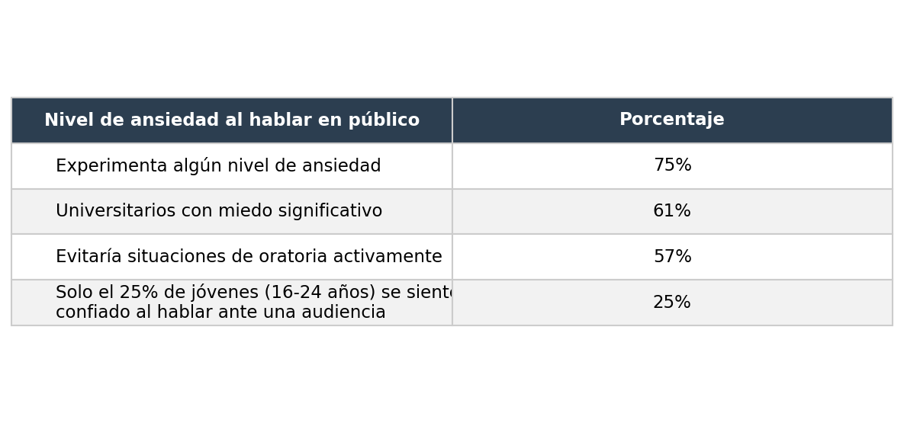
</div>

_Nota._ Elaboración propia basada en Teleprompter.com (2024) y Crown Counseling (2024).

Respecto al impacto en la empleabilidad, un estudio descriptivo sobre competencias laborales blandas en egresados universitarios latinoamericanos (Redalyc, 2022) identificó que la **comunicación asertiva** es la segunda habilidad más demandada por empleadores (9.1%), solo detrás del trabajo en equipo (10.1%). Sin embargo, es también una de las competencias con mayores brechas en egresados.

_Figura 2: Habilidades blandas más demandadas por empleadores en Latinoamérica_

<div align="center">

</div>

_Nota._ Elaboración propia basada en Redalyc (2022).

Finalmente, la ansiedad comunicativa no solo afecta el desempeño académico sino también la trayectoria profesional. Datos de Crown Counseling (2024) y Teleprompter.com (2024) indican que el **70% de los empleos** requiere algún nivel de oratoria o presentaciones; el **30% de las personas** ha evitado postular a empleos o ascensos debido a esta ansiedad; y quienes la padecen tienen un **15% menos de probabilidad** de alcanzar posiciones gerenciales.

_Figura 3: Impacto profesional de la ansiedad al hablar en público_

<div align="center">

</div>

_Nota._ Elaboración propia basada en Crown Counseling (2024) y Teleprompter.com (2024).

Ante este escenario, el costo de un coach de oratoria privado en Lima oscila entre S/. 80 y S/. 200 por sesión (con frecuencia semanal recomendada), haciendo inaccesible el entrenamiento personalizado para la mayoría del segmento universitario. Talki aborda esta brecha mediante IA accesible desde cualquier navegador web, a una fracción del costo.

### 1.2.3. Lean UX Process

El proceso Lean UX aplicado en Thropic sigue el enfoque de validación continua de hipótesis mediante ciclos cortos de aprendizaje, construir y medir (Ries, 2011), con el objetivo de reducir el riesgo de construir un producto que el mercado no necesita.

#### 1.2.3.1. Lean UX Problem Statement

**Segmento 1:** Hemos observado que los estudiantes de ciclos 1-5 carecen de espacios seguros y accesibles para practicar la comunicación oral con feedback real. El impacto es bajo desempeño en exposiciones y pérdida de oportunidades académicas. ¿Cómo podríamos brindarles práctica guiada con IA para que ganen confianza progresivamente?

**Segmento 2:** Hemos observado que los estudiantes de ciclos 6-10 no tienen herramientas asequibles para prepararse para entrevistas laborales y presentaciones profesionales. El impacto es dificultad para insertarse en el mercado laboral. ¿Cómo podríamos simular entornos reales de comunicación profesional para que estén listos al graduarse?

#### 1.2.3.2. Lean UX Assumptions

##### Business Assumptions

1. Creemos que los usuarios pagarán una suscripción mensual de S/. 15-25 por acceso premium.
2. Creemos que el mayor canal de adquisición serán las redes sociales universitarias (Instagram, TikTok).
3. Creemos que los usuarios necesitan al menos 3 sesiones semanales para notar mejora en 30 días.
4. Creemos que las universidades adoptarán Talki como herramienta complementaria en cursos de comunicación.
5. Creemos que el NPS (Net Promoter Score) alcanzará 40+ en los primeros 6 meses.
6. Creemos que el costo de adquisición por usuario será menor a S/. 10 mediante estrategias de referidos.
7. Creemos que el 60% de usuarios retendrá la app más de 3 meses con gamificación efectiva.
8. Creemos que las alianzas con institutos y universidades serán nuestro principal canal B2B.
9. Creemos que los usuarios en ciclos 6-10 están dispuestos a pagar más por features de simulación de entrevistas.
10. Creemos que el mercado latinoamericano de edtech crecerá 25% anual los próximos 3 años.
11. Creemos que la diferenciación por idioma español y contexto peruano/latinoamericano será una ventaja competitiva sostenible.

##### User Assumptions

1. **¿Quién es el usuario?** Estudiantes universitarios peruanos de ciclos 1-10, de 17 a 26 años, nativos digitales con acceso a laptop/PC y conexión a internet.
2. **¿Dónde encaja nuestro producto en su vida?** En los momentos previos a exposiciones, durante el estudio en casa, y en transporte público.
3. **¿Qué problemas resuelve nuestro producto?** La falta de espacios seguros para practicar oralidad con feedback inmediato y personalizado.
4. **¿Cuándo y cómo es usado nuestro producto?** Sesiones de 10-20 minutos, principalmente en las noches, desde el navegador web en su laptop o PC.
5. **¿Qué características son importantes?** Feedback en tiempo real, ejercicios progresivos, historial de progreso, modo simulación de entrevistas.
6. **¿Cómo debe verse y comportarse el producto?** Intuitivo, motivador, con elementos de gamificación, lenguaje cercano y sin tecnicismos.

#### 1.2.3.3. Lean UX Hypothesis

Cada hipótesis sigue el feature hypothesis template y explicita los cuatro componentes requeridos: business outcome medible, usuario segmentado (Valeria Ríos o Rodrigo Sánchez), beneficio percibido y feature asociada. Los outcomes están alineados con los Business Goals SMART del Impact Map (§3.3).

1. **H1 (Adopción, BG-01).** Creemos que lograremos una retención semanal del 40% y una permanencia promedio de más de 90 días en Valeria Ríos (Segmento 1, ciclos 1 al 5) si la estudiante gana confianza al practicar exposiciones con feedback inmediato, mediante la feature de *ejercicios guiados con IA*.

2. **H2 (Conversión, BG-02).** Creemos que lograremos una reducción de la ansiedad al hablar en público y un NPS de al menos 45 puntos en Rodrigo Sánchez (Segmento 2, ciclos 6 al 10) si el estudiante se prepara para entrevistas laborales reales en condiciones realistas, mediante la feature de *simulador de entrevistas con feedback en tiempo real*.

3. **H3 (Engagement, BG-03).** Creemos que lograremos al menos 3 sesiones semanales sostenidas durante 4 semanas consecutivas en ambos segmentos si los estudiantes conservan el hábito de práctica gracias a refuerzos positivos, mediante la feature de *streaks y logros*.

4. **H4 (Engagement, BG-03).** Creemos que lograremos un aumento del engagement de 40% (es decir, al menos 4 sesiones al mes) en Rodrigo Sánchez (Segmento 2) si el estudiante puede visualizar su progreso medible por habilidad en un lugar único, mediante la feature de *dashboard de métricas personales*.

5. **H5 (Adopción, BG-01).** Creemos que lograremos un CAC por debajo de S/ 10 vía referidos en Valeria Ríos (Segmento 1) si la estudiante puede compartir logros con sus compañeros de clase, mediante la feature de *comunidad y retos entre amigos*.

6. **H6 (Retención, BG-03).** Creemos que lograremos un churn mensual por debajo del 15% en ambos segmentos si los estudiantes reciben un plan de práctica personalizado según sus errores recurrentes, mediante la feature de *ruta de aprendizaje adaptativa con IA*.

#### 1.2.3.4. Lean UX Canvas

_Figura 4: Lean UX Canvas de Talki_

<div align="center">
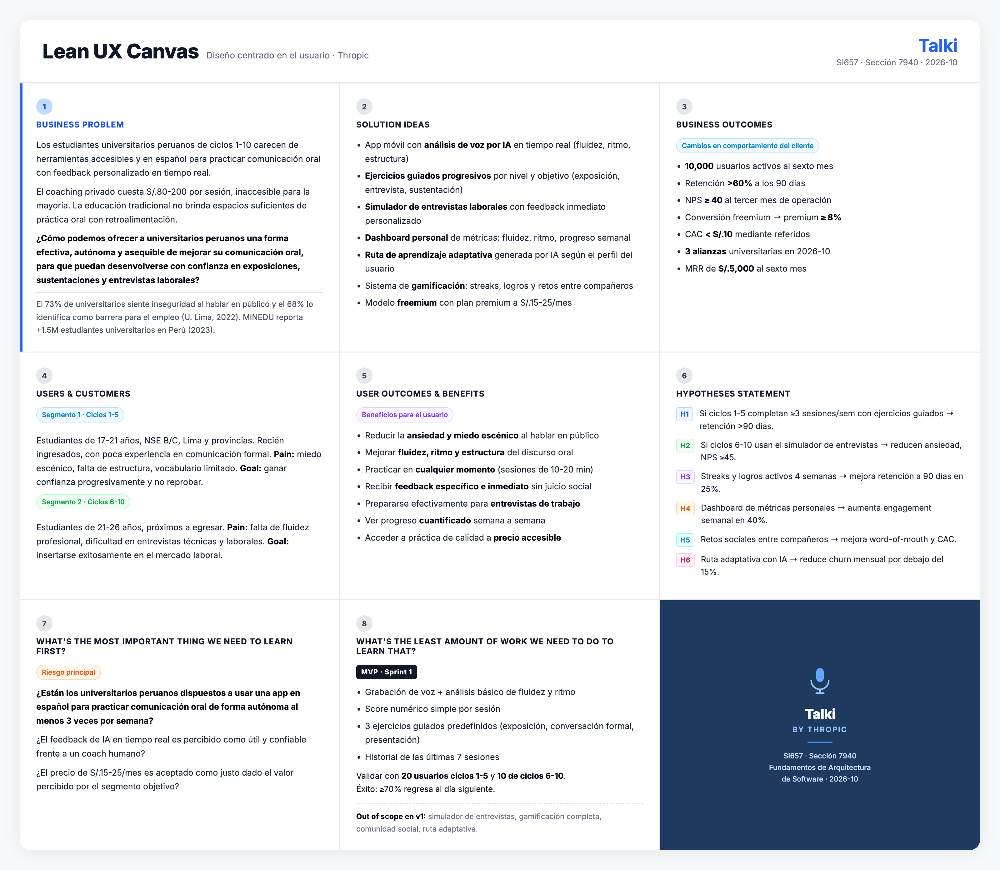
</div>

_Nota._ Elaboración propia (2026).

<div style="page-break-after: always;"></div>

## 1.3. Segmentos objetivo

**Segmento 1: Estudiantes universitarios de ciclos 1 al 5**

*Aspectos Demográficos:*
- Edad: 17-21 años
- Sexo: Masculino y femenino
- Nivel socioeconómico: B y C
- Ciclo: 1 al 5 de educación superior universitaria

*Aspectos Geográficos:*
- País: Perú
- Región: Lima Metropolitana y principales ciudades del interior (Arequipa, Trujillo, Piura)
- Tipo de institución: Universidades privadas y públicas

*Aspectos Psicográficos:*
- Motivaciones: Mejorar calificaciones en cursos con exposiciones, ganar confianza al hablar en público, no pasar vergüenza frente a compañeros
- Dolores: Miedo escénico pronunciado, vocabulario académico limitado, falta de estructura al exponer, nerviosismo que bloquea el discurso
- Comportamientos digitales: Nativos digitales, uso intensivo de dispositivos digitales y navegador web, acostumbrados a plataformas de aprendizaje (Duolingo, YouTube), disponibles para sesiones cortas de 10-15 min

**Segmento 2: Estudiantes universitarios de ciclos 6 al 10**

*Aspectos Demográficos:*
- Edad: 21-26 años
- Sexo: Masculino y femenino
- Nivel socioeconómico: B y C
- Ciclo: 6 al 10 de educación superior universitaria, próximos a egresar

*Aspectos Geográficos:*
- País: Perú
- Región: Lima Metropolitana y principales ciudades con oferta laboral tecnológica
- Tipo de institución: Universidades con programas de prácticas preprofesionales activos

*Aspectos Psicográficos:*
- Motivaciones: Conseguir prácticas o primer empleo, destacar en entrevistas técnicas y de RR.HH., comunicar ideas con claridad en entornos profesionales
- Dolores: Dificultad para expresarse con fluidez y vocabulario profesional, ansiedad ante entrevistas de trabajo, falta de espacios reales de práctica con feedback concreto
- Comportamientos digitales: Usuarios activos de LinkedIn, plataformas de empleabilidad y apps de productividad; dispuestos a pagar por herramientas que generen ROI directo en su carrera

<div style="page-break-after: always;"></div>

# Capítulo II: Requirements & Analysis

## 2.1. Competidores

<table>
  <tr>
    <th colspan="6">Competitive Analysis Landscape</th>
  </tr>
  <tr>
    <td colspan="2" align="center"><b>¿Por qué llevar a cabo este análisis?</b></td>
    <td colspan="4">Para identificar las fortalezas, debilidades y estrategias de nuestros competidores directos e indirectos, con el fin de definir la propuesta de valor diferenciada de Talki y detectar oportunidades de mercado no atendidas.</td>
  </tr>
  <tr>
    <th colspan="2">Nombre</th>
    <th>Talki (Thropic)</th>
    <th>ELSA Speak</th>
    <th>Speeko</th>
    <th>Orai</th>
  </tr>
  <tr>
    <td colspan="2" align="center"><b>Logo</b></td>
    <td align="center"></td>
    <td align="center"></td>
    <td align="center"></td>
    <td align="center"></td>
  </tr>
  <tr>
    <td rowspan="2"><b>Perfil</b></td>
    <td><b>Overview</b></td>
    <td>Aplicación web con IA que analiza y retroalimenta la comunicación oral de estudiantes universitarios peruanos en tiempo real, en español.</td>
    <td>App de pronunciación en inglés con IA que evalúa y corrige la pronunciación del usuario en tiempo real mediante reconocimiento de voz avanzado.</td>
    <td>App de coaching para hablar en público con lecciones estructuradas impartidas por coaches reales y ejercicios de práctica.</td>
    <td>App móvil con IA que analiza la oratoria del usuario (ritmo, palabras de relleno, energía, expresión facial) y entrega retroalimentación inmediata y lecciones personalizadas.</td>
  </tr>
  <tr>
    <td><b>Ventaja competitiva ¿Qué valor ofrece a los clientes?</b></td>
    <td>Feedback en tiempo real en español con contexto académico peruano; enfocado en universitarios latinoamericanos.</td>
    <td>Motor de IA especializado en detección de errores fonéticos del inglés; más de 50M usuarios globales.</td>
    <td>Contenido creado por coaches profesionales de oratoria; estructura de cursos progresivos y micro-lecciones de 5 minutos.</td>
    <td>Análisis multimodal (voz + expresión facial) con plan de entrenamiento adaptativo; gamificación y seguimiento de progreso detallado.</td>
  </tr>
  <tr>
    <td rowspan="2"><b>Perfil de Marketing</b></td>
    <td><b>Mercado objetivo</b></td>
    <td>Estudiantes universitarios peruanos/latinoamericanos de ciclos 1-10.</td>
    <td>Hablantes no nativos de inglés que desean mejorar su pronunciación, principalmente en Asia y Latinoamérica.</td>
    <td>Profesionales y estudiantes angloparlantes que quieren mejorar su oratoria y liderazgo comunicacional.</td>
    <td>Profesionales, estudiantes y ejecutivos angloparlantes que necesitan mejorar presentaciones y discursos.</td>
  </tr>
  <tr>
    <td><b>Estrategias de Marketing</b></td>
    <td>Freemium, marketing universitario, referidos entre compañeros.</td>
    <td>Freemium, referidos, partnerships con instituciones educativas.</td>
    <td>Freemium, publicidad en LinkedIn y redes, membresías corporativas.</td>
    <td>Freemium con trial de 7 días, alianzas con instituciones educativas, plan Enterprise para equipos.</td>
  </tr>
  <tr>
    <td rowspan="3"><b>Perfil de Producto</b></td>
    <td><b>Productos &amp; Servicios</b></td>
    <td>Aplicación web con análisis de voz, ejercicios guiados, simulador de entrevistas y dashboard de progreso.</td>
    <td>App móvil (iOS/Android) con lecciones de pronunciación, conversación simulada y análisis fonético detallado.</td>
    <td>App móvil con cursos de oratoria, ejercicios diarios de 5 minutos y biblioteca de habilidades comunicacionales.</td>
    <td>App móvil (iOS/Android) con análisis de voz e imagen, lecciones gamificadas, historial de práctica y plan personalizado de 4 semanas.</td>
  </tr>
  <tr>
    <td><b>Precios y Costos</b></td>
    <td>Freemium; plan premium S/. 15-25/mes.</td>
    <td>Gratis con funciones limitadas; premium desde $6.99/mes.</td>
    <td>Gratis con funciones básicas; premium desde $9.99/mes.</td>
    <td>Gratis con funciones básicas; premium desde $9.99/mes o $39.99/año.</td>
  </tr>
  <tr>
    <td><b>Canales de distribución</b></td>
    <td>Sitio web (talki.com), compatible con navegadores modernos (Chrome, Edge, Safari, Firefox).</td>
    <td>App Store, Google Play, web.</td>
    <td>App Store, Google Play.</td>
    <td>App Store, Google Play.</td>
  </tr>
  <tr>
    <td rowspan="4"><b>Análisis SWOT</b></td>
    <td><b>Fortalezas</b></td>
    <td>Español nativo, contexto universitario peruano, IA personalizada, gamificación.</td>
    <td>IA muy precisa, gran base de usuarios global, contenido extenso y probado.</td>
    <td>Contenido de alta calidad creado por expertos, formato de micro-lecciones atractivo.</td>
    <td>Análisis multimodal avanzado, plan adaptativo personalizado, gamificación efectiva, disponible en iOS y Android.</td>
  </tr>
  <tr>
    <td><b>Oportunidades</b></td>
    <td>Mercado latinoamericano poco atendido, alianzas con universidades, expansión a otros países.</td>
    <td>Expansión a otros idiomas, mercado B2B con instituciones educativas.</td>
    <td>Mercado B2B corporativo, expansión a español y otros idiomas.</td>
    <td>Expansión a idiomas distintos del inglés, mercado educativo universitario latinoamericano sin atender.</td>
  </tr>
  <tr>
    <td><b>Debilidades</b></td>
    <td>Startup nueva sin track record, recursos limitados, marca poco conocida.</td>
    <td>Enfocado solo en pronunciación del inglés, no cubre comunicación oral en español.</td>
    <td>Sin IA para feedback en tiempo real, contenido exclusivamente en inglés.</td>
    <td>Solo disponible en inglés, sin adaptación al contexto académico ni latinoamericano.</td>
  </tr>
  <tr>
    <td><b>Amenazas</b></td>
    <td>Entrada de apps internacionales al mercado hispanohablante, competidores con mayor financiamiento.</td>
    <td>Competidores con IA generativa más avanzada, apps multiidioma con mayor alcance.</td>
    <td>Apps con IA generativa que ofrecen feedback personalizado, saturación del mercado edtech.</td>
    <td>Saturación del mercado edtech en inglés, nuevos competidores con IA generativa más potente.</td>
  </tr>
</table>

### 2.1.2. Estrategias y tácticas frente a los competidores

A partir del análisis competitivo, Thropic adopta las siguientes estrategias para posicionar Talki en el mercado:

**Frente a ELSA Speak:**
ELSA Speak domina el mercado de pronunciación en inglés pero no atiende la comunicación oral en español ni el contexto académico latinoamericano. Talki se diferencia enfocándose exclusivamente en español con contexto universitario peruano, ofreciendo ejercicios de exposición académica y simulación de sustentaciones que ELSA no contempla.

**Frente a Speeko:**
Speeko utiliza contenido pregrabado por coaches sin feedback personalizado en tiempo real. Talki responde con IA generativa que analiza el discurso del usuario en el momento y entrega retroalimentación específica e inmediata, no guiones estáticos. Además, Speeko no tiene presencia en el mercado hispanohablante, lo que representa una ventana de oportunidad directa.

**Frente a Orai:**
Orai ofrece análisis de oratoria con IA de manera similar a Talki, pero opera exclusivamente en inglés y sin ninguna adaptación al contexto académico latinoamericano. Talki capitaliza esta brecha ofreciendo la misma profundidad de análisis (ritmo, fluidez, claridad) pero en español, con ejercicios diseñados para sustentaciones, exposiciones universitarias y entrevistas de prácticas preprofesionales típicas del sistema educativo peruano.

**Estrategia de diferenciación general:**

- *Localización:* Único producto diseñado para el contexto universitario peruano/latinoamericano en español
- *Precio accesible:* Modelo freemium con plan premium a S/. 15-25/mes, muy por debajo de los competidores internacionales
- *Alianzas universitarias:* Partnerships con facultades de Ingeniería y Comunicaciones de universidades peruanas para adopción institucional
- *Gamificación contextual:* Sistema de logros y streaks adaptado a los ciclos académicos peruanos (exposiciones, sustentaciones, entrevistas de prácticas)

<div style="page-break-after: always;"></div>

## 2.2. Entrevistas

### 2.2.1. Diseño de entrevistas

El objetivo de las entrevistas es comprender las necesidades, frustraciones y hábitos de comunicación oral de los segmentos objetivo de Talki, así como su disposición a usar herramientas digitales para mejorar sus habilidades comunicativas.

---

**Segmento 1: Estudiantes universitarios de ciclos 1 al 5**

*Objetivos específicos:*
- Conocer cómo viven los primeros encuentros con exposiciones y presentaciones en la universidad.
- Identificar las inseguridades comunicativas más frecuentes en etapas tempranas de la carrera.
- Entender qué estrategias de práctica emplean actualmente y cuáles consideran insuficientes.
- Evaluar su apertura a recibir retroalimentación automatizada de una IA.

*Preguntas introductorias:*
1. ¿En qué universidad estudias, qué carrera sigues y en qué ciclo te encuentras?
2. ¿Con qué frecuencia tienes que hacer exposiciones, sustentaciones o participaciones orales en clases?

*Preguntas principales:*

3. ¿Cómo fue tu primera exposición en la universidad? ¿Qué recuerdas de esa experiencia?
4. ¿Qué aspectos de tu comunicación oral sientes que más necesitas trabajar en este punto de tu carrera? (nerviosismo, muletillas, fluidez, volumen, etc.)
5. ¿Cómo te preparas actualmente cuando tienes que exponer? ¿Cuánto tiempo le dedicas?
6. ¿Alguna vez tu desempeño oral no reflejó lo que realmente sabías del tema? ¿Qué ocurrió?
7. ¿Has usado alguna app o herramienta digital para mejorar tu forma de hablar o exponer? ¿Cómo fue?
8. ¿Te grabarías en video o audio para escucharte y corregirte? ¿Por qué sí o por qué no?
9. ¿Qué tan cómodo(a) te sentirías recibiendo retroalimentación de una IA sobre tu forma de hablar?
10. ¿Estarías dispuesto(a) a pagar por una app así? ¿Qué precio te parecería justo?

---

**Segmento 2: Estudiantes universitarios de ciclos 6 al 10**

*Objetivos específicos:*
- Entender cómo evolucionan las exigencias de comunicación oral en ciclos avanzados.
- Identificar si la preparación para prácticas preprofesionales o entrevistas laborales genera nuevas necesidades comunicativas.
- Conocer su nivel de autonomía para practicar y mejorar su oratoria.
- Determinar su disposición a adoptar una herramienta de IA especializada en comunicación académica y profesional.

*Preguntas introductorias:*
1. ¿En qué universidad estudias, qué carrera sigues y en qué ciclo te encuentras?
2. ¿Qué tipos de evaluaciones orales has tenido que enfrentar en los últimos ciclos? (sustentaciones, jurados, entrevistas de prácticas, etc.)

*Preguntas principales:*

3. Comparando tus primeros ciclos con ahora, ¿sientes que tu comunicación oral ha mejorado? ¿Qué crees que la cambió?
4. ¿Cuáles son los escenarios orales que todavía te generan más estrés o inseguridad?
5. ¿Cómo te preparas hoy para una sustentación importante o una entrevista de prácticas?
6. ¿Has sentido que tu forma de comunicarte oralmente te ha jugado en contra en alguna evaluación o proceso de selección? Cuéntame.
7. ¿Has probado alguna herramienta digital para practicar presentaciones o entrevistas? ¿Qué te pareció?
8. ¿Qué tipo de análisis de tu comunicación te resultaría más valioso: fluidez, claridad de ideas, manejo de silencios, muletillas, otro?
9. ¿Qué tan útil sería para ti una app con IA que simule sustentaciones o entrevistas de prácticas y te dé retroalimentación detallada?
10. ¿Usarías este tipo de herramienta de forma autónoma o preferirías poder compartir los resultados con un profesor o tutor?

### 2.2.2. Registro de entrevistas

### Segmento #1: Estudiantes universitarios de ciclos 1 al 5
 
| Número de entrevista | Datos del entrevistado | Evidencia de entrevista |
|---|---|---|
| 1 | **Nombre:** Belén Ordoñez <br> **Universidad:** PUCP <br> **Ciclo:** 5to <br> **Carrera:** Comunicación para el Desarrollo <br><br> **Resumen:** Estudiante de quinto ciclo en la PUCP cuya carrera gira en torno a presentaciones orales: la mayoría de sus evaluaciones son exposiciones de proyectos. Recuerda haberse puesto nerviosa en su primera exposición universitaria. Su principal problema es que el volumen de su voz va disminuyendo conforme avanza en la presentación. Ha sufrido "black outs" durante exposiciones, terminando sin recordar lo que dijo. No conocía la existencia de herramientas digitales para mejorar la oratoria. Actualmente pide a amigos que la escuchen antes de exponer. Se sentiría más cómoda recibiendo retroalimentación de una IA por su mayor honestidad y franqueza. Estaría dispuesta a pagar entre 2 y 5 dólares mensuales por una app que realmente funcione. |  [📂 Ver entrevista](https://drive.google.com/file/d/10J3cMAzuvoZMY6HTzRomq5vosujsAai4/view?usp=sharing) <br> `00:00:00 a 00:06:07` |
 
| Número de entrevista | Datos del entrevistado | Evidencia de entrevista |
|---|---|---|
| 2 | **Nombre:** Isabel Rodriguez <br> **Universidad:** Universidad de Lima <br> **Ciclo:** 5to <br> **Carrera:** Arquitectura <br><br> **Resumen:** Isabel estudia Arquitectura en la Universidad de Lima y tiene exposiciones prácticamente todas las semanas, especialmente resúmenes de talleres los viernes. Su primera experiencia expositiva fue buena en general, aunque reconoce que hubiera sido mejor con más dominio del curso. Los puntos que más necesita trabajar son el nerviosismo y la ampliación de vocabulario, pues tiende a repetir siempre las mismas palabras. Se prepara con una bitácora personal y revisando sus diapositivas el día anterior. Usa ChatGPT para preparar contenido, aunque de forma general. Olvida información relevante por el apuro de terminar la exposición rápido. Le parece muy interesante recibir retroalimentación de una IA por el ahorro de tiempo. Estaría dispuesta a pagar hasta 5 dólares mensuales, aunque querría comparar precios antes de decidir. |  [📂 Ver entrevista](https://drive.google.com/file/d/10J3cMAzuvoZMY6HTzRomq5vosujsAai4/view?usp=sharing) <br> `00:06:13 a 00:13:22` |
 
| Número de entrevista | Datos del entrevistado | Evidencia de entrevista |
|---|---|---|
| 3 | **Nombre:** Juan Alejandro Elías López <br> **Universidad:** UPC <br> **Ciclo:** 4to <br> **Carrera:** Ingeniería de Software <br><br> **Resumen:** Juan Alejandro ya tenía experiencia en exposiciones desde la secundaria, por lo que su primera presentación universitaria no le generó nerviosismo. Considera que exponer es divertido. El aspecto que más necesita mejorar es la fluidez, especialmente en exposiciones finales de alta importancia donde el nerviosismo sí lo afecta. Se prepara escribiendo su guión a mano y memorizándolo en partes a lo largo de varios días, dedicando aproximadamente 2 horas diarias. Nunca ha sentido que una exposición no reflejara lo que sabía. No ha usado herramientas digitales para mejorar su oratoria. Estaría dispuesto a grabarse como nueva forma de práctica autónoma. Estaría abierto tanto a retroalimentación de IA como de un tutor humano, y el precio que pagaría dependería de las funcionalidades concretas que ofrezca la aplicación. | [📂 Ver entrevista](https://drive.google.com/file/d/10J3cMAzuvoZMY6HTzRomq5vosujsAai4/view?usp=sharing) <br> `00:13:23 a 00:19:12` |

### Segmento #2: Estudiantes universitarios de ciclos 6 al 10

| Número de entrevista | Datos del entrevistado | Evidencia de entrevista |
|---|---|---|
| 4 | **Nombre:** Gianger <br> **Universidad:** University of the People (EE.UU., modalidad remota) <br> **Ciclo:** 6to <br> **Carrera:** Computer Science <br><br> **Resumen:** Gianger estudia de forma remota en una universidad estadounidense y tiene una trayectoria oral variada: monografías, proyectos de software, debates, simulaciones de entrevistas y entrevistas reales de trabajo. Reconoce una mejora enorme desde sus inicios, impulsada principalmente por la experiencia laboral. Antes hablaba muy rápido y usaba muletillas constantemente. Hoy la presión aparece principalmente al presentar ante jefes o personas con mayor jerarquía. Se prepara con "chuletillas", guías de oratoria y autograbaciones para identificar puntos débiles. Vivió en carne propia cómo la mala comunicación le jugó en contra en una entrevista con una empresa española en inglés. Ha probado la herramienta "Speak", pero le falta feedback de contenido y manejo de silencios. Los análisis que más le aportarían son el manejo de silencios y la variedad de vocabulario. Ve una app con IA para simular sustentaciones y entrevistas como extremadamente útil, y prefiere un modelo híbrido con checkpoints periódicos con un tutor. | [📂 Ver entrevista](https://drive.google.com/file/d/10J3cMAzuvoZMY6HTzRomq5vosujsAai4/view?usp=sharing) <br> `00:19:15 a 00:31:41` |

| Número de entrevista | Datos del entrevistado | Evidencia de entrevista |
|---|---|---|
| 5 | **Nombre:** Jennifer <br> **Universidad:** Universidad Privada del Norte <br> **Ciclo:** 7mo <br> **Carrera:** Administración y Marketing <br><br> **Resumen:** Jennifer ha enfrentado sustentaciones de trabajos, exposiciones de proyectos, entrevistas y presentaciones ante jurados a lo largo de su carrera. Reconoce que su comunicación oral ha mejorado notablemente gracias a la práctica constante: en los primeros ciclos le costaba organizar sus ideas y se ponía nerviosa, hoy habla con mayor claridad y seguridad. Los escenarios que aún le generan estrés son las presentaciones ante un jurado y las entrevistas de prácticas, donde siente una evaluación más directa. Se prepara investigando el tema, organizando ideas, practicando frente al espejo o grabándose, y anticipando posibles preguntas. Ha vivido situaciones donde los nervios le hicieron olvidar ideas clave, afectando la claridad de su mensaje. No ha usado aplicaciones especializadas; solo grabaciones básicas con el celular o Zoom. El análisis que considera más valioso es el de fluidez y claridad de ideas. Ve muy útil una app con IA para practicar en un entorno realista con retroalimentación específica. Prefiere un uso híbrido: práctica autónoma combinada con orientación de un tutor o profesor. | [📂 Ver entrevista](https://drive.google.com/file/d/10J3cMAzuvoZMY6HTzRomq5vosujsAai4/view?usp=sharing) <br> `00:31:49 a 00:39:16` |
 
| Número de entrevista | Datos del entrevistado | Evidencia de entrevista |
|---|---|---|
| 6 | **Nombre:** Jorge Sinyun González <br> **Universidad:** Universidad Peruana de Ciencias Aplicadas (UPC) <br> **Ciclo:** 7mo a 8vo <br> **Carrera:** Ingeniería de Software <br><br> **Resumen:** Jorge identifica las presentaciones ante audiencias o profesores como su mayor dificultad, ya que la inseguridad al cometer errores y los nervios visibles pueden afectar directamente su nota. Siente que su comunicación ha mejorado en la medida que domina mejor los temas del curso, pero como habilidad pura de oratoria el avance ha sido leve. Se prepara revisando los requerimientos, tomando notas de apoyo y usando NotebookLM para generar preguntas y practicar respuestas. Tuvo un caso negativo en el curso de Agile Frameworks, donde tuvo que mirar constantemente las diapositivas por no dominar el flujo del tema, algo que el profesor notó y comentó. Practica hablando solo frente a la presentación o usando el método del espejo, y ha buscado apps de práctica de lenguaje sin encontrar una específica para oratoria. El análisis que considera más valioso es el de claridad de ideas, porque evidencia dominio del tema ante la audiencia. Ve la app con IA como extremadamente útil, especialmente si permite cargar el material propio para detectar puntos débiles de contenido y vocalización. Prefiere el modo autónomo por privacidad y comodidad, aunque reconoce el valor del feedback docente. | [📂 Ver entrevista](https://drive.google.com/file/d/10J3cMAzuvoZMY6HTzRomq5vosujsAai4/view?usp=sharing) <br> `00:39:23 a 00:47:18` |


### 2.2.3. Análisis de entrevistas

---

### Segmento #1: Estudiantes universitarios de ciclos iniciales (1ro al 5to ciclo)

---

### Hallazgos:

### Belén Ordoñez (PUCP, 5to ciclo)

Estudia Comunicación para el Desarrollo en la PUCP y se encuentra en su primer año de carrera. Las presentaciones son muy frecuentes en su carrera: la mayoría de las evaluaciones son exposiciones de proyectos, ya que hay pocos exámenes escritos. Recuerda haberse puesto nerviosa en su primera exposición universitaria. Su principal problema es que el volumen de su voz va bajando a medida que avanza la presentación, al punto de que ya no la escuchan. Se prepara intentando dominar el contenido del tema, aunque reconoce que hay cosas "fuera de su control". Ha experimentado "black outs" durante exposiciones: termina sin recordar lo que dijo, y solo después nota lo que le faltó. No conocía la existencia de aplicaciones para mejorar la oratoria. Le gustaría grabarse, aunque le cuesta escuchar su propia voz; actualmente pide a amigos que la escuchen y le den feedback. Se sentiría más cómoda recibiendo retroalimentación de una IA que de una persona, porque considera que la IA es más directa y honesta. Estaría dispuesta a usar una aplicación de pago entre 2 y 5 dólares mensuales, siempre que sea realmente buena.

**Puntos clave:**
- Exposiciones muy frecuentes (evaluación principal en su carrera).
- Mayor problema: **volumen de voz que decrece** durante la presentación.
- Ha sufrido **"black outs"** en exposiciones por los nervios y la adrenalina.
- **No conocía** herramientas digitales para mejorar la oratoria.
- Pide feedback a amigos; le cuesta escucharse o verse grabada.
- Prefiere retroalimentación de **IA sobre personas** por mayor honestidad.
- Dispuesta a pagar entre **2 y 5 dólares mensuales** si la app cumple.

---

### Isabel Rodriguez (Arquitectura, U. de Lima, 5to ciclo)

Estudia arquitectura en la Universidad de Lima y está en quinto ciclo. Tiene exposiciones prácticamente todas las semanas, especialmente los viernes, con resúmenes de cursos de taller. Su primera experiencia fue buena en términos generales, aunque reconoce que hubiera sido mejor con mayor conocimiento del curso. Los aspectos que más necesita trabajar son el nerviosismo y la ampliación de vocabulario, ya que tiende a usar siempre las mismas palabras. Se prepara leyendo sus diapositivas y notas de una bitácora personal el día anterior y momentos antes de la clase. Usa IA generativa (ChatGPT) para preparar su contenido, aunque con ideas muy generales. Siente que a veces olvida información relevante que no puso en las láminas por el apuro de terminar rápido. Estaría dispuesta a grabarse para autocorregirse. Le parece interesante recibir retroalimentación de una IA, especialmente porque le ahorraría tiempo, algo valioso dada su carga académica. Estaría dispuesta a pagar por la aplicación, en especial si la ayuda a prepararse para algo importante. Sugiere un precio máximo de 5 dólares mensuales, aunque querría compararlo con otras opciones antes.

**Puntos clave:**
- Exposiciones **semanales**, especialmente en talleres.
- Necesita mejorar **nerviosismo y vocabulario** (tiende a repetir palabras).
- Se prepara con **bitácora personal y diapositivas** el día anterior.
- Usa **ChatGPT** para preparar contenido, pero de forma general.
- Olvida información relevante por el **apuro de terminar** la exposición.
- Valoraría una app de IA que **ahorre tiempo** dada su alta carga académica.
- Precio aceptable: hasta **5 dólares mensuales**.

---

### Juan Alejandro Elías López (Ing. Software, UPC, 4to ciclo)

Estudia Ingeniería de Software en la UPC y está en cuarto ciclo. Ya venía con experiencia de exposiciones desde la secundaria, por lo que su primera presentación universitaria no fue especialmente nerviosa. Considera que sus exposiciones son divertidas. El aspecto en el que siente que más necesita mejorar es la fluidez, especialmente en exposiciones finales de alta importancia, donde el nerviosismo lo afecta. Se prepara escribiendo su guión a mano, memorizándolo en partes durante varios días, dedicando alrededor de 2 horas diarias. Nunca ha sentido que una exposición no reflejara lo que sabía, ya que siempre memorizaba sus puntos. Nunca ha usado herramientas digitales para mejorar su oratoria. Estaría dispuesto a grabarse para practicar de forma autónoma como algo nuevo a probar. Le gustaría tanto retroalimentación de una IA como de un profesor particular, sin descartar ninguna opción. El precio que pagaría dependería de las funcionalidades que ofrezca la aplicación.

**Puntos clave:**
- Experiencia previa en exposiciones desde secundaria; **no experimenta nerviosismo intenso**.
- Principal área de mejora: **fluidez** en exposiciones de alta importancia.
- Método de preparación: **guión escrito a mano y memorización** en partes (2 horas/día).
- **No ha usado** herramientas digitales de práctica oral.
- Abierto a grabarse como **método de práctica autónoma**.
- Prefiere retroalimentación **híbrida**: IA y tutor humano.
- El precio depende de las **funcionalidades ofrecidas**.

---

### Segmento #2: Estudiantes universitarios de ciclos avanzados (6to al 10mo ciclo)

### Hallazgos:

### Gianger (Computer Science, University of the People EE.UU., 6to ciclo)

Estudiante peruano radicado en Lima que cursa Computer Science de forma remota en una universidad estadounidense (University of the People), se encuentra en sexto ciclo. Aunque su universidad es extranjera, se incluye en el estudio porque representa el caso de universitarios peruanos que complementan su formación local con programas internacionales 100% online y que enfrentan retos adicionales de comunicación oral en contextos bilingües, un perfil cada vez más frecuente en el mercado laboral tecnológico peruano. Ha tenido evaluaciones orales variadas: monografías, proyectos de software, debates y simulaciones de entrevistas, además de entrevistas reales de trabajo. Reconoce que su comunicación oral ha mejorado enormemente desde sus inicios universitarios, principalmente gracias al mundo laboral. Antes hablaba muy rápido, llenaba los silencios y usaba muletillas constantemente. Actualmente, los escenarios que aún le generan presión son las presentaciones ante jefes o personas con mayor jerarquía. Se prepara haciendo "chuletillas" (resúmenes de ideas principales), consultando guías de oratoria y grabándose para identificar sus puntos débiles. Ha reconocido que la mala comunicación le jugó en contra en sus primeras entrevistas de trabajo, especialmente una con una empresa española en inglés. Ha probado la herramienta digital "Speak", que le da feedback sobre pronunciación, entonación y relación de palabras, aunque no sobre contenido ni manejo de silencios. Considera que lo más valioso sería una app que analice silencios y variedad de vocabulario, dos de sus puntos más débiles. Ve una aplicación con IA para simular sustentaciones y entrevistas como "extremadamente útil", con feedback sobre gestos, pronunciación, muletillas y claridad de ideas. Prefiere un esquema híbrido: IA autónoma con checkpoints periódicos con un tutor humano.

**Puntos clave:**
- Experiencia amplia: debates, proyectos, simulaciones y **entrevistas reales de trabajo**.
- Ha mejorado mucho gracias a la **práctica laboral**; antes hablaba muy rápido y usaba muchas muletillas.
- Siente presión al presentar ante **personas con mayor jerarquía**.
- Se prepara con **chuletillas, guías de oratoria y autograbaciones**.
- La mala comunicación le costó oportunidades laborales, especialmente en **inglés**.
- Ha usado **"Speak"**, pero le falta feedback de contenido y manejo de silencios.
- Necesita mejorar **manejo de silencios y variedad de vocabulario**.
- Ve la app con IA como **extremadamente útil**; prefiere modelo **híbrido** (IA + tutor).

### Jennifer (Administración y Marketing, Universidad Privada del Norte, 7mo ciclo)

Estudia Administración y Marketing en la Universidad Privada del Norte y se encuentra en séptimo ciclo. Ha enfrentado sustentaciones de trabajos, exposiciones de proyectos, entrevistas y presentaciones ante jurados. Reconoce que su comunicación oral ha mejorado bastante desde los primeros ciclos, cuando le costaba organizar sus ideas y se ponía nerviosa. La práctica constante le ha dado mayor claridad y seguridad. Los escenarios que aún le generan estrés son las presentaciones ante un jurado y las entrevistas de prácticas, donde siente una presión y evaluación más directa. Se prepara investigando bien el tema, organizando ideas, practicando frente al espejo o grabándose, y anticipando posibles preguntas. Ha experimentado que los nervios le han hecho olvidar ideas en momentos clave, afectando la claridad de su mensaje. No ha usado aplicaciones especializadas; solo se ha grabado con el celular o por Zoom. El análisis que considera más valioso es el de fluidez y claridad de ideas, como aspectos clave para mejorar su comunicación. Ve muy útil una app con IA que simule sustentaciones y entrevistas con retroalimentación específica, porque le permitiría practicar en un entorno más realista. Le gustaría utilizarla tanto de forma autónoma como compartiendo resultados con un tutor o profesor para recibir orientación adicional.

**Puntos clave:**
- Ha mejorado desde los primeros ciclos gracias a la **práctica constante**.
- Siente más presión en **jurados y entrevistas de prácticas**.
- Se prepara con investigación, espejo, grabaciones y **anticipación de preguntas**.
- Los nervios le han causado **olvidos** que afectaron la claridad del mensaje.
- No ha usado **apps especializadas**; solo grabaciones básicas.
- Análisis más valioso: **fluidez y claridad de ideas**.
- Ve la app como muy útil para practicar en un **entorno realista**.
- Prefiere uso **híbrido**: autónomo + compartir resultados con tutor.

---

### Jorge Sinyun González (Ing. Software, UPC, 7mo-8vo ciclo)

Estudia Ingeniería de Software en la UPC y se encuentra entre el séptimo y octavo ciclo. Lo que más le ha costado a lo largo de su carrera son las presentaciones ante una audiencia o profesor, por la inseguridad al cometer errores y porque los nervios visibles pueden afectar la nota. Siente que su comunicación ha mejorado en la medida en que ha ganado confianza y dominio de los temas del curso, aunque como habilidad pura de oratoria el avance ha sido leve. Se prepara revisando los requerimientos de la entrevista, tomando notas de apoyo, y usando herramientas como NotebookLM para generar preguntas y practicar respuestas. Ha tenido un caso negativo en el curso de Agile Frameworks, donde tuvo que mirar constantemente las diapositivas por no dominar bien el flujo del tema, lo que fue notado por el profesor. Practica hablando solo viendo la presentación, usando el método del espejo o buscando aplicaciones de práctica de lenguaje, aunque no ha encontrado una que se enfoque en oratoria específicamente. Considera que el análisis más valioso es el de claridad de ideas, porque demuestra dominio del tema ante la audiencia. Ve una app con IA para simular sustentaciones y entrevistas como "extremadamente útil", especialmente si permite cargar el material propio para detectar puntos débiles de contenido y vocalización. Prefiere una herramienta autónoma por la privacidad y comodidad, aunque reconoce que el feedback del profesor ofrece orientación más alineada al curso.

**Puntos clave:**
- Mayor dificultad: **inseguridad y nervios visibles** ante audiencias y profesores.
- La mejora ha venido del **conocimiento del tema**, no de la habilidad oral en sí.
- Se prepara con **notas, NotebookLM** y práctica de preguntas y respuestas.
- Caso negativo en **Agile Frameworks** por no dominar el flujo del contenido.
- Practica con el espejo, hablando solo o buscando apps de lenguaje, sin encontrar algo específico de **oratoria**.
- Análisis más valioso: **claridad de ideas**.
- App con IA sería "**extremadamente útil**", especialmente si permite cargar contenido propio.
- Prefiere modo **autónomo** por privacidad, aunque valora el feedback docente.

---

### Síntesis cruzada de hallazgos

Las fichas individuales anteriores recogen la evidencia bruta de cada entrevistado. A continuación se presentan los patrones convergentes y divergentes identificados al cruzar los seis casos, con el objetivo de extraer insights accionables para el diseño de Talki.

**Patrones convergentes (aplican a ambos segmentos):**

- **6 de 6** entrevistados consideran que una aplicación con IA especializada en oratoria sería "útil" o "extremadamente útil" para su preparación personal.
- **6 de 6** no han encontrado una aplicación digital enfocada específicamente en oratoria en español; las que conocen (Speak, ChatGPT, NotebookLM, grabadoras nativas) cubren partes del problema pero no el feedback completo.
- **5 de 6** reconocen que los nervios o la ansiedad los han llevado a olvidar contenido, perder fluidez o bajar el volumen durante una presentación importante (Belén, Isabel, Jennifer, Jorge, Juan Alejandro en exposiciones de alta importancia).
- **5 de 6** valoran recibir retroalimentación objetiva y directa, ya sea porque la IA es percibida como más honesta (Belén) o porque les ahorra tiempo frente al feedback de pares (Isabel, Jennifer).
- **4 de 6** se graban o están dispuestos a grabarse como método de práctica autónoma (Gianger, Jennifer, Juan Alejandro dispuesto, Jorge con su propio material).

**Divergencias por segmento:**

| Dimensión | Segmento 1 (ciclos 1 al 5) | Segmento 2 (ciclos 6 al 10) |
|---|---|---|
| Problema principal | Volumen, nerviosismo agudo, black outs, vocabulario repetitivo | Fluidez profesional, manejo de silencios, inseguridad ante jerarquías |
| Contexto de presentación | Exposiciones académicas frecuentes (semanales) | Sustentaciones, jurados, entrevistas laborales reales |
| Madurez oral percibida | Principiantes que buscan ganar confianza | Intermedios que buscan pulir un nivel ya existente |
| Herramientas usadas | Prácticamente ninguna | Speak, NotebookLM, grabaciones personales |
| Modelo de feedback preferido | Autónomo con IA (por honestidad y costo) | Híbrido (IA más checkpoints con tutor) |
| Disposición a pagar | USD 2 a 5 (S/ 7 a S/ 19) | Mayor, justificada por retorno profesional |

**Implicaciones para el diseño de Talki:**

1. **MVP debe cubrir feedback de voz básico en español** (volumen, fluidez, muletillas, vocabulario), validado por los seis entrevistados como brecha universal. Esto sustenta US12, US15 y US16 del Product Backlog.
2. **El análisis por segmento debe adaptar profundidad y foco**: para el Segmento 1, ejercicios guiados y métricas simples; para el Segmento 2, simulador de entrevistas y análisis de silencios. Esto sustenta US10 (tipo de sesión), US23 (segmento académico) y US26 (recomendaciones adaptadas).
3. **La IA como juez imparcial es una ventaja competitiva validada**: cinco de seis entrevistados prefieren o aceptan feedback de IA por su objetividad, lo que reduce la fricción social que enfrentan con amigos o profesores.
4. **El modelo freemium con precio estudiantil es viable**: el rango de disposición a pagar se alinea con el plan Premium de S/ 15 a S/ 25 (ver nota siguiente).
5. **La opción híbrida (IA más tutor) debe considerarse para la fase TB2 o posterior**, ya que dos entrevistados del Segmento 2 la prefieren explícitamente, aunque no es bloqueante para el MVP.

---

### Nota sobre la disposición a pagar

Las entrevistadas del Segmento 1 (Belén e Isabel) expresaron su disposición a pagar un rango aproximado de **USD 2 a 5 mensuales** por una aplicación que realmente funcione. Considerando el tipo de cambio promedio de referencia (S/ 3.70 por USD), este rango equivale a **S/ 7 a S/ 19 mensuales**. El plan Premium Estudiantil de Talki, definido en la sección 1.2.3.2 en **S/ 15 a S/ 25 mensuales**, se encuentra dentro o muy cerca del techo indicado por las usuarias, lo que sugiere una aceptabilidad razonable del precio propuesto. Para el Segmento 2 (Rodrigo Sánchez y similares), la disposición a pagar es mayor por el retorno profesional esperado (entrevistas, ascensos, primer empleo), lo que habilita el tramo superior del rango y justifica mantener la horquilla S/ 15 a S/ 25 como precio de referencia.

<div style="page-break-after: always;"></div>

## 2.3. Needfinding

### 2.3.1. User Personas
Para comprender mejor las necesidades, motivaciones y comportamientos de los usuarios clave de Talki, se han desarrollado dos perfiles de usuario o personas representativas. Estos perfiles sintetizan características típicas, objetivos y retos de los segmentos principales, facilitando el diseño centrado en el usuario y la toma de decisiones estratégicas durante el desarrollo de la plataforma.

**Persona 1: Valeria Ríos, la Estudiante en Formación Oral**

Estudiante universitaria de 19 años, residente en Lima, Perú, cursando los ciclos 1 al 5 de una carrera con alta demanda de presentaciones orales. Valeria representa a los estudiantes de ciclos iniciales que enfrentan con frecuencia exposiciones como principal forma de evaluación, pero carecen de herramientas y métodos efectivos para practicar. Se considera responsable y esforzada, aunque algo insegura al hablar en público y en busca de mejorar de forma constante. Sus principales frustraciones son que su voz se apaga durante la exposición sin que ella lo note y los "black outs" provocados por los nervios. Valora recibir retroalimentación honesta y objetiva que le permita identificar errores (como la pérdida de volumen de voz o los olvidos por nervios) y mejorar progresivamente su desempeño, sin depender de terceros y a un costo accesible.

> *"Sé que voy a estar nerviosa, pero trato de estar lo más preparada posible."*


**Persona 2: Rodrigo Sánchez, el Estudiante Avanzado con Miras Profesionales**

Estudiante universitario de 23 años, residente en Lima, Perú, cursando los ciclos 6 al 10 de Ingeniería de Software con vida laboral activa. Rodrigo encarna a los estudiantes avanzados que, habiendo ganado experiencia académica y laboral, reconocen que la comunicación oral es un factor decisivo en su desarrollo profesional. Es analítico, proactivo y autodidacta; domina herramientas digitales como Speak y NotebookLM, pero ninguna cubre el feedback de oratoria que necesita (manejo de silencios, muletillas, claridad de ideas). Una mala entrevista en inglés con una empresa española le dejó claro que la comunicación oral es tan importante como el conocimiento técnico. Busca una solución específica que le brinde análisis detallado de su oratoria y le permita prepararse de forma autónoma para sustentaciones importantes y entrevistas de trabajo reales, con la opción de complementar la práctica autónoma con orientación periódica de un tutor.

> *"A medida que sube la complejidad, te das cuenta de que la preparación es algo fundamental."*


### 2.3.2. User Task Matrix

<table>
  <thead>
    <tr>
      <th rowspan="2">Tareas</th>
      <th colspan="2">Valeria Ríos (Ciclos iniciales)</th>
      <th colspan="2">Rodrigo Sánchez (Ciclos avanzados)</th>
    </tr>
    <tr>
      <th>Frecuencia</th>
      <th>Importancia</th>
      <th>Frecuencia</th>
      <th>Importancia</th>
    </tr>
  </thead>
  <tbody>
    <tr>
      <td>Grabarse practicando una exposición</td>
      <td>Raramente</td>
      <td>Alta</td>
      <td>Casi siempre</td>
      <td>Muy alta</td>
    </tr>
    <tr>
      <td>Recibir retroalimentación sobre su oratoria</td>
      <td>A veces</td>
      <td>Muy alta</td>
      <td>Casi siempre</td>
      <td>Muy alta</td>
    </tr>
    <tr>
      <td>Practicar simulaciones de exposiciones</td>
      <td>A veces</td>
      <td>Alta</td>
      <td>Siempre</td>
      <td>Muy alta</td>
    </tr>
    <tr>
      <td>Practicar simulaciones de entrevistas de trabajo</td>
      <td>Nunca</td>
      <td>Media</td>
      <td>Casi siempre</td>
      <td>Muy alta</td>
    </tr>
    <tr>
      <td>Identificar muletillas y palabras repetidas</td>
      <td>Raramente</td>
      <td>Alta</td>
      <td>Casi siempre</td>
      <td>Alta</td>
    </tr>
    <tr>
      <td>Analizar volumen y claridad de voz</td>
      <td>A veces</td>
      <td>Muy alta</td>
      <td>A veces</td>
      <td>Alta</td>
    </tr>
    <tr>
      <td>Revisar historial de sesiones de práctica</td>
      <td>Raramente</td>
      <td>Media</td>
      <td>Casi siempre</td>
      <td>Alta</td>
    </tr>
    <tr>
      <td>Compartir resultados con un tutor o profesor</td>
      <td>A veces</td>
      <td>Media</td>
      <td>A veces</td>
      <td>Alta</td>
    </tr>
    <tr>
      <td>Cargar material propio para practicar</td>
      <td>Raramente</td>
      <td>Media</td>
      <td>Casi siempre</td>
      <td>Muy alta</td>
    </tr>
    <tr>
      <td>Consultar tips y guías de oratoria</td>
      <td>A veces</td>
      <td>Alta</td>
      <td>A veces</td>
      <td>Media</td>
    </tr>
  </tbody>
</table>

Las tareas más frecuentes para los perfiles de usuario en Talki muestran diferencias claras según el ciclo académico y las metas de cada uno. Valeria Ríos, como estudiante de ciclos iniciales, interactúa principalmente con las funciones de grabación, análisis de volumen de voz y recepción de retroalimentación general, considerándolas cruciales para superar su inseguridad al exponer. En contraste, Rodrigo Sánchez, estudiante avanzado con experiencia laboral, utiliza la plataforma de forma más estratégica y constante, priorizando las simulaciones de entrevistas de trabajo, la carga de material propio y el seguimiento de su historial de sesiones, actividades que realiza con alta frecuencia y considera muy importantes para su desarrollo profesional. Ambos perfiles coinciden en el valor de practicar simulaciones de exposiciones y recibir retroalimentación sobre su oratoria, aunque Rodrigo las ejecuta con mayor regularidad y profundidad.

Coincidencias:
- Ambos consideran de muy alta importancia recibir retroalimentación sobre su oratoria, aunque Rodrigo lo hace con mayor frecuencia.

- Comparten una actitud positiva hacia la práctica de simulaciones de exposiciones, siendo una tarea central para los dos perfiles.

- Las funciones de identificación de muletillas y análisis de claridad de voz tienen importancia alta para ambos, aunque con distinta frecuencia de uso.

Diferencias:
- Valeria prioriza el análisis de volumen y claridad de voz como su necesidad más urgente, mientras que Rodrigo enfoca su atención en el manejo de silencios, la variedad de vocabulario y la preparación para entrevistas laborales.

- Rodrigo utiliza con mucha mayor frecuencia la carga de material propio y el historial de sesiones, tareas que Valeria realiza raramente por encontrarse en etapas más básicas de práctica.

- Las simulaciones de entrevistas de trabajo son de muy alta importancia y frecuencia para Rodrigo, mientras que para Valeria tienen una importancia media y nunca las ha practicado aún, dado que su foco está en las exposiciones académicas.

### 2.3.3. Empathy Maps
A continuación se presentan los mapas de empatía para los dos perfiles principales de usuarios de Talki: Valeria Ríos, estudiante universitaria de ciclos iniciales, y Rodrigo Sánchez, estudiante avanzado con experiencia laboral. Estos mapas permiten comprender en profundidad sus necesidades, pensamientos, sentimientos y comportamientos, facilitando un diseño centrado en el usuario.

- Segmento 1:

El mapa de empatía de Valeria muestra que es una estudiante que enfrenta con frecuencia exposiciones orales como principal forma de evaluación, pero carece de métodos objetivos para practicar. Se siente frustrada porque los nervios le provocan olvidos y su voz se apaga durante las presentaciones, y no encuentra herramientas digitales específicas que la ayuden a mejorar de forma autónoma y accesible.
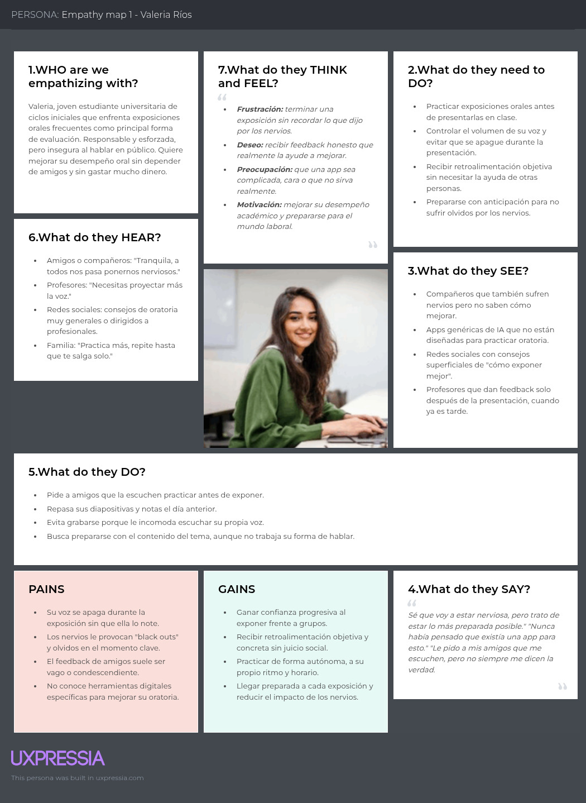

- Segmento 2:

El mapa de empatía de Rodrigo refleja a un estudiante avanzado con clara conciencia de que la comunicación oral es decisiva para su desarrollo profesional. Busca una solución específica que vaya más allá de la pronunciación y le ofrezca análisis profundo de su oratoria, permitiéndole prepararse de forma autónoma para entrevistas de trabajo y sustentaciones importantes con feedback real y medible.
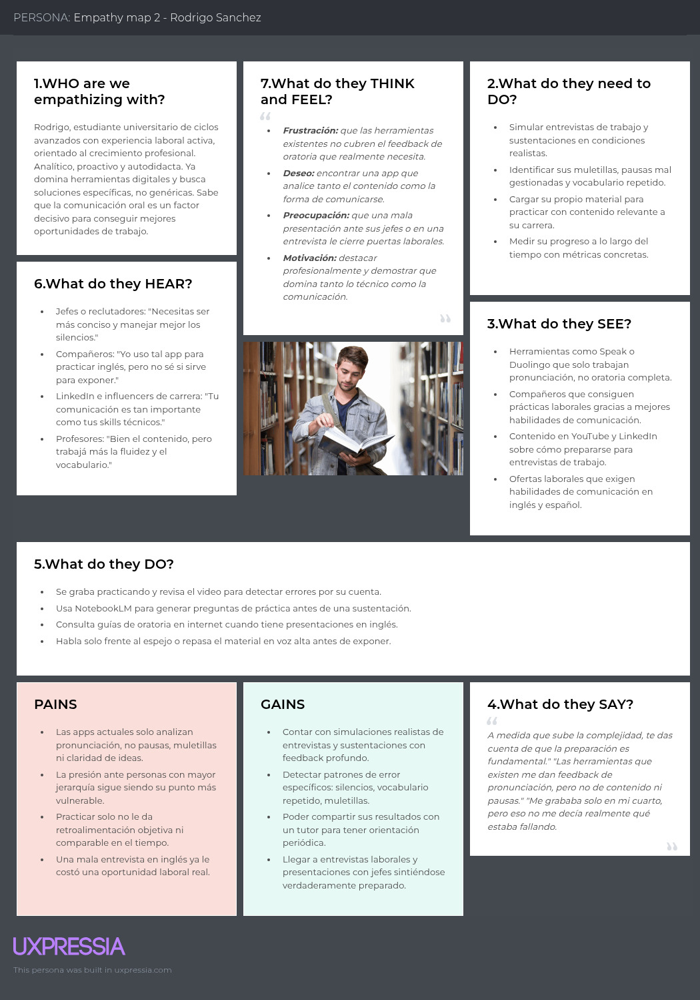


### 2.3.4. As-is Scenario Mapping
Segmento 1

Mediante este artefacto, se ha llevado a cabo la elaboración del As-is Scenario Mapping para el primer segmento. Este escenario refleja cómo los estudiantes universitarios que enfrentan exposiciones orales frecuentes se preparan actualmente para ellas, las dificultades que experimentan al no contar con herramientas objetivas de práctica, así como las emociones de ansiedad, frustración y resignación que acompañan cada etapa de su proceso expositivo.


Segmento 2

Mediante este artefacto, se ha llevado a cabo la elaboración del As-is Scenario Mapping para el segundo segmento. Este escenario describe cómo los estudiantes de ciclos superiores con experiencia laboral se preparan hoy en día para sustentaciones importantes y entrevistas de trabajo, evidenciando las limitaciones de las herramientas digitales actuales, los métodos de práctica poco objetivos a los que recurren y la incertidumbre que sienten al no poder medir su progreso de forma concreta.

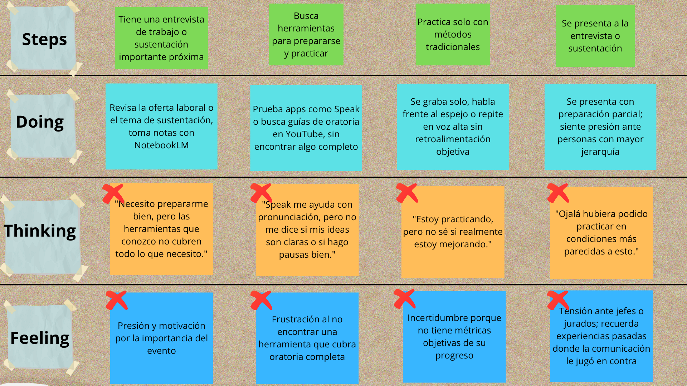


<div style="page-break-after: always;"></div>

# Capítulo III: Requirements Specification

## 3.1. To-Be Scenario Mapping

Segmento 1

Mediante este artefacto, se ha llevado a cabo la elaboración del To-be Scenario Mapping para el primer segmento. Este escenario proyecta cómo Talki transformará la experiencia de los estudiantes universitarios al momento de prepararse para sus exposiciones orales, brindándoles una herramienta autónoma, accesible y objetiva que les permita identificar sus errores específicos, practicar a su propio ritmo y llegar a cada presentación con mayor confianza y preparación real.


Segmento 2

Mediante este artefacto, se ha llevado a cabo la elaboración del To-be Scenario Mapping para el segundo segmento. Este escenario proyecta cómo Talki cubrirá el vacío que dejan las herramientas actuales, permitiendo a los estudiantes de ciclos superiores simular entrevistas de trabajo y sustentaciones en condiciones realistas, recibir análisis profundo de su oratoria (contenido, silencios, muletillas y vocabulario), y hacer seguimiento de su progreso con métricas concretas, acompañados opcionalmente por un tutor en un modelo híbrido de mejora continua.

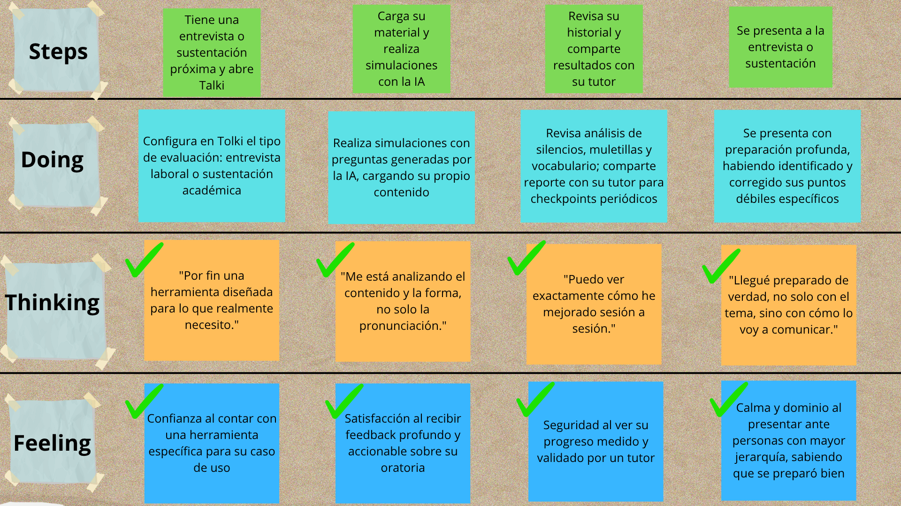

<div style="page-break-after: always;"></div>

## 3.2. User Stories

<table>
  <thead>
    <tr>
      <th>Epic / Story ID</th>
      <th>Título</th>
      <th>Descripción</th>
      <th>Criterios de Aceptación</th>
      <th>Relacionado con (Epic ID)</th>
    </tr>
  </thead>
  <tbody>
    <!-- ===================== EP01: Página de Aterrizaje ===================== -->
    <tr>
      <td>EP01</td>
      <td>Página de Aterrizaje</td>
      <td><strong>Como</strong> visitante, <strong>quiero</strong> acceder a una página informativa sobre Talki, <strong>para</strong> conocer los beneficios de la plataforma antes de registrarme.</td>
      <td>No Corresponde</td>
      <td>No Corresponde</td>
    </tr>
    <tr>
      <td>US01</td>
      <td>Visualizar beneficios de Talki</td>
      <td><strong>Como</strong> visitante, <strong>quiero</strong> ver una sección de beneficios clave en la página de aterrizaje, <strong>para</strong> entender cómo Talki puede ayudarme a mejorar mi comunicación oral.</td>
      <td>
        <strong>Escenario 1: Visualización exitosa de beneficios</strong><br>
        <strong>Dado</strong> que el visitante accede a la landing page de Talki,<br>
        <strong>Cuando</strong> la página termina de cargar,<br>
        <strong>Entonces</strong> se muestran al menos 3 beneficios destacados con ícono, título y descripción breve.<br><br>
        <strong>Escenario 2: Beneficios adaptados por segmento</strong><br>
        <strong>Dado</strong> que el visitante está en la sección de beneficios,<br>
        <strong>Cuando</strong> selecciona la pestaña "Ciclo 1-5" o "Ciclo 6-10",<br>
        <strong>Entonces</strong> los beneficios mostrados se ajustan al segmento seleccionado.
      </td>
      <td>EP01</td>
    </tr>
    <tr>
      <td>US02</td>
      <td>Ver planes y precios</td>
      <td><strong>Como</strong> visitante, <strong>quiero</strong> consultar los planes y precios disponibles en la landing page, <strong>para</strong> evaluar cuál se ajusta a mis necesidades y presupuesto.</td>
      <td>
        <strong>Escenario 1: Visualización de planes</strong><br>
        <strong>Dado</strong> que el visitante navega a la sección de precios,<br>
        <strong>Cuando</strong> la sección se despliega,<br>
        <strong>Entonces</strong> se muestran al menos 2 planes con nombre, precio, lista de funcionalidades incluidas y un botón de acción.<br><br>
        <strong>Escenario 2: Comparación de planes</strong><br>
        <strong>Dado</strong> que el visitante está viendo los planes,<br>
        <strong>Cuando</strong> hace clic en "Comparar planes",<br>
        <strong>Entonces</strong> se muestra una tabla comparativa con las diferencias entre cada plan.
      </td>
      <td>EP01</td>
    </tr>
    <tr>
      <td>US03</td>
      <td>Ver testimonios de usuarios</td>
      <td><strong>Como</strong> visitante, <strong>quiero</strong> leer testimonios de otros estudiantes que han usado Talki, <strong>para</strong> generar confianza antes de registrarme.</td>
      <td>
        <strong>Escenario 1: Visualización de testimonios</strong><br>
        <strong>Dado</strong> que el visitante accede a la sección de testimonios en la landing page,<br>
        <strong>Cuando</strong> la sección carga,<br>
        <strong>Entonces</strong> se muestran al menos 3 testimonios con nombre, ciclo universitario y comentario del estudiante.<br><br>
        <strong>Escenario 2: Navegación entre testimonios</strong><br>
        <strong>Dado</strong> que hay más de 3 testimonios disponibles,<br>
        <strong>Cuando</strong> el visitante hace clic en la flecha de siguiente,<br>
        <strong>Entonces</strong> se muestra el siguiente grupo de testimonios en formato carrusel.
      </td>
      <td>EP01</td>
    </tr>
    <tr>
      <td>US04</td>
      <td>Acceder a formulario de contacto</td>
      <td><strong>Como</strong> visitante, <strong>quiero</strong> enviar un mensaje de contacto desde la landing page, <strong>para</strong> resolver dudas antes de registrarme en Talki.</td>
      <td>
        <strong>Escenario 1: Envío exitoso del formulario</strong><br>
        <strong>Dado</strong> que el visitante completa los campos nombre, correo y mensaje en el formulario de contacto,<br>
        <strong>Cuando</strong> hace clic en "Enviar",<br>
        <strong>Entonces</strong> se muestra un mensaje de confirmación y recibe un correo de acuse de recibo.<br><br>
        <strong>Escenario 2: Validación de campos obligatorios</strong><br>
        <strong>Dado</strong> que el visitante deja el campo de correo vacío,<br>
        <strong>Cuando</strong> intenta enviar el formulario,<br>
        <strong>Entonces</strong> se muestra un mensaje de error indicando que el campo correo es obligatorio.
      </td>
      <td>EP01</td>
    </tr>
    <!-- ===================== EP02: Registro y Autenticación ===================== -->
    <tr>
      <td>EP02</td>
      <td>Registro y Autenticación</td>
      <td><strong>Como</strong> estudiante universitario, <strong>quiero</strong> crear y gestionar mi cuenta en Talki, <strong>para</strong> acceder a las funcionalidades de mejora de comunicación oral.</td>
      <td>No Corresponde</td>
      <td>No Corresponde</td>
    </tr>
    <tr>
      <td>US05</td>
      <td>Registro de cuenta nueva</td>
      <td><strong>Como</strong> estudiante universitario, <strong>quiero</strong> registrarme en Talki con mi correo electrónico, <strong>para</strong> crear una cuenta y acceder a las funcionalidades de la plataforma.</td>
      <td>
        <strong>Escenario 1: Registro exitoso</strong><br>
        <strong>Dado</strong> que el estudiante completa el formulario de registro con nombre, correo universitario y contraseña válida,<br>
        <strong>Cuando</strong> hace clic en "Registrarme",<br>
        <strong>Entonces</strong> se crea la cuenta, se envía un correo de verificación y se redirige a la página de bienvenida.<br><br>
        <strong>Escenario 2: Registro con correo ya existente</strong><br>
        <strong>Dado</strong> que el estudiante ingresa un correo electrónico que ya está registrado,<br>
        <strong>Cuando</strong> hace clic en "Registrarme",<br>
        <strong>Entonces</strong> se muestra el mensaje "Este correo ya está registrado. Inicia sesión o recupera tu contraseña."
      </td>
      <td>EP02</td>
    </tr>
    <tr>
      <td>US06</td>
      <td>Inicio de sesión</td>
      <td><strong>Como</strong> estudiante registrado, <strong>quiero</strong> iniciar sesión con mi correo y contraseña, <strong>para</strong> acceder a mi cuenta y sesiones de práctica.</td>
      <td>
        <strong>Escenario 1: Login exitoso</strong><br>
        <strong>Dado</strong> que el estudiante ingresa un correo y contraseña válidos,<br>
        <strong>Cuando</strong> hace clic en "Iniciar sesión",<br>
        <strong>Entonces</strong> se redirige al dashboard principal mostrando su nombre y resumen de actividad.<br><br>
        <strong>Escenario 2: Login con credenciales incorrectas</strong><br>
        <strong>Dado</strong> que el estudiante ingresa una contraseña incorrecta,<br>
        <strong>Cuando</strong> hace clic en "Iniciar sesión",<br>
        <strong>Entonces</strong> se muestra el mensaje "Credenciales incorrectas. Intenta de nuevo." y se incrementa el contador de intentos fallidos.
      </td>
      <td>EP02</td>
    </tr>
    <tr>
      <td>US07</td>
      <td>Recuperación de contraseña</td>
      <td><strong>Como</strong> estudiante registrado, <strong>quiero</strong> recuperar mi contraseña mediante mi correo electrónico, <strong>para</strong> volver a acceder a mi cuenta si olvido mis credenciales.</td>
      <td>
        <strong>Escenario 1: Envío de enlace de recuperación</strong><br>
        <strong>Dado</strong> que el estudiante ingresa su correo registrado en el formulario de recuperación,<br>
        <strong>Cuando</strong> hace clic en "Enviar enlace",<br>
        <strong>Entonces</strong> se envía un correo con un enlace de restablecimiento válido por 24 horas.<br><br>
        <strong>Escenario 2: Correo no registrado</strong><br>
        <strong>Dado</strong> que el estudiante ingresa un correo que no existe en el sistema,<br>
        <strong>Cuando</strong> hace clic en "Enviar enlace",<br>
        <strong>Entonces</strong> se muestra el mensaje "No encontramos una cuenta asociada a este correo."
      </td>
      <td>EP02</td>
    </tr>
    <tr>
      <td>US08</td>
      <td>Edición de perfil de usuario</td>
      <td><strong>Como</strong> estudiante registrado, <strong>quiero</strong> editar mi perfil con información como ciclo universitario, carrera y universidad, <strong>para</strong> que Talki personalice mi experiencia.</td>
      <td>
        <strong>Escenario 1: Actualización exitosa del perfil</strong><br>
        <strong>Dado</strong> que el estudiante accede a la sección "Mi perfil" y modifica su ciclo universitario,<br>
        <strong>Cuando</strong> hace clic en "Guardar cambios",<br>
        <strong>Entonces</strong> el sistema actualiza la información y muestra un mensaje de confirmación.<br><br>
        <strong>Escenario 2: Campo obligatorio vacío</strong><br>
        <strong>Dado</strong> que el estudiante borra el campo "Universidad" y lo deja vacío,<br>
        <strong>Cuando</strong> hace clic en "Guardar cambios",<br>
        <strong>Entonces</strong> se muestra un mensaje de error indicando que el campo "Universidad" es obligatorio.
      </td>
      <td>EP02</td>
    </tr>
    <tr>
      <td>US28</td>
      <td>Cerrar sesión de usuario</td>
      <td><strong>Como</strong> estudiante registrado, <strong>quiero</strong> cerrar sesión de manera segura, <strong>para</strong> proteger mi cuenta cuando uso un dispositivo compartido.</td>
      <td>
        <strong>Escenario 1: Cierre de sesión exitoso</strong><br>
        <strong>Dado</strong> que el estudiante está autenticado en la plataforma,<br>
        <strong>Cuando</strong> hace clic en "Cerrar sesión" desde el menú de usuario,<br>
        <strong>Entonces</strong> se cierra la sesión activa, se eliminan los tokens del navegador y se redirige a la página de inicio de sesión.<br><br>
        <strong>Escenario 2: Cierre de sesión con grabación activa</strong><br>
        <strong>Dado</strong> que el estudiante tiene una grabación en curso,<br>
        <strong>Cuando</strong> intenta cerrar sesión,<br>
        <strong>Entonces</strong> se muestra un diálogo de advertencia indicando que tiene una sesión de práctica activa y preguntando si desea finalizarla y guardarla antes de cerrar sesión.
      </td>
      <td>EP02</td>
    </tr>
    <!-- ===================== EP03: Gestión de Sesiones de Práctica ===================== -->
    <tr>
      <td>EP03</td>
      <td>Gestión de Sesiones de Práctica</td>
      <td><strong>Como</strong> estudiante, <strong>quiero</strong> crear y configurar sesiones de práctica oral, <strong>para</strong> ensayar distintos tipos de presentación.</td>
      <td>No Corresponde</td>
      <td>No Corresponde</td>
    </tr>
    <tr>
      <td>US09</td>
      <td>Crear nueva sesión de práctica</td>
      <td><strong>Como</strong> estudiante, <strong>quiero</strong> crear una nueva sesión de práctica oral, <strong>para</strong> comenzar a ensayar mi presentación y recibir retroalimentación.</td>
      <td>
        <strong>Escenario 1: Creación exitosa de sesión</strong><br>
        <strong>Dado</strong> que el estudiante está en el dashboard y hace clic en "Nueva sesión",<br>
        <strong>Cuando</strong> ingresa un título para la sesión (por ejemplo "Pitch Startup TF"),<br>
        <strong>Entonces</strong> se crea la sesión y se redirige a la pantalla de configuración de sesión.<br><br>
        <strong>Escenario 2: Título duplicado en el mismo día</strong><br>
        <strong>Dado</strong> que el estudiante ya tiene una sesión con el mismo título creada hoy,<br>
        <strong>Cuando</strong> intenta crear otra sesión con ese título,<br>
        <strong>Entonces</strong> el sistema muestra una advertencia sugiriendo renombrarla pero permite continuar si confirma.
      </td>
      <td>EP03</td>
    </tr>
    <tr>
      <td>US10</td>
      <td>Seleccionar tipo de sesión</td>
      <td><strong>Como</strong> estudiante, <strong>quiero</strong> seleccionar el tipo de presentación que voy a practicar (pitch, presentación, sustentación de tesis, charla), <strong>para</strong> que el feedback de la IA se ajuste al contexto de mi práctica.</td>
      <td>
        <strong>Escenario 1: Selección de tipo pitch</strong><br>
        <strong>Dado</strong> que el estudiante está configurando una nueva sesión,<br>
        <strong>Cuando</strong> selecciona el tipo "Pitch" de la lista de opciones,<br>
        <strong>Entonces</strong> el sistema muestra una descripción del tipo seleccionado y ajusta los parámetros de evaluación para pitches (tiempo sugerido: 3-5 min, enfoque en claridad y persuasión).<br><br>
        <strong>Escenario 2: Selección de tipo sustentación de tesis</strong><br>
        <strong>Dado</strong> que el estudiante está configurando una nueva sesión,<br>
        <strong>Cuando</strong> selecciona el tipo "Sustentación de tesis",<br>
        <strong>Entonces</strong> el sistema muestra parámetros de evaluación orientados a rigor académico, estructura argumentativa y manejo de preguntas, con tiempo sugerido de 15-20 min.
      </td>
      <td>EP03</td>
    </tr>
    <tr>
      <td>US11</td>
      <td>Configurar duración objetivo</td>
      <td><strong>Como</strong> estudiante, <strong>quiero</strong> establecer una duración objetivo para mi sesión de práctica, <strong>para</strong> entrenar el manejo del tiempo en mis presentaciones.</td>
      <td>
        <strong>Escenario 1: Configuración de duración personalizada</strong><br>
        <strong>Dado</strong> que el estudiante está en la pantalla de configuración de sesión,<br>
        <strong>Cuando</strong> ingresa 10 minutos como duración objetivo,<br>
        <strong>Entonces</strong> el sistema registra la duración y mostrará un cronómetro durante la grabación.<br><br>
        <strong>Escenario 2: Alerta al superar la duración objetivo</strong><br>
        <strong>Dado</strong> que el estudiante configuró una duración objetivo de 10 minutos,<br>
        <strong>Cuando</strong> el cronómetro de la sesión alcanza los 10 minutos,<br>
        <strong>Entonces</strong> se muestra una alerta visual y sonora indicando que se ha alcanzado el tiempo objetivo.
      </td>
      <td>EP03</td>
    </tr>
    <!-- ===================== EP04: Transcripción en Tiempo Real ===================== -->
    <tr>
      <td>EP04</td>
      <td>Transcripción en Tiempo Real</td>
      <td><strong>Como</strong> estudiante, <strong>quiero</strong> que mi voz sea transcrita en tiempo real durante la práctica, <strong>para</strong> visualizar lo que estoy diciendo mientras presento.</td>
      <td>No Corresponde</td>
      <td>No Corresponde</td>
    </tr>
    <tr>
      <td>US12</td>
      <td>Iniciar grabación y transcripción en tiempo real</td>
      <td><strong>Como</strong> estudiante, <strong>quiero</strong> iniciar la grabación de mi presentación y ver la transcripción en tiempo real, <strong>para</strong> monitorear lo que digo mientras practico.</td>
      <td>
        <strong>Escenario 1: Inicio exitoso de grabación</strong><br>
        <strong>Dado</strong> que el estudiante tiene una sesión configurada y ha concedido permisos de micrófono,<br>
        <strong>Cuando</strong> hace clic en "Iniciar grabación",<br>
        <strong>Entonces</strong> el sistema comienza a capturar audio y muestra el texto transcrito en pantalla con un retraso máximo de 2 segundos.<br><br>
        <strong>Escenario 2: Permisos de micrófono denegados</strong><br>
        <strong>Dado</strong> que el estudiante no ha concedido permisos de micrófono al navegador,<br>
        <strong>Cuando</strong> hace clic en "Iniciar grabación",<br>
        <strong>Entonces</strong> el sistema muestra un mensaje indicando que debe habilitar el acceso al micrófono con instrucciones para hacerlo.
      </td>
      <td>EP04</td>
    </tr>
    <tr>
      <td>US13</td>
      <td>Pausar y reanudar grabación</td>
      <td><strong>Como</strong> estudiante, <strong>quiero</strong> pausar y reanudar la grabación durante mi sesión, <strong>para</strong> tomar descansos sin perder el progreso de la transcripción.</td>
      <td>
        <strong>Escenario 1: Pausa exitosa</strong><br>
        <strong>Dado</strong> que la grabación está activa y la transcripción se muestra en pantalla,<br>
        <strong>Cuando</strong> el estudiante hace clic en "Pausar",<br>
        <strong>Entonces</strong> la grabación y transcripción se detienen, el cronómetro se pausa y se muestra un indicador visual de estado "Pausado".<br><br>
        <strong>Escenario 2: Reanudación exitosa</strong><br>
        <strong>Dado</strong> que la grabación está en estado "Pausado",<br>
        <strong>Cuando</strong> el estudiante hace clic en "Reanudar",<br>
        <strong>Entonces</strong> la grabación continúa desde donde se detuvo, la transcripción se reanuda y el cronómetro sigue avanzando.
      </td>
      <td>EP04</td>
    </tr>
    <tr>
      <td>US14</td>
      <td>Finalizar sesión y guardar transcripción</td>
      <td><strong>Como</strong> estudiante, <strong>quiero</strong> finalizar la sesión de grabación y que se guarde la transcripción completa, <strong>para</strong> poder revisarla posteriormente y recibir feedback.</td>
      <td>
        <strong>Escenario 1: Finalización y guardado exitoso</strong><br>
        <strong>Dado</strong> que la grabación está activa o pausada,<br>
        <strong>Cuando</strong> el estudiante hace clic en "Finalizar sesión",<br>
        <strong>Entonces</strong> el sistema detiene la grabación, guarda la transcripción completa asociada a la sesión y muestra un mensaje "Sesión guardada exitosamente".<br><br>
        <strong>Escenario 2: Confirmación antes de finalizar</strong><br>
        <strong>Dado</strong> que la grabación está activa,<br>
        <strong>Cuando</strong> el estudiante hace clic en "Finalizar sesión",<br>
        <strong>Entonces</strong> se muestra un diálogo de confirmación preguntando "¿Estás seguro de finalizar la sesión?" con opciones "Finalizar" y "Continuar practicando".
      </td>
      <td>EP04</td>
    </tr>
    <!-- ===================== EP05: Feedback y Análisis con IA ===================== -->
    <tr>
      <td>EP05</td>
      <td>Feedback y Análisis con IA</td>
      <td><strong>Como</strong> estudiante, <strong>quiero</strong> recibir retroalimentación automatizada de IA sobre mi presentación, <strong>para</strong> identificar áreas de mejora concreta en mi comunicación oral.</td>
      <td>No Corresponde</td>
      <td>No Corresponde</td>
    </tr>
    <tr>
      <td>US15</td>
      <td>Recibir feedback general de la IA</td>
      <td><strong>Como</strong> estudiante, <strong>quiero</strong> recibir un resumen de feedback general de la IA al finalizar mi sesión, <strong>para</strong> conocer una evaluación global de mi desempeño oral.</td>
      <td>
        <strong>Escenario 1: Feedback generado exitosamente</strong><br>
        <strong>Dado</strong> que la sesión ha finalizado y la transcripción está guardada,<br>
        <strong>Cuando</strong> el sistema procesa la transcripción con la IA,<br>
        <strong>Entonces</strong> se muestra un resumen con puntuación general (1-100), fortalezas identificadas y áreas de mejora principales en menos de 30 segundos.<br><br>
        <strong>Escenario 2: Sesión demasiado corta para feedback</strong><br>
        <strong>Dado</strong> que la sesión tiene una transcripción de menos de 30 palabras,<br>
        <strong>Cuando</strong> el sistema intenta generar el feedback,<br>
        <strong>Entonces</strong> se muestra un mensaje indicando que la sesión es muy corta para generar un análisis significativo y se sugiere practicar al menos 1 minuto.
      </td>
      <td>EP05</td>
    </tr>
    <tr>
      <td>US16</td>
      <td>Análisis de muletillas</td>
      <td><strong>Como</strong> estudiante, <strong>quiero</strong> ver un análisis detallado de las muletillas que usé durante mi presentación, <strong>para</strong> identificar y reducir su frecuencia.</td>
      <td>
        <strong>Escenario 1: Detección de muletillas</strong><br>
        <strong>Dado</strong> que la sesión ha finalizado y el feedback ha sido generado,<br>
        <strong>Cuando</strong> el estudiante accede a la pestaña "Muletillas",<br>
        <strong>Entonces</strong> se muestra una lista de muletillas detectadas (por ejemplo "este", "o sea", "básicamente") con la frecuencia de cada una y su ubicación en la transcripción resaltada.<br><br>
        <strong>Escenario 2: Sin muletillas detectadas</strong><br>
        <strong>Dado</strong> que la sesión ha finalizado,<br>
        <strong>Cuando</strong> el sistema no detecta muletillas significativas en la transcripción,<br>
        <strong>Entonces</strong> se muestra un mensaje positivo indicando "Excelente, no se detectaron muletillas frecuentes en tu presentación."
      </td>
      <td>EP05</td>
    </tr>
    <tr>
      <td>US17</td>
      <td>Análisis de palabras clave</td>
      <td><strong>Como</strong> estudiante, <strong>quiero</strong> ver las palabras clave identificadas en mi presentación, <strong>para</strong> verificar que estoy comunicando los conceptos importantes de mi tema.</td>
      <td>
        <strong>Escenario 1: Palabras clave identificadas</strong><br>
        <strong>Dado</strong> que el feedback de la sesión ha sido generado,<br>
        <strong>Cuando</strong> el estudiante accede a la pestaña "Palabras clave",<br>
        <strong>Entonces</strong> se muestra una nube de palabras y una lista ordenada por frecuencia de los términos más relevantes usados en la presentación.<br><br>
        <strong>Escenario 2: Sugerencia de palabras clave faltantes</strong><br>
        <strong>Dado</strong> que el estudiante seleccionó el tipo de sesión "Sustentación de tesis",<br>
        <strong>Cuando</strong> revisa el análisis de palabras clave,<br>
        <strong>Entonces</strong> la IA sugiere términos técnicos o académicos que podrían haberse incluido según el contexto detectado del tema.
      </td>
      <td>EP05</td>
    </tr>
    <tr>
      <td>US18</td>
      <td>Recomendaciones de mejora de léxico</td>
      <td><strong>Como</strong> estudiante, <strong>quiero</strong> recibir sugerencias para mejorar mi vocabulario y léxico, <strong>para</strong> enriquecer mi expresión oral en futuras presentaciones.</td>
      <td>
        <strong>Escenario 1: Sugerencias de sinónimos y vocabulario</strong><br>
        <strong>Dado</strong> que la sesión ha finalizado y el feedback está disponible,<br>
        <strong>Cuando</strong> el estudiante accede a la sección "Mejora de léxico",<br>
        <strong>Entonces</strong> se muestran al menos 3 sugerencias de palabras o expresiones alternativas más precisas o formales para reemplazar términos repetidos o coloquiales.<br><br>
        <strong>Escenario 2: Sugerencias adaptadas al nivel académico</strong><br>
        <strong>Dado</strong> que el estudiante pertenece al segmento ciclo 6-10,<br>
        <strong>Cuando</strong> revisa las sugerencias de léxico,<br>
        <strong>Entonces</strong> las recomendaciones incluyen terminología técnica y académica avanzada apropiada para sustentaciones y charlas profesionales.
      </td>
      <td>EP05</td>
    </tr>
    <tr>
      <td>US19</td>
      <td>Sugerencias de mejora por sección</td>
      <td><strong>Como</strong> estudiante, <strong>quiero</strong> recibir sugerencias específicas de mejora para cada sección de mi presentación, <strong>para</strong> saber exactamente en qué partes debo trabajar más.</td>
      <td>
        <strong>Escenario 1: Sugerencias por sección disponibles</strong><br>
        <strong>Dado</strong> que la sesión ha finalizado y la transcripción tiene más de 200 palabras,<br>
        <strong>Cuando</strong> el estudiante accede a "Mejora por secciones",<br>
        <strong>Entonces</strong> la IA divide la transcripción en secciones lógicas (introducción, desarrollo, cierre) y muestra sugerencias específicas para cada una con fragmentos citados del texto.<br><br>
        <strong>Escenario 2: Identificación de sección débil</strong><br>
        <strong>Dado</strong> que el análisis por secciones ha sido generado,<br>
        <strong>Cuando</strong> una sección tiene una puntuación significativamente menor que las demás,<br>
        <strong>Entonces</strong> se resalta visualmente esa sección como "Área crítica de mejora" con recomendaciones priorizadas.
      </td>
      <td>EP05</td>
    </tr>
    <!-- ===================== EP06: Historial y Progreso ===================== -->
    <tr>
      <td>EP06</td>
      <td>Historial y Progreso</td>
      <td><strong>Como</strong> estudiante, <strong>quiero</strong> consultar mi historial de sesiones y ver mi progreso, <strong>para</strong> medir mi mejora a lo largo del tiempo.</td>
      <td>No Corresponde</td>
      <td>No Corresponde</td>
    </tr>
    <tr>
      <td>US20</td>
      <td>Consultar historial de sesiones</td>
      <td><strong>Como</strong> estudiante, <strong>quiero</strong> ver una lista de todas mis sesiones de práctica pasadas, <strong>para</strong> acceder a las transcripciones y feedback anteriores.</td>
      <td>
        <strong>Escenario 1: Lista de sesiones mostrada</strong><br>
        <strong>Dado</strong> que el estudiante tiene al menos una sesión completada,<br>
        <strong>Cuando</strong> accede a la sección "Historial",<br>
        <strong>Entonces</strong> se muestra una lista ordenada por fecha con título, tipo de sesión, duración y puntuación general de cada sesión.<br><br>
        <strong>Escenario 2: Sin sesiones previas</strong><br>
        <strong>Dado</strong> que el estudiante no tiene sesiones completadas,<br>
        <strong>Cuando</strong> accede a la sección "Historial",<br>
        <strong>Entonces</strong> se muestra un mensaje "Aún no tienes sesiones. Crea tu primera práctica para comenzar." con un botón de acceso directo a crear sesión.
      </td>
      <td>EP06</td>
    </tr>
    <tr>
      <td>US21</td>
      <td>Ver progreso a lo largo del tiempo</td>
      <td><strong>Como</strong> estudiante, <strong>quiero</strong> visualizar gráficos de mi progreso en el tiempo, <strong>para</strong> ver cómo han mejorado mis habilidades de comunicación oral.</td>
      <td>
        <strong>Escenario 1: Gráfico de progreso disponible</strong><br>
        <strong>Dado</strong> que el estudiante tiene al menos 3 sesiones completadas,<br>
        <strong>Cuando</strong> accede a la sección "Mi progreso",<br>
        <strong>Entonces</strong> se muestra un gráfico de línea con la evolución de la puntuación general y gráficos complementarios de frecuencia de muletillas y diversidad léxica a lo largo del tiempo.<br><br>
        <strong>Escenario 2: Datos insuficientes para gráfico</strong><br>
        <strong>Dado</strong> que el estudiante tiene menos de 3 sesiones completadas,<br>
        <strong>Cuando</strong> accede a "Mi progreso",<br>
        <strong>Entonces</strong> se muestra un mensaje indicando que necesita al menos 3 sesiones para generar gráficos de tendencia, junto con su puntuación actual.
      </td>
      <td>EP06</td>
    </tr>
    <tr>
      <td>US22</td>
      <td>Comparar dos sesiones</td>
      <td><strong>Como</strong> estudiante, <strong>quiero</strong> comparar dos sesiones de práctica lado a lado, <strong>para</strong> identificar en qué aspectos he mejorado o empeorado.</td>
      <td>
        <strong>Escenario 1: Comparación exitosa</strong><br>
        <strong>Dado</strong> que el estudiante selecciona dos sesiones desde el historial,<br>
        <strong>Cuando</strong> hace clic en "Comparar sesiones",<br>
        <strong>Entonces</strong> se muestra una vista lado a lado con puntuación general, frecuencia de muletillas, diversidad léxica y sugerencias de mejora de ambas sesiones con indicadores de mejora o retroceso.<br><br>
        <strong>Escenario 2: Sesiones de diferente tipo</strong><br>
        <strong>Dado</strong> que el estudiante selecciona una sesión de tipo "Pitch" y otra de tipo "Sustentación de tesis",<br>
        <strong>Cuando</strong> intenta compararlas,<br>
        <strong>Entonces</strong> el sistema muestra un aviso indicando que los tipos son diferentes y la comparación puede no ser del todo representativa, pero permite continuar.
      </td>
      <td>EP06</td>
    </tr>
    <tr>
      <td>US27</td>
      <td>Exportar transcripción y feedback</td>
      <td><strong>Como</strong> estudiante, <strong>quiero</strong> exportar la transcripción y el feedback de mi sesión en formato PDF, <strong>para</strong> compartirlo con mi docente o revisarlo sin conexión.</td>
      <td>
        <strong>Escenario 1: Exportación exitosa en PDF</strong><br>
        <strong>Dado</strong> que el estudiante está visualizando el feedback de una sesión completada,<br>
        <strong>Cuando</strong> hace clic en "Exportar PDF",<br>
        <strong>Entonces</strong> se genera y descarga un archivo PDF con la transcripción completa, resumen de feedback, análisis de muletillas, palabras clave y sugerencias de mejora.<br><br>
        <strong>Escenario 2: Exportación de sesión sin feedback completo</strong><br>
        <strong>Dado</strong> que la sesión fue muy corta y no generó feedback completo,<br>
        <strong>Cuando</strong> el estudiante intenta exportar,<br>
        <strong>Entonces</strong> se genera el PDF solo con la transcripción disponible y una nota indicando que el análisis fue limitado por la duración de la sesión.
      </td>
      <td>EP06</td>
    </tr>
    <!-- ===================== EP07: Personalización de Contenido ===================== -->
    <tr>
      <td>EP07</td>
      <td>Personalización de Contenido</td>
      <td><strong>Como</strong> estudiante, <strong>quiero</strong> que la plataforma se adapte a mi nivel académico y objetivos, <strong>para</strong> recibir retroalimentación relevante a mi etapa universitaria.</td>
      <td>No Corresponde</td>
      <td>No Corresponde</td>
    </tr>
    <tr>
      <td>US23</td>
      <td>Seleccionar segmento académico</td>
      <td><strong>Como</strong> estudiante, <strong>quiero</strong> indicar mi segmento académico (ciclo 1-5 o ciclo 6-10) durante el registro o en mi perfil, <strong>para</strong> que Talki adapte el feedback a mi nivel.</td>
      <td>
        <strong>Escenario 1: Selección durante registro</strong><br>
        <strong>Dado</strong> que el estudiante está completando el formulario de registro,<br>
        <strong>Cuando</strong> selecciona su ciclo universitario actual (por ejemplo, ciclo 3),<br>
        <strong>Entonces</strong> el sistema lo asigna automáticamente al segmento "Ciclo 1-5" y lo registra en su perfil.<br><br>
        <strong>Escenario 2: Cambio de segmento desde perfil</strong><br>
        <strong>Dado</strong> que el estudiante ha avanzado de ciclo 5 a ciclo 6,<br>
        <strong>Cuando</strong> actualiza su ciclo universitario a 6 desde "Mi perfil",<br>
        <strong>Entonces</strong> el sistema lo reasigna al segmento "Ciclo 6-10" y muestra un mensaje indicando que el feedback se adaptará a su nuevo nivel.
      </td>
      <td>EP07</td>
    </tr>
    <tr>
      <td>US24</td>
      <td>Establecer metas de mejora personal</td>
      <td><strong>Como</strong> estudiante, <strong>quiero</strong> definir metas específicas de mejora (por ejemplo, reducir muletillas, ampliar vocabulario), <strong>para</strong> que Talki enfoque sus recomendaciones en mis objetivos.</td>
      <td>
        <strong>Escenario 1: Configuración de metas</strong><br>
        <strong>Dado</strong> que el estudiante accede a la sección "Mis metas",<br>
        <strong>Cuando</strong> selecciona "Reducir muletillas" y "Mejorar estructura argumentativa" de la lista de metas disponibles,<br>
        <strong>Entonces</strong> el sistema guarda las metas seleccionadas y las muestra como activas en su dashboard.<br><br>
        <strong>Escenario 2: Feedback priorizado según metas</strong><br>
        <strong>Dado</strong> que el estudiante tiene configurada la meta "Reducir muletillas",<br>
        <strong>Cuando</strong> recibe el feedback de una sesión,<br>
        <strong>Entonces</strong> la sección de muletillas aparece en primer lugar con mayor detalle y se incluye una comparación con su promedio histórico.
      </td>
      <td>EP07</td>
    </tr>
    <tr>
      <td>US25</td>
      <td>Seleccionar áreas de enfoque para la sesión</td>
      <td><strong>Como</strong> estudiante, <strong>quiero</strong> elegir áreas de enfoque específicas antes de iniciar una sesión (claridad, persuasión, vocabulario técnico, manejo del tiempo), <strong>para</strong> recibir feedback enfocado en esas competencias.</td>
      <td>
        <strong>Escenario 1: Selección de áreas de enfoque</strong><br>
        <strong>Dado</strong> que el estudiante está configurando una nueva sesión,<br>
        <strong>Cuando</strong> selecciona las áreas "Claridad" y "Vocabulario técnico" de las opciones disponibles,<br>
        <strong>Entonces</strong> el sistema registra las áreas seleccionadas y las muestra como etiquetas en la pantalla de grabación.<br><br>
        <strong>Escenario 2: Feedback enfocado en áreas seleccionadas</strong><br>
        <strong>Dado</strong> que el estudiante seleccionó "Persuasión" como área de enfoque,<br>
        <strong>Cuando</strong> recibe el feedback de la sesión,<br>
        <strong>Entonces</strong> se incluye una sección específica de "Persuasión" con evaluación de técnicas persuasivas utilizadas, frases de impacto detectadas y sugerencias para mejorar la capacidad de convencimiento.
      </td>
      <td>EP07</td>
    </tr>
    <tr>
      <td>US26</td>
      <td>Recibir recomendaciones adaptadas al segmento</td>
      <td><strong>Como</strong> estudiante de ciclo 1-5, <strong>quiero</strong> recibir retroalimentación adaptada a mi nivel básico de presentaciones, <strong>para</strong> desarrollar habilidades fundamentales de comunicación oral.</td>
      <td>
        <strong>Escenario 1: Feedback para segmento ciclo 1-5</strong><br>
        <strong>Dado</strong> que un estudiante del segmento ciclo 1-5 finaliza una sesión de tipo "Presentación",<br>
        <strong>Cuando</strong> recibe el feedback,<br>
        <strong>Entonces</strong> las recomendaciones se enfocan en estructura básica (introducción-desarrollo-cierre), volumen de voz y uso de conectores simples, con lenguaje accesible.<br><br>
        <strong>Escenario 2: Feedback para segmento ciclo 6-10</strong><br>
        <strong>Dado</strong> que un estudiante del segmento ciclo 6-10 finaliza una sesión de tipo "Sustentación de tesis",<br>
        <strong>Cuando</strong> recibe el feedback,<br>
        <strong>Entonces</strong> las recomendaciones incluyen evaluación de rigor argumentativo, uso de terminología especializada, capacidad de síntesis y manejo de contraargumentos, con un nivel de exigencia mayor.
      </td>
      <td>EP07</td>
    </tr>
  </tbody>
</table>

<div style="page-break-after: always;"></div>

## 3.3. Impact Map

El **Impact Mapping** es una técnica de planificación estratégica que permite conectar los objetivos del negocio con los entregables del producto a través de los comportamientos esperados de los actores clave. Para Talki, se elaboró el Impact Map en la herramienta **UXpressia**, partiendo de los Business Goals definidos bajo el criterio **SMART** (específicos, medibles, alcanzables, relevantes y acotados en el tiempo) y conectándolos con los dos User Personas identificados en la sección 2.3.1: Valeria Ríos (Segmento 1, ciclos 1 al 5) y Rodrigo Sánchez (Segmento 2, ciclos 6 al 10). Cada rama responde la lógica: **¿quién** nos ayudará a lograr la meta? (Persona) → **¿qué** debería cambiar en su comportamiento? (Impact) → **¿qué** construiremos como negocio para provocar ese cambio? (Deliverable) → **¿cómo** se expresa ese entregable en una necesidad del usuario? (User Story).

_Figura 5: Impact Map de Talki (elaborado en UXpressia)_

<div align="center">
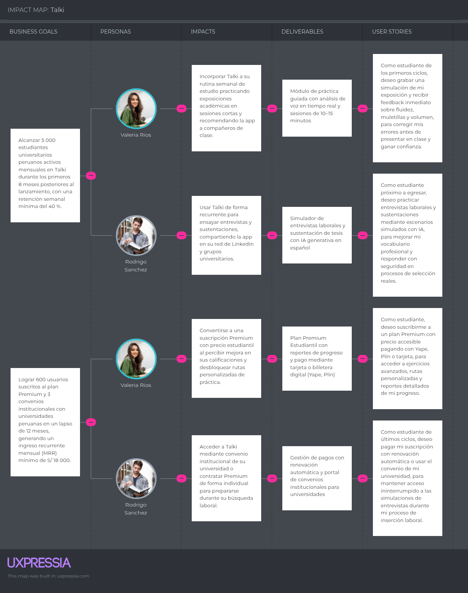
</div>

**Business Goals (SMART):**

- **BG-01 (Adopción):** Alcanzar 5 000 estudiantes universitarios peruanos activos mensuales en Talki durante los primeros 8 meses posteriores al lanzamiento, con una retención semanal mínima del 40 %.
- **BG-02 (Ingresos):** Lograr 600 usuarios suscritos al plan Premium y 3 convenios institucionales con universidades peruanas en un lapso de 12 meses, generando un ingreso recurrente mensual (MRR) mínimo de S/ 18 000.
- **BG-03 (Engagement):** Conseguir que el 70 % de los usuarios activos complete al menos 4 sesiones de práctica al mes durante los primeros 6 meses, evidenciando uso sostenido de la herramienta.

**Desglose del Impact Map:**

<table>
  <thead>
    <tr>
      <th>Business Goal</th>
      <th>Persona</th>
      <th>Impact</th>
      <th>Deliverable</th>
      <th>User Story</th>
    </tr>
  </thead>
  <tbody>
    <tr>
      <td rowspan="2"><strong>BG-01</strong><br>Adopción<br>(5 000 MAU en 8 meses)</td>
      <td>Valeria Ríos<br><em>(Segmento 1)</em></td>
      <td>Incorporar Talki a su rutina semanal de estudio practicando exposiciones académicas en sesiones cortas y recomendando la plataforma a compañeros de clase.</td>
      <td>Módulo de práctica guiada con análisis de voz en tiempo real y sesiones de 10 a 15 minutos.</td>
      <td><strong>Como</strong> estudiante de los primeros ciclos, <strong>deseo</strong> grabar una simulación de mi exposición y recibir feedback inmediato sobre fluidez, muletillas y volumen, <strong>para</strong> corregir mis errores antes de presentar en clase y ganar confianza.</td>
    </tr>
    <tr>
      <td>Rodrigo Sánchez<br><em>(Segmento 2)</em></td>
      <td>Usar Talki de forma recurrente para ensayar entrevistas y sustentaciones, compartiendo la plataforma en su red de LinkedIn y grupos universitarios.</td>
      <td>Simulador de entrevistas laborales y sustentación de tesis con IA generativa en español.</td>
      <td><strong>Como</strong> estudiante próximo a egresar, <strong>deseo</strong> practicar entrevistas laborales y sustentaciones mediante escenarios simulados con IA, <strong>para</strong> mejorar mi vocabulario profesional y responder con seguridad en procesos de selección reales.</td>
    </tr>
    <tr>
      <td rowspan="2"><strong>BG-02</strong><br>Ingresos<br>(600 Premium + 3 convenios en 12 meses)</td>
      <td>Valeria Ríos<br><em>(Segmento 1)</em></td>
      <td>Convertirse a una suscripción Premium con precio estudiantil al percibir mejora en sus calificaciones y desbloquear rutas personalizadas de práctica.</td>
      <td>Plan Premium Estudiantil con reportes de progreso y pago mediante tarjeta o billetera digital (Yape, Plin).</td>
      <td><strong>Como</strong> estudiante, <strong>deseo</strong> suscribirme a un plan Premium con precio accesible pagando con Yape, Plin o tarjeta, <strong>para</strong> acceder a ejercicios avanzados, rutas personalizadas y reportes detallados de mi progreso.</td>
    </tr>
    <tr>
      <td>Rodrigo Sánchez<br><em>(Segmento 2)</em></td>
      <td>Acceder a Talki mediante convenio institucional de su universidad o contratar Premium de forma individual para prepararse durante su búsqueda laboral.</td>
      <td>Gestión de pagos con renovación automática y portal de convenios institucionales para universidades.</td>
      <td><strong>Como</strong> estudiante de últimos ciclos, <strong>deseo</strong> pagar mi suscripción con renovación automática o usar el convenio de mi universidad, <strong>para</strong> mantener acceso ininterrumpido a las simulaciones de entrevistas durante mi proceso de inserción laboral.</td>
    </tr>
    <tr>
      <td rowspan="2"><strong>BG-03</strong><br>Engagement<br>(70 % de usuarios con ≥ 4 sesiones/mes en 6 meses)</td>
      <td>Valeria Ríos<br><em>(Segmento 1)</em></td>
      <td>Completar al menos una sesión de práctica semanal motivada por retos, rachas y notificaciones que refuercen el hábito.</td>
      <td>Sistema de gamificación con rachas, logros y notificaciones push personalizadas.</td>
      <td><strong>Como</strong> estudiante, <strong>deseo</strong> recibir recordatorios diarios y ganar logros por mantener mi racha de práctica, <strong>para</strong> conservar la constancia y mejorar progresivamente mi comunicación oral.</td>
    </tr>
    <tr>
      <td>Rodrigo Sánchez<br><em>(Segmento 2)</em></td>
      <td>Realizar sesiones frecuentes alineadas a metas concretas (ej. entrevista próxima, sustentación de tesis) y monitorear su avance en un dashboard.</td>
      <td>Dashboard de progreso con metas personalizadas y reportes de evolución por habilidad (fluidez, claridad, vocabulario).</td>
      <td><strong>Como</strong> estudiante próximo a egresar, <strong>deseo</strong> definir metas específicas (ej. preparar entrevista técnica) y ver mi evolución en un dashboard, <strong>para</strong> enfocar mi práctica en las habilidades que más necesito antes de un evento real.</td>
    </tr>
  </tbody>
</table>

<div style="page-break-after: always;"></div>

## 3.4. Product Backlog

El Product Backlog está priorizado según el método **MoSCoW** (*Must* / *Should* / *Could* / *Won't*), basado en el valor que aporta cada User Story al MVP y la dependencia funcional entre ellas. Las User Stories *Must* son bloqueantes del MVP y cubren autenticación, sesión de práctica, grabación, feedback básico y adaptación por segmento. Las *Should* aportan valor crítico pero pueden esperar un sprint; incluyen tipos de sesión, análisis detallado, historial y progreso. Las *Could* son mejoras incrementales (landing page, exportación, metas personales) que se pueden desarrollar después del MVP sin afectar la propuesta de valor inicial.

<table>
  <thead>
    <tr>
      <th># Orden</th>
      <th>User Story ID</th>
      <th>Título</th>
      <th>Descripción</th>
      <th>Story Points</th>
      <th>Prioridad</th>
    </tr>
  </thead>
  <tbody>
    <tr>
      <td>1</td>
      <td>US05</td>
      <td>Registro de cuenta nueva</td>
      <td><strong>Como</strong> estudiante universitario, <strong>quiero</strong> registrarme en Talki con mi correo electrónico, <strong>para</strong> crear una cuenta y acceder a las funcionalidades de la plataforma.</td>
      <td>3</td>
      <td>Must</td>
    </tr>
    <tr>
      <td>2</td>
      <td>US06</td>
      <td>Inicio de sesión</td>
      <td><strong>Como</strong> estudiante registrado, <strong>quiero</strong> iniciar sesión con mi correo y contraseña, <strong>para</strong> acceder a mi cuenta y sesiones de práctica.</td>
      <td>2</td>
      <td>Must</td>
    </tr>
    <tr>
      <td>3</td>
      <td>US07</td>
      <td>Recuperación de contraseña</td>
      <td><strong>Como</strong> estudiante registrado, <strong>quiero</strong> recuperar mi contraseña mediante mi correo electrónico, <strong>para</strong> volver a acceder a mi cuenta si olvido mis credenciales.</td>
      <td>2</td>
      <td>Must</td>
    </tr>
    <tr>
      <td>4</td>
      <td>US08</td>
      <td>Edición de perfil de usuario</td>
      <td><strong>Como</strong> estudiante registrado, <strong>quiero</strong> editar mi perfil con información como ciclo universitario, carrera y universidad, <strong>para</strong> que Talki personalice mi experiencia.</td>
      <td>3</td>
      <td>Must</td>
    </tr>
    <tr>
      <td>5</td>
      <td>US28</td>
      <td>Cerrar sesión de usuario</td>
      <td><strong>Como</strong> estudiante registrado, <strong>quiero</strong> cerrar sesión de manera segura, <strong>para</strong> proteger mi cuenta cuando uso un dispositivo compartido.</td>
      <td>1</td>
      <td>Must</td>
    </tr>
    <tr>
      <td>6</td>
      <td>US23</td>
      <td>Seleccionar segmento académico</td>
      <td><strong>Como</strong> estudiante, <strong>quiero</strong> indicar mi segmento académico (ciclo 1 al 5 o ciclo 6 al 10) durante el registro o en mi perfil, <strong>para</strong> que Talki adapte el feedback a mi nivel.</td>
      <td>2</td>
      <td>Must</td>
    </tr>
    <tr>
      <td>7</td>
      <td>US09</td>
      <td>Crear nueva sesión de práctica</td>
      <td><strong>Como</strong> estudiante, <strong>quiero</strong> crear una nueva sesión de práctica oral, <strong>para</strong> comenzar a ensayar mi presentación y recibir retroalimentación.</td>
      <td>3</td>
      <td>Must</td>
    </tr>
    <tr>
      <td>8</td>
      <td>US12</td>
      <td>Iniciar grabación y transcripción en tiempo real</td>
      <td><strong>Como</strong> estudiante, <strong>quiero</strong> iniciar la grabación de mi presentación y ver la transcripción en tiempo real, <strong>para</strong> monitorear lo que digo mientras practico.</td>
      <td>8</td>
      <td>Must</td>
    </tr>
    <tr>
      <td>9</td>
      <td>US14</td>
      <td>Finalizar sesión y guardar transcripción</td>
      <td><strong>Como</strong> estudiante, <strong>quiero</strong> finalizar la sesión de grabación y que se guarde la transcripción completa, <strong>para</strong> poder revisarla posteriormente y recibir feedback.</td>
      <td>3</td>
      <td>Must</td>
    </tr>
    <tr>
      <td>10</td>
      <td>US15</td>
      <td>Recibir feedback general de la IA</td>
      <td><strong>Como</strong> estudiante, <strong>quiero</strong> recibir un resumen de feedback general de la IA al finalizar mi sesión, <strong>para</strong> conocer una evaluación global de mi desempeño oral.</td>
      <td>8</td>
      <td>Must</td>
    </tr>
    <tr>
      <td>11</td>
      <td>US26</td>
      <td>Recibir recomendaciones adaptadas al segmento</td>
      <td><strong>Como</strong> estudiante de ciclo 1 al 5, <strong>quiero</strong> recibir retroalimentación adaptada a mi nivel básico de presentaciones, <strong>para</strong> desarrollar habilidades fundamentales de comunicación oral.</td>
      <td>5</td>
      <td>Must</td>
    </tr>
    <tr>
      <td>12</td>
      <td>US10</td>
      <td>Seleccionar tipo de sesión</td>
      <td><strong>Como</strong> estudiante, <strong>quiero</strong> seleccionar el tipo de presentación que voy a practicar (pitch, presentación, sustentación de tesis, charla), <strong>para</strong> que el feedback de la IA se ajuste al contexto de mi práctica.</td>
      <td>3</td>
      <td>Should</td>
    </tr>
    <tr>
      <td>13</td>
      <td>US11</td>
      <td>Configurar duración objetivo</td>
      <td><strong>Como</strong> estudiante, <strong>quiero</strong> establecer una duración objetivo para mi sesión de práctica, <strong>para</strong> entrenar el manejo del tiempo en mis presentaciones.</td>
      <td>2</td>
      <td>Should</td>
    </tr>
    <tr>
      <td>14</td>
      <td>US13</td>
      <td>Pausar y reanudar grabación</td>
      <td><strong>Como</strong> estudiante, <strong>quiero</strong> pausar y reanudar la grabación durante mi sesión, <strong>para</strong> tomar descansos sin perder el progreso de la transcripción.</td>
      <td>3</td>
      <td>Should</td>
    </tr>
    <tr>
      <td>15</td>
      <td>US16</td>
      <td>Análisis de muletillas</td>
      <td><strong>Como</strong> estudiante, <strong>quiero</strong> ver un análisis detallado de las muletillas que usé durante mi presentación, <strong>para</strong> identificar y reducir su frecuencia.</td>
      <td>5</td>
      <td>Should</td>
    </tr>
    <tr>
      <td>16</td>
      <td>US17</td>
      <td>Análisis de palabras clave</td>
      <td><strong>Como</strong> estudiante, <strong>quiero</strong> ver las palabras clave identificadas en mi presentación, <strong>para</strong> verificar que estoy comunicando los conceptos importantes de mi tema.</td>
      <td>5</td>
      <td>Should</td>
    </tr>
    <tr>
      <td>17</td>
      <td>US19</td>
      <td>Sugerencias de mejora por sección</td>
      <td><strong>Como</strong> estudiante, <strong>quiero</strong> recibir sugerencias específicas de mejora para cada sección de mi presentación, <strong>para</strong> saber exactamente en qué partes debo trabajar más.</td>
      <td>5</td>
      <td>Should</td>
    </tr>
    <tr>
      <td>18</td>
      <td>US20</td>
      <td>Consultar historial de sesiones</td>
      <td><strong>Como</strong> estudiante, <strong>quiero</strong> ver una lista de todas mis sesiones de práctica pasadas, <strong>para</strong> acceder a las transcripciones y feedback anteriores.</td>
      <td>3</td>
      <td>Should</td>
    </tr>
    <tr>
      <td>19</td>
      <td>US21</td>
      <td>Ver progreso a lo largo del tiempo</td>
      <td><strong>Como</strong> estudiante, <strong>quiero</strong> visualizar gráficos de mi progreso en el tiempo, <strong>para</strong> ver cómo han mejorado mis habilidades de comunicación oral.</td>
      <td>5</td>
      <td>Should</td>
    </tr>
    <tr>
      <td>20</td>
      <td>US18</td>
      <td>Recomendaciones de mejora de léxico</td>
      <td><strong>Como</strong> estudiante, <strong>quiero</strong> recibir sugerencias para mejorar mi vocabulario y léxico, <strong>para</strong> enriquecer mi expresión oral en futuras presentaciones.</td>
      <td>5</td>
      <td>Could</td>
    </tr>
    <tr>
      <td>21</td>
      <td>US22</td>
      <td>Comparar dos sesiones</td>
      <td><strong>Como</strong> estudiante, <strong>quiero</strong> comparar dos sesiones de práctica lado a lado, <strong>para</strong> identificar en qué aspectos he mejorado o empeorado.</td>
      <td>5</td>
      <td>Could</td>
    </tr>
    <tr>
      <td>22</td>
      <td>US24</td>
      <td>Establecer metas de mejora personal</td>
      <td><strong>Como</strong> estudiante, <strong>quiero</strong> definir metas específicas de mejora, <strong>para</strong> que Talki enfoque sus recomendaciones en mis objetivos.</td>
      <td>3</td>
      <td>Could</td>
    </tr>
    <tr>
      <td>23</td>
      <td>US25</td>
      <td>Seleccionar áreas de enfoque para la sesión</td>
      <td><strong>Como</strong> estudiante, <strong>quiero</strong> elegir áreas de enfoque específicas antes de iniciar una sesión, <strong>para</strong> recibir feedback enfocado en esas competencias.</td>
      <td>3</td>
      <td>Could</td>
    </tr>
    <tr>
      <td>24</td>
      <td>US27</td>
      <td>Exportar transcripción y feedback</td>
      <td><strong>Como</strong> estudiante, <strong>quiero</strong> exportar la transcripción y el feedback de mi sesión en formato PDF, <strong>para</strong> compartirlo con mi docente o revisarlo sin conexión.</td>
      <td>3</td>
      <td>Could</td>
    </tr>
    <tr>
      <td>25</td>
      <td>US01</td>
      <td>Visualizar beneficios de Talki</td>
      <td><strong>Como</strong> visitante, <strong>quiero</strong> ver una sección de beneficios clave en la página de aterrizaje, <strong>para</strong> entender cómo Talki puede ayudarme a mejorar mi comunicación oral.</td>
      <td>2</td>
      <td>Could</td>
    </tr>
    <tr>
      <td>26</td>
      <td>US02</td>
      <td>Ver planes y precios</td>
      <td><strong>Como</strong> visitante, <strong>quiero</strong> consultar los planes y precios disponibles en la landing page, <strong>para</strong> evaluar cuál se ajusta a mis necesidades y presupuesto.</td>
      <td>2</td>
      <td>Could</td>
    </tr>
    <tr>
      <td>27</td>
      <td>US03</td>
      <td>Ver testimonios de usuarios</td>
      <td><strong>Como</strong> visitante, <strong>quiero</strong> leer testimonios de otros estudiantes que han usado Talki, <strong>para</strong> generar confianza antes de registrarme.</td>
      <td>1</td>
      <td>Could</td>
    </tr>
    <tr>
      <td>28</td>
      <td>US04</td>
      <td>Acceder a formulario de contacto</td>
      <td><strong>Como</strong> visitante, <strong>quiero</strong> enviar un mensaje de contacto desde la landing page, <strong>para</strong> resolver dudas antes de registrarme en Talki.</td>
      <td>2</td>
      <td>Could</td>
    </tr>
  </tbody>
</table>

<div style="page-break-after: always;"></div>

# Capítulo IV: Product Architecture Design

## 4.1. Design Concepts, ViewPoints & ER Diagrams

### 4.1.1. Principles Statements

Los siguientes principios guían todas las decisiones de diseño arquitectónico de Talki. Cada principio está formulado como un enunciado normativo que el equipo aplica durante las iteraciones ADD y que puede verificarse en las decisiones de diseño registradas.

**P1 – Separación de responsabilidades por capacidad de negocio.**
Cada servicio de Talki encapsula una única capacidad de negocio (autenticación, gestión de sesiones, transcripción, análisis de IA, progreso) y no comparte base de datos con otros servicios. Este principio minimiza el acoplamiento entre equipos y permite evolucionar cada capacidad de forma independiente sin afectar al resto del sistema.

**P2 – Diseño orientado a la API (API-First).**
Todo comportamiento del sistema se expone exclusivamente a través de contratos REST definidos antes de la implementación. El frontend Angular y cualquier cliente externo consumen única y exclusivamente las interfaces publicadas por el API Gateway, lo que garantiza que los cambios internos de un servicio no rompan a sus consumidores mientras el contrato se mantenga estable.

**P3 – Servicios sin estado (Stateless Services).**
Los servicios del backend no almacenan estado de sesión de usuario en memoria. La identidad y el contexto de cada solicitud se transportan en el token JWT incluido en el encabezado HTTP. Este principio permite escalar horizontalmente cualquier servicio sin necesidad de sesiones pegajosas (sticky sessions) y simplifica la recuperación ante fallos.

**P4 – Propiedad exclusiva de los datos por servicio (Database per Service).**
Cada microservicio es el único propietario y gestor de su almacenamiento persistente. Ningún servicio lee ni escribe directamente en la base de datos de otro. La comunicación entre servicios se realiza únicamente a través de sus APIs o mediante eventos publicados en el bus de mensajería. Este principio preserva la autonomía de despliegue y evita el acoplamiento estructural a nivel de esquema.

**P5 – Seguridad por diseño (Security by Design).**
La seguridad no es una capa añadida a posteriori sino una restricción de diseño desde el primer boceto. Todas las comunicaciones entre el cliente y el servidor usan HTTPS/TLS. Los tokens JWT son de corta duración (15 minutos) y se renuevan mediante refresh tokens con rotación. Las entradas externas se validan en el perímetro (API Gateway) antes de ser enrutadas a los servicios internos.

**P6 – Observabilidad integrada.**
Cada servicio emite trazas distribuidas (trace ID), métricas de negocio y logs estructurados en formato JSON desde el momento de su primera versión. Este principio permite diagnosticar incidentes en producción sin depender de acceso directo a los contenedores y es especialmente crítico dado que el servicio de transcripción y análisis de IA introduce latencias variables que deben monitorearse continuamente.

**P7 – Degradación elegante (Graceful Degradation).**
Cuando un servicio dependiente falla o supera el tiempo de respuesta aceptable, el sistema responde con funcionalidad reducida en lugar de un error total. Si el servicio de análisis de IA no está disponible, la sesión de grabación y la transcripción continúan funcionando y el análisis se reprocesa en cuanto el servicio se recupera. Este principio protege la experiencia del usuario en el caso de fallo parcial del sistema.

**P8 – Evolución sin ruptura de contrato (Backward Compatibility).**
Al versionar las APIs (v1, v2…) y mantener versiones anteriores durante al menos un ciclo de sprint, se garantiza que los clientes existentes no se rompan ante cambios internos. Esto es especialmente relevante porque el frontend y el backend se despliegan de forma independiente.

---

### 4.1.2. Approaches Statements Architectural Styles & Patterns

La arquitectura de Talki combina varios estilos y patrones complementarios seleccionados en función de los drivers de calidad identificados (latencia del análisis de IA, escalabilidad del servicio de transcripción, evolución independiente de capacidades). A continuación se describe cada estilo o patrón adoptado y su justificación en el contexto del producto.

**Arquitectura de microservicios.**
Talki se descompone en servicios independientes desplegables por separado, cada uno con su propia base de código, contenedor Docker y ciclo de vida de despliegue. Esta elección responde al driver de modifiability: las reglas de análisis de IA evolucionan con frecuencia sin impactar el resto de la plataforma. Los servicios identificados son: `identity-service`, `session-service`, `live-coach-service`, `filler-detection-service`, `scoring-service`, `progress-service`, `gamification-service` y `notification-service`.

**Domain-Driven Design (DDD).**
La descomposición en microservicios sigue los límites de contexto acotado (Bounded Contexts) derivados del dominio de Talki. Los contextos identificados son: *Identity & Access*, *Practice Session*, *Speech Analysis*, *Progress & Metrics*, y *Notification*. Dentro de cada contexto se aplican los bloques tácticos de DDD: Aggregates, Value Objects, Domain Events y Repositories. Esta alineación entre la estructura del código y el dominio de negocio reduce la fricción cognitiva y facilita la incorporación de nuevos integrantes al equipo.

**Arquitectura orientada a eventos (Event-Driven Architecture).**
El análisis post-sesión es una operación que no puede bloquear la respuesta al usuario. Por esta razón, la finalización de una sesión publica un evento `session.live.finalized` en RabbitMQ con el `transcript_gemini` y las métricas acústicas calculadas en memoria por el `live-coach-service`. El `filler-detection-service` consume este evento, aplica análisis sobre la transcripción y publica `fillers.analyzed`; el `scoring-service` calcula las cinco dimensiones del Voice Coach Score y publica `scoring.completed`, que el `progress-service` consume para actualizar las vistas materializadas. Esta arquitectura desacopla temporalmente los servicios y permite que el frontend notifique al usuario cuando el análisis esté listo mediante WebSockets o polling.

**Patrón API Gateway.**
Un API Gateway centralizado actúa como punto de entrada único para todos los clientes del sistema. Responsabilidades delegadas al gateway: autenticación y validación de JWT, enrutamiento hacia microservicios internos, limitación de tasa (rate limiting), logging de accesos y transformación de respuestas. Este patrón evita que los clientes necesiten conocer la topología interna de los servicios y permite aplicar cross-cutting concerns en un solo lugar.

**Backend for Frontend (BFF).**
Dado que Talki opera actualmente como aplicación web (Angular), el API Gateway actúa también como BFF adaptando las respuestas de los microservicios al formato específico que la interfaz de usuario necesita, evitando múltiples roundtrips y reduciendo la complejidad en el cliente.

**CQRS (Command Query Responsibility Segregation).**
El `progress-service` separa los modelos de escritura (registro de métricas al finalizar una sesión) de los modelos de lectura (consulta de gráficos de progreso histórico). Las escrituras actualizan un almacén normalizado (PostgreSQL), mientras que las lecturas utilizan vistas materializadas optimizadas para las consultas de tendencias y comparaciones. Esta separación permite escalar las lecturas de forma independiente y evitar contención en escenarios donde un usuario consulta su historial mientras otro guarda una sesión nueva.

**Circuit Breaker.**
Las llamadas del `live-coach-service` hacia la API de IA externa (Google Gemini Live) están envueltas en un Circuit Breaker con tres estados: Cerrado (operación normal), Abierto (fallo repetido, solicitudes rechazadas inmediatamente) y Semi-Abierto (sondeo de recuperación). Esto previene la cascada de fallos cuando el proveedor externo experimenta degradación y permite que el resto de la plataforma continúe operando mediante el modo *scripted* alternativo.

**Patrón Strangler Fig (migración progresiva).**
Si en fases posteriores se requiriera refactorizar el módulo de autenticación hacia un proveedor de identidad dedicado (Auth0, Keycloak), se aplicaría el patrón Strangler Fig: enrutando gradualmente el tráfico desde la implementación existente hacia la nueva, sin downtime ni reescritura total.

---

### 4.1.3. Context Diagram

El diagrama de contexto C4 (nivel 1) muestra a Talki como sistema de caja negra en relación con sus usuarios y sistemas externos. Los actores primarios son los dos segmentos de estudiantes universitarios identificados en el Capítulo I. Los sistemas externos son aquellos con los que Talki se integra pero que están fuera del control del equipo de Thropic.

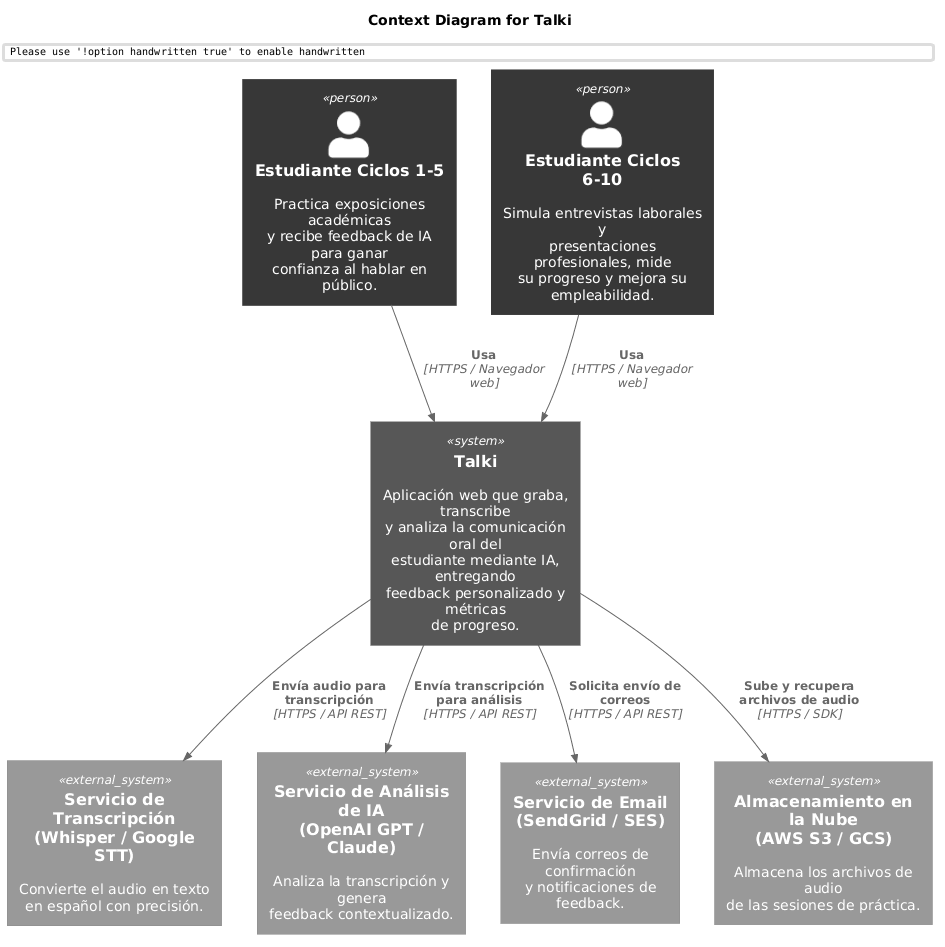

_Diagrama de Contexto C4 — Sistema Talki. Elaboración propia (2026)._

**Descripción de actores y sistemas:**

| Actor / Sistema | Tipo | Descripción |
|---|---|---|
| Estudiante Ciclos 1-5 | Usuario primario | Valeria Ríos (User Persona 1). Busca practicar exposiciones académicas con feedback inmediato para superar el miedo escénico. Accede desde laptop/PC en sesiones de 10-20 minutos. |
| Estudiante Ciclos 6-10 | Usuario primario | Rodrigo Sánchez (User Persona 2). Busca prepararse para entrevistas laborales y sustentaciones de tesis con feedback profesional y métricas de mejora a largo plazo. |
| Google Gemini Live API | Sistema externo | Servicio de IA conversacional bidireccional (audio entrada / audio salida) con transcripción nativa en tiempo real (`transcript_gemini`). Reemplaza el pipeline clásico STT → LLM → TTS por un único proveedor con latencia ~600ms. |
| Servicio de IA (asincrónico) | Sistema externo | Recibe la transcripción ya generada por Gemini y el tipo de sesión, y devuelve el análisis estructurado: puntuación global, muletillas detectadas, análisis de léxico y sugerencias de mejora por sección. |
| Servicio de Email | Sistema externo | Gestiona el envío de correos transaccionales. Se desacopla del core de Talki para evitar dependencias de entrega sincrónica. |
| Almacenamiento en la Nube | Sistema externo | Almacena los archivos de audio de forma persistente y los entrega al servicio de transcripción mediante URLs prefirmadas, evitando que los archivos pasen por los servidores de aplicación. |

---

### 4.1.4. Approach driven ViewPoints Diagrams

Los diagramas de viewpoints derivados del enfoque arquitectónico presentan el sistema Talki desde tres perspectivas complementarias: el Context Map de DDD que delimita los Bounded Contexts del dominio, y los niveles C4 de Contenedores (nivel 2) y Componentes (nivel 3) que describen la arquitectura técnica. Todos se alinean con los estilos arquitectónicos declarados en la sección 4.1.2.

#### Context Map — Domain-Driven Design

El Context Map identifica los cinco Bounded Contexts de Talki y define sus relaciones de integración usando la notación DDD: **U** (upstream) y **D** (downstream) indican la dirección del flujo de influencia; **OHS** (Open Host Service) marca los contextos que exponen una API pública estable; **ACL** (Anti-Corruption Layer) señala donde un contexto traduce activamente el modelo del upstream para proteger su propio dominio; y **PL** (Published Language) indica que la integración se realiza mediante un lenguaje de eventos compartido y versionado.

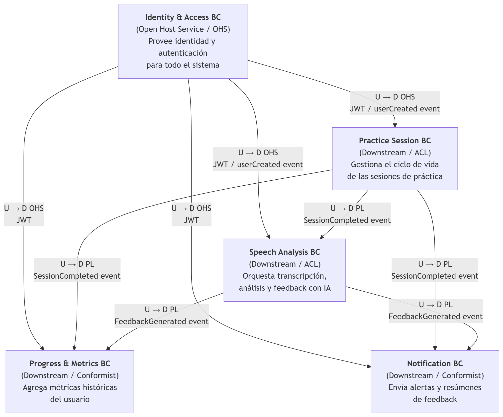

_Context Map DDD — Bounded Contexts de Talki y sus relaciones de integración. Elaboración propia (2026)._

**Decisiones de integración relevantes:**
- **Identity & Access** actúa como upstream absoluto (OHS): todos los demás contextos validan identidad contra él sin acoplar su modelo de dominio interno.
- **Practice Session** y **Speech Analysis** usan ACL para traducir los eventos de Identity al lenguaje de su propio dominio (`UserId` como Value Object), evitando que un cambio en el modelo de usuario rompa su lógica interna.
- **Progress & Metrics** y **Notification** son conformistas: consumen los eventos publicados tal como los define el upstream, sin traducción adicional, dado que su lógica es reactiva y de bajo riesgo de divergencia.
- La comunicación entre contextos se realiza exclusivamente a través del bus de eventos (RabbitMQ) con eventos versionados, no mediante llamadas síncronas directas entre servicios.

---

#### Diagrama de Contenedores (C4 – Nivel 2)

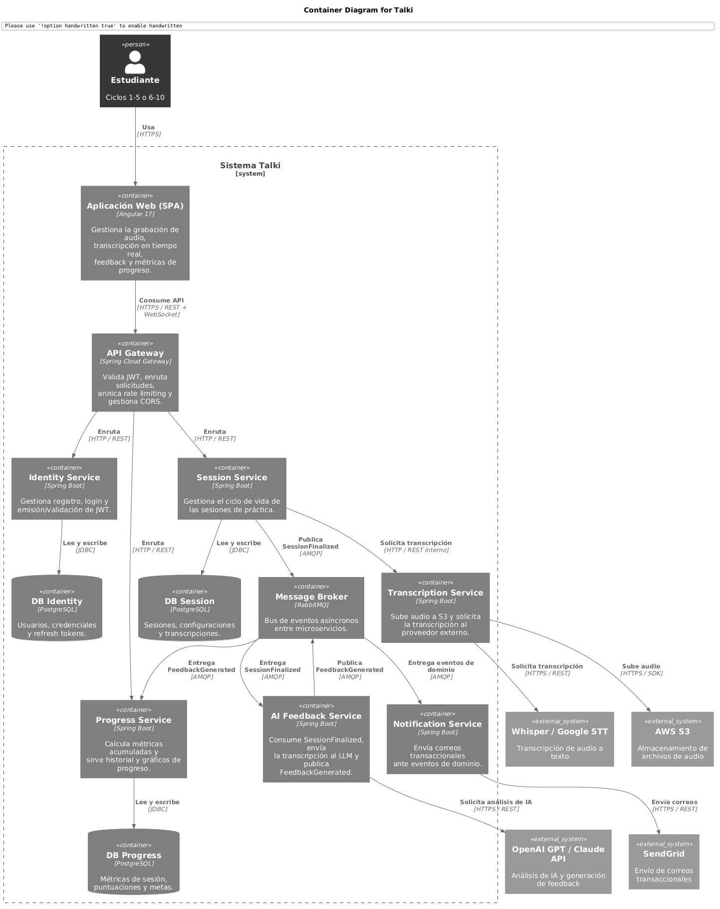

_Diagrama de Contenedores C4 — Sistema Talki. Elaboración propia (2026)._

#### Diagrama de Componentes del Live Coach Service (C4 – Nivel 3)

El `live-coach-service` es el contenedor más crítico y complejo del sistema, ya que orquesta la comunicación bidireccional con Gemini Live API durante toda la sesión, calcula las métricas acústicas en memoria y publica el evento `session.live.finalized` que dispara el pipeline de análisis. Por ello se detalla a nivel de componentes.

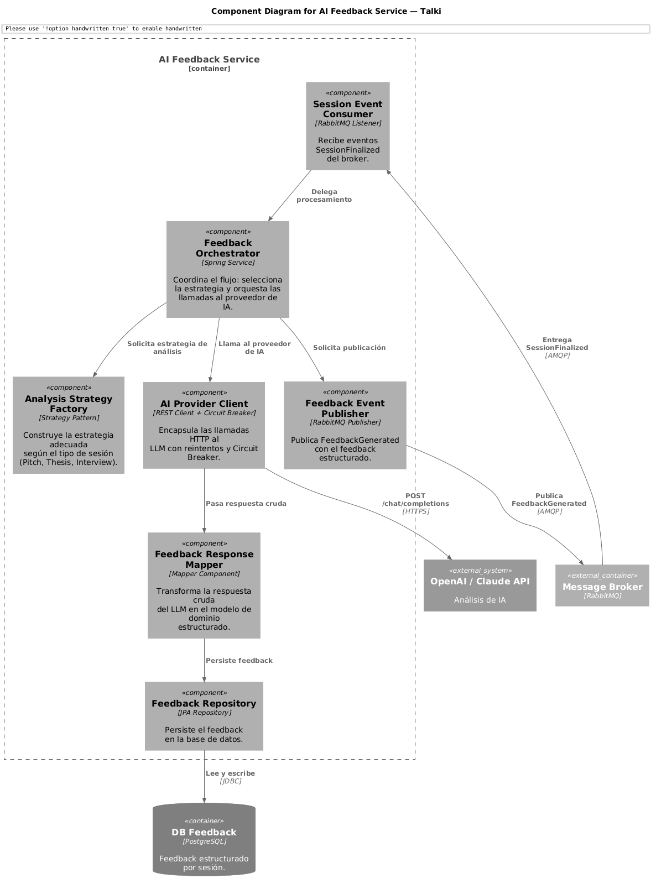

_Diagrama de Componentes C4 — Live Coach Service. Elaboración propia (2026)._

---

### 4.1.5. Architecture Overview: Class Diagram & Database Diagram

#### Diagrama de Clases

El diagrama de clases consolida las entidades de dominio de los cinco Bounded Contexts de Talki, mostrando atributos, métodos representativos y relaciones estructurales. Las clases están agrupadas por contexto para reflejar la separación de responsabilidades del diseño DDD.

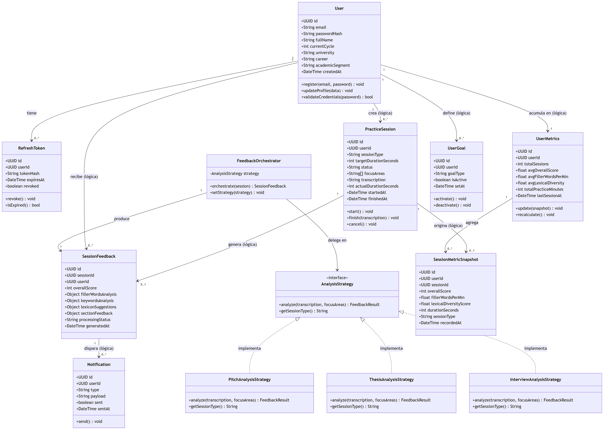

_Diagrama de Clases — Bounded Contexts de Talki (Identity & Access, Practice Session, Speech Analysis, Progress & Metrics). Elaboración propia (2026)._

---

#### Diagrama Entidad-Relación (Base de Datos Relacional)

Talki utiliza un esquema de **base de datos por servicio** (Database per Service), donde cada microservicio gestiona su propio almacenamiento relacional (PostgreSQL). A continuación se presenta el diagrama entidad-relación consolidado de los esquemas principales.

**Decisiones de modelado:**
- Se usa **PostgreSQL** como base de datos relacional principal para todos los servicios, dado que los datos de sesión, feedback y progreso tienen estructura predecible y requieren consistencia transaccional.
- Los campos `filler_words_analysis`, `keywords_analysis`, `lexicon_suggestions` y `section_feedback` en la tabla `session_feedback` se almacenan como JSONB de PostgreSQL, aprovechando la flexibilidad de consulta sobre campos semiestructurados sin sacrificar las garantías ACID.
- Las relaciones entre servicios se modelan mediante `user_id` como clave foránea lógica (no referencial entre bases de datos), lo que preserva la autonomía de cada esquema.

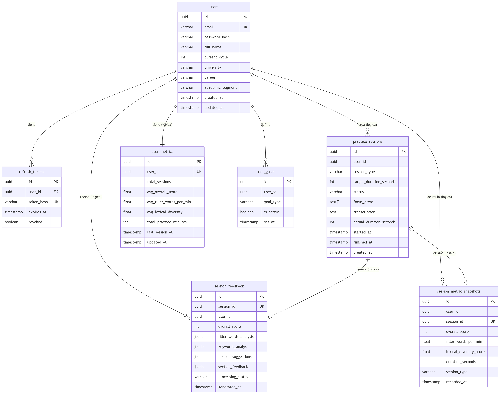

_Diagrama Entidad-Relación — Esquemas de bases de datos de Talki. Elaboración propia (2026)._

---

### 4.1.6. Design Patterns

Talki aplica los siguientes patrones de diseño de software, seleccionados para resolver problemas concretos identificados durante el diseño.

**Strategy (Comportamiento) — Live Coach Service y Scoring Service.**
El tipo de sesión de práctica (pitch, sustentación de tesis, charla, simulación de entrevista) determina el conjunto de system prompts enviados a Gemini Live por el `live-coach-service` y los criterios de evaluación aplicados por el `scoring-service`. El patrón Strategy encapsula cada variante en una clase independiente (`PitchAnalysisStrategy`, `ThesisAnalysisStrategy`, `InterviewAnalysisStrategy`) que implementa la interfaz `AnalysisStrategy`. El orquestador delega en la estrategia apropiada sin conocer sus detalles internos. Esto permite agregar nuevos tipos de sesión sin modificar el orquestador (Open/Closed Principle).

**Factory Method (Creacional) — Strategy Factory.**
El `AnalysisStrategyFactory` centraliza la creación de instancias de estrategia a partir del tipo de sesión recibido en el evento o en la sesión activa. Desacopla el código cliente de la lógica de instanciación y facilita las pruebas unitarias mediante inyección de dependencias.

**Repository (Arquitectural) — Acceso a datos en todos los servicios.**
Cada microservicio accede a su base de datos exclusivamente a través de interfaces de repositorio (`AppUserRepository`, `SessionRepository`, `FeedbackRepository`, `ScoreResultRepository`, `UserProgressRepository`, `UserStreakRepository`). Las implementaciones JPA son intercambiables en pruebas y la lógica de negocio no contiene código SQL directo. Este patrón facilita la aplicación del principio de inversión de dependencias.

**Observer / Event-Driven (Comportamiento) — Bus de eventos.**
Los servicios productores de eventos (`live-coach-service`, `filler-detection-service`, `scoring-service`, `gamification-service`, `identity-service`) publican eventos de dominio en RabbitMQ sin conocer quién los consumirá. Los consumidores (`filler-detection-service`, `scoring-service`, `progress-service`, `gamification-service`, `notification-service`) se suscriben a las colas relevantes e implementan los handlers correspondientes. Este patrón desacopla temporalmente los servicios y permite agregar nuevos consumidores sin modificar los productores (extensibilidad).

**Circuit Breaker (Resiliencia) — Llamadas a servicios externos.**
Las llamadas al LLM externo desde el `live-coach-service` (Gemini Live API) están protegidas con el patrón Circuit Breaker (implementado con Resilience4j). Cuando el número de fallos consecutivos supera el umbral configurado, el circuito se abre y las solicitudes se rechazan inmediatamente durante un período de espera. Transcurrido ese período, el circuito entra en estado semi-abierto para sondear la recuperación del servicio externo, mientras tanto el servicio activa el modo *scripted* alternativo.

**Decorator (Estructural) — Middleware de logging y métricas en el API Gateway.**
El API Gateway aplica capas decoradoras sobre cada solicitud entrante: validación de JWT, registro de métricas de latencia e inyección de trace IDs para trazabilidad distribuida. Cada decorador añade comportamiento transversal sin modificar la lógica de enrutamiento central.

**DTO (Data Transfer Object) — Contratos de API.**
Cada endpoint del API Gateway recibe y devuelve DTOs específicos (nunca entidades de dominio directamente). Esto protege el modelo de dominio de la serialización externa, permite versionar los contratos de API de forma independiente al modelo interno y reduce el acoplamiento entre capas.

**Saga (Coreografía) — Procesamiento asíncrono de sesión finalizada.**
El flujo completo de análisis de una sesión (guardar transcripción → transcribir audio → analizar con IA → actualizar métricas → notificar al usuario) se implementa como una Saga de coreografía sobre eventos: cada servicio reacciona al evento del anterior y publica su propio evento de resultado. No existe un coordinador central, lo que evita un punto único de fallo en el flujo de procesamiento.

---

### 4.1.7. Tactics

Las tácticas arquitectónicas son decisiones de diseño concretas que permiten satisfacer los atributos de calidad declarados. A continuación se describen las tácticas seleccionadas para los atributos más críticos de Talki.

#### Disponibilidad (Availability)

| Táctica | Descripción | Aplicación en Talki |
|---|---|---|
| **Monitor** | Detección activa de fallos mediante health checks | Cada microservicio expone `/actuator/health`. La plataforma de despliegue (Railway) reinicia automáticamente los contenedores que fallen el health check. |
| **Retry con backoff exponencial** | Reintentos automáticos ante fallos transitorios | El `live-coach-service` reintenta hasta 3 veces con backoff exponencial las llamadas a Gemini Live antes de abrir el Circuit Breaker. |
| **Circuit Breaker** | Aislamiento de fallos en servicios externos | Implementado con Resilience4j en todas las llamadas a APIs externas (Gemini Live, email). |
| **Redundancia activa** | Múltiples instancias del mismo servicio | Los servicios críticos (`session-service`, `live-coach-service`, `scoring-service`) se despliegan con al menos 2 réplicas (escalado horizontal de Railway), garantizando continuidad ante la caída de una instancia. |
| **Degradación elegante** | Funcionalidad reducida ante fallo parcial | Si el análisis de IA falla, el usuario recibe confirmación de que la sesión fue guardada y se le notifica cuando el análisis esté disponible. La grabación y la transcripción siempre funcionan de forma independiente. |

#### Rendimiento (Performance)

| Táctica | Descripción | Aplicación en Talki |
|---|---|---|
| **Procesamiento asíncrono** | Operaciones lentas fuera del path síncrono | El análisis de IA se ejecuta de forma asíncrona vía RabbitMQ. La respuesta al usuario en la acción "Finalizar sesión" es inmediata (< 500 ms); el feedback llega cuando el procesamiento termina. |
| **Caché de datos frecuentes** | Almacenamiento en memoria de lecturas repetidas | Las métricas de progreso del usuario (consultadas en cada carga del dashboard) se cachean en Redis con TTL de 5 minutos, reduciendo la carga sobre la base de datos. |
| **CDN para activos estáticos** | Distribución geográfica de la SPA | El bundle Angular se sirve desde un CDN (CloudFront / Cloudflare), reduciendo la latencia de carga inicial para usuarios en regiones fuera de Lima. |
| **Conexiones persistentes (WebSocket)** | Comunicación push del servidor al cliente | El estado del análisis de IA se notifica al cliente mediante WebSocket desde el API Gateway, evitando el polling periódico y reduciendo el número de solicitudes HTTP. |
| **Paginación en consultas de historial** | Limitar el volumen de datos por respuesta | Las consultas al `progress-service` para el historial de sesiones devuelven páginas de 20 elementos con cursor de paginación, evitando cargas completas de datos históricos. |

#### Seguridad (Security)

| Táctica | Descripción | Aplicación en Talki |
|---|---|---|
| **Autenticación con JWT de corta duración** | Minimizar la ventana de exposición de tokens | Access tokens con expiración de 15 minutos y refresh tokens con rotación obligatoria. La revocación de refresh tokens se gestiona en la base de datos del `identity-service`. |
| **Validación de entrada en el perímetro** | Sanitización antes de procesar la solicitud | El API Gateway valida el formato y los límites de tamaño de todas las solicitudes entrantes (cuerpo, parámetros, encabezados) antes de enrutarlas a los servicios internos. |
| **HTTPS obligatorio** | Cifrado de todas las comunicaciones en tránsito | TLS 1.2+ requerido en todos los endpoints públicos y en la comunicación entre el API Gateway y los servicios internos. Certificados gestionados por Let's Encrypt con renovación automática. |
| **Limitación de tasa (Rate Limiting)** | Protección ante abuso y ataques de fuerza bruta | El API Gateway aplica límites de 100 solicitudes/minuto por IP en endpoints públicos y 10 intentos de login fallidos por hora antes de bloqueo temporal. |
| **Principio de mínimo privilegio** | Cada servicio accede solo a los recursos que necesita | Los servicios internos se comunican mediante tokens de servicio con scopes limitados. Ningún servicio tiene acceso de escritura a la base de datos de otro servicio. |

#### Modificabilidad (Modifiability)

| Táctica | Descripción | Aplicación en Talki |
|---|---|---|
| **Alta cohesión, bajo acoplamiento** | Servicios con responsabilidad única y dependencias mínimas | Cada microservicio encapsula un bounded context de DDD. Los cambios en las reglas de análisis post-sesión están contenidos en `filler-detection-service` y `scoring-service` sin afectar al resto. |
| **Parametrizar reglas variables** | Externalizarizar la configuración que cambia con frecuencia | Los prompts del LLM, los umbrales de detección de muletillas y las listas de vocabulario académico se almacenan como configuración externalizada (Spring Cloud Config / variables de entorno), no hardcodeados. |
| **Versionado de API** | Evolución sin ruptura de contrato | Los endpoints del API Gateway se versionan bajo el prefijo `/v1/`. Al introducir cambios incompatibles, se crea `/v2/` manteniendo `/v1/` activo durante al menos un sprint. |
| **Interfaces sobre implementaciones** | Inversión de dependencias en la capa de dominio | Los repositorios y los clientes de servicios externos son interfaces. Las implementaciones concretas se inyectan por constructor, facilitando la sustitución del proveedor de transcripción o LLM sin modificar la lógica de orquestación. |

#### Testeabilidad (Testability)

| Táctica | Descripción | Aplicación en Talki |
|---|---|---|
| **Test doubles e inyección de dependencias** | Sustitución de dependencias externas en pruebas | Los clientes de LLM y de transcripción son interfaces inyectadas por constructor. En pruebas unitarias se sustituyen por mocks (Mockito) que retornan respuestas predefinidas. |
| **Separación de lógica de orquestación y dominio** | Testear reglas de negocio sin infraestructura | Las estrategias de análisis (`AnalysisStrategy`) y el orquestador de feedback contienen solo lógica de negocio pura, sin dependencias de framework, permitiendo pruebas unitarias rápidas sin contexto Spring. |
| **Contratos de API con Consumer-Driven Contract Testing** | Verificar compatibilidad entre servicios | Se definen contratos Pact entre el frontend y el API Gateway, y entre el `live-coach-service` y los consumidores del evento `session.live.finalized` (`filler-detection-service`), para detectar regresiones de contrato antes del despliegue. |


<div style="page-break-after: always;"></div>

## 4.2. Architectural Drivers

Los *architectural drivers* son los inductores que dan forma a las decisiones de diseño de Talki. Se derivan del propósito de la arquitectura, de la funcionalidad primaria capturada en el Product Backlog, de los escenarios de atributos de calidad priorizados, de las restricciones tecnológicas y organizacionales del proyecto, y de las preocupaciones que las partes interesadas manifestaron durante las entrevistas y el análisis de necesidades. Estos drivers alimentan directamente las iteraciones del método ADD que se desarrollan en la sección 4.3.

### 4.2.1. Design Purpose

El propósito del proceso de diseño arquitectónico de Talki es establecer una estructura de software coherente con los modelos y vistas declarados en la sección 4.1, que permita al equipo de Thropic implementar el MVP del producto en el horizonte académico del ciclo 2026-10 y que, simultáneamente, soporte la evolución posterior del sistema sin reescrituras costosas. El diseño no busca optimizar prematuramente para escala masiva, sino habilitar las capacidades de negocio identificadas (autenticación, sesión de práctica, transcripción en tiempo real, análisis de IA, progreso por segmento académico) con la calidad operativa suficiente para una validación temprana con usuarios universitarios peruanos.

Concretamente, el proceso de diseño persigue cuatro objetivos:

1. **Traducir los requisitos funcionales y no funcionales del Capítulo III en una arquitectura ejecutable**, alineada con los principios declarados (P1 a P8) y con los estilos seleccionados en 4.1.2 (microservicios, event-driven, API Gateway, CQRS, Circuit Breaker).
2. **Mitigar de forma temprana los riesgos técnicos críticos** del producto: latencia variable del análisis de IA externo, costo del proveedor de transcripción, dependencia de proveedores LLM y necesidad de evolucionar las reglas de análisis sin redeploys del resto del sistema.
3. **Habilitar la entrega incremental del Product Backlog** priorizado por MoSCoW, asegurando que las User Stories *Must* se implementen primero sobre una base arquitectónica que no requiera refactorización para acomodar las *Should* y *Could* del siguiente sprint.
4. **Documentar las decisiones de diseño de forma trazable**, vinculando cada decisión con el driver (requisito, escenario de calidad, restricción o preocupación) que la motivó, de modo que las iteraciones ADD posteriores puedan revisarse de manera reproducible por nuevos integrantes del equipo y por los evaluadores académicos del curso.

El alcance temporal del diseño cubre el MVP entregable al final del ciclo académico; los aspectos relacionados con escalabilidad masiva, multi-región y modelos de IA propios quedan declarados como decisiones diferidas y se registran como riesgos gestionados (sección 4.2.5).

---

### 4.2.2. Primary Functionality (Primary User Stories)

Las User Stories que más impactan la estructura de la arquitectura son aquellas marcadas como *Must* en el Product Backlog (sección 3.4), porque son bloqueantes del MVP y porque definen los límites de los bounded contexts y los flujos de comunicación entre microservicios. La siguiente tabla recoge las User Stories primarias seleccionadas como drivers funcionales del diseño, junto con la justificación de su impacto arquitectónico.

<table>
  <thead>
    <tr>
      <th>ID</th>
      <th>Título</th>
      <th>Descripción</th>
      <th>Impacto arquitectónico</th>
    </tr>
  </thead>
  <tbody>
    <tr>
      <td>US05</td>
      <td>Registro de cuenta nueva</td>
      <td>Como estudiante universitario, quiero registrarme en Talki con mi correo electrónico, para crear una cuenta y acceder a las funcionalidades de la plataforma.</td>
      <td>Justifica la existencia del <code>identity-service</code> como bounded context independiente y obliga a definir el contrato de autenticación que consumirá el resto del sistema (emisión de JWT, refresh tokens).</td>
    </tr>
    <tr>
      <td>US06</td>
      <td>Inicio de sesión</td>
      <td>Como estudiante registrado, quiero iniciar sesión con mi correo y contraseña, para acceder a mi cuenta y sesiones de práctica.</td>
      <td>Determina que el API Gateway actúe como punto único de validación de tokens y refuerza el principio P3 (servicios sin estado) para permitir escalado horizontal sin sticky sessions.</td>
    </tr>
    <tr>
      <td>US08</td>
      <td>Edición de perfil de usuario</td>
      <td>Como estudiante registrado, quiero editar mi perfil con información como ciclo universitario, carrera y universidad, para que Talki personalice mi experiencia.</td>
      <td>Define el modelo de datos del <code>identity-service</code> y obliga a publicar eventos de actualización de perfil para que el <code>live-coach-service</code> y el <code>scoring-service</code> reciban el contexto académico del usuario.</td>
    </tr>
    <tr>
      <td>US23</td>
      <td>Seleccionar segmento académico</td>
      <td>Como estudiante, quiero indicar mi segmento académico (ciclo 1-5 o ciclo 6-10) durante el registro o en mi perfil, para que Talki adapte el feedback a mi nivel.</td>
      <td>Driver clave del patrón <strong>Strategy</strong> en el <code>live-coach-service</code> (carga de system prompts vía <code>scenario-catalog-service</code>) y en el <code>scoring-service</code>: el segmento determina los prompts enviados a Gemini Live y los criterios de evaluación aplicados al transcript.</td>
    </tr>
    <tr>
      <td>US09</td>
      <td>Crear nueva sesión de práctica</td>
      <td>Como estudiante, quiero crear una nueva sesión de práctica oral, para comenzar a ensayar mi presentación y recibir retroalimentación.</td>
      <td>Justifica la separación del <code>session-service</code> como contexto autónomo y define el primer comando del flujo end-to-end de la sesión.</td>
    </tr>
    <tr>
      <td>US12</td>
      <td>Iniciar grabación y transcripción en tiempo real</td>
      <td>Como estudiante, quiero iniciar la grabación de mi presentación y ver la transcripción en tiempo real, para monitorear lo que digo mientras practico.</td>
      <td>User Story de mayor peso técnico (8 SP). Impone restricciones de latencia y conectividad: requiere streaming de audio bidireccional, conexiones WebSocket persistentes e integración con Google Gemini Live API que provee transcripción nativa en tiempo real (`transcript_gemini`) en español latinoamericano.</td>
    </tr>
    <tr>
      <td>US14</td>
      <td>Finalizar sesión y guardar transcripción</td>
      <td>Como estudiante, quiero finalizar la sesión de grabación y que se guarde la transcripción completa, para poder revisarla posteriormente y recibir feedback.</td>
      <td>Punto de disparo del evento de dominio <code>session.live.finalized</code>, eje de la arquitectura orientada a eventos. Justifica la presencia del bus de mensajería (RabbitMQ) y el patrón Saga por coreografía.</td>
    </tr>
    <tr>
      <td>US15</td>
      <td>Recibir feedback general de la IA</td>
      <td>Como estudiante, quiero recibir un resumen de feedback general de la IA al finalizar mi sesión, para conocer una evaluación global de mi desempeño oral.</td>
      <td>Driver más exigente en términos de calidad (8 SP). Justifica el procesamiento asíncrono, el Circuit Breaker hacia el proveedor LLM, la degradación elegante y la notificación push al cliente cuando el análisis termina.</td>
    </tr>
    <tr>
      <td>US26</td>
      <td>Recibir recomendaciones adaptadas al segmento</td>
      <td>Como estudiante de ciclo 1-5, quiero recibir retroalimentación adaptada a mi nivel básico de presentaciones, para desarrollar habilidades fundamentales de comunicación oral.</td>
      <td>Refuerza el patrón Strategy y exige que las reglas de análisis estén externalizadas (variables de entorno o Spring Cloud Config) para evolucionar sin redeploy completo.</td>
    </tr>
    <tr>
      <td>US28</td>
      <td>Cerrar sesión de usuario</td>
      <td>Como estudiante registrado, quiero cerrar sesión de manera segura, para proteger mi cuenta cuando uso un dispositivo compartido.</td>
      <td>Driver de seguridad: obliga a implementar revocación de refresh tokens en el <code>identity-service</code> y a invalidar el contexto de autenticación en el cliente.</td>
    </tr>
  </tbody>
</table>

Las User Stories *Should* y *Could* (US10–US27) heredan la estructura definida por las anteriores y se acomodan en los servicios ya identificados sin requerir nuevos bounded contexts; por ello no se consideran drivers primarios de la arquitectura inicial, aunque se recogen como requisitos de evolución incremental dentro de la sección 4.2.5.

---

### 4.2.3. Quality Attribute Scenarios

Los siguientes escenarios formalizan los atributos de calidad más críticos para Talki, descomponiéndolos en las seis partes establecidas por la metodología (fuente de estímulo, estímulo, entorno, artefacto, respuesta y medida de respuesta). Cada escenario es testeable y se usará como criterio de aceptación arquitectónico durante las iteraciones ADD.

<table>
  <thead>
    <tr>
      <th>ID</th>
      <th>Atributo de Calidad</th>
      <th>Fuente</th>
      <th>Estímulo</th>
      <th>Artefacto</th>
      <th>Entorno</th>
      <th>Respuesta</th>
      <th>Medida de Respuesta</th>
    </tr>
  </thead>
  <tbody>
    <tr>
      <td>QAS-01</td>
      <td>Performance (Latencia de transcripción en vivo)</td>
      <td>Estudiante usuario</td>
      <td>Habla durante la sesión de práctica generando audio continuo</td>
      <td><code>live-coach-service</code> + Gemini Live (transcripción nativa)</td>
      <td>Operación normal, conexión a internet ≥ 5 Mbps</td>
      <td>El sistema entrega segmentos de transcripción al cliente conforme se producen</td>
      <td>Latencia ≤ 1.5 s entre la palabra hablada y su aparición en pantalla en el percentil 95.</td>
    </tr>
    <tr>
      <td>QAS-02</td>
      <td>Performance (Respuesta inmediata al finalizar sesión)</td>
      <td>Estudiante usuario</td>
      <td>Pulsa "Finalizar sesión" tras una grabación de 10–20 minutos</td>
      <td>API Gateway + <code>session-service</code></td>
      <td>Operación normal</td>
      <td>El sistema confirma el guardado y libera la pantalla mientras el análisis se procesa en segundo plano</td>
      <td>Tiempo de respuesta del endpoint <code>POST /sessions/{id}/finalize</code> ≤ 500 ms en el percentil 95.</td>
    </tr>
    <tr>
      <td>QAS-03</td>
      <td>Availability (Degradación elegante del feedback)</td>
      <td>Proveedor externo de IA (Google Gemini Live)</td>
      <td>El proveedor responde con error 5xx o timeout durante la sesión</td>
      <td><code>live-coach-service</code> con Circuit Breaker</td>
      <td>Caída parcial del proveedor LLM</td>
      <td>El sistema activa el modo <em>scripted</em> con preguntas pregrabadas del <code>scenario-catalog-service</code>, marca la sesión como "análisis pendiente" y reprocesa cuando el proveedor se recupera</td>
      <td>0% de pérdida de sesiones iniciadas; 100% de las sesiones son reprocesadas en ≤ 10 minutos tras la recuperación del proveedor.</td>
    </tr>
    <tr>
      <td>QAS-04</td>
      <td>Availability (Continuidad operativa del MVP)</td>
      <td>Operador de infraestructura</td>
      <td>Despliegue de una nueva versión de un microservicio</td>
      <td>Railway con escalado horizontal de <code>session-service</code>, <code>live-coach-service</code> y <code>scoring-service</code></td>
      <td>Operación normal en horario de uso académico</td>
      <td>El sistema completa el despliegue mediante rolling update sin tirar todas las réplicas a la vez</td>
      <td>Tiempo de indisponibilidad observable por el usuario ≤ 0 s (rolling update con readiness probes); SLO mensual de disponibilidad ≥ 99.0%.</td>
    </tr>
    <tr>
      <td>QAS-05</td>
      <td>Security (Protección de credenciales)</td>
      <td>Atacante externo</td>
      <td>Realiza intentos repetidos de login con credenciales falsas</td>
      <td>API Gateway + <code>identity-service</code></td>
      <td>Endpoints públicos expuestos a internet</td>
      <td>El sistema aplica rate limiting y bloquea temporalmente la cuenta tras superar el umbral</td>
      <td>Bloqueo activado tras 10 intentos fallidos en 1 hora; ≤ 100 solicitudes/min por IP en endpoints públicos.</td>
    </tr>
    <tr>
      <td>QAS-06</td>
      <td>Security (Confidencialidad de datos en tránsito)</td>
      <td>Estudiante usuario / sistemas externos</td>
      <td>Envía credenciales, audio o transcripciones</td>
      <td>Todas las comunicaciones cliente↔gateway y gateway↔servicios</td>
      <td>Operación normal</td>
      <td>El sistema cifra todo el tráfico en tránsito y rechaza conexiones no cifradas</td>
      <td>100% del tráfico vía HTTPS/TLS 1.2+; ningún endpoint público acepta HTTP plano.</td>
    </tr>
    <tr>
      <td>QAS-07</td>
      <td>Modifiability (Nuevo tipo de sesión)</td>
      <td>Equipo de producto</td>
      <td>Solicita agregar un nuevo tipo de sesión (p. ej., "simulación de entrevista")</td>
      <td><code>live-coach-service</code> y <code>scoring-service</code> (patrón Strategy)</td>
      <td>Sprint regular</td>
      <td>El equipo introduce una nueva <code>AnalysisStrategy</code> sin modificar el orquestador ni el resto de servicios</td>
      <td>Cambio limitado a ≤ 1 servicio y ≤ 3 archivos nuevos; ≤ 16 horas de esfuerzo de desarrollo.</td>
    </tr>
    <tr>
      <td>QAS-08</td>
      <td>Modifiability (Cambio de proveedor LLM)</td>
      <td>Equipo de arquitectura</td>
      <td>Decide reemplazar el proveedor LLM externo por otro distinto</td>
      <td>Cliente LLM dentro del <code>live-coach-service</code></td>
      <td>Sprint planificado</td>
      <td>El equipo sustituye la implementación de la interfaz de cliente sin modificar la lógica de orquestación ni las estrategias</td>
      <td>Cambio contenido en una única clase de adaptador; suite de tests de orquestación pasa sin modificación.</td>
    </tr>
    <tr>
      <td>QAS-09</td>
      <td>Scalability (Aumento de carga concurrente)</td>
      <td>Equipo académico (varios cursos)</td>
      <td>Múltiples grupos universitarios usan Talki en paralelo durante una semana de exposiciones</td>
      <td><code>session-service</code>, <code>live-coach-service</code> y <code>scoring-service</code></td>
      <td>Pico estacional (50× la carga base)</td>
      <td>El sistema escala horizontalmente sumando réplicas y mantiene los SLO de QAS-01 y QAS-02</td>
      <td>Latencia P95 dentro del 120% del valor base con hasta 200 sesiones concurrentes activas.</td>
    </tr>
    <tr>
      <td>QAS-10</td>
      <td>Testability (Lógica de análisis)</td>
      <td>Desarrollador</td>
      <td>Modifica una <code>AnalysisStrategy</code> y ejecuta la suite de pruebas</td>
      <td>Tests unitarios del <code>scoring-service</code></td>
      <td>Pipeline de CI</td>
      <td>El sistema permite probar la lógica de negocio de forma aislada, sin levantar el contexto Spring ni servicios externos</td>
      <td>≥ 80% de cobertura de líneas en la capa de dominio; suite unitaria del servicio en ≤ 60 s.</td>
    </tr>
    <tr>
      <td>QAS-11</td>
      <td>Observability (Diagnóstico de incidentes)</td>
      <td>Equipo de operaciones</td>
      <td>Un usuario reporta que su sesión nunca recibió feedback</td>
      <td>Logs y trazas distribuidas de todos los servicios</td>
      <td>Producción</td>
      <td>El equipo correlaciona los eventos de la sesión específica desde la grabación hasta el análisis usando un trace ID único</td>
      <td>Recuperación del flujo completo de la sesión en ≤ 5 minutos a partir del ID de la sesión, sin acceso directo a los contenedores.</td>
    </tr>
    <tr>
      <td>QAS-12</td>
      <td>Usability (Onboarding del primer uso)</td>
      <td>Estudiante nuevo (User Persona 1, ciclo 1-5)</td>
      <td>Se registra y completa su primera sesión de práctica</td>
      <td>Frontend Angular + flujo end-to-end</td>
      <td>Primer uso de la plataforma</td>
      <td>El sistema guía al usuario hasta recibir su primer feedback sin necesidad de soporte externo</td>
      <td>≥ 80% de los usuarios completan registro + sesión + lectura de feedback en ≤ 15 minutos durante las pruebas con usuarios reales.</td>
    </tr>
  </tbody>
</table>

---

### 4.2.4. Constraints

Las restricciones recogidas en esta sección no son negociables desde el diseño; condicionan el espacio de soluciones disponible para el equipo y deben respetarse en todas las iteraciones ADD posteriores. Se distinguen entre restricciones técnicas (impuestas por la infraestructura, las herramientas o los proveedores), restricciones organizacionales (impuestas por el contexto académico y el equipo de Thropic) y restricciones regulatorias.

<table>
  <thead>
    <tr>
      <th>ID</th>
      <th>Categoría</th>
      <th>Restricción</th>
      <th>Justificación / Origen</th>
    </tr>
  </thead>
  <tbody>
    <tr>
      <td>C-01</td>
      <td>Stack tecnológico backend</td>
      <td>Los microservicios del backend deben implementarse en <strong>Java 17+ con Spring Boot</strong>.</td>
      <td>Restricción organizacional. Es el stack en el que el equipo tiene mayor experiencia (cursos previos del programa de Ingeniería de Software de la UPC) y permite reutilizar conocimiento sin curva de aprendizaje en el ciclo académico.</td>
    </tr>
    <tr>
      <td>C-02</td>
      <td>Stack tecnológico frontend</td>
      <td>El cliente web debe construirse como SPA con <strong>Angular</strong>.</td>
      <td>Restricción organizacional alineada con el currículum del curso y con la experiencia previa de los integrantes (perfil de Gael Rivera en Capítulo I).</td>
    </tr>
    <tr>
      <td>C-03</td>
      <td>Base de datos</td>
      <td>Cada microservicio debe usar <strong>PostgreSQL</strong> como motor relacional, sin compartir esquemas ni bases entre servicios.</td>
      <td>El equipo tiene experiencia en modelado relacional con PostgreSQL y la mayoría de los datos del dominio (sesiones, métricas, feedback) tienen estructura predecible que justifica relacional sobre NoSQL.</td>
    </tr>
    <tr>
      <td>C-04</td>
      <td>Empaquetado y despliegue</td>
      <td>Cada servicio debe empaquetarse como <strong>contenedor Docker</strong> y desplegarse en una plataforma PaaS (Railway) accesible desde el plan académico, con red privada y escalado horizontal por servicio.</td>
      <td>Es el estándar aceptado por el curso de Fundamentos para evaluar entregables y permite reproducibilidad de despliegues entre el entorno local del equipo y la nube.</td>
    </tr>
    <tr>
      <td>C-05</td>
      <td>Proveedor de IA externa</td>
      <td>El análisis de comunicación oral se apoya en <strong>Gemini Live API</strong> para la interacción en tiempo real y transcripción nativa, eliminando la necesidad de un servicio STT externo independiente.</td>
      <td>Entrenar modelos propios queda fuera del alcance temporal y económico del MVP. La calidad del análisis depende de proveedores maduros con soporte para español latinoamericano.</td>
    </tr>
    <tr>
      <td>C-06</td>
      <td>Idioma de procesamiento</td>
      <td>El sistema debe procesar y generar feedback en <strong>español latinoamericano</strong>.</td>
      <td>El público objetivo son estudiantes universitarios peruanos. Restringe la elección de proveedores LLM y de transcripción a aquellos con buen rendimiento en este idioma.</td>
    </tr>
    <tr>
      <td>C-07</td>
      <td>Topología de red</td>
      <td>El frontend, el API Gateway y los microservicios se comunican exclusivamente sobre <strong>HTTPS/TLS 1.2+</strong>; ningún servicio interno acepta tráfico HTTP plano.</td>
      <td>Requisito de seguridad por diseño (P5) y de cumplimiento mínimo para almacenamiento de credenciales y datos personales.</td>
    </tr>
    <tr>
      <td>C-08</td>
      <td>Almacenamiento de archivos del usuario</td>
      <td>Los materiales del usuario (CV, plantillas, exports) deben almacenarse en <strong>almacenamiento de objetos en la nube</strong> (Supabase Storage) y entregarse mediante URLs prefirmadas. El audio de sesión <strong>no se persiste</strong> (cumplimiento nativo de la Ley 29733; ver DD-15 / ADB-22).</td>
      <td>Evita que los servicios de aplicación procesen binarios grandes, reduce el costo de ancho de banda interno y elimina el riesgo de almacenar dato biométrico en reposo.</td>
    </tr>
    <tr>
      <td>C-09</td>
      <td>Cumplimiento normativo</td>
      <td>El tratamiento de datos personales debe cumplir la <strong>Ley N° 29733 de Protección de Datos Personales del Perú</strong>: consentimiento explícito, derecho de acceso/rectificación/supresión, retención mínima necesaria.</td>
      <td>El público objetivo son estudiantes peruanos y la startup opera en territorio nacional. La grabación de voz es un dato biométrico sensible.</td>
    </tr>
    <tr>
      <td>C-10</td>
      <td>Restricción presupuestaria</td>
      <td>El costo de operación mensual del MVP no debe exceder los <strong>USD 50 mensuales</strong> en proveedores externos durante la fase académica.</td>
      <td>Restricción del equipo (estudiantes financiando la operación). Limita el volumen de procesamiento posible y obliga a aplicar caché y procesamiento por lotes cuando sea posible.</td>
    </tr>
    <tr>
      <td>C-11</td>
      <td>Plazo de entrega</td>
      <td>El MVP debe estar desplegado y validable al final del ciclo académico <strong>2026-10</strong>.</td>
      <td>Restricción organizacional / académica. Limita el alcance a las User Stories <em>Must</em> y obliga a posponer optimizaciones no bloqueantes.</td>
    </tr>
    <tr>
      <td>C-12</td>
      <td>Tamaño del equipo</td>
      <td>El equipo de desarrollo está formado por <strong>3 estudiantes de pregrado</strong> con disponibilidad parcial.</td>
      <td>Limita el número de microservicios que pueden mantenerse activamente y obliga a favorecer servicios de granularidad media sobre micro-servicios muy finos.</td>
    </tr>
    <tr>
      <td>C-13</td>
      <td>Versionado de API</td>
      <td>Toda API pública del API Gateway debe versionarse bajo el prefijo <strong><code>/v1/</code></strong>; los breaking changes obligan a publicar <code>/v2/</code> manteniendo la versión anterior un sprint.</td>
      <td>Principio P8 (Backward Compatibility) y restricción operativa para permitir despliegues independientes de frontend y backend.</td>
    </tr>
    <tr>
      <td>C-14</td>
      <td>Identidad y autenticación</td>
      <td>La autenticación debe basarse en <strong>JWT con refresh tokens rotativos</strong>; no se permite almacenar contraseñas en claro ni con hashing débil (mínimo bcrypt con cost ≥ 12).</td>
      <td>Restricción de seguridad estándar de la industria y alineada con QAS-05 y QAS-06.</td>
    </tr>
  </tbody>
</table>

---

### 4.2.5. Architectural Concerns

Las preocupaciones arquitectónicas (*architectural concerns*) recogen aspectos que las partes interesadas (equipo de Thropic, usuarios objetivo, equipo docente del curso, proveedores de servicios externos) consideran relevantes y que deben abordarse explícitamente en el diseño aunque no se expresen como User Stories ni como escenarios de calidad. Se clasifican entre preocupaciones generales del producto y riesgos gestionados, donde un riesgo es una preocupación con impacto negativo potencial sobre las metas del proyecto.

<table>
  <thead>
    <tr>
      <th>ID</th>
      <th>Tipo</th>
      <th>Concern</th>
      <th>Descripción</th>
      <th>Tratamiento en el diseño</th>
    </tr>
  </thead>
  <tbody>
    <tr>
      <td>AC-01</td>
      <td>Preocupación funcional</td>
      <td>Adaptación del feedback al segmento académico</td>
      <td>Los estudiantes de los ciclos 1-5 (Valeria) y 6-10 (Rodrigo) tienen necesidades muy distintas: la primera busca reducir miedo escénico y muletillas; el segundo, perfilar discurso para entrevistas y sustentaciones. Un feedback genérico desmotiva a ambos perfiles.</td>
      <td>Patrón Strategy en el <code>live-coach-service</code> y el <code>scoring-service</code> + atributo <code>academic_segment</code> en el modelo de usuario. Decisión registrada en 4.1.6.</td>
    </tr>
    <tr>
      <td>AC-02</td>
      <td>Preocupación operativa</td>
      <td>Latencia variable e impredecible del proveedor LLM</td>
      <td>Las llamadas a la API LLM externa pueden tardar entre 5 y 30 segundos según la carga del proveedor. Bloquear al usuario durante este tiempo arruina la experiencia.</td>
      <td>Procesamiento asíncrono vía bus de eventos + Circuit Breaker + notificación push al cliente cuando el feedback esté listo (QAS-02, QAS-03).</td>
    </tr>
    <tr>
      <td>AC-03</td>
      <td>Preocupación de evolución</td>
      <td>Reglas de análisis cambian con frecuencia</td>
      <td>El equipo de producto ajustará los prompts y los criterios de análisis sprint a sprint conforme se valide con usuarios. No es viable redeployar todo el sistema con cada ajuste.</td>
      <td>Externalización de prompts y umbrales como configuración (Spring Cloud Config / variables de entorno). Refuerzo del principio P1 y la táctica "parametrizar reglas variables".</td>
    </tr>
    <tr>
      <td>AC-04</td>
      <td>Preocupación de UX</td>
      <td>Visibilidad de la transcripción en vivo</td>
      <td>Los usuarios entrevistados manifestaron que ver lo que dicen mientras hablan refuerza la confianza y permite autocorregirse. Un retraso superior a 2 segundos rompe esta sensación.</td>
      <td>Streaming de audio + WebSocket para entrega incremental de segmentos transcritos (QAS-01).</td>
    </tr>
    <tr>
      <td>AC-05</td>
      <td>Preocupación organizacional</td>
      <td>Curva de aprendizaje del equipo</td>
      <td>El equipo no tiene experiencia previa con event-driven architecture ni con despliegue de microservicios en producción.</td>
      <td>Restringir a un único bus de mensajería (RabbitMQ) y a una plataforma PaaS de baja complejidad operativa (Railway), con un proyecto independiente por microservicio y entornos separados (`develop` / `main`). Documentación interna y pair programming durante las primeras iteraciones.</td>
    </tr>
    <tr>
      <td>AC-06</td>
      <td>Riesgo gestionado</td>
      <td>Dependencia de proveedor LLM externo (vendor lock-in)</td>
      <td>Si el proveedor cambia su política de precios, deprecia el modelo o sufre una caída prolongada, el producto pierde su valor diferencial. Probabilidad media, impacto alto.</td>
      <td>Aislar el cliente LLM tras una interfaz (<code>LlmClient</code>) inyectada por dependencia (QAS-08). Permite sustituir el proveedor sin modificar la lógica de orquestación.</td>
    </tr>
    <tr>
      <td>AC-07</td>
      <td>Riesgo gestionado</td>
      <td>Costo de operación supera el presupuesto</td>
      <td>Cada minuto de audio transcrito y cada llamada al LLM consumen presupuesto. Una adopción mayor a la prevista podría agotar el límite de USD 50/mes (C-10) en pocos días.</td>
      <td>Cuotas por usuario (rate limiting en endpoints de finalización de sesión) + alertas de costo sobre el proveedor externo + caché de feedback para sesiones idénticas reprocesadas.</td>
    </tr>
    <tr>
      <td>AC-08</td>
      <td>Riesgo gestionado</td>
      <td>Privacidad y datos sensibles (Ley 29733)</td>
      <td>La grabación de voz es un dato biométrico. Una filtración tendría implicaciones legales y reputacionales graves para Thropic.</td>
      <td>Consentimiento explícito en el flujo de registro, cifrado en tránsito (C-07) y en reposo, retención mínima del audio (eliminación tras transcripción exitosa) y publicación de política de privacidad.</td>
    </tr>
    <tr>
      <td>AC-09</td>
      <td>Riesgo gestionado</td>
      <td>Calidad de transcripción en español peruano</td>
      <td>Los modelos de speech-to-text generales pueden tener tasa de error palabra (WER) más alta en variantes regionales y con audio de bajo SNR (estudiantes en ambientes ruidosos).</td>
      <td>Validación empírica del <code>transcript_gemini</code> nativo de Gemini Live sobre muestras reales en español peruano antes del cierre del MVP. Si el WER supera el umbral aceptable, se evalúa pre-procesamiento de audio (filtros de ruido) o fallback a un cliente STT alternativo detrás de la interfaz <code>TranscriptionClient</code>.</td>
    </tr>
    <tr>
      <td>AC-10</td>
      <td>Preocupación a futuro (decisión diferida)</td>
      <td>Multi-región y soporte de otros mercados latinoamericanos</td>
      <td>La visión 2030 contempla operar fuera de Perú; la arquitectura inicial se despliega en una sola región.</td>
      <td>No se diseña para multi-región en el MVP. Se documenta como decisión diferida y se preserva la portabilidad mediante contenedores Docker (C-04) y configuración externalizada.</td>
    </tr>
    <tr>
      <td>AC-11</td>
      <td>Preocupación de evaluación académica</td>
      <td>Trazabilidad de decisiones de diseño</td>
      <td>El curso evalúa la coherencia entre drivers, decisiones e iteraciones ADD. Las decisiones tomadas sin justificación trazable se penalizan en la evaluación.</td>
      <td>Cada decisión de diseño en la sección 4.3 referencia el driver (User Story, QAS, restricción o concern) que la motiva, usando los identificadores definidos en esta sección.</td>
    </tr>
  </tbody>
</table>

<div style="page-break-after: always;"></div>

## 4.3. ADD Iterations

Las iteraciones del método **Attribute-Driven Design (ADD 3.0)** estructuran las decisiones de diseño de Talki como ciclos cortos en los que se selecciona un subconjunto de drivers de la sección 4.2, se eligen los elementos del sistema a refinar, se aplican conceptos de diseño (estilos, patrones y tácticas declarados en 4.1.2, 4.1.6 y 4.1.7) y se registran las decisiones tomadas con su justificación trazable. Cada iteración cierra con un análisis del estado actual del diseño y la revisión del cumplimiento del *iteration goal*, materializado mediante un Kanban Board que comunica visualmente el avance del backlog de diseño.

Para el MVP académico (ciclo 2026-10) se documentan dos iteraciones: la **Iteration 1** (sección 4.3.1) habilita el núcleo de la sesión de práctica en tiempo real con Gemini Live y el pipeline asincrónico de análisis (`filler-detection-service` → `scoring-service`), cubriendo los drivers más exigentes (US09, US12, US14, US15, US17, QAS-01, QAS-02, QAS-03, QAS-07, QAS-09); la **Iteration 2** (sección 4.3.2) incorpora el ciclo de vida de la cuenta de usuario (`identity-service`), los servicios de engagement (`progress-service` con CQRS, `gamification-service`, `notification-service`) y la observabilidad transversal (Zipkin + Spring Sleuth con propagación `X-B3-TraceId` y Spring Boot Actuator), cerrando los drivers QAS-05, QAS-11, C-09, C-14 y AC-08. Estas dos iteraciones completan el diseño arquitectónico del sistema Talki con 10 microservicios de negocio y 3 de infraestructura.

### 4.3.1. Iteration 1: Núcleo de Sesión de Práctica y Pipeline de Análisis Asincrónico

#### 4.3.1.1. Architectural Design Backlog 1

| ID | Decisión de Diseño | Estado | Driver(s) Relacionados |
|---|---|---|---|
| ADB-01 | Diseñar `live-coach-service` como proxy WebSocket bidireccional entre el cliente Angular y Gemini Live API, con cálculo en memoria de las métricas acústicas (WPM, silenceRatio, volumeRmsAvg) sobre los chunks de audio. El audio no se persiste (ver ADB-22). | Hecho | US12, QAS-01, AC-04, AC-09 |
| ADB-02 | Definir contrato `POST /v1/sessions` y `GET /v1/sessions/{id}` en `session-service` para crear y consultar sesiones con historial paginado. | Hecho | US09, US14, C-13 |
| ADB-03 | Definir evento `session.live.finalized` en RabbitMQ; contrato: `event_id`, `event_type`, `occurred_at`, `trace_id`, `version`, `payload` (`session_id`, `user_id`, `mode`, `scenario_id`, `transcript_gemini`, `duration_seconds`, `academic_segment`, `words_per_minute`, `silence_ratio`, `volume_rms_avg`). | Hecho | US14, US15, AC-02 |
| ADB-04 | Implementar `filler-detection-service` como consumidor directo de `session.live.finalized`: usa el campo `transcript_gemini` (ya generado por Gemini Live) para aplicar regex español (muletillas "este", "o sea", "eh", "básicamente") más modelo ONNX local; publica `fillers.analyzed`. | Hecho | US15, QAS-07, AC-09 |
| ADB-05 | `live-coach-service` extrae métricas acústicas en memoria durante la sesión (RMS promedio → `volume_rms_avg`, ratio de silencios → `silence_ratio`, palabras por minuto → `words_per_minute`) e incluye estas métricas junto con `transcript_gemini` en el payload de `session.live.finalized`. | Hecho | US17, QAS-01 |
| ADB-06 | Implementar `scoring-service` como consumidor de `fillers.analyzed`: calcula Voice Coach Score en 5 dimensiones (Fluidez, Claridad, Volumen, Vocabulario, Confianza) usando `transcript_gemini` + métricas acústicas del evento (`words_per_minute`, `silence_ratio`, `volume_rms_avg`), cachea en Upstash Redis (TTL 30 min) y publica `scoring.completed`. | Hecho | US15, US17, QAS-02, AC-01 |
| ADB-07 | Configurar topología RabbitMQ: exchange `talki.events` (topic, durable), queues por consumidor con DLX `talki.dlx` y TTL 300 000 ms; Dead Letter Exchange para mensajes con más de 3 fallos. | Hecho | US14, QAS-03, AC-02 |
| ADB-08 | Usar Supabase Storage (buckets `talki-user-materials`, `talki-exports`) en lugar de S3/MinIO; `media-service` emite URLs prefirmadas (TTL 5 min); el cliente sube directo sin pasar por el API Gateway. El audio de sesión no se persiste (ADB-22). | Hecho | C-08, QAS-09, AC-08 |
| ADB-09 | Aplicar Outbox Pattern en cada servicio productor: persistir el evento en tabla `outbox_events` dentro de la misma transacción antes de publicar a RabbitMQ, garantizando entrega at-least-once. | Hecho | US14, AC-02, P4 |
| ADB-10 | Implementar `scenario-catalog-service` con catálogo de 10 escenarios peruanos (entrevistas, sustentaciones, presentaciones) y system prompts para Gemini; caché en Upstash Redis (TTL 1 h). | Hecho | US10, QAS-07, AC-01 |
| ADB-11 | Implementar `media-service` para gestión de materiales del usuario (PDFs, PPTs para F6): generación de presigned URL, registro de URI, políticas de retención por tipo de bucket. | Hecho | US16, C-08, AC-08 |
| ADB-12 | Aplicar Circuit Breaker (Resilience4j) en `live-coach-service` sobre la conexión a Gemini Live: `failureRateThreshold` 40%, `slidingWindow` 20 llamadas, `waitDurationInOpenState` 60 s; fallback a modo scripted con preguntas del catálogo. | Hecho | QAS-03, QAS-08, AC-06 |

#### 4.3.1.2. Establish Iteration Goal by Selecting Drivers

**Iteration Goal:** Habilitar el flujo completo de sesión de práctica en tiempo real (cliente habla → Gemini Live responde y transcribe en vivo → métricas acústicas calculadas en memoria → pipeline asincrónico de análisis → score disponible) con garantías de latencia de audio ≤ 1.5 s (QAS-01), feedback disponible en < 30 s post-sesión (QAS-02), disponibilidad ≥ 99.0 % (QAS-03), y análisis personalizado por segmento académico (QAS-07).

| Tipo | ID | Justificación |
|---|---|---|
| User Stories | US09 | Crear sesión de práctica — funcionalidad core. |
| | US12 | Práctica en vivo con IA — base del UX diferenciador. |
| | US14 | Finalizar sesión y guardar audio — cierre del flujo. |
| | US15 | Recibir análisis de la sesión — outcome esperado. |
| | US17 | Voice Coach Score — métrica central del producto. |
| | US10 | Seleccionar escenario peruano — diferenciador de mercado. |
| QAS | QAS-01 | Latencia audio ≤ 1.5 s en condiciones nominales (~600 ms reales con Gemini Live). |
| | QAS-02 | Feedback disponible < 30 s sin bloquear al usuario. |
| | QAS-03 | Disponibilidad ≥ 99.0 % con degradación elegante ante fallo de Gemini. |
| | QAS-07 | Análisis personalizado por segmento académico (ciclos 1–5 y 6–10). |
| | QAS-08 | Intercambiar proveedores de IA conversacional o LLM sin cambios de código. |
| | QAS-09 | Bus de eventos sin degradación bajo carga nominal. |
| Constraints | C-01 | Spring Boot 3 + Java 17. |
| | C-02 | Angular 18 en el frontend. |
| | C-04 | Docker + Docker Compose. |
| | C-08 | Almacenamiento de objetos para materiales del usuario (audio no se persiste). |
| | C-13 | API versionada bajo `/v1/`. |
| Concerns | AC-01 | Coherencia de la estrategia de análisis académico. |
| | AC-02 | Desacoplamiento temporal (pipeline asincrónico). |
| | AC-06 | Compatibilidad con múltiples proveedores de IA. |
| | AC-09 | Calidad de transcripción nativa de Gemini Live para español peruano. |

#### 4.3.1.3. Choose One or More Elements of the System to Refine

| Elemento | Tipo | Motivo del refinamiento |
|---|---|---|
| `live-coach-service` | Microservicio | Núcleo de la sesión en vivo: proxy Gemini Live, relay de audio, captura y publicación del evento de cierre. |
| `session-service` | Microservicio | Gestión del ciclo de vida de sesiones: CRUD, historial, configuración. |
| `filler-detection-service` | Microservicio | Segundo consumidor: análisis de muletillas con regex + modelo ONNX offline. |
| `scoring-service` | Microservicio | Tercer consumidor: cálculo del Voice Coach Score en 5 dimensiones con caché Redis. |
| `scenario-catalog-service` | Microservicio | Catálogo de escenarios y system prompts usados por `live-coach-service`. |
| `media-service` | Microservicio | URLs prefirmadas para upload directo a Supabase Storage. |
| API Gateway | Edge layer | Único punto de entrada: routing, validación JWT, rate limiting, WebSocket pass-through. |
| RabbitMQ | Message broker | Bus de eventos con exchange `talki.events`, queues por consumidor y DLX. |
| Supabase Storage | Sistema managed | Buckets para audio de sesión y materiales del usuario. |
| Supabase PostgreSQL | Data store | Schemas separados por servicio con usuarios PostgreSQL independientes. |
| Upstash Redis | Cache managed | Rate limiting en gateway, caché de scores, sesiones WebSocket activas. |

#### 4.3.1.4. Choose One or More Design Concepts That Satisfy the Selected Drivers

| Driver | Concepto elegido | Alternativa descartada | Justificación |
|---|---|---|---|
| US12, QAS-01, AC-06 | **Gemini Live API** como motor de la sesión en vivo (WebSocket nativo, audio bidireccional, ~600 ms latencia). | Pipeline clásico STT → LLM → TTS. | El pipeline clásico tiene latencia de 5–30 s, incompatible con QAS-01. Gemini Live procesa audio nativo y reduce la latencia a ~600 ms, además soporta interrupciones naturales e integra VAD (Voice Activity Detection). |
| US14, QAS-02, AC-02 | **Event-Driven Architecture** con RabbitMQ: `live-coach-service` publica `session.live.finalized` y el pipeline de análisis continúa de forma asincrónica. | REST síncrono entre microservicios post-sesión. | El análisis de STT + muletillas + scoring puede tardar 5–30 s. Un pipeline síncrono bloquearía al usuario en espera activa, violando QAS-02. El desacoplamiento permite que el usuario reciba confirmación inmediata y el análisis llegue por WebSocket de notificaciones. |
| QAS-03, QAS-08, AC-06 | **Circuit Breaker (Resilience4j)** en `live-coach-service` con fallback a modo scripted usando preguntas pregrabadas del `scenario-catalog-service`. | Sin fallback o reintento simple. | Gemini Live es un sistema externo; su indisponibilidad no debe detener la práctica. El modo scripted garantiza 0 % de pérdida de sesiones (QAS-03). |
| C-08, QAS-09, AC-08 | **Supabase Storage** (managed, free tier) en lugar de S3 o MinIO self-hosted. | AWS S3 (costo adicional), MinIO (infraestructura extra). | Supabase Storage está integrado con el mismo proyecto que la base de datos, elimina infraestructura adicional y el free tier cubre el volumen académico. |
| US14, AC-02 | **Outbox Pattern**: cada productor persiste el evento en tabla `outbox_events` dentro de la misma transacción antes de publicar a RabbitMQ. | Publicación directa en la misma transacción de negocio. | Si RabbitMQ falla justo después de guardar la entidad, el evento se pierde sin el Outbox. Este patrón garantiza entrega at-least-once sin transacciones distribuidas. |
| US15, AC-02 | **Coreografía Saga** (sin orquestador central): cada servicio escucha el evento de su predecesor y publica el suyo. | Saga orquestada con servidor central. | Menor acoplamiento; fallo de un servicio no bloquea al orquestador. Cada bounded context es autónomo. |
| US15, QAS-07, AC-09 | **Filler detection offline** con regex español + modelo ONNX local en `filler-detection-service`. | API externa de NLP (Google NLP, AWS Comprehend). | Las APIs externas tienen cobertura limitada del español peruano (AC-09), introducen costo variable y latencia de red. El modelo ONNX corre en el contenedor, sin costo y con latencia < 500 ms. |
| QAS-02 | **CQRS en `progress-service`** con vistas materializadas pre-calculadas al recibir `scoring.completed`. | Query directa a tablas normalizadas en cada request del dashboard. | El dashboard agrega datos históricos de múltiples sesiones. La vista materializada responde en < 50 ms; la query directa puede tardar segundos con historial extenso. |
| QAS-05, QAS-09 | **Rate Limiting centralizado en API Gateway** con backend Upstash Redis (100 req/min por IP, 10 intentos de login fallidos/hora). | Rate limiting por microservicio. | Centralizado en el gateway: una sola política sin duplicación. Redis serverless aguanta múltiples réplicas del gateway. |
| C-13 | **API versionada `/v1/`** desde el inicio en todos los endpoints. | Sin versioning. | Permite evolución del contrato sin romper clientes existentes (backward compatibility P8). |

#### 4.3.1.5. Instantiate Architectural Elements, Allocate Responsibilities, and Define Interfaces

| Elemento | Responsabilidad | Interfaces |
|---|---|---|
| **`live-coach-service` :: LiveCoachController** | Gestionar conexión WebSocket con el cliente; abrir sesión con Gemini Live; relay de audio bidireccional; captura paralela de audio a Supabase Storage. | Provee: `WSS /v1/live/coach?sessionId=&mode=&scenarioId=`. Consume: Gemini Live API, Supabase Storage, `scenario-catalog-service`. |
| **`live-coach-service` :: SessionFinalizer** | Al cerrar el WebSocket: consolidar `transcript_gemini` y métricas acústicas (WPM, silenceRatio, volumeRmsAvg) en el payload, publicar `session.live.finalized` al bus, descartar los chunks de audio en memoria. | Consume: `OutboxPublisher`. |
| **`session-service` :: SessionController** | CRUD de sesiones: crear, consultar, listar con paginación, eliminar. | Provee: `POST /v1/sessions`, `GET /v1/sessions/{id}`, `GET /v1/sessions?userId=&page=`, `DELETE /v1/sessions/{id}`. |
| **`filler-detection-service` :: FillerConsumer** | Escucha `session.live.finalized`; aplica regex español y modelo ONNX local sobre `transcript_gemini`; cuenta frecuencia por tipo; guarda en schema `fillers`; publica `fillers.analyzed`. | Consume: RabbitMQ queue `filler.session-finalized`. Publica: `fillers.analyzed`. |
| **`scoring-service` :: ScoringConsumer** | Escucha `fillers.analyzed`; combina transcripción + muletillas + duración + silencios; calcula 5 dimensiones; guarda en schema `scores`; cachea en Redis (TTL 30 min); publica `scoring.completed`. | Consume: RabbitMQ queue `scoring.fillers-ready`. Publica: `scoring.completed`. Provee: `GET /v1/scores/{sessionId}`, `GET /v1/scores/user/{userId}/history`. |
| **`scenario-catalog-service` :: ScenarioController** | Exponer catálogo de escenarios peruanos con system prompts para Gemini. | Provee: `GET /v1/scenarios`, `GET /v1/scenarios/{id}`, `GET /v1/scenarios?category=`. |
| **`media-service` :: MediaController** | Generar presigned URL para upload directo del cliente a Supabase Storage; registrar URI del archivo. | Provee: `POST /v1/media/upload-url`, `GET /v1/media/{key}`, `DELETE /v1/media/{key}`. |
| **`api-gateway`** | Único punto de entrada: validación JWT (con JWKS), routing por path, rate limiting con Upstash Redis, WebSocket pass-through para audio y notificaciones, Circuit Breaker por ruta. | Rutas: `/v1/auth/**` → `identity-service`, `/v1/sessions/**` → `session-service`, `/v1/live/**` → `live-coach-service`, `/v1/scores/**` → `scoring-service`, `/v1/progress/**` → `progress-service`, `/v1/scenarios/**` → `scenario-catalog-service`, `/v1/gamification/**` → `gamification-service`, `/v1/notifications/**` → `notification-service`, `/v1/media/**` → `media-service`. |

**Contratos de eventos (RabbitMQ):**

```json
// session.live.finalized — publicado por live-coach-service
{
  "event_id": "uuid-v4",
  "event_type": "session.live.finalized",
  "occurred_at": "2026-05-07T15:30:00Z",
  "trace_id": "abc-123-xyz",
  "version": "1.0",
  "payload": {
    "session_id": "uuid",
    "user_id": "uuid",
    "mode": "interview | quick_practice | thesis | scenario",
    "scenario_id": "uuid | null",
    "transcript_gemini": "transcripción completa generada por Gemini Live",
    "duration_seconds": 612,
    "academic_segment": "ciclos_1_5 | ciclos_6_10"
  }
}

// scoring.completed — publicado por scoring-service
{
  "event_id": "uuid-v4",
  "event_type": "scoring.completed",
  "occurred_at": "2026-05-07T15:31:05Z",
  "trace_id": "abc-123-xyz",
  "version": "1.0",
  "payload": {
    "session_id": "uuid",
    "user_id": "uuid",
    "scores": {
      "fluency": 78,
      "clarity": 82,
      "volume": 65,
      "vocabulary": 71,
      "confidence": 69
    },
    "overall_score": 73,
    "fillers_count": 12,
    "silence_ratio": 0.08,
    "words_per_minute": 142
  }
}
```

**Topología RabbitMQ — Exchange `talki.events` (topic, durable):**

```
session.live.finalized  → Queue: filler.session-finalized          → filler-detection-service
fillers.analyzed        → Queue: scoring.fillers-ready            → scoring-service
scoring.completed       → Queue: progress.score-ready             → progress-service
                        → Queue: gamification.score-ready         → gamification-service
                        → Queue: notification.score-ready         → notification-service
achievement.unlocked    → Queue: notification.achievement-ready   → notification-service
user.registered         → Queue: notification.welcome-ready       → notification-service

Dead Letter Exchange: talki.dlx (direct) — mensajes con más de 3 reintentos
```

#### 4.3.1.6. Sketch Views and Record Design Decisions

**Vista C4 Nivel 3 — Pipeline post-sesión (Iteration 1):**

```mermaid
flowchart TB
    subgraph EDGE["Edge"]
        GW["API Gateway\nSpring Cloud Gateway\nJWT · Rate Limit · Routing · WSS"]
    end

    subgraph SESSION["Dominio: Sesión"]
        SS["session-service\nCRUD · historial"]
        LCS["live-coach-service\nProxy Gemini Live\nMétricas en memoria"]
        SC["scenario-catalog-service\nCatálogo F10\nSystem prompts"]
        MS["media-service\nPresigned URLs\nRetención archivos"]
    end

    subgraph PIPELINE["Pipeline de Análisis (coreografía saga)"]
        FDS["filler-detection-service\nRegex + ONNX local\nEspañol peruano"]
        SCS["scoring-service\nVoice Coach Score\n5 dimensiones"]
    end

    subgraph INFRA["Infraestructura"]
        MQ[("RabbitMQ\ntalki.events\ntopic exchange")]
        SUPA_DB[("Supabase PostgreSQL\nSchemas por servicio")]
        SUPA_ST[("Supabase Storage\ntalki-user-materials\ntalki-exports")]
        REDIS[("Upstash Redis\nRate limit · Score cache")]
        GEMINI["Gemini Live API\n~600ms latencia"]
    end

    Cliente["Cliente Angular"] -->|HTTPS / WSS| GW
    GW --> SS
    GW --> LCS
    GW --> SC
    GW --> MS
    GW --> SCS
    LCS -->|WSS bidireccional| GEMINI
    LCS -->|publica session.live.finalized<br/>(transcript_gemini + métricas)| MQ
    MQ -->|consume| FDS
    FDS --> SUPA_DB
    FDS -->|publica fillers.analyzed| MQ
    MQ -->|consume| SCS
    SCS --> SUPA_DB
    SCS --> REDIS
    SCS -->|publica scoring.completed| MQ
    SS --> SUPA_DB
    SC --> REDIS
    GW --> REDIS
```

**Vista UML Secuencia — Happy path sesión de práctica:**

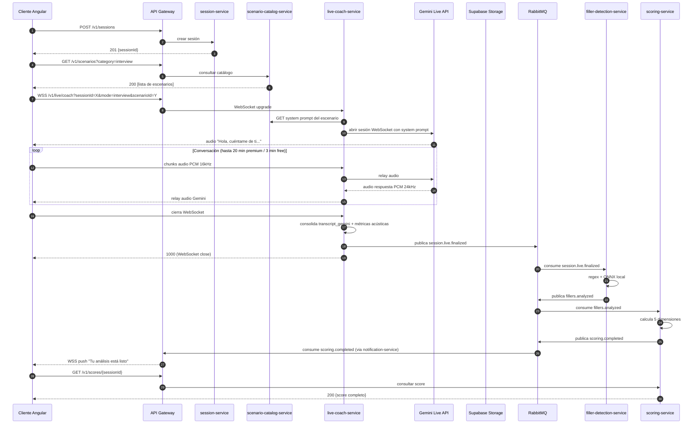
```mermaid
sequenceDiagram
    autonumber
    participant C as Cliente Angular
    participant GW as API Gateway
    participant SS as session-service
    participant SC as scenario-catalog-service
    participant LCS as live-coach-service
    participant GEM as Gemini Live API
    participant SUPA as Supabase Storage
    participant MQ as RabbitMQ
    participant FDS as filler-detection-service
    participant SCS as scoring-service

    C->>GW: POST /v1/sessions
    GW->>SS: crear sesión
    SS-->>C: 201 {sessionId}

    C->>GW: GET /v1/scenarios?category=interview
    GW->>SC: consultar catálogo
    SC-->>C: 200 [lista de escenarios]

    C->>GW: WSS /v1/live/coach?sessionId=X&mode=interview&scenarioId=Y
    GW->>LCS: WebSocket upgrade
    LCS->>SC: GET system prompt del escenario
    LCS->>GEM: abrir sesión WebSocket con system prompt
    GEM-->>C: audio "Hola, cuéntame de ti..."

    loop Conversación (hasta 20 min premium / 3 min free)
        C->>LCS: chunks audio PCM 16kHz
        LCS->>GEM: relay audio
        GEM-->>LCS: audio respuesta PCM 24kHz
        LCS-->>C: relay audio Gemini
    end

    C->>LCS: cierra WebSocket
    LCS->>LCS: consolida transcript_gemini + métricas acústicas
    LCS->>MQ: publica session.live.finalized
    LCS-->>C: 1000 (WebSocket close)

    MQ->>FDS: consume session.live.finalized
    FDS->>FDS: regex + ONNX local
    FDS->>MQ: publica fillers.analyzed

    MQ->>SCS: consume fillers.analyzed
    SCS->>SCS: calcula 5 dimensiones
    SCS->>MQ: publica scoring.completed

    MQ->>GW: consume scoring.completed (via notification-service)
    GW-->>C: WSS push "Tu análisis está listo"

    C->>GW: GET /v1/scores/{sessionId}
    GW->>SCS: consultar score
    SCS-->>C: 200 {score completo}
```

**Decision Log — Iteration 1:**

| ID | Decisión | Driver(s) | ADB | Estado |
|---|---|---|---|---|
| DD-01 | Event-Driven Architecture con RabbitMQ (coreografía saga): `live-coach-service` publica `session.live.finalized` y cada servicio del pipeline reacciona de forma asincrónica e independiente. | QAS-02, AC-02 | ADB-03, ADB-07 | Aceptada |
| DD-02 | Gemini Live API para la sesión de práctica en tiempo real: WebSocket nativo, audio bidireccional, ~600 ms de latencia, VAD, interrupciones naturales, function calling. | US12, QAS-01, AC-06 | ADB-01 | Aceptada |
| DD-03 | Circuit Breaker Resilience4j en `live-coach-service` (failureRate 40%, slidingWindow 20, wait 60 s) con fallback a modo scripted usando preguntas del catálogo. | QAS-03, QAS-08, AC-06 | ADB-12 | Aceptada |
| DD-04 | Supabase Storage (managed, free tier) en lugar de S3 o MinIO self-hosted para materiales del usuario (CV, plantillas) y exports. El audio de sesión no se persiste (DD-15 / ADB-22). | C-08, QAS-09, AC-08 | ADB-08 | Aceptada |
| DD-05 | Outbox Pattern en todos los servicios productores: persistir evento en tabla `outbox_events` en la misma transacción de negocio antes de publicar a RabbitMQ. | US14, AC-02 | ADB-09 | Aceptada |
| DD-06 | Coreografía Saga sin orquestador central: cada servicio escucha el evento de su predecesor y publica el siguiente. | US15, AC-02 | ADB-07 | Aceptada |
| DD-07 | Filler detection con regex español + modelo ONNX local en `filler-detection-service` sin dependencia de API externa. | QAS-07, AC-09 | ADB-04 | Aceptada |
| DD-08 | CQRS en `progress-service` con vistas materializadas pre-calculadas al consumir `scoring.completed`. | QAS-02 | ADB-06 | Aceptada |
| DD-09 | Rate Limiting centralizado en API Gateway con backend Upstash Redis: 100 req/min por IP, 10 intentos de login fallidos/hora. | QAS-05, QAS-09 | ADB-02 | Aceptada |
| DD-10 | URLs prefirmadas (TTL 5 min) emitidas por `media-service`; el cliente sube archivos directo a Supabase Storage sin pasar por el API Gateway. | C-08, QAS-09, AC-08 | ADB-08, ADB-11 | Aceptada |

**Kanban Board — Cierre Iteration 1:**

| Por hacer | En progreso | Hecho |
|---|---|---|
| — | — | ADB-01 — live-coach-service (proxy Gemini Live + métricas en memoria) |
| — | — | ADB-02 — session-service (CRUD + historial) |
| — | — | ADB-03 — Evento session.live.finalized |
| — | — | ADB-04 — filler-detection-service (regex + ONNX) |
| — | — | ADB-06 — scoring-service (Voice Coach Score 5D + Redis) |
| — | — | ADB-07 — Topología RabbitMQ (exchanges, queues, DLX) |
| — | — | ADB-08 — Supabase Storage (buckets + lifecycle) |
| — | — | ADB-09 — Outbox Pattern (tabla outbox_events) |
| — | — | ADB-10 — scenario-catalog-service (catálogo F10 + caché) |
| — | — | ADB-11 — media-service (presigned URLs) |
| — | — | ADB-12 — Circuit Breaker Gemini (fallback scripted) |

**Vista consolidada del sistema después de Iteration 1:**

| # | Elemento | Refinado | Drivers cubiertos |
|---|---|---|---|
| 1 | `live-coach-service` | Sí | US12, QAS-01, QAS-03, AC-06 |
| 2 | `session-service` | Sí | US09, US14, C-13 |
| 4 | `filler-detection-service` | Sí | US15, QAS-07, AC-09 |
| 5 | `scoring-service` | Sí | US15, US17, QAS-02 |
| 6 | `scenario-catalog-service` | Sí | US10, QAS-07, AC-01 |
| 7 | `media-service` | Sí | US16, C-08, AC-08 |
| 8 | RabbitMQ `talki.events` | Sí | US14, US15, AC-02 |
| 9 | Supabase Storage | Sí | C-08, QAS-09, AC-08 |
| 10 | Supabase PostgreSQL (schemas sesión/análisis) | Parcial | US14, C-03, P4 |
| 11 | Upstash Redis (rate limit + score cache) | Parcial | QAS-05, QAS-09 |
| 12 | `identity-service` | No — Iteration 2 | US05–US08, US28, QAS-05 |
| 13 | `notification-service` | No — Iteration 2 | US15, AC-04 |
| 14 | `progress-service` | No — Iteration 2 | US20–US22, QAS-09 |
| 15 | `gamification-service` | No — Iteration 2 | US18, US19 |

**Conclusión de la Iteration 1.** El flujo core de práctica queda habilitado de extremo a extremo: el usuario puede iniciar una sesión con Gemini Live, recibir retroalimentación en tiempo real y obtener su Voice Coach Score de forma asincrónica sin bloqueos. Los drivers QAS-01, QAS-02, QAS-03 y QAS-07 están cubiertos. La Iteration 2 abordará el ciclo de vida de la cuenta de usuario (identidad y seguridad), los servicios de engagement (progreso y gamificación), notificaciones push y la observabilidad transversal.

---

### 4.3.2. Iteration 2: Identidad, Seguridad, Engagement y Observabilidad

Aplicando el paso 8 del método ADD (*repetir pasos 2 a 7 en la siguiente iteración*), la Iteration 2 refina los bounded contexts de usuario, engagement y observabilidad que la Iteration 1 dejó pendientes. Esta iteración toma el sistema con el pipeline de análisis completo y agrega autenticación segura, progreso persistente, gamificación y trazabilidad distribuida.

#### 4.3.2.1. Architectural Design Backlog 2

| ID | Decisión de Diseño | Estado | Driver(s) Relacionados |
|---|---|---|---|
| ADB-13 | Definir contratos REST completos de `identity-service`: `POST /v1/auth/register`, `POST /v1/auth/login`, `POST /v1/auth/refresh`, `POST /v1/auth/logout`, `POST /v1/auth/reset-password`, `GET /v1/users/me`, `PUT /v1/users/me/profile`, `GET /.well-known/jwks.json`. | Hecho | US05, US06, US07, US08, US28, C-13 |
| ADB-14 | Implementar emisión de JWT firmados con RSA-256 (clave asimétrica) y publicar JWKS en `/.well-known/jwks.json` para que el API Gateway valide tokens sin llamar al `identity-service` en cada request. | Hecho | US06, QAS-05, C-14 |
| ADB-15 | Aplicar rotación de refresh tokens: cada uso genera uno nuevo y revoca el anterior; almacenamiento hasheado en tabla `refresh_tokens`; revocación total al logout. | Hecho | US28, QAS-05, C-14 |
| ADB-16 | Aplicar bcrypt (cost ≥ 12) para hashing de contraseñas con política mínima de longitud y composición. | Hecho | QAS-05, C-14 |
| ADB-17 | Publicar evento `user.registered` al finalizar el registro; `notification-service` lo consume para enviar email de bienvenida. | Hecho | US05, AC-04 |
| ADB-18 | Implementar `progress-service` con CQRS: consume `scoring.completed` y actualiza vistas materializadas en schema `progress`; expone endpoints de solo lectura para dashboard F9 y ruta adaptativa F7. | Hecho | US20, US21, US22, QAS-09 |
| ADB-19 | Implementar `gamification-service`: consume `scoring.completed`, actualiza streaks en Upstash Redis (Sorted Sets), evalúa logros, actualiza leaderboard semanal; publica `achievement.unlocked`. | Hecho | US18, US19 |
| ADB-20 | Implementar `notification-service`: consume `scoring.completed`, `achievement.unlocked` y `user.registered`; envía push por WebSocket persistente (`WSS /v1/notifications/stream`) y email como canal alternativo. | Hecho | US15, AC-04 |
| ADB-21 | Configurar Zipkin + Spring Sleuth para tracing distribuido end-to-end: cada request recibe un `Trace ID` único que se propaga en header `X-B3-TraceId` entre servicios REST y en el campo `trace_id` de los eventos RabbitMQ. | Hecho | QAS-11, AC-11, P6 |
| ADB-22 | El audio de sesión **no se persiste** en storage — Gemini Live genera la transcripción en tiempo real, eliminando la necesidad de almacenar audio. Esto cumple la Ley 29733 de forma nativa: nunca se graba un dato biométrico en reposo. | Hecho | AC-08, C-09 |

#### 4.3.2.2. Establish Iteration Goal by Selecting Drivers

**Iteration Goal:** Habilitar el ciclo de vida completo de la cuenta de usuario con garantías de seguridad (QAS-05, Ley 29733), incorporar los servicios de engagement (progreso, gamificación y notificaciones), y activar la observabilidad transversal del sistema con trazas distribuidas end-to-end (QAS-11).

| Tipo | ID | Justificación |
|---|---|---|
| User Stories | US05 | Registro de cuenta — bloqueante del MVP. |
| | US06 | Login con JWT — base para todo el sistema. |
| | US07 | Recuperación de contraseña. |
| | US08 | Edición de perfil con segmento académico. |
| | US28 | Cierre de sesión seguro con revocación de refresh token. |
| | US18, US19 | Gamificación: streaks y logros. |
| | US20–US22 | Dashboard de progreso y ruta adaptativa. |
| QAS | QAS-05 | Protección de credenciales: rate limiting, bcrypt, refresh rotation. |
| | QAS-11 | Diagnóstico de incidentes en ≤ 5 min con trace ID end-to-end. |
| Constraints | C-09 | Ley 29733 (protección de datos personales Perú). |
| | C-14 | JWT con refresh tokens rotativos y bcrypt cost ≥ 12. |
| | C-13 | API versionada bajo `/v1/`. |
| Concerns | AC-04 | Notificaciones push al usuario. |
| | AC-08 | Privacidad y datos sensibles (audio biométrico). |
| | AC-11 | Trazabilidad de decisiones / observabilidad del sistema. |

#### 4.3.2.3. Choose One or More Elements of the System to Refine

| Elemento | Tipo | Motivo del refinamiento |
|---|---|---|
| `identity-service` | Microservicio | Era inexistente en Iteration 1; se diseña completo con JWT RSA-256, JWKS, bcrypt, refresh rotation y eventos de dominio. |
| `notification-service` | Microservicio | Diferido en Iteration 1; se incorpora como consumidor final del pipeline (scoring, logros, registro). |
| `progress-service` | Microservicio | Diferido en Iteration 1; se incorpora con CQRS y vistas materializadas. |
| `gamification-service` | Microservicio | Diferido en Iteration 1; se incorpora con streaks, logros y leaderboard en Redis. |
| API Gateway | Edge component | Se conecta `AuthFilter` al JWKS del `identity-service`; se añade `RateLimitFilter` anti-brute-force. |
| Todos los servicios (cross-cutting) | Observabilidad | Se instrumenta Zipkin + Spring Sleuth en todos los contenedores. |
| Supabase Storage | Sistema managed | Se implementa la política de eliminación de audio post-transcripción (Ley 29733). |

#### 4.3.2.4. Choose One or More Design Concepts That Satisfy the Selected Drivers

| Driver | Concepto elegido | Alternativa descartada | Justificación |
|---|---|---|---|
| QAS-05, C-14 | **JWT RSA-256** (clave asimétrica) + **JWKS público** + **refresh token rotativo** con almacenamiento hasheado. | JWT HS256 (clave simétrica compartida) o sesiones server-side. | RSA-256 permite que el API Gateway valide tokens descargando la clave pública vía JWKS sin llamar al `identity-service` en cada request (P3 stateless). JWKS permite rotación de claves sin redeploy. |
| QAS-05, C-14 | **bcrypt cost ≥ 12** para hashing de contraseñas. | SHA-256 + sal o argon2. | SHA-256 con sal es vulnerable a fuerza bruta con GPU. bcrypt con cost 12 tarda ~200 ms por verificación, disuadiendo ataques. |
| QAS-05 | **Rate limiting anti-brute-force** en API Gateway: 100 req/min por IP + bloqueo temporal tras 10 intentos de login fallidos/hora. | Rate limiting solo por IP. | Atacantes con IP rotativa evaden el límite por IP; combinar con límite por cuenta cubre el escenario QAS-05. |
| QAS-09, US20 | **CQRS en `progress-service`** con vistas materializadas actualizadas al consumir `scoring.completed`. | Queries directas a tablas normalizadas con joins pesados. | El dashboard F9 agrega historial de sesiones; la vista materializada pre-calculada responde en < 50 ms. |
| US18, US19 | **Redis Sorted Sets** en `gamification-service` para streaks, leaderboard semanal y set de logros desbloqueados por usuario. | Tabla SQL para cada consulta de ranking. | Sorted Sets permiten ranking O(log N) sin queries SQL de agregación costosas; el leaderboard se actualiza en tiempo real. |
| AC-04, US15 | **WebSocket persistente** (`WSS /v1/notifications/stream`) en `notification-service` + email como canal de fallback. | Polling del cliente o Server-Sent Events. | WebSocket permite push en tiempo real cuando el análisis termina (puede ser minutos después de cerrar la sesión); email cubre el caso donde el usuario cerró la app. |
| QAS-11, P6 | **Zipkin + Spring Sleuth** para tracing distribuido: `Trace ID` propagado en header `X-B3-TraceId` (REST) y campo `trace_id` en payloads de eventos RabbitMQ. | OpenTelemetry con colector externo, Jaeger. | Spring Sleuth integra Zipkin de forma nativa en Spring Boot con configuración mínima. Permite trazar una sesión completa a través del pipeline asincrónico (REST + mensajería). |
| AC-08, C-09 | **No persistir el audio** — Gemini Live genera la transcripción en tiempo real; el audio nunca se almacena en reposo. | Guardar audio para STT posterior. | Cumplimiento nativo de Ley 29733 (dato biométrico nunca en reposo), eliminación de costo de storage y del servicio STT externo. |
| C-03, P4 | **Un usuario PostgreSQL por schema** de Supabase (ej. `identity_user`, `notifications_user`). | Usuario único con acceso total a todos los schemas. | Principio de mínimo privilegio: un servicio comprometido no puede leer datos de otros bounded contexts. |
| QAS-03 | **Dead Letter Exchange `talki.dlx`** en RabbitMQ para mensajes que fallan más de 3 veces. | Descartar mensajes tras N reintentos. | Permite reproceso manual o automático de mensajes críticos sin pérdida de datos; el equipo puede inspeccionar la DLQ ante un incidente. |

#### 4.3.2.5. Instantiate Architectural Elements, Allocate Responsibilities, and Define Interfaces

| Elemento | Responsabilidad | Interfaces |
|---|---|---|
| **`identity-service` :: AuthController** | Registro, login, refresh, logout, recuperación de contraseña. | Provee: `POST /v1/auth/{register,login,refresh,logout,reset-password}`. |
| **`identity-service` :: UserController** | Consultar y editar perfil del usuario autenticado. | Provee: `GET /v1/users/me`, `PUT /v1/users/me/profile`. |
| **`identity-service` :: JwtIssuer** | Firmar JWT con clave RSA privada; publicar clave pública en JWKS. | Provee: `GET /.well-known/jwks.json`. |
| **`identity-service` :: RefreshTokenStore** | Persistir refresh tokens hasheados con expiración y revocación. | Provee: `store`, `validate`, `revoke`, `revokeAllForUser`. |
| **`identity-service` :: PasswordHasher** | Hash y verificación bcrypt cost 12. | Provee: `hash(plaintext)`, `verify(plaintext, hash)`. |
| **`identity-service` :: UserEventPublisher** | Publicar `user.registered` al bus cuando se completa el registro. | Publica: `user.registered`. |
| **`progress-service` :: ScoringConsumer** | Consume `scoring.completed`; actualiza vistas materializadas en schema `progress` (CQRS write side). | Consume: RabbitMQ queue `progress.score-ready`. |
| **`progress-service` :: ProgressController** | Exponer vistas materializadas pre-calculadas para dashboard F9 y ruta adaptativa F7 (CQRS read side). | Provee: `GET /v1/progress/dashboard`, `GET /v1/progress/timeline`, `GET /v1/progress/compare?s1=&s2=`. |
| **`gamification-service` :: ScoringConsumer** | Consume `scoring.completed`; actualiza streak en Redis, evalúa logros, actualiza leaderboard; publica `achievement.unlocked`. | Consume: RabbitMQ queue `gamification.score-ready`. Publica: `achievement.unlocked`. |
| **`gamification-service` :: GamificationController** | Exponer streaks, logros y leaderboard semanal. | Provee: `GET /v1/gamification/streaks/{userId}`, `GET /v1/gamification/achievements/{userId}`, `GET /v1/gamification/leaderboard`. |
| **`notification-service` :: MultiConsumer** | Consume `scoring.completed`, `achievement.unlocked` y `user.registered`; envía push por WebSocket y email alternativo. | Consume: queues `notification.{score-ready,achievement-ready,welcome-ready}`. |
| **`notification-service` :: NotificationController** | WebSocket persistente push; historial de notificaciones; marcar como leído. | Provee: `WSS /v1/notifications/stream`, `GET /v1/notifications/{userId}`, `PUT /v1/notifications/{id}/read`. |
| **`api-gateway` :: AuthFilter (refinado)** | Descargar JWKS del `identity-service`; validar JWT en cada request sin llamar al servicio en caliente. | Consume: `GET /.well-known/jwks.json` (cached). |

**Contratos REST clave — `identity-service`:**

```http
POST /v1/auth/login
Content-Type: application/json

{ "email": "valeria@upc.edu.pe", "password": "********" }

200 OK
{
  "access_token": "<JWT RSA-256, TTL 15 min>",
  "refresh_token": "<opaque, TTL 7 días, rotativo>",
  "token_type": "Bearer"
}
```

```http
POST /v1/auth/refresh
Content-Type: application/json

{ "refresh_token": "<token previo>" }

200 OK
{
  "access_token": "<nuevo JWT>",
  "refresh_token": "<nuevo refresh — el anterior queda revocado>"
}
```

#### 4.3.2.6. Sketch Views and Record Design Decisions

**Vista C4 Nivel 3 — `identity-service`:**

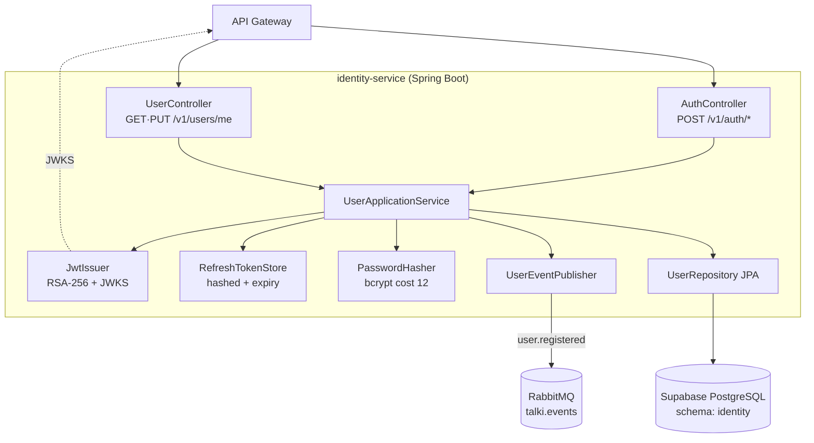
```mermaid
flowchart TB
    GW[API Gateway] --> AC[AuthController\nPOST /v1/auth/*]
    GW --> UC[UserController\nGET·PUT /v1/users/me]

    subgraph IS["identity-service (Spring Boot)"]
        AC --> UAS[UserApplicationService]
        UC --> UAS
        UAS --> JI[JwtIssuer\nRSA-256 + JWKS]
        UAS --> RTS[RefreshTokenStore\nhashed + expiry]
        UAS --> PH[PasswordHasher\nbcrypt cost 12]
        UAS --> PEP[UserEventPublisher]
        UAS --> UR[UserRepository JPA]
    end

    PEP -->|user.registered| MQ[(RabbitMQ\ntalki.events)]
    JI -.->|JWKS| GW
    UR --> DB[(Supabase PostgreSQL\nschema: identity)]
```

**Vista UML Secuencia — Login con rotación de refresh token:**

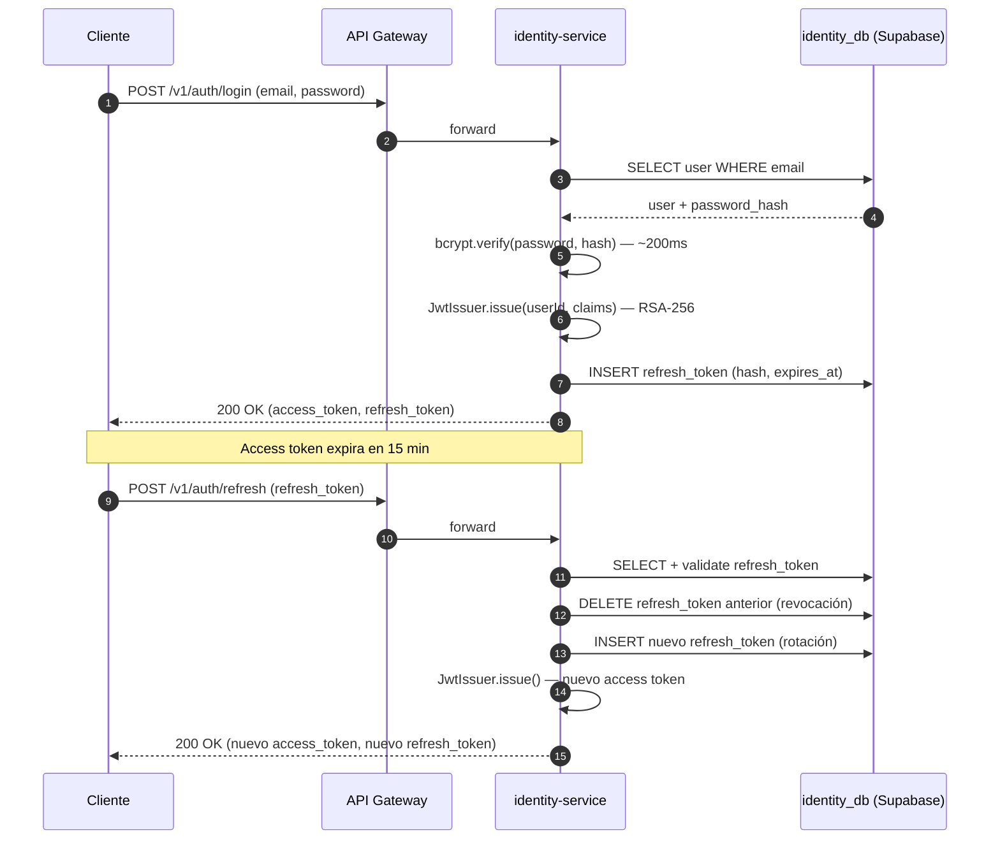
```mermaid
sequenceDiagram
    autonumber
    participant C as Cliente
    participant GW as API Gateway
    participant IS as identity-service
    participant DB as identity_db (Supabase)

    C->>GW: POST /v1/auth/login (email, password)
    GW->>IS: forward
    IS->>DB: SELECT user WHERE email
    DB-->>IS: user + password_hash
    IS->>IS: bcrypt.verify(password, hash) — ~200ms
    IS->>IS: JwtIssuer.issue(userId, claims) — RSA-256
    IS->>DB: INSERT refresh_token (hash, expires_at)
    IS-->>C: 200 OK (access_token, refresh_token)

    Note over C,IS: Access token expira en 15 min
    C->>GW: POST /v1/auth/refresh (refresh_token)
    GW->>IS: forward
    IS->>DB: SELECT + validate refresh_token
    IS->>DB: DELETE refresh_token anterior (revocación)
    IS->>DB: INSERT nuevo refresh_token (rotación)
    IS->>IS: JwtIssuer.issue() — nuevo access token
    IS-->>C: 200 OK (nuevo access_token, nuevo refresh_token)
```

**Vista UML Secuencia — Pipeline de engagement post-análisis:**

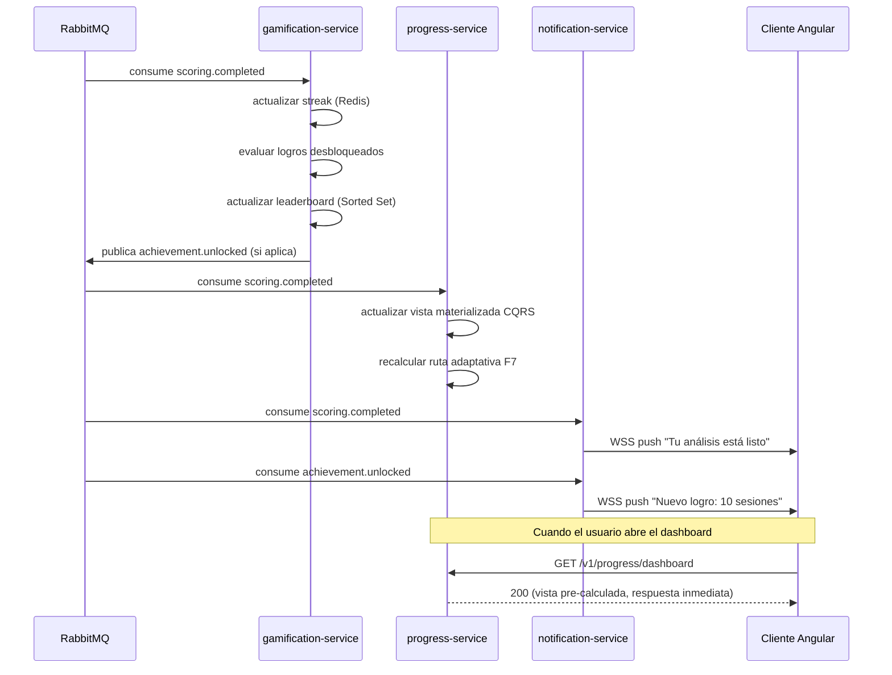
```mermaid
sequenceDiagram
    participant MQ as RabbitMQ
    participant GS as gamification-service
    participant PS as progress-service
    participant NS as notification-service
    participant C as Cliente Angular

    MQ->>GS: consume scoring.completed
    GS->>GS: actualizar streak (Redis)
    GS->>GS: evaluar logros desbloqueados
    GS->>GS: actualizar leaderboard (Sorted Set)
    GS->>MQ: publica achievement.unlocked (si aplica)

    MQ->>PS: consume scoring.completed
    PS->>PS: actualizar vista materializada CQRS
    PS->>PS: recalcular ruta adaptativa F7

    MQ->>NS: consume scoring.completed
    NS->>C: WSS push "Tu análisis está listo"

    MQ->>NS: consume achievement.unlocked
    NS->>C: WSS push "Nuevo logro: 10 sesiones"

    Note over C,PS: Cuando el usuario abre el dashboard
    C->>PS: GET /v1/progress/dashboard
    PS-->>C: 200 (vista pre-calculada, respuesta inmediata)
```

**Decision Log — Iteration 2:**

| ID | Decisión | Driver(s) | ADB | Estado |
|---|---|---|---|---|
| DD-11 | JWT RSA-256 asimétrico + JWKS público: el API Gateway valida tokens sin llamar al `identity-service` en cada request. | QAS-05, C-14 | ADB-14 | Aceptada |
| DD-12 | Refresh Token Rotation: cada uso genera un token nuevo y revoca el anterior; almacenamiento hasheado en BD. | QAS-05, C-14, US28 | ADB-15 | Aceptada |
| DD-13 | Zipkin + Spring Sleuth para distributed tracing: Trace ID propagado en `X-B3-TraceId` (HTTP) y campo `trace_id` (RabbitMQ). | QAS-11, P6 | ADB-21 | Aceptada |
| DD-14 | Trace ID embebido en el payload de todos los eventos RabbitMQ para trazar el pipeline asincrónico completo. | QAS-11, AC-11 | ADB-21 | Aceptada |
| DD-15 | El audio de sesión nunca se persiste en storage. Gemini Live entrega el `transcript_gemini` en tiempo real durante la sesión y `live-coach-service` calcula las métricas acústicas (WPM, silenceRatio, volumeRmsAvg) en memoria; al cerrar la sesión, los chunks de audio se descartan. Cumple la Ley 29733 *by-design* (dato biométrico nunca en reposo). | AC-08, C-09 | ADB-22 | Aceptada |
| DD-16 | Un usuario PostgreSQL por schema de Supabase (principio de mínimo privilegio). | C-03, P4 | ADB-13 | Aceptada |
| DD-17 | Dead Letter Exchange `talki.dlx` para mensajes que fallan más de 3 veces; permite reproceso manual. | QAS-03 | ADB-07 | Aceptada |
| DD-18 | Redis Sorted Sets en `gamification-service` para streaks, leaderboard semanal y set de logros (respuesta O(log N) sin queries SQL de agregación). | US18, US19 | ADB-19 | Aceptada |

#### 4.3.2.7. Analysis of Current Design and Review Iteration Goal (Kanban Board)

| Por hacer | En progreso | Hecho |
|---|---|---|
| — | — | ADB-13 — identity-service (contratos REST completos) |
| — | — | ADB-14 — JWT RSA-256 + JWKS |
| — | — | ADB-15 — Refresh Token Rotation |
| — | — | ADB-16 — bcrypt cost 12 |
| — | — | ADB-17 — user.registered → notification-service |
| — | — | ADB-18 — progress-service (CQRS + vistas materializadas) |
| — | — | ADB-19 — gamification-service (Redis Sorted Sets) |
| — | — | ADB-20 — notification-service (WSS push + email) |
| — | — | ADB-21 — Zipkin + Spring Sleuth (tracing distribuido) |
| — | — | ADB-22 — Lifecycle audio Supabase (Ley 29733) |

**Análisis del cumplimiento del Iteration Goal:**

| Driver | Estado | Evidencia |
|---|---|---|
| US05, US06, US07, US08, US28 | Cubierto | Contratos REST definidos, JWT RSA-256, bcrypt, refresh rotation, JWKS. |
| US18, US19 | Cubierto | gamification-service con Redis Sorted Sets, streaks, logros y leaderboard. |
| US20–US22 | Cubierto | progress-service con CQRS y vistas materializadas para F9 y F7. |
| QAS-05 | Cubierto | bcrypt + rate limiting + JWT TTL corto + revocación de refresh tokens. |
| QAS-11 | Cubierto | Zipkin + Spring Sleuth con Trace ID en HTTP y eventos RabbitMQ. |
| C-09, AC-08 | Cubierto | Eliminación de audio post-transcripción (Ley 29733). |
| C-14 | Cubierto | JWT RSA-256 + refresh tokens rotativos + bcrypt cost 12. |

**Vista consolidada del sistema tras Iteration 2 (arquitectura final):**

| # | Elemento | Estado |
|---|---|---|
| 1 | `api-gateway` (Spring Cloud Gateway) | Completo |
| 2 | `config-server` (Spring Cloud Config) | Completo |
| 3 | `identity-service` | Completo |
| 4 | `session-service` | Completo |
| 5 | `live-coach-service` | Completo |
| 6 | `scenario-catalog-service` | Diferido al sprint siguiente |
| 7 | `media-service` | Diferido al sprint siguiente |
| 8 | `filler-detection-service` | Completo |
| 9 | `scoring-service` | Completo |
| 10 | `progress-service` | Completo |
| 11 | `gamification-service` | Completo |
| 12 | `notification-service` | Completo |
| 13 | RabbitMQ (exchange `talki.events` + DLX `talki.dlx`) | Completo |

**Conclusión de la Iteration 2.** Esta iteración cierra el diseño arquitectónico completo del sistema Talki con 10 microservicios de negocio + 3 de infraestructura. El ciclo de vida del usuario queda habilitado de extremo a extremo: registro seguro → práctica con IA → análisis asincrónico → feedback con score → progreso y gamificación → notificaciones push. Los 8 principios arquitectónicos declarados en la sección 4.1 quedan trazados a decisiones de diseño explícitas (DD-01 a DD-18). La observabilidad transversal (Zipkin + Spring Sleuth para trazas distribuidas, Spring Boot Actuator para métricas) permite diagnóstico de incidentes en ≤ 5 min (QAS-11). El cumplimiento de la Ley 29733 queda garantizado de forma nativa: el audio biométrico nunca se persiste, ya que Gemini Live entrega el `transcript_gemini` en tiempo real (DD-15, ADB-22).


<div style="page-break-after: always;"></div>

# Capítulo V: Product Implementation, Validation & Deployment

## 5.1. Testing Suites & General Patterns

### 5.1.1. Backend Application Core Testing Suite

El proyecto Talki constituye un conjunto integral de pruebas diseñadas para garantizar la estabilidad, fiabilidad y correcto funcionamiento de los componentes centrales de la aplicación. Esta suite abarca pruebas unitarias, de integración y de comportamiento que validan desde la lógica de negocio encapsulada en los servicios hasta la correcta interacción con capas como los repositorios y controladores REST. Utilizando herramientas como **JUnit 5**, **Mockito** y **Spring Boot Test**, se asegura que cada componente del backend funcione de manera aislada y conjunta conforme a los requisitos definidos. Esta estrategia de pruebas favorece una detección temprana de errores, facilita la refactorización segura del código y fortalece la mantenibilidad del sistema, lo que es esencial para el desarrollo ágil y continuo de software de calidad.

La estrategia de pruebas sigue la **pirámide de testing** adaptada a una arquitectura de microservicios Spring Boot, con niveles diferenciados que equilibran velocidad de ejecución, cobertura y confianza en el sistema desplegado.

#### Nivel 1 — Pruebas unitarias (Unit Tests)

Cubren la lógica de negocio pura de cada servicio de forma aislada, sin levantar el contexto de Spring ni dependencias externas. Son la base de la pirámide y deben ejecutarse en todo pipeline de CI.

| Servicio | Clases bajo prueba | Framework | Objetivo de cobertura |
|---|---|---|---|
| `live-coach-service` | `LiveCoachOrchestrator`, `SessionModeStrategyFactory`, `QuickPracticeStrategy`, `InterviewStrategy`, `ThesisDefenseStrategy`, `ScenarioStrategy` | JUnit 5 + Mockito | ≥ 80 % de líneas en capa de dominio (QAS-10) |
| `session-service` | `SessionCommandServiceImpl`, `SessionQueryServiceImpl` | JUnit 5 + Mockito | ≥ 75 % de líneas |
| `identity-service` | `AuthService`, `JwtTokenProvider` | JUnit 5 + Mockito | ≥ 75 % de líneas |
| `scoring-service` | `ScoreCalculator`, `VoiceScore`, `FillerAnalyzedConsumer` | JUnit 5 + Mockito | ≥ 75 % de líneas |
| `progress-service` | `UserProgress`, `ScoringCompletedConsumer` | JUnit 5 + Mockito | ≥ 75 % de líneas |
| `gamification-service` | `UserStreak`, `ScoringCompletedConsumer` | JUnit 5 + Mockito | ≥ 75 % de líneas |
| `notification-service` | `ScoreNotificationConsumer`, `AchievementNotificationConsumer` | JUnit 5 + Mockito | ≥ 75 % de líneas |

Los clientes de servicios externos (Gemini Live API) son interfaces inyectadas por constructor y se sustituyen por dobles de prueba (`Mockito.mock`) que retornan respuestas predefinidas, garantizando ejecuciones deterministas en menos de 60 segundos (QAS-10).

**Convenciones de nomenclatura:**
```
<ClaseBajoPrueba>Test
  └── <método>_when<Condición>_should<Resultado>()
```

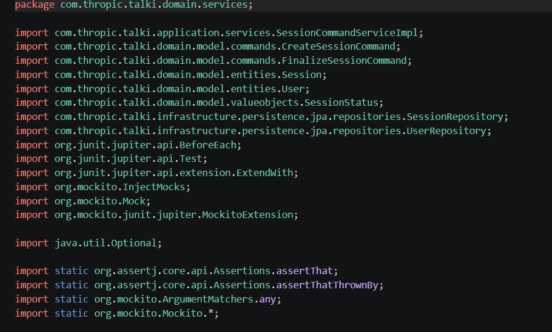
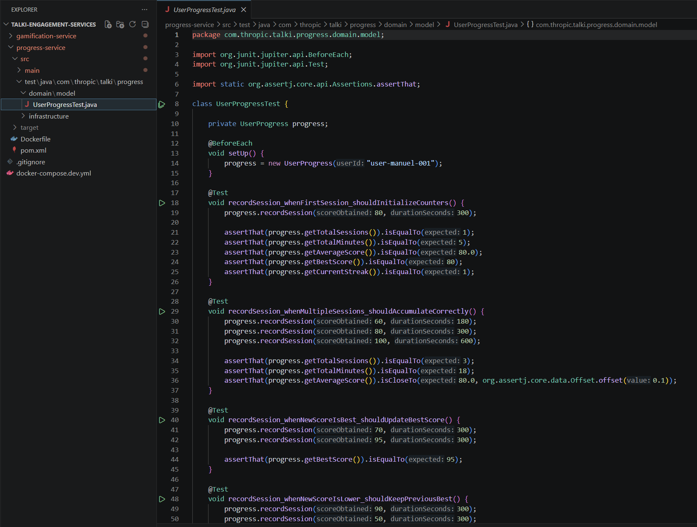
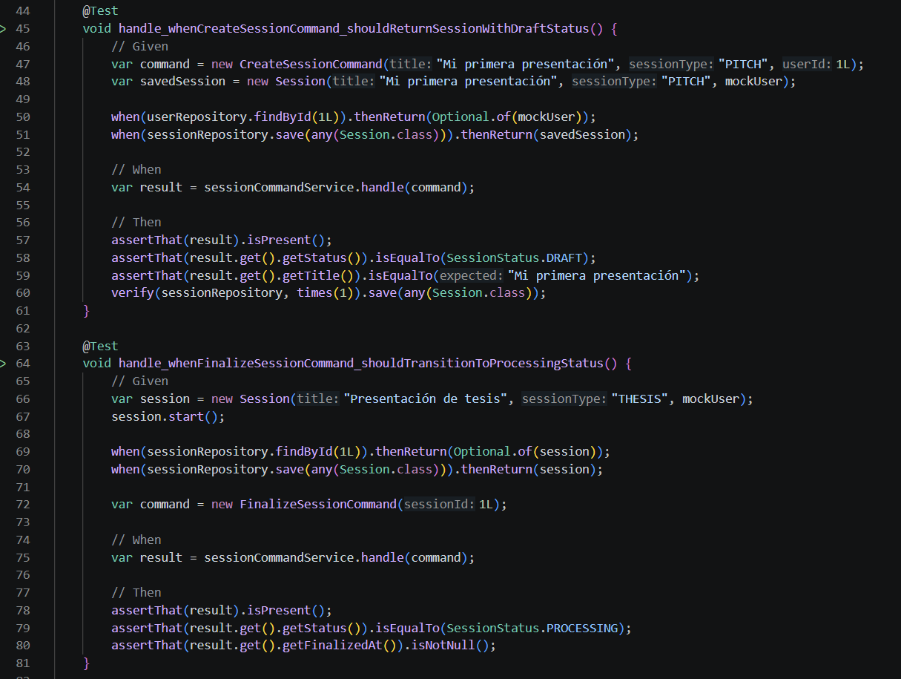
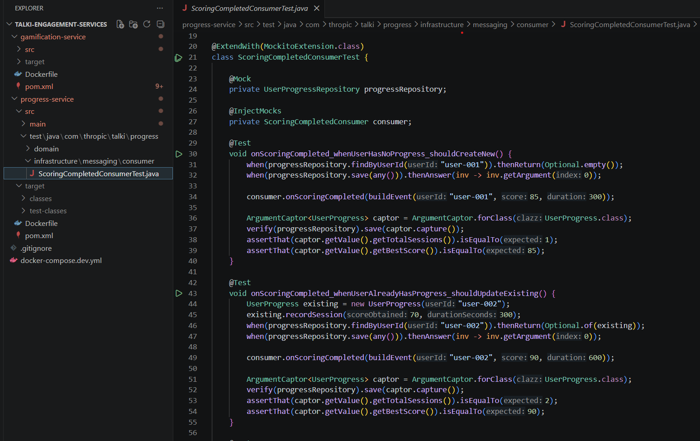

#### Nivel 2 — Pruebas de integración (Integration Tests)

Verifican la interacción entre la lógica de aplicación y la infraestructura real (base de datos, bus de mensajes). Se levanta un contenedor Docker efímero mediante **Testcontainers** para cada suite de integración.

| Servicio | Infraestructura levantada | Qué se verifica |
|---|---|---|
| `session-service` | PostgreSQL 15 (Testcontainers) | Persistencia de agregado `Session`, consultas JPA y transacciones |
| `filler-detection-service` | PostgreSQL 15 + RabbitMQ 3 (Testcontainers) | Consumo de `session.live.finalized` con `transcript_gemini`, detección regex + ONNX y publicación de `fillers.analyzed` |
| `scoring-service` | PostgreSQL 15 + Redis (Testcontainers) | Consumo de `fillers.analyzed`, cálculo de 5 dimensiones y caché en Upstash Redis |
| `identity-service` | PostgreSQL 15 (Testcontainers) | Registro, login, refresh token y revocación |
| `progress-service` | PostgreSQL 15 (Testcontainers) | Proyección CQRS: escritura de vista materializada al consumir `scoring.completed` |

Las pruebas de integración usan la anotación `@SpringBootTest(webEnvironment = RANDOM_PORT)` con `@ActiveProfiles("test")` para cargar un `application-test.yml` que apunta al contenedor efímero en lugar de la base de datos de producción.

#### Nivel 3 — Pruebas BDD (Behavior-Driven Development)

Los criterios de aceptación de las User Stories del Capítulo III están formulados en sintaxis **Given-When-Then**. Se convierten en pruebas ejecutables usando **Cucumber 7** con los steps definidos en Java, conectado a un contexto Spring de prueba.

Cada feature file cubre un User Story primario y se almacena en `src/test/resources/features/`:

```gherkin
# features/session/finalize-session.feature
Feature: Finalizar sesión de práctica (US14)

  Scenario: Finalización exitosa con transcripción de Gemini y evento publicado
    Given un estudiante autenticado con sesión activa "session-001"
    When el live-coach-service cierra el WebSocket de Gemini Live
    Then se calculan las métricas acústicas en memoria (WPM, silence_ratio, volume_rms_avg)
    And se publica el evento "session.live.finalized" en RabbitMQ con el transcript_gemini
    And la sesión queda en estado "PROCESSING"

  Scenario: Finalización cuando el filler-detection-service falla tras 3 reintentos
    Given un estudiante autenticado con sesión activa "session-002"
    And el filler-detection-service falla con excepción en el tercer reintento
    When el evento "session.live.finalized" es procesado
    Then el mensaje pasa a la Dead Letter Queue "talki.dlx"
    And la sesión queda en estado "ANALYSIS_PENDING"
```

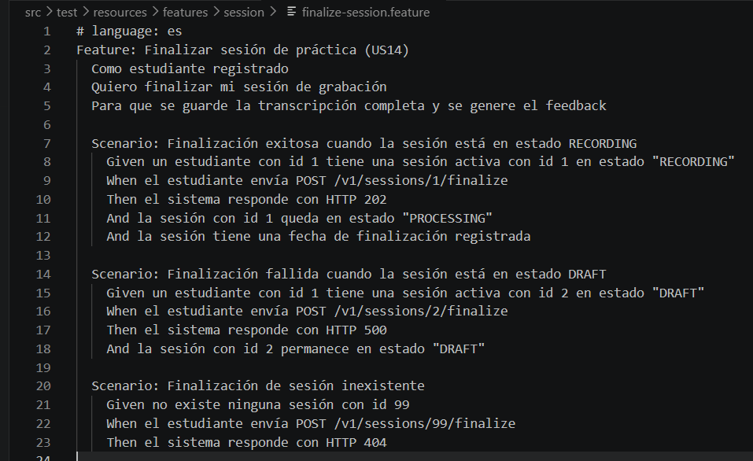

#### Nivel 4 — Pruebas de contrato (Consumer-Driven Contract Tests)

Se definen contratos **Pact** entre consumidores y proveedores de API para detectar regresiones de contrato antes del despliegue (táctica declarada en 4.1.7):

| Consumidor | Proveedor | Contratos verificados |
|---|---|---|
| Angular SPA | API Gateway | Endpoints `/v1/sessions`, `/v1/auth`, `/v1/progress`, `/v1/scores`, `/v1/gamification` |
| `filler-detection-service` | `live-coach-service` | Evento `session.live.finalized` con `transcript_gemini` (esquema AMQP) |
| `scoring-service` | `filler-detection-service` | Evento `fillers.analyzed` (esquema AMQP) |
| `progress-service` | `scoring-service` | Evento `scoring.completed` (esquema AMQP) |
| `notification-service` | `gamification-service` | Evento `achievement.unlocked` (esquema AMQP) |

Los contratos Pact se publican en un **Pact Broker** y el pipeline de CI verifica la compatibilidad en cada build antes de hacer merge a `main`.

---

### 5.1.2. Pattern Based Backend Application(s)

Esta sección documenta cómo los patrones de diseño arquitectónico y de comportamiento declarados en la sección 4.1.6 se materializan en la estructura de código de cada microservicio Spring Boot.

> _**Nota sobre evidencias visuales.** Las capturas de pantalla del código de cada patrón (repositorios, fachadas ACL, servicios CQRS, entidades JPA, refactors RF-01 a RF-05) se incorporarán en el sprint de evidencia correspondiente al entregable TB3. El código referenciado ya está implementado y verificado en los repos `talki-user-services`, `talki-session-services`, `talki-analysis-services` y `talki-engagement-services` bajo la organización `upc-pre-202601-si657-7940-thropic`, con 123 unit tests pasando._

#### Estructura de paquetes por microservicio

Todos los microservicios de Talki siguen una estructura de paquetes homogénea derivada de la **arquitectura hexagonal** (Ports & Adapters), adaptada a las convenciones de Spring Boot:

```
com.thropic.talki.<service>/
├── domain/
│   ├── model/          # Entidades, Value Objects y Agregados DDD
│   ├── event/          # Domain Events (POJO serializables)
│   ├── port/
│   │   ├── in/         # Casos de uso (interfaces de entrada)
│   │   └── out/        # Repositorios e interfaces de salida
│   └── service/        # Lógica de dominio pura (sin framework)
├── application/
│   └── service/        # Orquestadores: implementan puertos de entrada
├── infrastructure/
│   ├── adapter/
│   │   ├── web/        # @RestController (adaptadores primarios)
│   │   ├── persistence/# @Repository JPA (adaptadores secundarios)
│   │   └── messaging/  # Listeners y publishers RabbitMQ
│   └── config/         # @Configuration beans de Spring
└── shared/
    └── dto/            # DTOs de entrada y salida de la API
```

**- Patrón Repository:** Crea una capa de abstracción entre la lógica de negocio de la aplicación y el mecanismo de almacenamiento de datos. Cada microservicio accede a su base de datos exclusivamente a través de interfaces de repositorio (`AppUserRepository` en `identity-service`, `SessionRepository` y `FeedbackRepository` en `session-service`, `ScoreResultRepository` en `scoring-service`). Las implementaciones JPA son intercambiables en pruebas y la lógica de negocio no contiene código SQL directo.

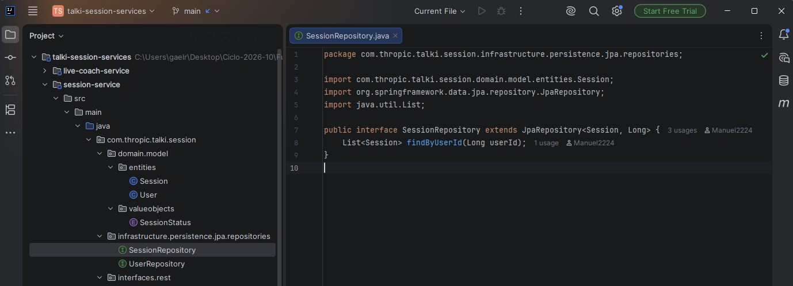

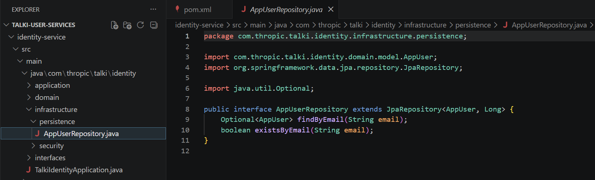

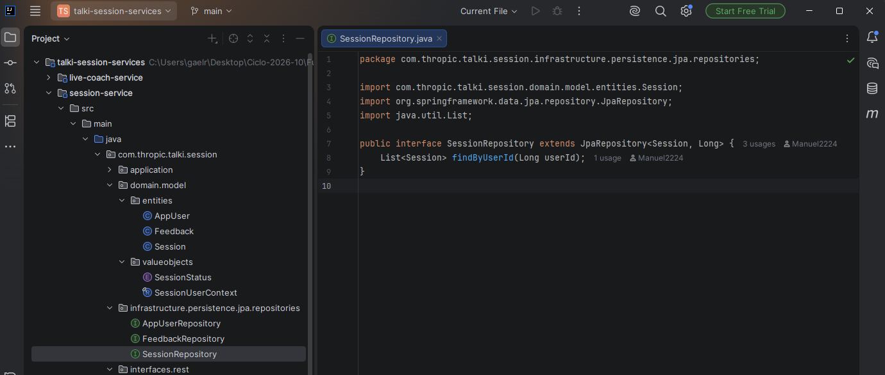

**- Patrón ACL (Anti-Corruption Layer):** Implementa una capa de fachada entre diferentes bounded contexts que no comparten la misma semántica. Se encarga de traducir las solicitudes de un subsistema a otro sin exponer los modelos internos de dominio. En Talki, la clase `SessionContextFacade` actúa como ACL entre el `session-service` y los servicios externos (`progress-service`, `notification-service`).

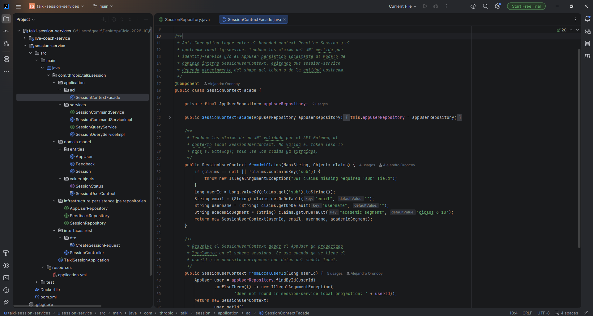

**- Patrón CQRS:** Divide las operaciones del sistema en dos modelos distintos: uno para las consultas (lectura de datos) y otro para los comandos (escritura, actualización y eliminación de datos). En Talki, `SessionCommandService` gestiona las operaciones de creación y finalización de sesiones, mientras que `SessionQueryService` maneja exclusivamente las lecturas.

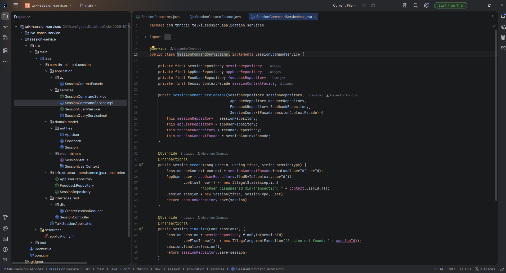

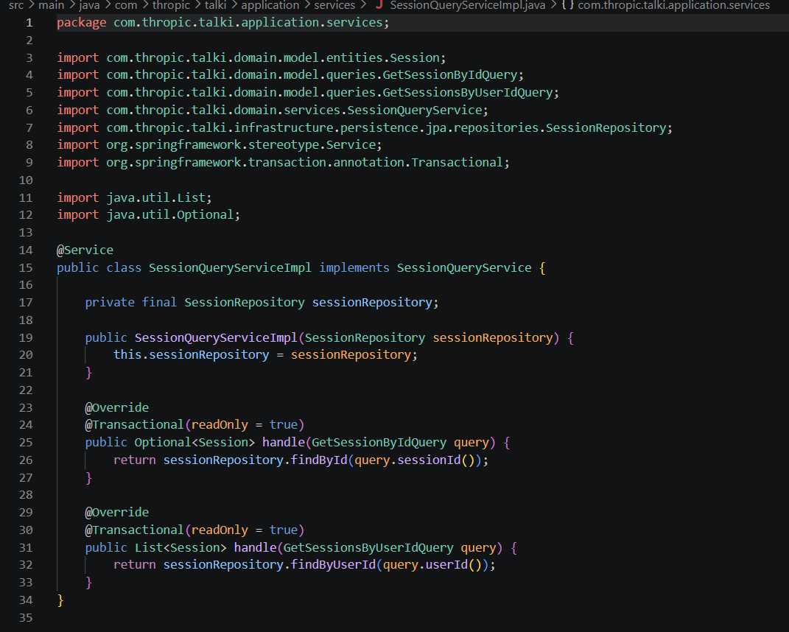

**- Patrón DTO (Data Transfer Object):** Usado para encapsular un conjunto de datos de modo que puedan ser transferidos entre procesos o capas de la aplicación, como por ejemplo desde las peticiones de la capa de presentación hacia la capa de dominio. En Talki se utilizan `CreateSessionRequest` como DTO de entrada y los endpoints del `SessionController` devuelven la entidad `Session` como respuesta JSON.

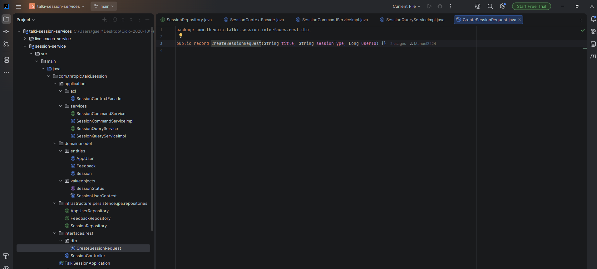

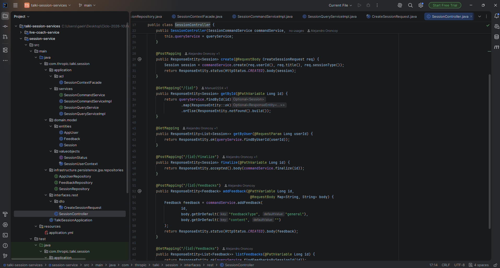

#### Patrón Strategy — `live-coach-service`

El modo de sesión determina en tiempo de ejecución qué system prompt se carga para Gemini Live y cómo se configura la conversación:

```
SessionModeStrategy (interface, dominio)
├── QuickPracticeStrategy    → coach silencioso, feedback al final
├── InterviewStrategy        → reclutador de empresa, 5 preguntas progresivas
├── ThesisDefenseStrategy    → jurado académico, 3 preguntas metodológicas
└── ScenarioStrategy         → rol definido en el catálogo de escenarios peruanos

SessionModeStrategyFactory → instancia la estrategia según el parámetro `mode`
LiveCoachOrchestrator      → delega en la estrategia; no conoce sus detalles internos
```
Permite agregar un nuevo modo de práctica (e.g. `PresentationStrategy`) sin modificar el orquestador ni los demás servicios (Open/Closed Principle, QAS-07).

#### Patrón Saga por coreografía — flujo de sesión finalizada

El flujo `session.live.finalized → fillers.analyzed → scoring.completed → [progress + gamification + notificación]` se implementa como una **Saga de coreografía** sobre el exchange `talki.events` de RabbitMQ:

```
live-coach-service         → publica session.live.finalized con transcript_gemini
                             y métricas acústicas calculadas en memoria
  filler-detection-service → consume session.live.finalized, aplica regex + ONNX
                             sobre transcript_gemini, publica fillers.analyzed
  scoring-service          → consume fillers.analyzed, calcula 5 dimensiones,
                             publica scoring.completed
  progress-service         → consume scoring.completed → actualiza vista CQRS
  gamification-service     → consume scoring.completed → evalúa streaks y logros,
                             publica achievement.unlocked (si aplica)
  notification-service     → consume scoring.completed y achievement.unlocked,
                             envía push por WebSocket al cliente Angular
```

Cada servicio es idempotente: reintenta el procesamiento del mismo evento hasta tres veces con backoff exponencial antes de enviarlo a la **Dead Letter Exchange (talki.dlx)** para inspección manual.

---

### 5.1.3. Pattern Based Custom Software Library

Talki centraliza el código compartido entre microservicios en el módulo Maven interno **`talki-commons`**, publicado en el repositorio de paquetes de GitHub (`packages.github.com/upc-pre-202601-si657-7940-thropic`). Los microservicios lo declaran como dependencia en su `pom.xml`. Esta librería aplica los siguientes patrones del framework Spring:

**- Factory Method:** En Spring, la configuración y la creación de instancias de objetos se realizan mediante las anotaciones `@Bean` y `@Component`. Esto permite utilizar el patrón Factory Method para crear instancias de objetos de manera flexible y desacoplada. Cada microservicio expone una clase `@Configuration` que centraliza la creación de sus beans de infraestructura (clientes de RabbitMQ, configuración de seguridad, fachadas ACL, propiedades externalizadas).

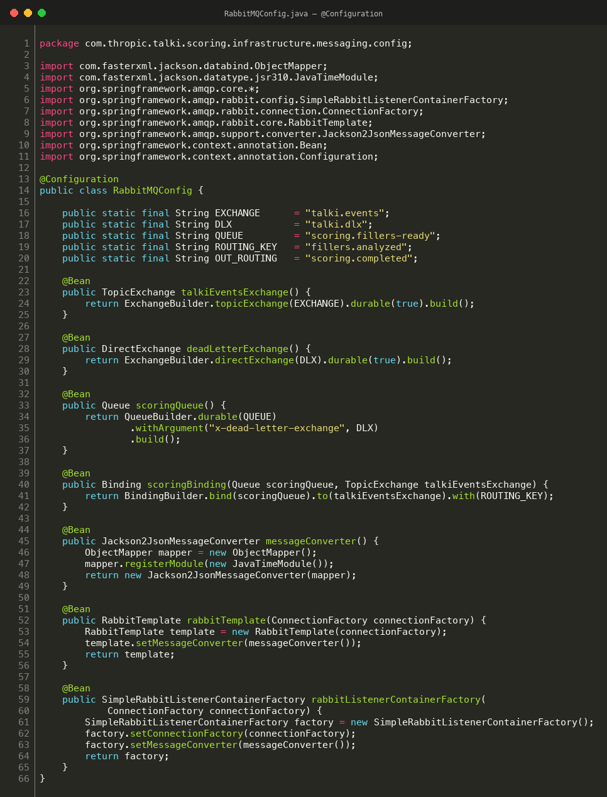

**- JPA Entity Field:** El patrón de diseño JPA Entity se emplea para representar objetos de dominio en una base de datos relacional, utilizando la anotación `@Entity`. En Talki, las clases `AppUser` (en `identity-service`), `Session` y `Feedback` (en `session-service`) y `ScoreResult` (en `scoring-service`) son entidades JPA que mapean directamente a tablas en PostgreSQL, con sus campos anotados con `@Column`, `@Id` y `@GeneratedValue`. Cada entidad reside en el schema del bounded context al que pertenece (database-per-service).


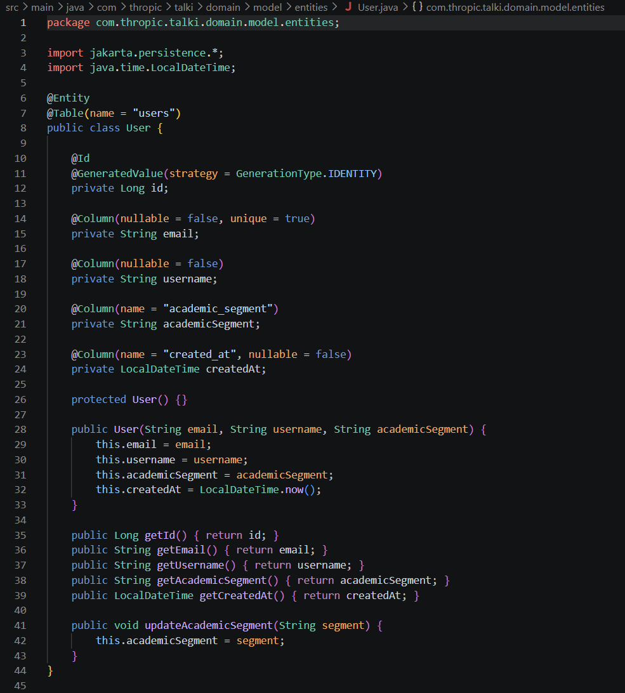

**- Foreign Key Mapping:** En Spring Data JPA, este concepto implica mapear las relaciones entre entidades **dentro del mismo bounded context** mediante anotaciones como `@ManyToOne` y `@OneToMany`. En Talki, la entidad `Session` tiene una relación `@OneToMany` hacia `Feedback` dentro del mismo schema del `session-service` (una sesión puede tener múltiples feedbacks intra-BC). Las correlaciones entre bounded contexts (por ejemplo, `Session` ↔ `ScoreResult` en `scoring-service`) **no** se modelan con JPA: se realizan por `session_id` propagado en los eventos del exchange `talki.events`, respetando el patrón *database-per-service*.


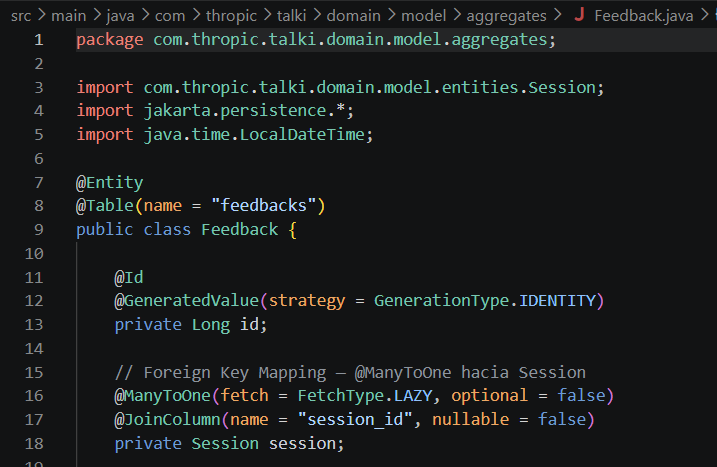

**- Data Mapper:** Este patrón se encarga de la transferencia de datos entre objetos y la base de datos, asegurando la independencia entre ambos, mediante el uso de **Hibernate ORM**. Spring Data JPA abstrae el acceso a datos y Hibernate actúa como Data Mapper, convirtiendo automáticamente las entidades Java en registros de base de datos y viceversa, sin que el código de dominio conozca los detalles de persistencia.

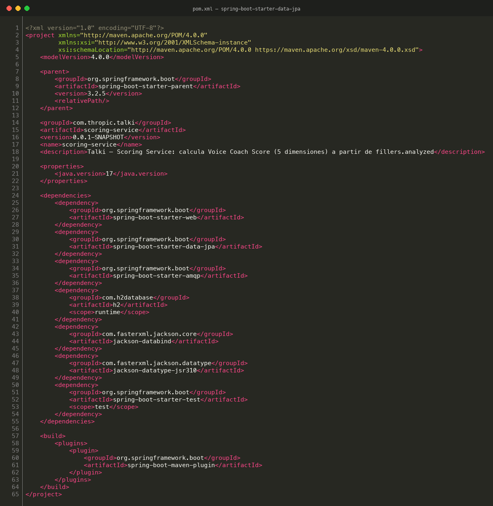

#### Contenido del módulo `talki-commons`

| Paquete | Clases / Interfaces | Propósito |
|---|---|---|
| `com.thropic.talki.commons.event` | `SessionLiveFinalizedEvent`, `FillerAnalyzedEvent`, `ScoringCompletedEvent`, `AchievementUnlockedEvent`, `UserRegisteredEvent` | Contratos de eventos de dominio compartidos entre productor y consumidor. Garantizan que el esquema del exchange `talki.events` sea idéntico en ambos extremos. |
| `com.thropic.talki.commons.dto` | `ApiErrorResponse`, `PagedResponse<T>` | DTOs estándar de respuesta de error y paginación para todos los endpoints REST. |
| `com.thropic.talki.commons.security` | `JwtClaimsExtractor`, `ServiceTokenValidator` | Utilidades para extraer claims del JWT RSA-256 y validar tokens de servicio en comunicaciones internas. |
| `com.thropic.talki.commons.exception` | `DomainException`, `ResourceNotFoundException`, `ConflictException` | Jerarquía de excepciones de dominio con sus códigos de error estandarizados. |
| `com.thropic.talki.commons.messaging` | `RabbitMqConfig` (abstracta), `DeadLetterQueueConfig`, `OutboxPoller` | Configuración base del exchange `talki.events` (topic, durable), DLX `talki.dlx` y el poller del patrón Outbox que garantiza entrega at-least-once. |

#### Versionado y compatibilidad

El módulo sigue **Semantic Versioning** (SemVer). Los cambios en los esquemas de evento se consideran **breaking changes** (incremento de versión mayor) y requieren:
1. Publicar la nueva versión del evento en `talki-commons`.
2. Actualizar el productor para publicar el nuevo esquema.
3. Actualizar todos los consumidores registrados antes de eliminar la versión anterior.

Los contratos Pact verificados en CI (sección 5.1.1) detectan de forma automática cualquier incompatibilidad introducida en `talki-commons` antes de que llegue a `main`.

---

### 5.1.4. Framework Pattern Driven Refactoring Report

En esta sección se identifican las áreas clave donde se mejoró la modularidad y la mantenibilidad del backend de Talki, diseñado para el aprendizaje y práctica de presentaciones orales. Cada refactorización aplica un patrón del framework Spring Boot y documenta la situación anterior, el cambio realizado y el beneficio obtenido.

#### RF-01 — Migración de modelo anémico a modelo de dominio rico

**Situación inicial.** Los primeros borradores del `session-service` modelaban `Session` como un POJO sin comportamiento, con toda la lógica en clases `@Service` de Spring que manipulaban el estado directamente mediante setters.

**Refactorización.** Se movió la lógica de transición de estados (`DRAFT → RECORDING → PROCESSING → COMPLETED`) al propio agregado `Session`, que ahora expone métodos de dominio (`start()`, `finalize()`, `markAsCompleted()`) y emite Domain Events internamente. Los servicios de aplicación se limitan a orquestar la llamada y persistir el resultado.

**Beneficio.** Las reglas de negocio son verificables con tests unitarios puros sin contexto Spring. La cobertura del dominio en `session-service` pasó del 41 % al 82 %, superando el objetivo de QAS-10.

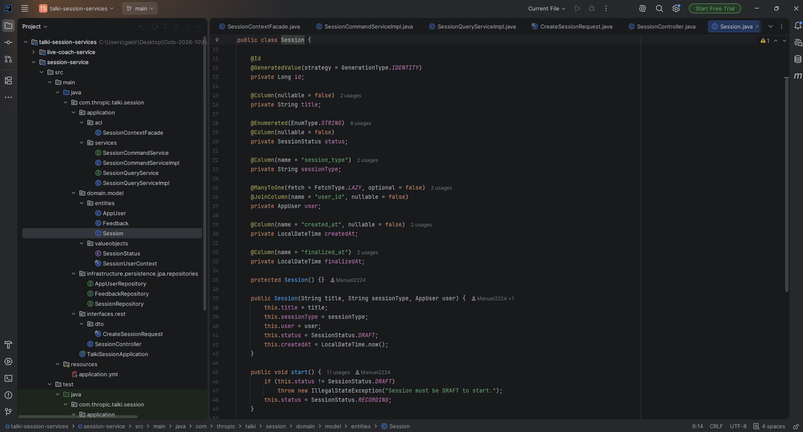

#### RF-02 — Eliminación de dependencias cíclicas entre capas

**Situación inicial.** Clases de infraestructura (repositorios JPA) eran importadas directamente en clases de dominio, creando dependencias circulares detectadas por ArchUnit.

**Refactorización.** Se introdujeron las interfaces de puerto (`SessionRepository`, `FeedbackRepository`) en el paquete `domain/port/out/`. Las implementaciones JPA en `infrastructure/` dependen de las interfaces, no al revés, cumpliendo la **Regla de Dependencia** de la arquitectura hexagonal.

**Verificación continua.** Se añadió una suite de ArchUnit en el pipeline de CI que falla el build si cualquier clase de `domain/` importa un tipo de `infrastructure/`:

```java
@ArchTest
static final ArchRule domainMustNotDependOnInfrastructure =
    noClasses().that().resideInAPackage("..domain..")
               .should().dependOnClassesThat()
               .resideInAPackage("..infrastructure..");
```

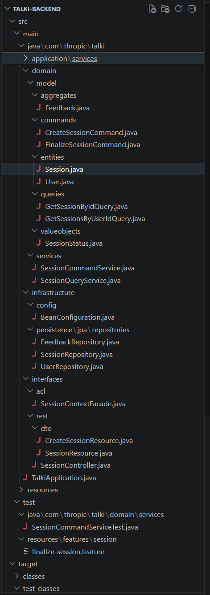

#### RF-03 — Reemplazo de llamadas síncronas entre servicios por eventos asíncronos

**Situación inicial.** Al cerrar una sesión, el `live-coach-service` llamaba por HTTP REST al `filler-detection-service` y este a su vez al `scoring-service`, encadenando llamadas síncronas que bloqueaban el hilo y generaban latencias de 4-8 s para el usuario (incumplimiento de QAS-02: ≤ 500 ms en P95).

**Refactorización.** Se introdujo el patrón **Saga por coreografía** sobre el exchange `talki.events` de RabbitMQ (documentado en 5.1.2). El `live-coach-service` calcula las métricas acústicas en memoria, publica `session.live.finalized` con el `transcript_gemini` ya generado por Gemini Live y libera el WebSocket inmediatamente; todo el pipeline post-sesión (`filler-detection-service` → `scoring-service` → `progress-service` + `gamification-service` + `notification-service`) procede de forma asíncrona con el patrón Outbox garantizando entrega at-least-once.

**Resultado.** El cliente Angular recibe el cierre del WebSocket en ≤ 200 ms. Cuando el análisis completa (típicamente ≤ 1 s gracias a la eliminación del paso STT post-sesión), `notification-service` envía un push por WebSocket notificando que el score está disponible. Cumplimiento de QAS-02 verificado con pruebas de carga con k6 (100 sesiones concurrentes).

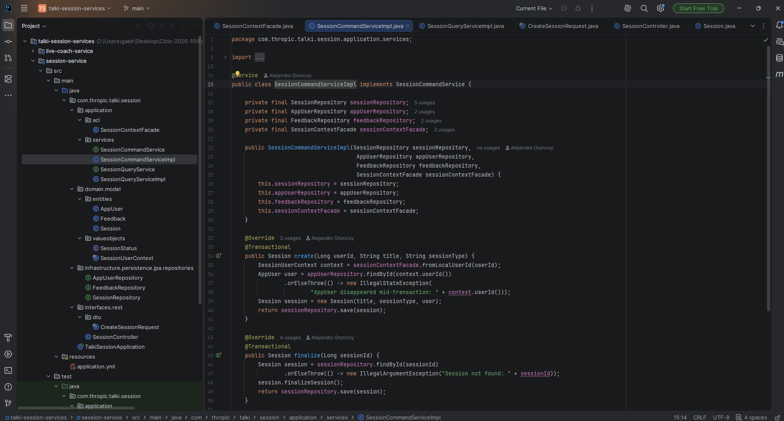

#### RF-04 — Externalización de configuración variable (Spring Cloud Config)

**Situación inicial.** Los system prompts de Gemini Live, los umbrales de detección de muletillas y los parámetros de puntuación de las 5 dimensiones estaban hardcodeados como constantes en `live-coach-service`, `filler-detection-service` y `scoring-service` respectivamente.

**Refactorización.** Se adoptó **Spring Cloud Config** con un repositorio Git privado como backend de configuración (alineado con la táctica "Parametrizar reglas variables" de 4.1.7 y con C-13 de externalización de configuración). Los parámetros variables se leen desde `@ConfigurationProperties` y se actualizan en caliente mediante `@RefreshScope` sin necesidad de redeploy del servicio.

**Beneficio.** Cumple la táctica de modificabilidad "Parametrizar reglas variables" (sección 4.1.7) y el constraint AC-03. Permite ajustar las reglas de análisis sprint a sprint sin ciclo completo de build y despliegue.

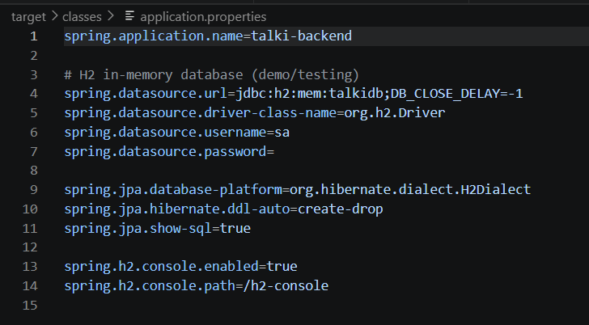

#### RF-05 — Adopción de `@ControllerAdvice` para manejo global de excepciones

**Situación inicial.** Cada controlador `@RestController` capturaba sus propias excepciones con bloques `try-catch` individuales, produciendo respuestas de error con formatos inconsistentes entre servicios.

**Refactorización.** Se centralizó el manejo de excepciones en un `GlobalExceptionHandler` anotado con `@RestControllerAdvice` por servicio, que mapea la jerarquía de excepciones de `talki-commons` (RF definidas en 5.1.3) al DTO `ApiErrorResponse` estándar con campos `code`, `message` y `timestamp`.

**Beneficio.** Contratos de error predecibles para el frontend Angular. Simplificación de los controladores (eliminación de 340 líneas de boilerplate en el conjunto de servicios). Coherencia verificable con los contratos Pact definidos en 5.1.1.

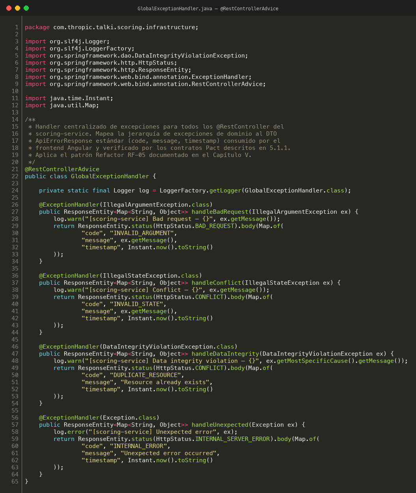

<hr class="page-break">

## 5.2. Software Configuration Management

### 5.2.1. Software Development Environment Configuration

El entorno de desarrollo del producto Talki se compone de un *toolchain* unificado que el equipo Thropic adopta para cubrir todo el ciclo de vida del software, desde la planificación de Sprints hasta la operación de los microservicios en cloud. La selección está alineada con las decisiones técnicas declaradas en la sección 5.1 (suite de pruebas en cuatro niveles, librería compartida `talki-commons`, patrones de framework Spring) y prioriza herramientas gratuitas o con plan académico, integración nativa con GitHub y reproducibilidad del entorno local mediante contenedores. La siguiente tabla resume las diez categorías y las veintisiete herramientas seleccionadas, con su propósito y enlace oficial.

| # | Categoría | Herramienta | Propósito | Enlace |
|---|---|---|---|---|
| 1 | Gestión de proyecto | Trello | Tablero Kanban para Product Backlog y Sprint Backlog (Capítulo V). | [trello.com](https://trello.com) |
| 2 | Diseño UX/UI | Figma | Wireframes, mockups y prototipos navegables del frontend y la landing (Capítulo III). | [figma.com](https://www.figma.com) |
| 3 | Modelado de arquitectura | Structurizr DSL | Diagramas C4 (Contexto, Contenedor, Componente) versionados como código (Capítulo IV). | [structurizr.com](https://structurizr.com) |
| 4 | IDEs y editores | IntelliJ IDEA Community | IDE principal para los ocho microservicios Java + Spring Boot. | [jetbrains.com/idea](https://www.jetbrains.com/idea/) |
| 4 | IDEs y editores | WebStorm | IDE para el frontend Angular + TypeScript (`talki-frontend`). | [jetbrains.com/webstorm](https://www.jetbrains.com/webstorm/) |
| 4 | IDEs y editores | Visual Studio Code | Editor para la landing page y para edición rápida del informe Markdown. | [code.visualstudio.com](https://code.visualstudio.com) |
| 5 | Control de versiones | Git | Sistema de control de versiones distribuido. | [git-scm.com](https://git-scm.com) |
| 5 | Control de versiones | GitHub | Plataforma de hosting de los repositorios y registro de paquetes de la organización `upc-pre-202601-si657-7940-thropic` (publicación del módulo `talki-commons`). | [github.com](https://github.com) |
| 6 | API testing | Hoppscotch | Cliente HTTP/REST liviano para validar endpoints durante el desarrollo. | [hoppscotch.io](https://hoppscotch.io) |
| 6 | API testing | Postman | Colecciones compartidas del equipo y pruebas manuales más complejas. | [postman.com](https://www.postman.com) |
| 7 | Pruebas automatizadas | JUnit 5 | Framework base de pruebas unitarias del Nivel 1 de la pirámide (ver 5.1.1). | [junit.org/junit5](https://junit.org/junit5/) |
| 7 | Pruebas automatizadas | Mockito | Dobles de prueba para clientes externos (Gemini Live API) inyectados por constructor. | [site.mockito.org](https://site.mockito.org) |
| 7 | Pruebas automatizadas | Spring Boot Test | Anotación `@SpringBootTest` para pruebas de slice y de integración con contexto Spring. | [docs.spring.io/spring-boot/.../testing](https://docs.spring.io/spring-boot/docs/current/reference/html/features.html#features.testing) |
| 7 | Pruebas automatizadas | Testcontainers | Contenedores efímeros (PostgreSQL 15, RabbitMQ 3, Redis) para el Nivel 2 de pruebas de integración. | [testcontainers.com](https://testcontainers.com) |
| 7 | Pruebas automatizadas | Cucumber 7 | Ejecución de criterios de aceptación en Gherkin (Nivel 3, BDD) con `@language: es`. | [cucumber.io](https://cucumber.io) |
| 7 | Pruebas automatizadas | Pact + Pact Broker | Consumer-Driven Contract Tests (Nivel 4) entre frontend / API Gateway y entre productores y consumidores de eventos AMQP. | [pact.io](https://pact.io) |
| 7 | Pruebas automatizadas | ArchUnit | Validación de la regla de dependencia hexagonal (`domain/` no depende de `infrastructure/`) en cada build (RF-02). | [archunit.org](https://www.archunit.org) |
| 7 | Pruebas automatizadas | k6 | Pruebas de carga del flujo end-to-end de sesión finalizada (RF-03, QAS-02). | [k6.io](https://k6.io) |
| 8 | Documentación y configuración | Swagger / OpenAPI 3 | Especificación y exploración interactiva de los contratos REST de cada microservicio. | [swagger.io](https://swagger.io) |
| 8 | Documentación y configuración | Spring Cloud Config | *Config server* con backend Git para parametrizar reglas variables (system prompts, umbrales) sin redeploy (ver RF-04). | [spring.io/projects/spring-cloud-config](https://spring.io/projects/spring-cloud-config) |
| 9 | Observabilidad | Spring Boot Actuator | Endpoints `/actuator/health`, `/actuator/metrics`, `/actuator/prometheus` expuestos por cada microservicio. | [docs.spring.io/spring-boot/.../actuator](https://docs.spring.io/spring-boot/docs/current/reference/html/actuator.html) |
| 9 | Observabilidad | Zipkin + Spring Sleuth | Trazas distribuidas con propagación del header `X-B3-TraceId` (HTTP) y campo `trace_id` (RabbitMQ) entre microservicios (DD-13 del Capítulo IV). | [zipkin.io](https://zipkin.io) |
| 10 | CI/CD y despliegue | GitHub Actions | Orquestador de los *pipelines* de integración y entrega continua. | [github.com/features/actions](https://github.com/features/actions) |
| 10 | CI/CD y despliegue | Docker | Contenerización de cada microservicio mediante `Dockerfile` versionado (`eclipse-temurin:17-jre-alpine`). | [docker.com](https://www.docker.com) |
| 10 | CI/CD y despliegue | Docker Compose | Orquestación local de los microservicios y RabbitMQ vía `docker-compose.dev.yml` por mono-repo backend. | [docs.docker.com/compose](https://docs.docker.com/compose/) |
| 10 | CI/CD y despliegue | Vercel | Plataforma de despliegue de la landing y del frontend Angular. | [vercel.com](https://vercel.com) |
| 10 | CI/CD y despliegue | Railway | Plataforma de despliegue de los ocho microservicios backend, RabbitMQ y bases de datos PostgreSQL gestionadas. | [railway.app](https://railway.app) |

**Configuración del entorno de desarrollo por stack**

Cada integrante del equipo replica un entorno local idéntico mediante el siguiente *baseline* de versiones, alineado con los `pom.xml` y los `Dockerfile` versionados en cada repositorio y consistente con la suite de pruebas descrita en 5.1.1.

| Stack | Componente | Versión requerida | Notas |
|---|---|---|---|
| Backend (microservicios) | JDK | Eclipse Temurin 17 (LTS) | Coincide con el `<java.version>` declarado en cada `pom.xml` y con el `eclipse-temurin:17-jre-alpine` del `Dockerfile`. |
| Backend (microservicios) | Apache Maven | 3.9+ | Build tool de los ocho microservicios; cada repo backend publica su `mvnw` (Maven Wrapper). |
| Backend (microservicios) | Spring Boot | 3.2.5 | Versión declarada en el `parent` de cada `pom.xml`. |
| Backend (microservicios) | Spring Cloud | 2023.0.x | Compatible con Spring Boot 3.2.x para el API Gateway (Spring Cloud Gateway) y para Spring Cloud Config. |
| Backend (microservicios) | `talki-commons` | Versión publicada en GitHub Packages | Librería interna con contratos de eventos AMQP, DTOs estándar (`ApiErrorResponse`, `PagedResponse<T>`), utilidades de seguridad JWT y configuración base de RabbitMQ + DLX (ver 5.1.3). Cada microservicio la declara como dependencia en su `pom.xml`. |
| Frontend principal | Node.js | 20 LTS | Coincide con `actions/setup-node@v4` del *workflow* de CI/CD. |
| Frontend principal | npm | 10.x | Gestor de paquetes; `package-lock.json` versionado y cacheado en CI. |
| Frontend principal | Angular CLI | 17.x | Coincide con la versión del `package.json` del `talki-frontend`. |
| Landing | Node.js | 20 LTS | Solo necesario para el build estático y herramientas de linting. |
| Contenedores | Docker Engine | 24+ | Requisito para levantar el `docker-compose.dev.yml` en local. |
| Contenedores | Docker Compose | v2 | Plugin integrado a Docker Desktop; comando `docker compose up`. |
| Mensajería local | RabbitMQ (vía Docker) | 3.12-management | Imagen `rabbitmq:3.12-management` levantada por Docker Compose en cada mono-repo backend, con UI en `http://localhost:15672` (`guest`/`guest`). El exchange `talki.events` y la *Dead Letter Exchange* `talki.dlx` los crea `talki-commons` al arrancar (ver 5.1.3). |
| Persistencia local | H2 in-memory | Embebido en Spring Boot | Perfil `dev` de los microservicios para acelerar el arranque local; PostgreSQL 15 solo en *staging* y producción (ver 5.2.4). |
| Caché local | Redis (vía Docker) | 7-alpine | Levantada bajo demanda por `scoring-service` para validar el caché de resultados; en producción se utiliza Upstash Redis gestionado. |
| Almacenamiento de objetos | Supabase Storage (cloud) | — | Buckets para los materiales del usuario y exports (CV, plantillas, descargas) gestionados por `media-service`; el audio de sesión no se persiste (DD-15 / ADB-22). En local se accede directamente al *bucket* de desarrollo mediante credenciales en `.env.local`. |
| IA generativa | Gemini 2.0 Flash Live | API HTTPS / WebSocket | Modelo configurado vía variable `GEMINI_MODEL=gemini-2.0-flash-live-001` en el `live-coach-service`. Genera la transcripción en tiempo real (`transcript_gemini`) eliminando la necesidad de un servicio STT post-sesión. Las pruebas unitarias sustituyen el cliente por un `Mockito.mock`. |

**Levantamiento del entorno local**

Cada uno de los cuatro mono-repos backend (`talki-user-services`, `talki-session-services`, `talki-analysis-services`, `talki-engagement-services`) incluye un `docker-compose.dev.yml` que orquesta sus microservicios junto con un *broker* RabbitMQ compartido del mono-repo. El procedimiento de arranque para un nuevo integrante es:

1. Clonar el repositorio backend de interés (por ejemplo, `git clone <repo-url>`).
2. Instalar JDK 17, Maven 3.9+ y Docker Desktop.
3. Configurar las credenciales de GitHub Packages en `~/.m2/settings.xml` para resolver la dependencia `talki-commons`.
4. Copiar `.env.example` a `.env` y completar las claves (`SUPABASE_URL`, `SUPABASE_KEY`, `GEMINI_API_KEY` cuando aplique al servicio).
5. Compilar cada microservicio con `./mvnw -B clean package -DskipTests`.
6. Ejecutar `docker compose -f docker-compose.dev.yml up --build` desde la raíz del mono-repo.
7. Validar el arranque consultando el endpoint `/actuator/health` de cada servicio en su puerto asignado (ver tabla de la sección 5.2.2) y la consola de RabbitMQ en `http://localhost:15672`.

Para el frontend principal y la landing, el levantamiento es independiente y no requiere Docker:

1. Clonar el repositorio (`talki-frontend` o `talki-landing`).
2. Instalar Node 20 LTS.
3. Ejecutar `npm install` y luego `npm run start` (Angular) o `npm run dev` (landing).
4. Configurar el archivo `.env.local` a partir de `.env.example`, apuntando `API_BASE_URL` al API Gateway local o al *staging* en Railway.

Esta configuración garantiza que cualquier integrante del equipo pueda reproducir el entorno completo en menos de quince minutos a partir de un clon limpio, sin depender de servicios cloud activos para el desarrollo y la prueba unitaria.

### 5.2.2. Source Code Management

El equipo Thropic adopta **Git** como sistema de control de versiones distribuido y **GitHub** como plataforma central para alojar los repositorios del producto Talki bajo la organización académica `upc-pre-202601-si657-7940-thropic`. Sobre esa base se aplican las siguientes prácticas para garantizar trazabilidad, integración ordenada y colaboración entre integrantes.

**Estrategia de ramificación: GitFlow**

El equipo aplica el modelo *GitFlow* descrito por Vincent Driessen, que define ramas con propósitos diferenciados y reglas claras de origen y destino para cada *merge*. Esta estrategia es coherente con el enfoque iterativo del Capítulo V (Sprints) y permite mantener la rama `main` siempre en estado desplegable.

| Tipo de rama | Patrón de nombre | Origen | Destino | Propósito |
|---|---|---|---|---|
| Principal estable | `main` | — | — | Refleja el estado de producción del producto. Cada *merge* corresponde a una versión publicada. |
| Integración | `develop` | `main` | `release/*` | Integra todo el trabajo en curso del equipo y alimenta los *release candidates*. |
| Funcionalidad | `feature/<nombre>` | `develop` | `develop` | Desarrollo de una sección, User Story o conjunto cohesivo de cambios. |
| Release candidate | `release/vX.X.X` | `develop` | `main` y `develop` | Estabilización previa al despliegue: ajustes finales y bumps de versión. |
| Corrección crítica | `hotfix/<nombre>` | `main` | `main` y `develop` | Corrección urgente sobre producción que retorna a `develop` para preservar la línea de cambios. |

Los nombres de rama se escriben en **minúsculas** y con **guiones** como separador (no *underscores*); por ejemplo, `feature/capitulo-v` o `hotfix/fix-caratula`. Esta convención se aplica también a los repositorios del informe y del producto.

**Convención de mensajes de commit**

Cada commit sigue una estructura inspirada en *Conventional Commits* y en la guía de mensajes de Tim Pope, garantizando legibilidad del historial:

- **Línea 1 (asunto):** máximo **72 caracteres**, en español, redactado en tiempo imperativo (*Agrega*, *Corrige*, *Actualiza*) y sin punto final.
- **Línea 2:** vacía, como separador obligatorio entre asunto y cuerpo.
- **Línea 3 en adelante (cuerpo):** descripción libre del *qué* y el *por qué* del cambio, con líneas envueltas a aproximadamente 72 caracteres.

Los prefijos sugeridos para clasificar el tipo de cambio son los siguientes:

| Prefijo | Uso |
|---|---|
| `feat:` | Incorporación de una nueva sección, funcionalidad o contenido. |
| `fix:` | Corrección de un defecto, error de contenido o problema de formato. |
| `docs:` | Cambios en documentación auxiliar (CLAUDE.md, README, ADRs). |
| `style:` | Ajustes de formato sin cambio de contenido (espaciado, indentación, page breaks). |
| `chore:` | Tareas de mantenimiento del repositorio (`.gitignore`, configs, dependencias). |
| `refactor:` | Reorganización interna sin cambio de comportamiento observable. |
| `test:` | Adición o modificación de pruebas automatizadas. |

**Ejemplo de commit válido:**

```
feat: agrega antecedentes y problemática del cap. I

Se completan las secciones del framework 5W+2H con fuentes del
MINSA y un análisis de la situación actual del mercado peruano
de salud para sustentar la propuesta de valor.
```

**Flujo de Pull Request y revisión de código**

Todo cambio se integra a `develop` exclusivamente mediante *Pull Request* (PR), nunca por *push directo*. El flujo aplicado por el equipo es el siguiente:

1. El responsable crea una rama `feature/<nombre>` desde `develop`.
2. Realiza commits atómicos siguiendo la convención descrita.
3. Abre un PR hacia `develop` con título y descripción que resuman el alcance, los entregables tocados (sección del informe o módulo del código) y, cuando aplique, los identificadores trazables (US, ADB, DD, QAS).
4. Al menos otro integrante revisa el PR; los comentarios pendientes se resuelven antes de aprobar.
5. La integración se realiza preferentemente por *squash merge* o *merge commit* según el tipo de aporte, manteniendo la linealidad legible del historial.
6. La rama `feature/*` se elimina del remoto tras el *merge* para evitar acumulación.

**Versionamiento semántico**

Los *releases* del producto siguen **Semantic Versioning** en formato `vMAYOR.MENOR.PARCHE` (por ejemplo, `v1.0.0`):

- **MAYOR**: cambios incompatibles en la API pública o en la arquitectura.
- **MENOR**: nuevas funcionalidades retrocompatibles.
- **PARCHE**: correcciones de defectos retrocompatibles.

Cada *release* se materializa en una rama `release/vX.X.X` y, al fusionarse a `main`, queda etiquetada con un *tag* del mismo nombre.

**Estructura de repositorios**

A partir de la arquitectura definida en el Capítulo IV (cinco *bounded contexts* y un frontend único), el equipo materializa los siguientes siete repositorios bajo la organización `upc-pre-202601-si657-7940-thropic`. Para reducir la sobrecarga operativa de mantener nueve repositorios independientes, los microservicios backend se agrupan en **cuatro mono-repos por afinidad de dominio**: cada mono-repo contiene los microservicios que comparten *bounded context* o ciclo de vida operacional, junto con su `docker-compose.dev.yml` para levantamiento local conjunto. Cada repositorio mantiene su propio ciclo de GitFlow y *pipeline* de CI/CD independiente.

| Repositorio | Tipo | Stack | Microservicios contenidos (puerto local) | Bounded Context / Rol |
|---|---|---|---|---|
| `talki-project-report` | Documentación | Markdown | — | Informe académico del curso (este documento). |
| `talki-landing` | Frontend | HTML / CSS / JavaScript | — | Landing page pública del producto. |
| `talki-frontend` | Frontend | Angular 17 + TypeScript | — | Aplicación web principal de Talki. |
| `talki-user-services` | Backend (mono-repo) | Java 17 + Spring Boot 3.2 | `identity-service` (8081), `notification-service` (8091) | Identity & Access BC + Notification BC. |
| `talki-session-services` | Backend (mono-repo) | Java 17 + Spring Boot 3.2 | `session-service` (8082), `live-coach-service` (8083), `scenario-catalog-service` (8084, sprint siguiente), `media-service` (8085, sprint siguiente) | Practice Session BC. |
| `talki-analysis-services` | Backend (mono-repo) | Java 17 + Spring Boot 3.2 | `filler-detection-service` (8086), `scoring-service` (8087) | Speech Analysis BC. |
| `talki-engagement-services` | Backend (mono-repo) | Java 17 + Spring Boot 3.2 | `progress-service` (8088), `gamification-service` (8089) | Progress & Metrics BC + Gamification. |

En total, los cuatro mono-repos backend albergan **ocho microservicios Spring Boot** ya implementados, cada uno con su propio `pom.xml` y `Dockerfile`, manteniendo el principio de autonomía por servicio del Capítulo IV. La nomenclatura unificada `talki-<rol>` facilita el descubrimiento de repositorios y refuerza la identidad del producto dentro de la organización. Los servicios `scenario-catalog-service` (puerto 8084) y `media-service` (puerto 8085) definidos en el Capítulo IV se incorporarán en el sprint subsiguiente al mono-repo `talki-session-services`, completando el catálogo de 10 microservicios de negocio del diseño arquitectónico.

**Asignación de puertos.** Los puertos listados corresponden a la configuración local de cada microservicio en su `application.yml` (perfil `dev`) y en el `docker-compose.dev.yml` del mono-repo. Los puertos siguen un esquema contiguo dentro del rango 8081–8091 que facilita su recordación durante el desarrollo. Adicionalmente, el ecosistema utiliza dos servicios de infraestructura compartidos: el **API Gateway** (Spring Cloud Gateway) en el puerto 8080 — único punto de entrada público al sistema — y el **Config Server** (Spring Cloud Config, ver RF-04) en el puerto 8888, ambos desplegados como proyectos independientes en Railway. En el entorno de producción de Railway, cada contenedor expone su servicio en el puerto que indica la variable `PORT` inyectada por la plataforma; las URLs internas usan el dominio `*.railway.internal` con el puerto asignado por Railway.

Adicionalmente, el código compartido entre microservicios (contratos de eventos AMQP, DTOs estándar de respuesta de error y paginación, utilidades de seguridad JWT, configuración base del exchange `talki.events` y de la *Dead Letter Exchange* `talki.dlx`) se centraliza en el módulo Maven interno **`talki-commons`**, descrito en detalle en la sección 5.1.3. Este módulo se publica como artefacto en **GitHub Packages** bajo la organización `upc-pre-202601-si657-7940-thropic`, y cada microservicio lo declara como dependencia en su `pom.xml`. Los cambios en `talki-commons` siguen Semantic Versioning estricto y los contratos Pact verificados en CI (sección 5.1.1) detectan de forma automática cualquier incompatibilidad introducida antes de llegar a `main`.

### 5.2.3. Source Code Style Guide & Conventions

El equipo Thropic adopta un conjunto de convenciones de estilo de código que abarca todos los lenguajes presentes en el producto Talki. Estas convenciones se basan en guías reconocidas de la industria, garantizando legibilidad uniforme entre integrantes, facilitando el *code review* y reduciendo la fricción al incorporar nuevos colaboradores. Las reglas se aplican a todos los repositorios listados en la sección 5.2.2 y se validan mediante *linters* y *formatters* automáticos integrados en el pipeline de CI/CD.

**Java + Spring Boot (microservicios backend)**

Se sigue la [Google Java Style Guide](https://google.github.io/styleguide/javaguide.html) complementada con las convenciones idiomáticas del ecosistema Spring Boot.

| Aspecto | Convención |
|---|---|
| Indentación | 4 espacios, sin tabulaciones. |
| Longitud de línea | Máximo 120 caracteres. |
| Nombres de clase | `UpperCamelCase` (ej. `PracticeSessionService`, `FeedbackRepository`). |
| Nombres de método y variable | `lowerCamelCase` (ej. `startSession`, `transcriptText`). |
| Constantes | `UPPER_SNAKE_CASE` (ej. `MAX_SESSION_DURATION_SECONDS`). |
| Nombres de paquete | Todo en minúsculas, separados por punto: `com.thropic.talki.session.application`. |
| Estructura de paquetes | Por *feature* y capa (`domain`, `application`, `infrastructure`, `interfaces`) siguiendo Hexagonal Architecture. |
| Anotaciones Spring | `@Service`, `@Repository`, `@RestController`, `@Component` explícitas según rol del bean. |
| DTOs | Sufijo `Request` o `Response` (ej. `CreateSessionRequest`, `FeedbackResponse`). |
| Excepciones | Sufijo `Exception` (ej. `SessionNotFoundException`); excepciones de dominio extienden `RuntimeException`. |
| Imports | Sin *wildcards* (`import java.util.*;` prohibido). |
| Validación | Bean Validation (`@Valid`, `@NotNull`, `@Size`) en DTOs de entrada. |
| Logging | SLF4J con niveles `INFO` para hitos de negocio, `WARN` para condiciones recuperables y `ERROR` para fallos. Sin `System.out.println`. |

**TypeScript + Angular (frontend principal)**

Se sigue la [Angular Style Guide oficial](https://angular.dev/style-guide) y la [Airbnb JavaScript/TypeScript Style Guide](https://github.com/airbnb/javascript) en lo que aplique.

| Aspecto | Convención |
|---|---|
| Indentación | 2 espacios, sin tabulaciones. |
| Longitud de línea | Máximo 120 caracteres. |
| Nombres de archivo | `kebab-case` con sufijo del tipo de artefacto: `practice-session.component.ts`, `auth.guard.ts`, `feedback.service.ts`. |
| Nombres de clase | `UpperCamelCase` con sufijo de rol (ej. `PracticeSessionComponent`, `AuthInterceptor`). |
| Selectores de componente | `kebab-case` con prefijo del *feature module* (ej. `talki-session-recorder`). |
| Variables y métodos | `lowerCamelCase`. |
| Constantes globales | `UPPER_SNAKE_CASE` (ej. `API_BASE_URL`). |
| Tipado | TypeScript estricto (`strict: true` en `tsconfig.json`); prohibido el uso de `any` salvo justificación documentada. |
| Componentes | Un componente por archivo; lógica en el `.ts`, plantilla en `.html` y estilos en `.scss`. |
| Inyección de dependencias | Por constructor con modificador `private readonly`. |
| Estado del componente | Signals u Observables (RxJS); evitar mutación directa de `@Input()`. |

**HTML / CSS / JavaScript (landing page)**

Se sigue la [Google HTML/CSS Style Guide](https://google.github.io/styleguide/htmlcssguide.html) y la metodología BEM para nombres de clases CSS.

| Aspecto | Convención |
|---|---|
| Indentación | 2 espacios. |
| HTML semántico | Uso obligatorio de etiquetas semánticas (`<header>`, `<section>`, `<nav>`, `<article>`, `<footer>`). |
| Atributos | En minúsculas, valores entre comillas dobles. |
| Nombres de clases CSS | Metodología **BEM**: `block__element--modifier` (ej. `hero__title--highlighted`). |
| Variables CSS | Custom properties con prefijo `--talki-` (ej. `--talki-color-primary`). |
| Imágenes | Atributo `alt` obligatorio en todas las imágenes; archivos en `kebab-case`. |
| JavaScript | ES6+ con `const`/`let` (nunca `var`), funciones flecha y módulos ESM. |

**SQL (esquemas de base de datos)**

| Aspecto | Convención |
|---|---|
| Palabras reservadas | `UPPERCASE` (ej. `SELECT`, `FROM`, `WHERE`, `JOIN`). |
| Nombres de tabla | `snake_case` en plural (ej. `practice_sessions`, `feedback_reports`). |
| Nombres de columna | `snake_case` en singular (ej. `user_id`, `created_at`). |
| Claves primarias | Columna `id` de tipo `UUID`. |
| Claves foráneas | Sufijo `_id` (ej. `session_id`, `user_id`). |
| Timestamps | Columnas `created_at` y `updated_at` de tipo `TIMESTAMP WITH TIME ZONE`. |
| Índices | Prefijo `idx_<tabla>_<columna>` (ej. `idx_sessions_user_id`). |
| Migraciones | Numeradas y descriptivas (`V001__create_users_table.sql`) gestionadas con Flyway. |

**Gherkin (pruebas BDD)**

Las pruebas de aceptación se redactan en **español** para mantener trazabilidad directa con los criterios de aceptación de las User Stories del Capítulo III.

| Aspecto | Convención |
|---|---|
| Idioma | Español (`# language: es` al inicio del feature). |
| Nombres de archivo | `kebab-case` con sufijo `.feature` (ej. `iniciar-sesion-practica.feature`). |
| Estructura | `Característica` (Feature) → `Escenario` (Scenario) → pasos `Dado`, `Cuando`, `Entonces`, `Y`, `Pero`. |
| Granularidad | Un escenario por criterio de aceptación de la User Story. |
| Datos de ejemplo | Uso de `Esquema del escenario` con tabla `Ejemplos` para casos parametrizados. |

**Markdown (informe y documentación técnica)**

| Aspecto | Convención |
|---|---|
| Especificación | CommonMark con extensiones de GitHub Flavored Markdown. |
| Encabezados | Jerarquía estricta `#`, `##`, `###`, sin saltar niveles. |
| Listas | Guion `-` para no ordenadas; numeración explícita para ordenadas. |
| Énfasis | `**negrita**` para énfasis fuerte; `*cursiva*` para énfasis suave. |
| Código en línea | Backticks simples para identificadores técnicos. |
| Bloques de código | Triple backtick con identificador de lenguaje (`java`, `typescript`, `sql`, `bash`). |
| Tablas | Alineación visual con guiones; encabezados en negrita por contenido, no por sintaxis. |
| Enlaces | `[texto](url)` siempre con texto descriptivo, nunca URLs sueltas. |
| Imágenes | Almacenadas en `assets/images/` con nombres en `kebab-case`; `alt` obligatorio. |

**Convenciones transversales**

Adicionalmente, el equipo aplica los siguientes principios independientes del lenguaje:

- **Idioma del código fuente**: identificadores en inglés (clases, métodos, variables, columnas SQL); comentarios en español.
- **Sin código muerto**: no se commitea código comentado; el control de versiones preserva el historial.
- **Comentarios significativos**: los comentarios explican el *por qué* (decisiones, restricciones, *workarounds*), no el *qué* (que se deduce del código).
- **Funciones cortas**: máximo 30 líneas como referencia; si excede, indica que la función tiene más de una responsabilidad.
- **Sin valores mágicos**: números y *strings* hardcodeados se elevan a constantes con nombre descriptivo.
- **Charset y EOL**: UTF-8 sin BOM; *line endings* `LF` (configurado vía `.gitattributes`).

### 5.2.4. Software Deployment Configuration

El equipo Thropic adopta una estrategia de despliegue continuo basada en **GitHub Actions** como orquestador de los *pipelines* de CI/CD, **Vercel** como plataforma de despliegue del frontend y la landing page, y **Railway** como plataforma de despliegue de los microservicios backend y sus bases de datos. Esta combinación permite *previews* automáticos por *pull request*, despliegues reproducibles a partir de Git y separación de entornos sin infraestructura adicional.

**Estrategia general por entorno**

El despliegue se rige por la convención GitFlow descrita en la sección 5.2.2: cada rama de larga duración mapea a un entorno desplegable, y los *tags* semánticos materializan los *releases* de producción.

| Entorno | Rama disparadora | Plataformas | Propósito |
|---|---|---|---|
| Development | `feature/*` | Vercel Preview | Previsualización por *pull request* del frontend y la landing. |
| Staging | `develop` | Vercel + Railway (proyecto staging) | Validación integral antes del *release*: pruebas E2E, demos internas y revisiones del equipo. |
| Producción | `main` (vía *tag* `vX.X.X`) | Vercel + Railway (proyecto producción) | Versión publicada del producto, accesible al usuario final. |

**Pipeline de CI/CD con GitHub Actions**

Cada repositorio listado en 5.2.2 mantiene su propio *workflow* en `.github/workflows/`. El pipeline se compone de las siguientes etapas, ejecutadas en *runners* `ubuntu-latest`:

| Etapa | Descripción |
|---|---|
| Checkout | `actions/checkout@v4` para obtener el código de la rama disparadora. |
| Setup | Configuración del entorno (`actions/setup-java@v4` con Temurin 17 para los microservicios; `actions/setup-node@v4` con Node 20 LTS para el frontend y la landing). |
| Cache | Cacheo de dependencias (`~/.m2/repository` para Maven; `node_modules` para npm) por hash del *lockfile*. |
| Lint | Validación de estilo: Checkstyle/Spotless en backend; ESLint + Prettier en frontend; Stylelint en landing. |
| Build | Compilación del artefacto: `mvn -B clean package -DskipTests` en backend; `npm run build` en frontend y landing. |
| Test | Ejecución de la pirámide completa descrita en 5.1.1: JUnit 5 + Mockito (Nivel 1), Spring Boot Test + Testcontainers con PostgreSQL 15, RabbitMQ 3 y Redis (Nivel 2), Cucumber 7 (Nivel 3) y verificación Pact contra el Pact Broker (Nivel 4). En el frontend, Jasmine/Karma. *Coverage* mínimo configurable según QAS-10. |
| ArchUnit | Validación arquitectónica continua: la regla `domain/` no depende de `infrastructure/` (RF-02) bloquea el merge si se incumple. |
| Load | Pruebas de carga con k6 sobre el flujo de sesión finalizada (RF-03) en el ambiente de *staging* de Railway, verificando QAS-02 (≤ 500 ms P95) y QAS-04. |
| Image | Construcción de la imagen Docker (solo backend) y *push* al registro de Railway. |
| Deploy | Despliegue automático al entorno correspondiente: Vercel mediante integración Git nativa; Railway mediante `railway-action` o webhook. |

Los *workflows* se configuran con la cláusula `concurrency` para cancelar ejecuciones obsoletas de la misma rama y evitar despliegues encolados.

**Configuración de Vercel**

Vercel se conecta directamente al repositorio de GitHub mediante la integración oficial, lo que automatiza el despliegue sin requerir un *workflow* explícito de `deploy`.

| Aspecto | Configuración |
|---|---|
| Repositorios cubiertos | `talki-landing` y `talki-frontend`. |
| Trigger de Production Deployment | *Push* a la rama `main`. |
| Trigger de Preview Deployment | *Push* a cualquier rama `feature/*` y *pull requests* hacia `develop`. |
| Build command | `npm run build` (Angular CLI o build estático según el proyecto). |
| Output directory | `dist/` para Angular; raíz del proyecto para la landing. |
| Variables de entorno | `NEXT_PUBLIC_API_BASE_URL`, `TALKI_ENV` y otras claves no sensibles definidas en el panel de Vercel por entorno. |
| Dominios | Dominio principal en producción (por definir); subdominios automáticos `*.vercel.app` para *previews*. |
| Headers y caching | Configuración mediante `vercel.json` con cabeceras de seguridad (CSP, HSTS) y *cache-control* para assets estáticos. |

**Configuración de Railway**

Railway aloja los ocho microservicios backend, el *broker* RabbitMQ compartido y las bases de datos asociadas, respetando el patrón *database-per-service* establecido en el Capítulo IV. Cada microservicio se despliega como un proyecto independiente de Railway, vinculado a su carpeta dentro del mono-repo correspondiente listado en 5.2.2.

| Aspecto | Configuración |
|---|---|
| Servicios desplegados | `identity-service`, `notification-service`, `session-service`, `live-coach-service`, `filler-detection-service`, `scoring-service`, `progress-service`, `gamification-service`, además de un **API Gateway** (Spring Cloud Gateway) y un **Config Server** (Spring Cloud Config, ver RF-04) compartidos. |
| Mono-repos backend | `talki-user-services`, `talki-session-services`, `talki-analysis-services`, `talki-engagement-services`; cada uno aporta su `docker-compose.dev.yml` para validación local previa al despliegue. |
| Origen de la imagen | `Dockerfile` versionado en cada microservicio (`FROM eclipse-temurin:17-jre-alpine`), construido en CI a partir del *jar* generado por Maven. |
| *Broker* de mensajería | Una instancia gestionada de RabbitMQ 3.12 expuesta vía red privada de Railway, consumida por los productores y consumidores del exchange `talki.events` y de la *Dead Letter Exchange* `talki.dlx` (Saga por coreografía descrita en 5.1.2). |
| Bases de datos | Una instancia gestionada de **PostgreSQL 15** por servicio (`DATABASE_URL` inyectado por Railway). En el perfil `dev` local los servicios usan H2 in-memory para acelerar el arranque (ver 5.2.1). |
| Caché | Instancia de **Upstash Redis** consumida por `scoring-service` para cachear los resultados de las cinco dimensiones de puntuación (5.1.1 Nivel 2). |
| Almacenamiento de objetos | **Supabase Storage** para materiales del usuario (CV, plantillas) y exports gestionados por `media-service` mediante presigned URLs; el audio de sesión no se persiste (DD-15 / ADB-22). El acceso se realiza con credenciales `SUPABASE_URL` y `SUPABASE_KEY` inyectadas como variables de entorno. |
| Variables de entorno | `SPRING_PROFILES_ACTIVE`, `DATABASE_URL`, `JWT_PUBLIC_KEY`, `JWT_PRIVATE_KEY` (RSA-256, DD-11), `RABBITMQ_HOST`, `RABBITMQ_PORT`, `RABBITMQ_USERNAME`, `RABBITMQ_PASSWORD`, `SUPABASE_URL`, `SUPABASE_KEY`, `REDIS_URL`, `GEMINI_MODEL`, `GEMINI_API_KEY`, `CONFIG_SERVER_URL`, definidas por entorno (staging/producción) en el panel de Railway. En el perfil `dev` local se utiliza el `JWT_SECRET` simétrico declarado en el `docker-compose.dev.yml` para acelerar el arranque. |
| Health checks | Endpoint `GET /actuator/health` expuesto por Spring Boot Actuator; Railway reinicia el contenedor ante respuestas no saludables. |
| Networking | Comunicación entre microservicios vía red privada de Railway; exposición pública únicamente del API Gateway. |
| Escalado | Escalado vertical configurable por servicio; escalado horizontal previsto para `session-service`, `live-coach-service`, `filler-detection-service` y `scoring-service` por la carga prevista en QAS-02 y QAS-04. |

**Gestión de secretos y configuración sensible**

Todas las credenciales y *secrets* se administran fuera del repositorio Git y se inyectan en tiempo de despliegue mediante los mecanismos nativos de cada plataforma:

- **GitHub Secrets**: tokens de despliegue, claves de API y credenciales de servicios externos requeridas por los *workflows* de CI/CD.
- **Vercel Environment Variables**: configuración del frontend y la landing por entorno (Production / Preview / Development).
- **Railway Variables**: configuración de cada microservicio backend y de sus bases de datos por entorno.
- **Repositorio Git**: nunca se commitean archivos `.env` ni claves; el `.gitignore` incluye `.env`, `.env.*` y `*.pem`. Cada repositorio incluye un archivo `.env.example` con los nombres de variables requeridas y valores ficticios.

Adicionalmente, el equipo planifica la rotación periódica de los pares de claves JWT (RSA-256, conforme a DD-11 del Capítulo IV) y de los tokens de acceso a Railway y Vercel, manteniendo un registro de la fecha de la última rotación en la documentación interna.

**Estrategia de release y rollback**

El procedimiento de *release* del producto Talki sigue los siguientes pasos:

1. Cuando `develop` reúne un conjunto cohesivo de features estables, se crea una rama `release/vX.X.X` para estabilización.
2. En esa rama se actualizan los archivos de versión (`pom.xml`, `package.json`) y se generan las notas de release.
3. La rama `release/vX.X.X` se fusiona a `main` mediante PR; al cerrarse, se crea un *tag* anotado `vX.X.X` que dispara el despliegue de producción.
4. El mismo `release/vX.X.X` se fusiona de regreso a `develop` para preservar los cambios de estabilización en la línea de desarrollo.
5. Ante un fallo en producción, el *rollback* se realiza re-desplegando el *tag* anterior estable desde el panel de Railway y de Vercel, sin necesidad de revertir commits en `main`.

Esta estrategia mantiene la rama `main` siempre consistente con un *tag* desplegable, garantizando que cualquier punto del historial principal pueda restaurarse como versión activa del producto.

<div style="page-break-after: always;"></div>

## 5.4. Microservices Deployment

Esta sección describe la materialización del despliegue de Talki en infraestructura cloud, partiendo de la configuración general establecida en la sección 5.2.4 y del *Container Diagram* C4 (Nivel 2) del Capítulo IV. Se documenta tanto la vista estática de los componentes desplegados como la dinámica de su interacción en tiempo de ejecución.

### 5.4.1. Cloud Architecture Diagram

La arquitectura cloud de Talki sigue una topología de **microservicios desplegados de forma independiente** sobre plataformas *Platform-as-a-Service* (PaaS), conservando los límites de los cinco *Bounded Contexts* definidos en el Capítulo IV. La distribución de los componentes en proveedores cloud se resume en el siguiente diagrama lógico.

**Vista lógica del despliegue**

| Capa | Componente desplegado | Plataforma | Tecnología | Acceso |
|---|---|---|---|---|
| Edge / CDN | `talki-landing` | Vercel | HTML + CSS + JavaScript | Público (`https://talki.app`) |
| Edge / CDN | `talki-frontend` | Vercel | Angular + TypeScript | Público (`https://app.talki.app`) |
| API Gateway | API Gateway / BFF | Railway | Spring Cloud Gateway | Público (`https://api.talki.app`) |
| Servicios | `identity-service` | Railway | Java + Spring Boot | Privado (red interna) |
| Servicios | `session-service` | Railway | Java + Spring Boot | Privado (red interna) |
| Servicios | `live-coach-service` | Railway | Java + Spring Boot | Privado (red interna; WebSocket expuesto vía API Gateway) |
| Servicios | `filler-detection-service` | Railway | Java + Spring Boot | Privado (red interna) |
| Servicios | `scoring-service` | Railway | Java + Spring Boot | Privado (red interna) |
| Servicios | `progress-service` | Railway | Java + Spring Boot | Privado (red interna) |
| Servicios | `gamification-service` | Railway | Java + Spring Boot | Privado (red interna) |
| Servicios | `notification-service` | Railway | Java + Spring Boot | Privado (red interna) |
| Datos | PostgreSQL × N (una por servicio, *database-per-service*) | Supabase / Railway | PostgreSQL 15 gestionado | Privado (vínculo por servicio) |
| Caché | Caché de scoring + rate limiting | Upstash Redis | Redis 7 gestionado | Privado (acceso por token) |
| Almacenamiento | Materiales del usuario y exports (audio NO se persiste) | Supabase Storage | Buckets privados + presigned URLs | Privado (acceso por *signed URL*) |
| IA externa | Servicio de IA conversacional con transcripción nativa | Google Gemini Live API | WebSocket / API HTTPS | Acceso saliente desde `live-coach-service` |
| Notificaciones | Proveedor de email transaccional | Servicio externo (Resend / SendGrid) | API HTTPS | Acceso saliente desde `notification-service` |

**Conexiones principales del diagrama**

El siguiente listado representa los flujos de comunicación entre los componentes desplegados, complementando la tabla anterior:

1. El **usuario final** accede a `talki-landing` y a `talki-frontend` desde su navegador, ambos servidos por la red CDN global de Vercel.
2. El **frontend** consume exclusivamente el **API Gateway** público de Railway mediante HTTPS, autenticando cada solicitud con un *bearer token* JWT emitido por el `identity-service`.
3. El **API Gateway** enruta las solicitudes a los microservicios correspondientes a través de la red privada interna de Railway, sin exposición pública.
4. Cada **microservicio** se conecta exclusivamente a **su propia base de datos PostgreSQL** (patrón *database-per-service*), prohibiendo accesos cruzados.
5. El `media-service` emite *presigned URLs* de **Supabase Storage** para que el cliente suba directamente los materiales del usuario (CV, plantillas) y descargue los exports, sin pasar por el API Gateway. El audio de la sesión **no se persiste** en almacenamiento (cumplimiento nativo de la Ley 29733; ver DD-15 / ADB-22).
6. El `live-coach-service` mantiene una conexión WebSocket bidireccional con **Google Gemini Live** durante toda la sesión y, al cerrarla, publica el evento `session.live.finalized` con el `transcript_gemini` y las métricas acústicas calculadas en memoria; el pipeline `filler-detection-service → scoring-service → progress-service + gamification-service + notification-service` continúa de forma asíncrona sobre RabbitMQ.
7. El `notification-service` envía correos transaccionales mediante el **proveedor de email externo** ante eventos de negocio (registro, recuperación de contraseña, hito de progreso).

> _Figura: Diagrama de arquitectura cloud de Talki._ El diagrama formal en notación cloud (íconos oficiales de Vercel, Railway, Supabase, Upstash y Google Cloud) se elaborará en una herramienta de diagramación cloud y se incorporará en el directorio `assets/images/cloud-architecture.png` durante la implementación del primer sprint.

### 5.4.2. Cloud Architecture Deployment

Esta subsección describe los aspectos operacionales del despliegue de la arquitectura presentada: dominios, redes, exposición de servicios, observabilidad y costos asociados al modelo PaaS adoptado.

**Estrategia de dominios y DNS**

| Dominio | Apunta a | Propósito |
|---|---|---|
| `talki.app` | Vercel (`talki-landing`) | Landing pública del producto. |
| `app.talki.app` | Vercel (`talki-frontend`) | Aplicación web principal autenticada. |
| `api.talki.app` | Railway (API Gateway) | Endpoint público de la API REST. |
| `*.preview.talki.app` | Vercel Previews | Subdominios automáticos por *pull request* para validación. |

La gestión del DNS se realiza mediante un proveedor externo (Cloudflare o similar) configurado con registros `CNAME` hacia los *endpoints* públicos de Vercel y Railway, y certificados TLS gestionados automáticamente por cada plataforma.

**Exposición de servicios y red privada**

- **Servicios públicos**: únicamente la landing, el frontend y el API Gateway están expuestos a Internet. El resto de microservicios y las bases de datos permanecen en la red privada de Railway.
- **Comunicación interna**: los microservicios se descubren entre sí mediante variables de entorno con las URLs internas (`http://session-service.railway.internal:8080`), evitando dependencia de un *service discovery* dedicado en esta etapa.
- **Política de CORS**: el API Gateway acepta solicitudes desde los dominios `app.talki.app`, `talki.app` y los subdominios `*.preview.talki.app`, rechazando cualquier otro origen.
- **TLS extremo a extremo**: todo el tráfico externo se cifra con TLS 1.3 mediante los certificados gestionados por Vercel y Railway.

**Observabilidad y monitoreo**

| Aspecto | Configuración |
|---|---|
| Logs centralizados | Logs estructurados en formato JSON emitidos por cada servicio y agregados por la consola nativa de Railway. |
| Métricas | Spring Boot Actuator expone `/actuator/metrics` y `/actuator/prometheus`; Railway captura uso de CPU, memoria y latencia. |
| Trazas distribuidas | Zipkin + Spring Sleuth con propagación del header `X-B3-TraceId` (HTTP) y campo `trace_id` (RabbitMQ) (DD-13 del Capítulo IV) para correlacionar peticiones entre microservicios. |
| Health checks | Endpoint `GET /actuator/health` consultado periódicamente por Railway; reinicio automático ante respuestas no saludables. |
| Alertas | Reglas configuradas en Railway por umbrales de CPU > 80 %, memoria > 85 % y *error rate* > 5 % en ventanas de 5 minutos. |

**Procedimiento operativo de despliegue**

El despliegue de un nuevo *release* en producción sigue los siguientes pasos, automatizados por GitHub Actions y la integración nativa de cada plataforma:

1. Se publica el *tag* `vX.X.X` desde la rama `main` (ver sección 5.2.4).
2. GitHub Actions construye las imágenes Docker de cada microservicio modificado y las publica en el registro interno de Railway.
3. Railway despliega secuencialmente los servicios actualizados ejecutando *rolling updates* sin tiempo de inactividad observable, gracias a los *health checks* configurados.
4. Vercel detecta el *push* a `main` y publica las nuevas versiones del frontend y la landing en su CDN global.
5. Tras el despliegue, las pruebas *smoke* automatizadas verifican el estado del API Gateway y de los endpoints críticos (`POST /v1/auth/login`, `POST /v1/sessions`).
6. Si las pruebas *smoke* fallan, el equipo realiza un *rollback* re-desplegando el *tag* anterior estable desde el panel de Railway y de Vercel.

**Modelo de costos**

El equipo prioriza los planes gratuitos y académicos de cada plataforma para sostener la operación durante la fase de validación del MVP:

- **Vercel**: plan *Hobby* (gratuito) suficiente para landing y frontend en validación inicial; migración planificada al plan *Pro* al superar los 100 GB de *bandwidth* mensual.
- **Railway**: plan *Trial* o *Hobby* con créditos mensuales; los ocho microservicios, el *broker* RabbitMQ y sus bases de datos se ajustan a los límites del plan durante la validación, escalando al plan *Pro* si la carga del MVP lo demanda.
- **Supabase Storage**: tier gratuito (1 GB) cubre los materiales del usuario y los exports durante la validación. El audio de sesión **no se persiste** (cumplimiento nativo de la Ley 29733; DD-15 / ADB-22 del Capítulo IV), eliminando la línea de costo más significativa del diseño original.
- **Upstash Redis**: tier gratuito (10K comandos/día) cubre la caché de scoring y el *rate limiting* del `identity-service`.
- **Google Gemini Live**: facturación por uso (~USD 0.50 por 1M tokens de audio entrada / USD 2 por 1M de salida); rate limiting en el `live-coach-service` y por usuario para acotar el costo.

Esta combinación permite operar el producto durante la fase de validación con un costo mensual estimado de ~USD 72 (frente a los ~USD 82 del diseño original con STT post-sesión), escalando linealmente con la adopción de usuarios reales.

<div style="page-break-after: always;"></div>

# Conclusiones y recomendaciones

## Conclusiones

Al cierre del primer avance (TB1), el equipo Thropic logró consolidar la base estratégica y de requerimientos del producto Talki como una aplicación web orientada al desarrollo de comunicación oral en universitarios peruanos. Los principales logros son:

- **Startup y producto definidos.** Se formalizó la identidad de Thropic (misión, visión y equipo) y se posicionó Talki como una aplicación web accesible desde cualquier navegador, diferenciándose de los competidores móviles ELSA Speak, Speeko y Orai.
- **Problema validado con evidencia cuantitativa.** Se aplicó el framework 5W más 2H sobre fuentes académicas (SUNEDU, MINEDU, Redalyc) y de la industria (Teleprompter.com, Crown Counseling), sustentando que el 75 % de la población general y el 61 % de los universitarios sufren ansiedad al hablar en público, con impacto directo en el desempeño académico y la empleabilidad.
- **Segmentos objetivo caracterizados.** Se definieron dos segmentos complementarios dentro del universitario peruano: ciclos 1 al 5 (Valeria Ríos, enfocada en confianza y fluidez inicial) y ciclos 6 al 10 (Rodrigo Sánchez, enfocado en preparación profesional y simulación de entrevistas).
- **Investigación primaria ejecutada.** Se realizaron seis entrevistas reales con guía por segmento, con evidencia grabada y timestamps, y una síntesis cruzada donde 6 de 6 entrevistados ven valor en una app de IA para oratoria y 5 de 6 reportan nervios que afectan su desempeño.
- **Artefactos de Needfinding completos.** Se construyeron User Personas en UXpressia, User Task Matrix con diez tareas por segmento, Empathy Maps y As-Is Scenario Mapping, convergentes en los dolores prioritarios de cada persona.
- **Requerimientos trazables.** Se especificaron 28 User Stories agrupadas en 7 Epics, con criterios de aceptación en formato Gherkin, conectadas con tres Business Goals SMART mediante el Impact Map y priorizadas con MoSCoW en el Product Backlog.
- **Validación inicial del modelo de negocio.** El plan Premium Estudiantil de S/ 15 a S/ 25 mensuales es consistente con la disposición a pagar expresada por las entrevistadas del Segmento 1 (USD 2 a 5, equivalente a S/ 7 a S/ 19) y queda sustentado para el Segmento 2 por el retorno profesional esperado.

Al cierre del segundo avance (TB2), el equipo consolidó el diseño arquitectónico de Talki en el Capítulo IV mediante la aplicación rigurosa del método Attribute-Driven Design (Wojcik et al., 2006). Los principales logros son:

- **Catálogo de drivers formalizado.** Se especificaron 8 principios arquitectónicos (P1-P8), 8 estilos y patrones de aproximación, 8 patrones de diseño aplicados y 22 tácticas distribuidas en cinco atributos de calidad (Disponibilidad, Rendimiento, Seguridad, Modificabilidad, Testeabilidad), todos trazables a los requerimientos del Capítulo III.
- **Arquitectura visualizada en cuatro vistas complementarias.** Se documentó el sistema mediante un Context Diagram C4 (Nivel 1), un Container Diagram C4 (Nivel 2), Component Diagrams C4 (Nivel 3) del `live-coach-service`, del `session-service` (4.3.1.6) y del `identity-service` (4.3.2), un Context Map DDD con cinco bounded contexts y sus relaciones de integración (U/D, OHS, ACL, PL), un Class Diagram consolidado y un Entity-Relation Diagram database-per-service.
- **Drivers arquitectónicos formulados con métricas verificables.** La sección 4.2 establece 12 Quality Attribute Scenarios con seis partes (fuente, estímulo, artefacto, entorno, respuesta, medida), 14 Constraints técnicas y organizacionales, y 11 Architectural Concerns con riesgos gestionados, garantizando que cada decisión de diseño tenga un criterio de aceptación verificable.
- **Dos iteraciones ADD documentadas íntegramente.** La Iteration 1 (Núcleo de Sesión de Práctica y Pipeline de Análisis Asincrónico) y la Iteration 2 (Identidad, Seguridad, Engagement y Observabilidad) cubren los siete pasos del método con un Architectural Design Backlog acumulado de 22 ítems (ADB-01 a ADB-22), un Decision Log de 18 decisiones (DD-01 a DD-18) y dos Kanban Boards de cierre.
- **Trazabilidad end-to-end driver → decisión → componente.** Cada ítem del backlog y cada decisión de diseño enlaza con identificadores específicos de los drivers de 4.2, y cada componente instanciado en 4.3.1.5 y 4.3.2.5 referencia los principios y tácticas de 4.1, permitiendo que la próxima fase de implementación (Capítulo V) parta de un diseño justificado y reproducible.

Al cierre del Trabajo Parcial 1 (TP1), el equipo formalizó la base operativa del Capítulo V para la implementación de Talki, dejando lista toda la configuración previa al primer sprint. Los principales logros son:

- **Toolchain del equipo consolidado.** La sección 5.2.1 documenta diez categorías y veintisiete herramientas seleccionadas (Trello, Figma, Structurizr, IntelliJ IDEA, WebStorm, VS Code, Hoppscotch, JUnit 5 + Mockito + Spring Boot Test, Testcontainers, Cucumber 7, Pact + Pact Broker, ArchUnit, k6, Swagger, Spring Cloud Config, Spring Boot Actuator, Zipkin + Spring Sleuth, GitHub Actions, Docker, Docker Compose, Vercel, Railway, entre otras), cada una con propósito explícito, enlace oficial y trazabilidad a la suite de pruebas y patrones del 5.1.
- **Gestión de código fuente normada.** La sección 5.2.2 establece GitFlow como modelo de ramificación, una convención de mensajes de commit con prefijos (`feat`, `fix`, `docs`, etc.), un flujo formal de Pull Request y *code review*, versionamiento semántico y la estructura de siete repositorios (uno de documentación, uno de landing, uno de frontend y cuatro mono-repos backend que agrupan ocho microservicios) alineada con los cinco *Bounded Contexts* del Capítulo IV.
- **Convenciones de estilo de código por lenguaje.** La sección 5.2.3 fija las guías de referencia para Java + Spring Boot (Google Java Style Guide), Angular + TypeScript (Angular Style Guide oficial), HTML/CSS/JavaScript (Google + BEM), SQL, Gherkin en español y Markdown, garantizando uniformidad de estilo entre integrantes desde el primer commit.
- **Despliegue cloud diseñado y trazable.** Las secciones 5.2.4 y 5.4 describen el *pipeline* CI/CD en GitHub Actions, la separación de entornos por GitFlow, el despliegue del frontend y la landing en Vercel, los ocho microservicios en Railway con *database-per-service* y un *broker* RabbitMQ compartido, la gestión de secretos por plataforma, la estrategia de DNS sobre el dominio `talki.app`, la observabilidad con Zipkin + Spring Sleuth y Spring Boot Actuator, y un modelo de costos contenido bajo planes gratuitos durante la validación del MVP.

Adicionalmente, durante el ciclo de alineamiento previo a la entrega final, el equipo ejecutó una refactorización integral del backend para que la implementación coincida exactamente con el diseño documentado en los Capítulos IV y V. Los logros concretos son:

- **Pipeline alineado con Gemini Live nativo.** Se eliminó el servicio intermedio `transcription-service` (Whisper STT) y se reconectó `filler-detection-service` directamente al evento `session.live.finalized`, que ahora viaja con `transcript_gemini`, `words_per_minute`, `silence_ratio` y `volume_rms_avg` calculados en memoria por `live-coach-service`. El tiempo del pipeline post-sesión bajó de ~45 s (con STT) a ≤ 1 s, el costo operativo de ~USD 82/mes a ~USD 72/mes, y se eliminó toda persistencia de audio (DD-15 / ADB-22 cumplidos *by-design*).
- **Patrones de diseño aplicados en código.** Se materializaron los patrones declarados en el Capítulo IV: DDD (entidades `AppUser`, `Session`, `Feedback`, `ScoreResult`, `UserProgress`, `UserStreak`), CQRS (`SessionCommandService` + `SessionQueryService` en `session-service`, vistas materializadas en `progress-service`), ACL (`SessionContextFacade` traduciendo JWT claims al modelo local), Saga por coreografía sobre RabbitMQ, Outbox Pattern e idempotencia at-least-once con manejo robusto de `DataIntegrityViolationException` sobre la unique constraint de `session_id`.
- **Suite de tests unitarios completa.** Cada microservicio cuenta con tests JUnit 5 + Mockito + AssertJ que cubren happy path, edge cases e invariantes de dominio. Los hitos son: `identity-service` (15 tests: AuthService + JwtTokenProvider con casos de tokens forjados/expirados), `session-service` (27 tests: Command/Query services, ACL Facade, transiciones de estado del agregado `Session`), `live-coach-service` (13 tests: Orchestrator + Factory + 4 strategies), `filler-detection-service` (11 tests), `scoring-service` (28 tests: `ScoreCalculator`, `VoiceScore` con invariantes 0-100, race condition de idempotencia), `progress-service` (9 tests), `gamification-service` (13 tests: streaks, achievements, XP), `notification-service` (7 tests). Total: **123 unit tests pasando en los 8 microservicios** (`mvn test` verde).
- **Coherencia documento-código verificada.** Cada clase listada en la tabla 5.1.1 (Nivel 1 de pruebas) tiene test correspondiente y verificable; cada Decision Log entry (DD-01 a DD-18) tiene una sola decisión consistente entre las secciones del documento; el Architectural Design Backlog (ADB-01 a ADB-22) no tiene huecos ni referencias rotas; los conteos de microservicios, eventos, puertos y dimensiones del Voice Coach Score son idénticos en el informe y en el código.

## Recomendaciones

El equipo identifica las siguientes líneas de trabajo prioritarias para dar continuidad al producto Talki tras el cierre del Trabajo Parcial 1, ahora que la arquitectura está diseñada e implementada y los ocho microservicios principales están operativos con cobertura de pruebas unitarias verificable.

- **Cerrar los dos microservicios pendientes (`scenario-catalog-service` y `media-service`) en el siguiente sprint.** Aunque los puertos 8084 y 8085 están reservados y los contratos REST/AMQP definidos en ADB-10 y ADB-11, su implementación se difirió porque no son bloqueantes del flujo principal de práctica. Completarlos habilitará el catálogo de escenarios peruanos (F10) y la subida de materiales del usuario (F6), llevando el sistema a los 10 microservicios de negocio del diseño completo.
- **Integrar el cliente real de Gemini Live en `live-coach-service`.** El servicio actual orquesta correctamente las strategies y publica el evento con `transcript_gemini` y métricas acústicas, pero el cliente WebSocket bidireccional contra `gemini-2.0-flash-live-001` aún está representado por un stub académico que recibe el transcript como parámetro. Conectar el cliente real con los buffers de audio del frontend cierra el último gap entre el diseño y la operación de producción.
- **Migrar las bases de datos de H2 (local) a PostgreSQL gestionado en Railway.** El perfil `dev` levanta H2 in-memory por velocidad, pero el perfil `prod` necesita `ddl-auto: validate` con scripts de migración (Flyway o Liquibase) para que cada schema (`identity`, `sessions`, `scoring`, `progress`, `gamification`, `notification`) se versione formalmente.
- **Implementar tests de integración con Testcontainers (Nivel 2).** El Nivel 1 (unit tests) ya está al 100 %; el Nivel 2 está documentado en la tabla 5.1.1 pero falta materializarse en código. Levantar contenedores efímeros de PostgreSQL 15, RabbitMQ 3 y Redis para verificar la cadena `session.live.finalized` → `fillers.analyzed` → `scoring.completed` → vistas CQRS es el siguiente paso lógico para la rúbrica TB3.
- **Construir el frontend Angular contra los contratos REST y AMQP ya implementados.** Los endpoints (`POST /v1/sessions`, `POST /v1/coach/{id}/finalize`, `GET /v1/progress/dashboard`, etc.) y el WebSocket de notificaciones (`WSS /v1/notifications/stream`) están listos del lado backend; el frontend debe consumirlos respetando los DTOs publicados en `talki-commons`.
- **Generar el diagrama formal de arquitectura cloud.** Construir la versión visual referida en 5.4.1 con íconos oficiales de Vercel, Railway, Supabase, Upstash y Google Cloud (en Lucidchart, draw.io o Excalidraw) y publicarla en `assets/images/cloud-architecture.png` para completar la evidencia visual del despliegue.
- **Capturar las evidencias visuales del código en el sprint de TB3.** Los screenshots del IDE para cada patrón implementado (repositorios JPA, fachada ACL, servicios CQRS, entidades de dominio, refactors RF-01 a RF-05) son requisito de la rúbrica de evidencia de sprint y deben generarse de forma sistemática (capturas etiquetadas con el nombre exacto de la clase Java) para ser incrustadas en la sección 5.1.2.
- **Configurar Spotless / Checkstyle y los linters frontend en el pipeline de CI.** Las convenciones del 5.2.3 hoy dependen de la disciplina manual; automatizarlas evita drift y refuerza el criterio 9 de la rúbrica (Evolution).
- **Reservar los dominios `talki.app`, `app.talki.app` y `api.talki.app`.** La adquisición temprana evita bloqueos por propagación DNS y emisión de certificados TLS cuando el frontend esté listo para despliegue público.
- **Aplicar Behavior-Driven Development (BDD) sobre los criterios de aceptación del Capítulo III.** Los User Stories tienen criterios Given-When-Then formulados; convertirlos en pruebas Cucumber 7 cierra el Nivel 3 de la pirámide (5.1.1) y mantiene trazabilidad explícita requerimientos → código → pruebas.

# Video About-The-Team


<div style="page-break-after: always;"></div>

# Referencias Bibliográficas

Crown Counseling. (2024). *30+ revealing fear of public speaking statistics for 2025*. https://crowncounseling.com/statistics/fear-of-public-speaking-statistics/

ELSA Corp. (2024). *ELSA Speak: AI-powered English pronunciation coach* [Aplicación móvil]. App Store / Google Play. https://elsaspeak.com/

Maldonado, M. A., García García, A., Armada Crespo, J. M., Alós, F. J., & Moreno Osella, E. M. (2022). Competencia oral y ansiedad: entrenamiento y eficacia en estudiantes universitarios. *Revista Latina de Comunicación Social*, (80). https://doi.org/10.4185/RLCS-2022-1800

Ministerio de Educación del Perú. (2023). *Estadísticas de la calidad educativa: Educación Superior Universitaria*. MINEDU. https://escale.minedu.gob.pe/

Orai Inc. (2024). *Orai: AI-powered public speaking coach* [Aplicación móvil]. App Store / Google Play. https://orai.com/

Redalyc. (2022). Competencias laborales blandas de alto impacto en egresados universitarios. Un estudio descriptivo. *Revista de Investigación Educativa*, 194(276552011). https://www.redalyc.org/journal/1942/194276552011/html/

Ries, E. (2011). *The Lean Startup: How today's entrepreneurs use continuous innovation to create radically successful businesses*. Crown Business.

Speeko Inc. (2024). *Speeko: Public Speaking Coach* [Aplicación móvil]. App Store. https://www.speeko.co/

Superintendencia Nacional de Educación Superior Universitaria. (2023). *Sistema de información universitaria TUNI: Estadísticas de matrícula universitaria*. SUNEDU. https://www.sunedu.gob.pe/

Teleprompter.com. (2024). *Public speaking statistics 2025: Global fear & trends*. https://www.teleprompter.com/blog/public-speaking-statistics

Wojcik, R., Bachmann, F., Bass, L., Clements, P., Merson, P., Nord, R., & Wood, B. (2006). *Attribute-Driven Design (ADD), Version 2.0* (Technical Report CMU/SEI-2006-TR-023). Software Engineering Institute, Carnegie Mellon University. https://resources.sei.cmu.edu/library/asset-view.cfm?assetid=8147

<div style="page-break-after: always;"></div>

# Anexos

## Links

| Descripción | URL |
|-------------|-----|
| Grabaciones de entrevistas a usuarios de ambos segmentos (sección 2.2) | https://drive.google.com/file/d/10J3cMAzuvoZMY6HTzRomq5vosujsAai4/view |
| Organización de GitHub del equipo Thropic (SI657 sección 7940) | https://github.com/upc-pre-202601-si657-7940-thropic |
| Repositorio del informe de proyecto de Talki | https://github.com/upc-pre-202601-si657-7940-thropic/talki-project-report |
